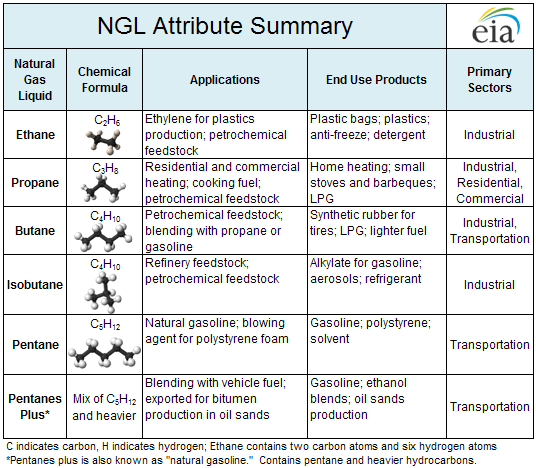

## Table of Contents

## What are natural gas liquids (NGLs)?

Natural gas liquids, or NGLs, are hydrocarbons that are found in natural gas. They are separated from the gas when it is processed. NGLs include things like ethane, propane, butane, and pentane. These liquids are valuable because they can be used for many different things, like making plastics or as fuel for vehicles.

NGLs are important because they help us use natural gas more efficiently. When natural gas is taken out of the ground, it often has NGLs mixed in with it. By removing the NGLs, we can use the natural gas for heating homes or generating electricity. The NGLs themselves can be sold separately, which makes the whole process more profitable and useful.

## How are natural gas liquids extracted from natural gas?

Natural gas liquids are extracted from natural gas through a process called gas processing. When natural gas is taken out of the ground, it often contains NGLs like ethane, propane, and butane. To separate these liquids, the natural gas is first cooled down. This cooling makes the NGLs turn into a liquid form, which can then be separated from the gas.

After the NGLs are turned into a liquid, they are separated using a device called a distillation column. In the column, the different NGLs are separated based on their boiling points. The NGLs with lower boiling points, like ethane, rise to the top of the column, while those with higher boiling points, like butane, stay at the bottom. This way, each type of NGL can be collected separately and used for different purposes.

## What are the main types of natural gas liquids?

The main types of natural gas liquids are ethane, propane, butane, isobutane, and natural gasoline. These liquids are all part of the natural gas that comes out of the ground. They are important because they can be used in many different ways.

Ethane is often used to make plastics. Propane is commonly used as fuel for heating and cooking. Butane and isobutane can be used as fuel too, but they are also used in things like lighters and as a propellant in aerosol cans. Natural gasoline is a type of NGL that can be added to regular gasoline to make it burn better. Each of these NGLs has its own special uses, which makes them very useful in many industries.

## Can you explain what ethane is and its uses?

Ethane is a type of natural gas liquid that is found in natural gas. It is a simple hydrocarbon, which means it is made up of hydrogen and carbon atoms. Ethane is usually the lightest of the natural gas liquids, and it is often found mixed with methane, which is the main part of natural gas.

Ethane is very important because it is used to make ethylene, which is a key ingredient in making plastics. When ethane is heated, it turns into ethylene, which can then be used to make all sorts of plastic products, like bottles, bags, and toys. Ethane can also be used as a fuel, but its main use is in the petrochemical industry to make things that we use every day.

## What is propane and how is it commonly used?

Propane is a type of natural gas liquid that is found in natural gas. It is a clear and colorless gas that can be turned into a liquid by cooling it or putting it under pressure. Propane is very useful because it can be stored and moved easily, which makes it a good choice for many different uses.

One of the most common uses for propane is as a fuel for heating and cooking. Many people use propane to heat their homes, especially in places where natural gas pipelines are not available. Propane is also used in grills for cooking outdoors, and in some vehicles as an alternative to gasoline. It is a clean-burning fuel, which means it is good for the environment.

## What are the differences between butane and isobutane?

Butane and isobutane are both natural gas liquids, but they are a bit different from each other. They both have the same chemical formula, which is C4H10, but their structures are different. Butane has a straight chain of four carbon atoms, while isobutane has a branched chain with three carbon atoms in a row and one carbon atom branching off. This difference in structure makes them behave differently in some ways.

One big difference is their boiling points. Butane has a boiling point of about 31 degrees Fahrenheit, which means it turns into a gas at that temperature. Isobutane, on the other hand, has a boiling point of about 11 degrees Fahrenheit, so it turns into a gas at a lower temperature. This makes isobutane useful in colder places where butane might not work as well. Both can be used as fuels, but isobutane is often used in things like aerosol cans and as a refrigerant because of its lower boiling point.

## How is pentane used in the industry?

Pentane is a natural gas liquid that is used in many industries. It is a clear, colorless liquid that is very good at dissolving other substances. One of the main ways pentane is used is in making polystyrene, which is a type of plastic. When pentane is mixed with styrene, it helps the styrene turn into polystyrene, which is used to make things like foam cups and packaging materials.

Another way pentane is used is as a blowing agent. This means it helps create bubbles in materials like foam insulation. When pentane is heated, it turns into a gas and makes the foam expand, which makes the insulation better at keeping heat in or out. Pentane is also used as a solvent in some industries, where it helps to clean or dissolve other materials.

## What role do natural gas liquids play in the petrochemical industry?

Natural gas liquids are very important in the petrochemical industry. They are used to make many things that we use every day. For example, ethane is turned into ethylene, which is used to make plastics. These plastics are used to make bottles, bags, and toys. Propane is also used in the petrochemical industry to make propylene, which is another important ingredient in making plastics and other chemicals.

Butane and isobutane are used to make things like synthetic rubber and other chemicals. These chemicals are used in many products, like tires and adhesives. Pentane is used to make polystyrene, which is the material used in foam cups and packaging. Natural gas liquids are also used as solvents and blowing [agents](/wiki/agents), which help in making foam insulation and cleaning other materials. Without natural gas liquids, the petrochemical industry would not be able to make many of the products we rely on.

## How do natural gas liquids impact the environment?

Natural gas liquids can have both good and bad effects on the environment. On the good side, they can be a cleaner fuel than other things like coal or oil. When we use propane or butane instead of these, it makes less pollution and helps keep the air cleaner. This is good for our health and for the planet. Also, using natural gas liquids in the petrochemical industry helps us make things like plastics and foam, which can save energy and reduce waste if we use them the right way.

On the bad side, there are some problems with natural gas liquids. When they leak or are not handled properly, they can harm the environment. For example, if methane, which is often with natural gas liquids, gets into the air, it can make the Earth warmer because it is a strong greenhouse gas. Also, the process of getting natural gas liquids out of the ground and turning them into useful things can use a lot of energy and make pollution. So, we need to be careful and find ways to do these things in a way that is better for the environment.

## What are the storage and transportation challenges associated with NGLs?

Storing and moving natural gas liquids, or NGLs, can be tricky. NGLs like propane and butane need to be kept in special tanks that can handle high pressure or low temperatures. This is because NGLs turn into gas at normal temperatures, so they need to be kept cool or under pressure to stay as a liquid. These tanks can be expensive and need to be checked often to make sure they are safe. Also, if there's a leak, NGLs can be dangerous because they are flammable.

Moving NGLs from one place to another is another challenge. They are usually moved using trucks, trains, or ships, but each way has its own problems. Trucks and trains can only [carry](/wiki/carry-trading) a certain amount at a time, and they need good roads or rails to travel on. Ships can carry a lot more, but they take longer to get to where they need to go. No matter how NGLs are moved, there is always a risk of accidents or spills, which can harm people and the environment. So, it's important to have good safety rules and plans in place to handle these risks.

## How do market prices for different NGLs fluctuate and what influences these changes?

The prices of natural gas liquids like ethane, propane, and butane go up and down because of many reasons. One big reason is how much people want to buy them. If more people want to use NGLs, the price goes up. If fewer people want them, the price goes down. Another reason is how much NGLs are available. If there's a lot of NGLs around, the price might go down because there's more to go around. But if there's not much, the price can go up because everyone is trying to get what's there.

Other things that can change NGL prices are what's happening in the world and in the economy. For example, if there's a problem getting NGLs from one place to another, like a storm or a war, the price can go up because it's harder to get them. Also, if the cost of making things like plastics goes up or down, it can change how much people want to buy NGLs, which can make the price change. The price of oil can also affect NGL prices because they are often used for similar things, so if oil prices go up or down, NGL prices might follow.

## What are the latest technological advancements in the processing and utilization of natural gas liquids?

New technology is making it easier and better to process and use natural gas liquids. One big change is in how we separate NGLs from natural gas. Now, we use things called membrane separation and cryogenic processing. Membrane separation uses special materials to let the NGLs pass through while keeping the natural gas out. Cryogenic processing cools the natural gas down a lot so the NGLs turn into liquid and can be taken out. These new ways are more efficient and help us get more NGLs out of the gas.

Another cool thing is how we are using NGLs in new ways. For example, we are using propane to make propylene in a better way. Propylene is used to make plastics, and the new way to make it uses less energy and makes less pollution. Also, we are finding new uses for NGLs in making things like biofuels and chemicals. These new technologies help us use NGLs in ways that are good for the environment and help us save money.

## What are Algorithmic Trading Strategies for NGLs?

Algorithmic trading has revolutionized the way natural gas liquids (NGLs) are traded in the commodities market. These strategies leverage computational algorithms to make trading decisions that are optimal and timely, based on quantitative data analysis.

One of the common trading strategies employed in the NGL market is the **mean reversion strategy**. This strategy is founded on the statistical premise that asset prices and returns eventually revert to their long-term mean or average level. In the context of NGLs, an algorithm may monitor price fluctuations, and when a price deviates significantly from its historical average, the algorithm executes trades that capitalize on the expectation of reversion. Mathematically, mean reversion can be modeled through time series analysis:

$$
x_t = \theta + \phi (x_{t-1} - \theta) + \epsilon_t
$$

where $x_t$ represents the price at time $t$, $\theta$ is the mean level, $\phi$ is the speed of reversion, and $\epsilon_t$ is a random error term.

**Trend-following algorithms** also play a vital role. These strategies involve identifying and following the direction of the market trend. In the NGL context, this might include using moving averages to detect upward or downward trends in prices, with buy or sell signals generated accordingly. A simple moving average crossover strategy could involve short-term and long-term moving averages; when the short-term average crosses above the long-term average, the algorithm buys the asset, and when it crosses below, it sells.

**Statistical arbitrage** strategies utilize algorithms to exploit price discrepancies between related markets or financial instruments. For instance, if propane prices in one geographic area lag compared to another, the algorithm may buy in the lower-priced market and sell in the higher-priced one, profiting from the convergence of prices.

Data analysis and algorithmic prediction also involve sophisticated **[machine learning](/wiki/machine-learning) models**. These models, such as neural networks and support vector machines, are employed to predict market trends by learning from large datasets that encompass historical prices, volumes, and other market indicators. For example, a model might be trained to recognize complex patterns in NGL price movements and forecast future prices, enabling traders to make informed decisions.

Successful implementations of [algorithmic trading](/wiki/algorithmic-trading) in the commodities sector include high-frequency trading ([HFT](/wiki/high-frequency-trading-strategies)) systems that execute a multitude of trades in milliseconds, efficiently responding to market signals faster than human traders. For example, an algorithm developed for HFT in the NGL market could rapidly process incoming data sources like market news and execute trades based on sentiment analysis, providing a competitive edge in capturing small price discrepancies.

In conclusion, algorithmic trading strategies for NGLs are multifaceted, deploying a blend of statistical, machine learning, and technical analysis methods to enhance trading performance. As technology and computational techniques advance, these strategies continue to evolve, offering significant benefits like increased efficiency and the ability to swiftly adapt to market conditions.

## References & Further Reading

[1]: U.S. Energy Information Administration (EIA). ["U.S. Natural Gas Liquids Production"](https://www.eia.gov/naturalgas/data.php). 

[2]: International Energy Agency (IEA). ["World Energy Outlook - Natural Gas Liquids"](https://www.iea.org/reports/world-energy-outlook-2024).

[3]: ExxonMobil. ["Annual Report 2022"](https://investor.exxonmobil.com/sec-filings/annual-reports).

[4]: Li, X., & Worthington, A. (2021). ["Algorithmic Trading and Machine Learning: A Literature Review"](https://www.mecs-press.org/ijeme/ijeme-v13-n6/v13n6-5.html). Decision Support Systems, 140.

[5]: Geman, H. (2005). ["Commodities and Commodity Derivatives: Modeling and Pricing for Agriculturals, Metals and Energy"](https://download.e-bookshelf.de/download/0000/5675/90/L-G-0000567590-0015270354.pdf) by Helyette Geman.

[6]: Propane Education & Research Council. ["Propane’s Role in Agriculture"](https://myrtlebeachsc.com/propane-council/). 

[7]: PetroSkills. ["NGL Fractionation: Processing Hydrocarbons"](https://www.petroskills.com/en/training/modules/refrigeration--ngl-extraction-and-fractionation~p2485).