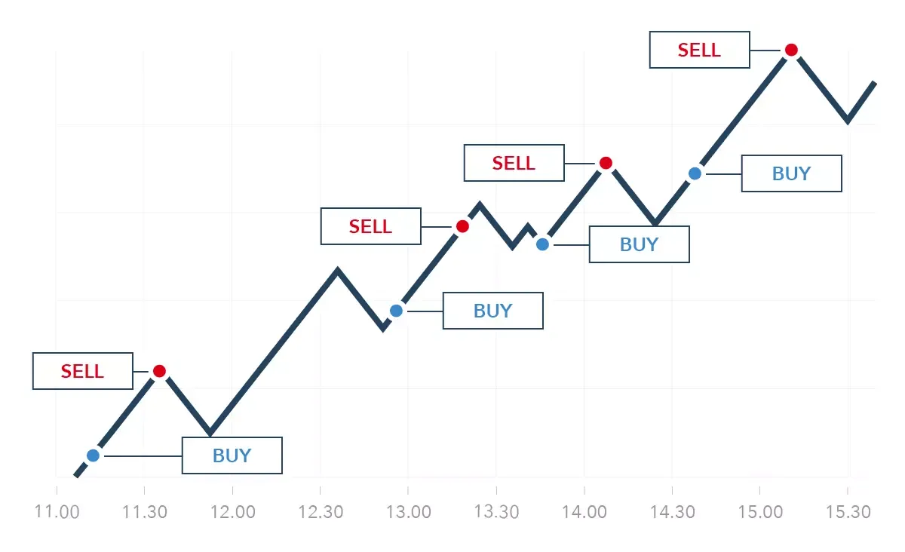

## Table of Contents

## What is natural gas and why is it important in the energy market?

Natural gas is a type of fuel that comes from deep under the ground. It is made up mostly of a gas called methane, but it can also have other gases mixed in. People find natural gas by drilling into the earth, similar to how they find oil. Once they bring it up to the surface, they can use it to make electricity, heat homes, and even cook food. It's called "natural" because it forms naturally over millions of years from the remains of ancient plants and animals.

Natural gas is really important in the energy market because it is a big source of energy for many countries. It's popular because it burns cleaner than other fossil fuels like coal and oil, which means it produces less pollution. This makes it a better choice for the environment. Also, natural gas is easy to transport through pipelines, which makes it convenient to use in many places. Because of these reasons, many power plants and industries rely on natural gas to keep things running smoothly.

## How does natural gas trading work and what are the basic principles?

Natural gas trading involves buying and selling natural gas, usually in large amounts. People and companies trade natural gas on special markets called exchanges, like the New York Mercantile Exchange (NYMEX). When someone wants to buy or sell natural gas, they agree on a price and a specific amount of gas. This can be done for immediate delivery, which is called the spot market, or for delivery at a future date, which is called the futures market. The price of natural gas can change a lot because it depends on things like how much gas is available, the weather, and how much people need it.

The basic principles of natural gas trading are about understanding supply and demand. When there is a lot of natural gas available and not many people want it, the price goes down. But if there is not enough gas and a lot of people need it, the price goes up. Traders try to guess what will happen to the price in the future. They use information like weather forecasts, how much gas is stored, and what's happening in the economy to make their guesses. Trading natural gas can be risky because the prices can change quickly, but it can also be a way for companies to make sure they have the gas they need at a price they can afford.

## What are the key factors that influence natural gas prices?

Natural gas prices are influenced by several key factors. One big factor is supply and demand. If there is a lot of natural gas available and not many people want it, the price goes down. But if there is not enough gas and a lot of people need it, the price goes up. Another important factor is the weather. Cold winters can make more people use natural gas to heat their homes, which can push prices up. Hot summers can also affect prices because more people use air conditioners, which can be powered by natural gas.

Another factor that influences natural gas prices is how much gas is stored. If there is a lot of gas stored up, prices might go down because there's plenty to go around. But if storage levels are low, prices might go up because people worry about running out. The economy also plays a role. When the economy is doing well, industries might use more natural gas, which can push prices up. On the other hand, if the economy is not doing well, people and businesses might use less gas, which can bring prices down.

## What are the different types of natural gas trading strategies for beginners?

For beginners, one simple trading strategy is called "buy and hold." This means you buy natural gas when you think the price is low and then hold onto it until the price goes up. You can then sell it for a profit. This strategy works well if you believe that natural gas prices will increase over time. It's a good way to start because it doesn't require you to watch the market every day, but you do need to be patient and wait for the right time to sell.

Another strategy for beginners is "day trading." This means you buy and sell natural gas within the same day. Day traders try to make small profits from the little changes in price that happen during the day. This strategy can be exciting but also risky because the prices can change quickly. To do well with day trading, you need to pay close attention to the market and be ready to make quick decisions.

A third strategy is "swing trading," which is in between buy and hold and day trading. With swing trading, you hold onto natural gas for a few days or weeks, trying to catch bigger price swings. This strategy can be less stressful than day trading but still needs you to keep an eye on the market. It's a good choice if you want to try to make more money than with a buy and hold strategy but don't want to watch the market all day like a day trader.

## How can one start trading natural gas, including account setup and basic tools needed?

To start trading natural gas, you first need to set up a trading account with a broker that offers natural gas trading. You can do this online by visiting the broker's website and filling out an application form. You'll need to provide some personal information and maybe some documents to prove who you are. Once your account is set up, you'll need to deposit some money into it. This money is called your trading capital, and you'll use it to buy and sell natural gas.

After setting up your account, you'll need some basic tools to trade natural gas. One important tool is a trading platform, which is a software program that lets you buy and sell natural gas. Your broker will usually provide you with a trading platform, or you might be able to choose one that you like. You'll also need access to market data and news, which can help you make better trading decisions. Many trading platforms include tools for charts and analysis, which can help you see how natural gas prices are moving and make guesses about where they might go next.

## What are the risks associated with natural gas trading and how can they be managed?

Trading natural gas can be risky because prices can go up and down a lot. One big risk is that the price might go down after you buy natural gas, and you could lose money when you sell it. Another risk is that the market might be very busy, and it can be hard to buy or sell natural gas when you want to. Also, if you use borrowed money to trade, called leverage, you could lose more money than you put in if the price goes against you.

To manage these risks, you can use a few different strategies. One way is to only use money you can afford to lose, so you don't get into big trouble if the price goes down. Another way is to set up stop-loss orders, which automatically sell your natural gas if the price drops to a certain level. This can help you limit how much money you lose. You can also spread out your risk by trading different things, not just natural gas, so if one goes down, the others might help balance it out.

## What advanced trading strategies can be used by intermediate traders in the natural gas market?

Intermediate traders can use a strategy called "spread trading" to trade natural gas. This means buying and selling different types of natural gas contracts at the same time. For example, you could buy a contract for natural gas that will be delivered in the summer and sell a contract for natural gas that will be delivered in the winter. The idea is to make money from the difference in prices between these two contracts. This can be less risky than just buying or selling one contract because it can help protect you if the overall price of natural gas goes down.

Another advanced strategy is "technical analysis." This means looking at charts and patterns to guess where the price of natural gas might go next. Intermediate traders can use tools like moving averages, which show the average price over a certain time, or the Relative Strength Index (RSI), which can tell if natural gas is being bought or sold too much. By understanding these patterns and indicators, traders can make better guesses about when to buy and sell. This strategy takes practice and a good understanding of how the market works, but it can help traders make more informed decisions.

## How do geopolitical events and seasonal changes affect natural gas trading strategies?

Geopolitical events can really shake up the natural gas market. If there's a problem in a country that produces a lot of natural gas, like a war or a new law, it can make less gas available. This can make the price go up because people are worried about not getting enough. Traders need to keep an eye on the news and be ready to change their plans if something big happens. For example, if a big pipeline gets shut down because of a conflict, traders might want to sell their natural gas before the price drops because of the news, or they might buy more if they think the price will go up because of less supply.

Seasonal changes also play a big role in natural gas trading. In the winter, more people use natural gas to heat their homes, so the demand goes up and prices can go up too. Traders might buy more natural gas in the fall, before the cold weather comes, hoping to sell it at a higher price in the winter. In the summer, it's different. People might use less natural gas, but if it's really hot, they might use more to run air conditioners. Traders need to watch the weather forecasts and adjust their strategies. If a cold winter is predicted, they might buy more natural gas, expecting the price to rise. If a mild winter is expected, they might sell some of their natural gas to avoid losing money if the price goes down.

## What are the technical analysis tools that expert traders use for natural gas trading?

Expert traders use a lot of different tools for technical analysis when trading natural gas. One important tool is the moving average, which helps them see the average price of natural gas over a certain time. There are different kinds of moving averages, like the simple moving average and the exponential moving average. Traders can use these to find trends and decide when to buy or sell. Another tool is the Relative Strength Index (RSI), which tells traders if natural gas is being bought or sold too much. If the RSI is high, it might mean the price is too high and could go down soon. If it's low, it might mean the price is too low and could go up.

Another useful tool for expert traders is the Bollinger Bands, which show how much the price of natural gas is moving around. The bands get wider when the price is moving a lot and narrower when it's not moving much. Traders use this to guess if the price might start moving more or less in the future. They also use chart patterns, like head and shoulders or triangles, to predict where the price might go next. By understanding these patterns, traders can make better guesses about when to enter or exit trades. All these tools help expert traders make smarter decisions and manage their risks better when trading natural gas.

## How can one use fundamental analysis to develop a robust natural gas trading strategy?

Fundamental analysis for natural gas trading involves looking at things that can affect the supply and demand of natural gas. This includes checking how much natural gas is being produced, how much is stored, and what the weather is like. For example, if there's a lot of natural gas being produced and stored, the price might go down because there's plenty to go around. But if there's not enough gas and the weather is really cold, more people will need it to heat their homes, which can push the price up. Traders use this information to guess where the price might go next and plan their trades accordingly.

To develop a robust natural gas trading strategy using fundamental analysis, traders need to keep an eye on economic reports, government data, and news about natural gas production and storage. They should also pay attention to what's happening in other countries that produce natural gas because events there can affect the global supply. By understanding these factors, traders can make better decisions about when to buy or sell natural gas. For example, if a report shows that natural gas storage levels are low and a cold winter is expected, a trader might decide to buy natural gas, expecting the price to rise. This way, fundamental analysis helps traders build a strategy that can handle the ups and downs of the natural gas market.

## What are the best practices for managing a natural gas trading portfolio?

Managing a natural gas trading portfolio well means keeping a close eye on how much money you have and how much risk you're taking. It's important to spread out your money and not put it all into natural gas. This way, if the price of natural gas goes down a lot, you won't lose all your money. You can do this by trading other things too, like oil or stocks. Also, set limits on how much you're willing to lose on each trade. This is called a stop-loss order. It can help you sell your natural gas before you lose too much money if the price goes down.

Another good practice is to keep learning about the natural gas market. This means reading news about natural gas, understanding how the weather affects prices, and knowing what's happening in countries that produce a lot of natural gas. By staying informed, you can make better guesses about where the price might go next. It's also a good idea to look back at your trades and see what worked and what didn't. This can help you make better decisions in the future and improve your trading strategy.

## How do expert traders adapt their strategies to market volatility and regulatory changes in the natural gas sector?

Expert traders know that the natural gas market can be very up and down, and they change their plans to handle this. They use tools like stop-loss orders to protect their money if the price suddenly drops a lot. They also might use options, which are special contracts that let them buy or sell natural gas at a certain price in the future. This can help them make money even if the market is moving a lot. They also pay attention to how much natural gas is being produced and stored, and they watch the news to see if anything big is happening that could change the price.

When the rules about natural gas change, expert traders need to be ready to adjust. New laws might make it harder or easier to produce and sell natural gas, which can change the price. Traders keep an eye on what the government is doing and how it might affect the market. They might change what they're trading or how much they're trading based on these new rules. By staying informed and being flexible, expert traders can handle the changes and still make good trading decisions.

## What is the role of Technical Analysis in Natural Gas Algo Trading?

Technical analysis is a crucial component in devising effective algorithmic trading strategies for natural gas markets. By utilizing various technical indicators and chart patterns, traders can identify potential entry and [exit](/wiki/exit-strategy) points that can optimize trading performance.

**Moving Averages**

Moving averages are among the most fundamental tools used in technical analysis. They help smooth out price data over a specific period, providing a clearer signal of the direction of the trend. The two most commonly used types are the simple moving average (SMA) and the exponential moving average (EMA). The SMA is calculated by taking the arithmetic mean of natural gas prices over a specified number of periods. In contrast, the EMA gives more weight to recent prices, making it more responsive to new information.

For example, if a trader is analyzing natural gas prices with a 50-period EMA:

$$

EMA_{t} = \left( P_{t} \times \frac{2}{N+1} \right) + EMA_{t-1} \times \left(1 - \frac{2}{N+1} \right) 
$$

where $P_{t}$ is the price at time $t$, and $N$ is the number of periods.

**Fibonacci Retracements**

Fibonacci retracements are another valuable tool utilized to predict potential support and resistance levels based on the Fibonacci sequence. Common retracement levels include 23.6%, 38.2%, 50%, 61.8%, and 100%. Traders use these levels to identify possible turning points in the market, which could signal an ideal entry or exit point.

**Relative Strength Index (RSI)**

The Relative Strength Index (RSI) is a [momentum](/wiki/momentum) oscillator that measures the speed and change of price movements. It oscillates between 0 and 100, with readings above 70 indicating overbought conditions and readings below 30 suggesting oversold conditions. In the context of natural gas trading, the RSI can be used to identify periods where price correction is likely, thereby offering signals for potential entry or exit points.

**Developing Entry and Exit Points**

Technical analysis allows traders to develop precise entry and exit strategies by using the aforementioned indicators in conjunction. For example, when natural gas prices cross above a moving average, combined with an RSI entering an overbought region, this might signal a robust entry point for a long position.

**Chart Patterns**

Chart patterns are visual representations of price movements that can indicate future price action. Patterns such as the "head and shoulders" or "triangles" can be particularly insightful for natural gas traders. A head and shoulders pattern typically signals a reversal, while triangle patterns often indicate continuation trends.

In a head and shoulders pattern, for instance, you're looking at three peaks with the middle being the highest, suggesting a potential bearish reversal:

```python
def head_and_shoulders(prices):
    left_shoulder = max(prices[0:len(prices)//3])
    head = max(prices[len(prices)//3: 2*len(prices)//3])
    right_shoulder = max(prices[2*len(prices)//3:])

    return head > left_shoulder and head > right_shoulder
```

Utilizing such tools and methodologies enables traders to capitalize on natural gas price fluctuations efficiently. By integrating technical analysis into algorithmic trading strategies, it becomes possible to enhance decision-making processes, leading to potentially lower risks and higher returns.

## What is the role of Fundamental Analysis in Algorithmic Strategies?

Fundamental analysis in algorithmic trading of natural gas involves evaluating qualitative and quantitative factors that influence the commodity's price. One crucial aspect is the oil-natural gas (oil-natgas) spread, which helps in understanding the relative pricing dynamics between these two vital energy sources. The oil-natgas spread can be represented mathematically as:

$$
\text{Spread} = \text{Price of Oil (per barrel)} - ( \text{Price of Natural Gas (per MMBtu)} \times \text{Conversion Factor})
$$

The conversion [factor](/wiki/factor-investing) is used to compare the energy content of the two commodities, typically around 5.8-6 MMBtu per barrel of oil. A significant change in this spread may indicate shifts in market conditions or sentiment, prompting traders to adjust their strategies accordingly.

Geopolitical influences play a pivotal role in natural gas pricing. Conflicts, sanctions, or diplomatic actions can disrupt supply routes or alter production levels, impacting global availability and prices. Traders utilize news feeds, geopolitical risk assessments, and economic reports to forecast potential market shifts. For example, tensions in natural gas-rich regions can lead to supply constraints, driving prices higher.

Monitoring production data and storage levels is another cornerstone of [fundamental analysis](/wiki/fundamental-analysis). The U.S. Energy Information Administration (EIA) provides comprehensive weekly data on natural gas production levels and storage inventories, crucial for understanding supply-demand balances. An increase in production or a decrease in storage levels can either alleviate or exacerbate price pressures, depending on the overall market context.

For algorithmic trading, constructing a predictive model involves incorporating these fundamental variables into the decision-making process. By continuously analyzing supply disruptions, geopolitical news, and production [statistics](/wiki/bayesian-statistics), automated systems can swiftly react to emerging trends, ensuring that trading strategies are responsive and aligned with the broader market landscape. This dynamic approach enables traders to anticipate and capitalize on fluctuations in natural gas prices efficiently.

## References & Further Reading

[1]: Bergstra, J., Bardenet, R., Bengio, Y., & Kégl, B. (2011). ["Algorithms for Hyper-Parameter Optimization."](https://dl.acm.org/doi/10.5555/2986459.2986743) Advances in Neural Information Processing Systems 24.

[2]: ["Advances in Financial Machine Learning"](https://www.amazon.com/Advances-Financial-Machine-Learning-Marcos/dp/1119482089) by Marcos Lopez de Prado

[3]: ["Evidence-Based Technical Analysis: Applying the Scientific Method and Statistical Inference to Trading Signals"](https://www.amazon.com/Evidence-Based-Technical-Analysis-Scientific-Statistical/dp/0470008741) by David Aronson

[4]: ["Machine Learning for Algorithmic Trading"](https://github.com/PacktPublishing/Machine-Learning-for-Algorithmic-Trading-Second-Edition) by Stefan Jansen

[5]: ["Quantitative Trading: How to Build Your Own Algorithmic Trading Business"](https://books.google.com/books/about/Quantitative_Trading.html?id=j70yEAAAQBAJ) by Ernest P. Chan