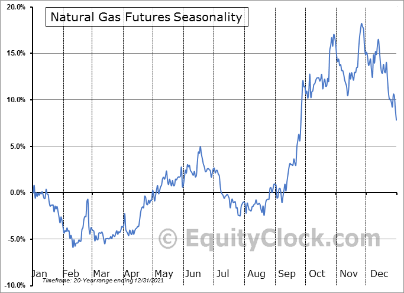

Natural gas trading has increasingly attracted the attention of traders seeking opportunities in commodity markets. Known for its significant price volatility and essential role in the global energy landscape, natural gas offers distinctive trading environments. The ever-changing dynamics of supply and demand, coupled with geo-economic factors, make natural gas a compelling choice for those wishing to capitalize on fluctuating prices.

Algorithmic trading, or algo trading, has emerged as a critical tool in natural gas markets, enabling traders to execute their strategies more efficiently and systematically. By leveraging advanced computational techniques, traders can analyze vast amounts of data quickly, identify trading opportunities, and execute trades with precision. This approach minimizes human error and allows for the rapid adaptability necessary in high-stakes trading scenarios.



This article examines various trading strategies used in algorithmic trading within the natural gas sector. Through a detailed exploration of both fundamental and technical analysis, readers will learn how to construct effective trading strategies. Fundamental analysis involves understanding the underlying economic factors, such as production, consumption, and geopolitical influences, which affect natural gas prices. In contrast, technical analysis focuses on historical data and price patterns to predict future movements.

With the integration of algorithmic models and a solid understanding of market forces, traders can enhance their decision-making processes and increase their potential for success. This combination of sophisticated technology and comprehensive market analysis paves the way for traders to navigate the complexities of natural gas trading with confidence.

## Table of Contents

## Understanding Natural Gas Markets

Natural gas markets are complex ecosystems influenced by a multitude of factors, with supply and demand dynamics, economic activity, and geopolitical events serving as fundamental drivers. The balance between these elements often results in considerable price volatility, creating opportunities and challenges for traders.

Supply and demand dynamics are pivotal in shaping natural gas markets. On the supply side, production levels, infrastructure development, and technological advancements can significantly impact the availability of natural gas. Key producers, such as the United States, Russia, and Qatar, play crucial roles in determining global supply. Conversely, demand is influenced by industrial usage, residential heating, and the growing trend of natural gas as a cleaner alternative to coal in power generation.

Economic activity, both on a macro and micro scale, affects natural gas consumption patterns. In periods of economic growth, industrial activities tend to increase, boosting natural gas demand. Conversely, economic downturns can lead to decreased consumption as industries scale back operations.

Geopolitical events can also have profound impacts on natural gas markets. Political instability in key production regions, shifts in energy policies, and international sanctions can lead to supply disruptions or trade reconfigurations, affecting global prices.

Natural gas futures contracts are instrumental tools for traders looking to capitalize on these market dynamics. These contracts, traded on major exchanges like the New York Mercantile Exchange (NYMEX), offer [liquidity](/wiki/liquidity-risk-premium) and the potential for substantial returns due to their speculative nature. Typically, these contracts have standard specifications, including a contract size of 10,000 million British thermal units (MMBtu) and monthly expirations, which facilitate consistent trading opportunities.

Trading hours for natural gas futures provide ample opportunities for global participation. Trading begins Sunday evening and continues through Friday, with slight daily breaks, allowing traders from different time zones to execute strategies effectively.

The transition towards cleaner energy sources has positioned natural gas as a bridge fuel, contributing to market behavior. Natural gas is perceived as a relatively cleaner fossil fuel, with lower carbon emissions compared to coal and oil. This perception has increased its attractiveness in the energy transition landscape, making it a key component in efforts to reduce greenhouse gas emissions.

Overall, understanding the complex interplay of these factors is essential for traders looking to navigate the natural gas markets effectively. By leveraging insights into supply-demand imbalances, economic indicators, geopolitical developments, and energy transition trends, traders can formulate informed trading strategies that capitalize on market opportunities.

## Significant Factors Affecting Natural Gas Prices

Natural gas prices are influenced by a myriad of factors, and understanding these can significantly benefit traders looking to develop effective trading strategies.

**Storage and Inventory Reports**

Storage and inventory levels, as reported by the Energy Information Administration (EIA), are pivotal in influencing natural gas prices. These reports provide data on the amount of natural gas held in underground storage facilities. When inventory levels are high, it typically implies a surplus, leading to lower prices. Conversely, low storage levels indicate potential shortages which generally lead to price increases. The EIA’s weekly Natural Gas Storage Report is closely monitored by market participants for insights into supply balance and potential price movements.

**Weather Conditions and Seasonal Demand Fluctuations**

Weather conditions are among the most influential factors affecting natural gas demand and, consequently, pricing. During the winter, cold temperatures increase the demand for heating, bolstering the consumption of natural gas. Similarly, in the summer, hotter weather elevates the demand for electricity to run air conditioning, indirectly boosting natural gas demand since it is a common fuel for electricity generation.

Seasonal demand fluctuations are also significant. The natural gas market typically experiences higher demand in the winter due to heating needs. This seasonality often leads to higher prices in colder months and lower prices in milder months. Weather forecasting models are thus vital for predicting demand changes and adjusting trading strategies accordingly.

**Economic Drivers**

Economic activity is a major component influencing the supply and demand dynamics of natural gas. Industrial activity can directly affect demand, as natural gas is a key energy source for a variety of industrial processes. A surge in industrial production typically increases natural gas consumption, thereby driving up prices.

Policy changes can also impact the natural gas markets. Regulations affecting drilling practices, environmental standards, and energy policies can alter production costs and capacities, influencing supply. For example, stricter environmental policies could lead to reduced drilling activity and tighter supply, impacting prices.

In conclusion, natural gas trading strategies must account for storage data, weather patterns, and economic indicators to accurately predict price movements. By integrating these fundamental factors with a thorough understanding of market dynamics, traders can enhance their ability to anticipate changes and respond effectively.

## Algo Trading Strategies for Natural Gas

Algorithmic trading leverages automated, data-driven models to facilitate efficient execution of trades in natural gas markets. These models utilize complex algorithms that can rapidly process vast amounts of data to identify and execute trading opportunities based on predefined criteria. Here, we explore some of the prominent strategies employed in [algorithmic trading](/wiki/algorithmic-trading) for natural gas.

### Formulation of Strategies

One of the key advantages of algorithmic trading is the ability to formulate strategies based on technical indicators and historical price patterns. These strategies exploit recurrent patterns and signals derived from technical analysis. For instance, moving averages, relative strength index (RSI), and technical chart patterns like head and shoulders or triangles can serve as the foundation for building systematic trading rules.

Consider a simple moving average crossover strategy, where a short-term moving average (SMA) is compared with a long-term SMA. A basic trading rule might be to buy natural gas futures when the short-term SMA crosses above the long-term SMA and to sell when the opposite occurs.

### Quantitative Analysis

Quantitative analysis is central to the design of algorithms predicting price movements. By employing statistical and mathematical models, traders can analyze historical price data to discern patterns that provide a statistical edge. Techniques such as regression analysis, time-series forecasting, and [machine learning](/wiki/machine-learning) models like neural networks are commonly utilized to enhance predictive accuracy.

### Backtesting for Strategy Validation

Backtesting is a critical process in evaluating the effectiveness of trading strategies. It involves applying a strategy to historical data to assess its performance over a specified time frame. This process helps in understanding how the strategy would have performed and allows for the identification and rectification of potential flaws before live trading.

A Python implementation for [backtesting](/wiki/backtesting) a simple moving average crossover strategy may involve the use of libraries such as Pandas and NumPy to manipulate and analyze historical price data. Below is a simplified example:

```python
import pandas as pd
import numpy as np

# Load historical natural gas prices
data = pd.read_csv('natural_gas_prices.csv')

# Compute short-term and long-term moving averages
data['SMA_short'] = data['Close'].rolling(window=20).mean()
data['SMA_long'] = data['Close'].rolling(window=50).mean()

# Generate buy/sell signals based on SMA crossovers
data['Signal'] = np.where(data['SMA_short'] > data['SMA_long'], 1, -1)

# Backtest by calculating returns
data['Returns'] = data['Signal'].shift(1) * data['Close'].pct_change()

# Calculate total strategy return
total_return = data['Returns'].cumsum()[-1]
print(f'Total Strategy Return: {total_return:.2%}')
```

These strategies necessitate thorough testing and validation to ensure their viability in real-world trading environments. By carefully designing, evaluating, and iterating these models, traders can optimize their algorithmic trading strategies to capitalize on the dynamic natural gas markets.

## Technical Analysis in Natural Gas Algo Trading

Technical analysis is a crucial component in devising effective algorithmic trading strategies for natural gas markets. By utilizing various technical indicators and chart patterns, traders can identify potential entry and [exit](/wiki/exit-strategy) points that can optimize trading performance.

**Moving Averages**

Moving averages are among the most fundamental tools used in technical analysis. They help smooth out price data over a specific period, providing a clearer signal of the direction of the trend. The two most commonly used types are the simple moving average (SMA) and the exponential moving average (EMA). The SMA is calculated by taking the arithmetic mean of natural gas prices over a specified number of periods. In contrast, the EMA gives more weight to recent prices, making it more responsive to new information.

For example, if a trader is analyzing natural gas prices with a 50-period EMA:

$$

EMA_{t} = \left( P_{t} \times \frac{2}{N+1} \right) + EMA_{t-1} \times \left(1 - \frac{2}{N+1} \right) 
$$

where $P_{t}$ is the price at time $t$, and $N$ is the number of periods.

**Fibonacci Retracements**

Fibonacci retracements are another valuable tool utilized to predict potential support and resistance levels based on the Fibonacci sequence. Common retracement levels include 23.6%, 38.2%, 50%, 61.8%, and 100%. Traders use these levels to identify possible turning points in the market, which could signal an ideal entry or exit point.

**Relative Strength Index (RSI)**

The Relative Strength Index (RSI) is a [momentum](/wiki/momentum) oscillator that measures the speed and change of price movements. It oscillates between 0 and 100, with readings above 70 indicating overbought conditions and readings below 30 suggesting oversold conditions. In the context of natural gas trading, the RSI can be used to identify periods where price correction is likely, thereby offering signals for potential entry or exit points.

**Developing Entry and Exit Points**

Technical analysis allows traders to develop precise entry and exit strategies by using the aforementioned indicators in conjunction. For example, when natural gas prices cross above a moving average, combined with an RSI entering an overbought region, this might signal a robust entry point for a long position.

**Chart Patterns**

Chart patterns are visual representations of price movements that can indicate future price action. Patterns such as the "head and shoulders" or "triangles" can be particularly insightful for natural gas traders. A head and shoulders pattern typically signals a reversal, while triangle patterns often indicate continuation trends.

In a head and shoulders pattern, for instance, you're looking at three peaks with the middle being the highest, suggesting a potential bearish reversal:

```python
def head_and_shoulders(prices):
    left_shoulder = max(prices[0:len(prices)//3])
    head = max(prices[len(prices)//3: 2*len(prices)//3])
    right_shoulder = max(prices[2*len(prices)//3:])

    return head > left_shoulder and head > right_shoulder
```

Utilizing such tools and methodologies enables traders to capitalize on natural gas price fluctuations efficiently. By integrating technical analysis into algorithmic trading strategies, it becomes possible to enhance decision-making processes, leading to potentially lower risks and higher returns.

## Fundamental Analysis in Algorithmic Strategies

Fundamental analysis in algorithmic trading of natural gas involves evaluating qualitative and quantitative factors that influence the commodity's price. One crucial aspect is the oil-natural gas (oil-natgas) spread, which helps in understanding the relative pricing dynamics between these two vital energy sources. The oil-natgas spread can be represented mathematically as:

$$
\text{Spread} = \text{Price of Oil (per barrel)} - ( \text{Price of Natural Gas (per MMBtu)} \times \text{Conversion Factor})
$$

The conversion [factor](/wiki/factor-investing) is used to compare the energy content of the two commodities, typically around 5.8-6 MMBtu per barrel of oil. A significant change in this spread may indicate shifts in market conditions or sentiment, prompting traders to adjust their strategies accordingly.

Geopolitical influences play a pivotal role in natural gas pricing. Conflicts, sanctions, or diplomatic actions can disrupt supply routes or alter production levels, impacting global availability and prices. Traders utilize news feeds, geopolitical risk assessments, and economic reports to forecast potential market shifts. For example, tensions in natural gas-rich regions can lead to supply constraints, driving prices higher.

Monitoring production data and storage levels is another cornerstone of [fundamental analysis](/wiki/fundamental-analysis). The U.S. Energy Information Administration (EIA) provides comprehensive weekly data on natural gas production levels and storage inventories, crucial for understanding supply-demand balances. An increase in production or a decrease in storage levels can either alleviate or exacerbate price pressures, depending on the overall market context.

For algorithmic trading, constructing a predictive model involves incorporating these fundamental variables into the decision-making process. By continuously analyzing supply disruptions, geopolitical news, and production [statistics](/wiki/bayesian-statistics), automated systems can swiftly react to emerging trends, ensuring that trading strategies are responsive and aligned with the broader market landscape. This dynamic approach enables traders to anticipate and capitalize on fluctuations in natural gas prices efficiently.

## Risk Management in Natural Gas Trading

Effective risk management is pivotal in natural gas trading due to the inherent high [volatility](/wiki/volatility-trading-strategies) of the commodity's prices. This volatility arises from various influencing factors including geopolitical tensions, supply constraints, and demand fluctuations driven by seasonal changes and economic conditions. Consequently, traders must employ well-structured strategies to protect themselves against potential significant losses.

Leverage is a common tool utilized in natural gas trading, enabling traders to control larger positions with a relatively smaller amount of capital. While leverage has the potential to amplify gains, it also significantly increases the risk of losses. Therefore, it is crucial to implement robust risk controls to manage leveraged positions effectively. Traders should set predetermined stop-loss orders to limit potential losses, and position sizing strategies should be used to ensure that no single trade can have a disproportionate impact on the overall portfolio.

Diversification plays a critical role in mitigating risks associated with natural gas trading. By allocating investments across various asset classes and geographical regions, traders can reduce the impact of market volatility on their overall portfolios. Diversification can be achieved by including other commodities, equities, or bonds that are not directly correlated with natural gas prices. This approach helps in smoothing out returns over time and reduces the likelihood of significant adverse effects from the volatility of any single market.

An example of diversification can be seen in the following Python snippet, illustrating a basic portfolio allocation strategy:

```python
# Sample Portfolio Diversification Strategy
import numpy as np

# Define asset returns
natgas_returns = np.random.normal(0.02, 0.15, 100)  # Natural Gas
equity_returns = np.random.normal(0.01, 0.1, 100)   # Equities
bond_returns = np.random.normal(0.005, 0.03, 100)   # Bonds

# Calculate portfolio returns using equal-weighted strategy
portfolio_returns = (natgas_returns + equity_returns + bond_returns) / 3

# Calculate the portfolio standard deviation as a measure of risk
portfolio_risk = np.std(portfolio_returns)

print("Portfolio Risk:", portfolio_risk)
```

Effective risk management also necessitates continuous monitoring and adjustment of risk controls as market conditions evolve. Tools such as the Value at Risk (VaR) and stress testing can provide valuable insights into potential risks under adverse market conditions. Traders should regularly review these metrics to ensure alignment with their overall risk tolerance and investment objectives.

By combining leverage management, diversification, and continuous risk assessment, traders can better navigate the complex and volatile landscape of natural gas trading, ultimately enhancing their potential for long-term success.

## Conclusion

Natural gas trading, when approached with well-designed algorithmic strategies, presents traders with substantial opportunities for profit. The volatile nature of natural gas prices generates numerous chances for traders to implement strategies that capitalize on market inefficiencies. The integration of both technical and fundamental analyses is crucial for developing robust trading strategies that can thrive in the dynamic environment of natural gas markets. Technical analysis facilitates the identification of price trends and patterns through tools like moving averages and Fibonacci retracements, while fundamental analysis examines underlying factors such as geopolitical influences and inventory levels.

Ongoing education and continual market observation are essential for traders to navigate and adapt to ever-evolving market conditions. This requires staying informed about relevant news, economic reports, and policy changes that might affect natural gas pricing. As markets constantly change due to technological developments and shifts in demand and supply, traders must be proactive in updating their strategies and models to maintain a competitive edge.

Implementing solid algorithmic models, paired with effective risk management tactics, significantly heightens the likelihood of success in natural gas trading. Traders should develop algorithms that employ quantitative analysis for predictive modeling and regularly backtest their strategies using historical data to ensure their validity and effectiveness. Risk management strategies, including the use of leverage controls and diversification across various asset classes, are imperative to mitigate potential losses and enhance profitability.

In summary, a comprehensive approach that combines algorithmic precision with strategic analysis and risk management positions traders to capitalize on the significant opportunities available in natural gas markets. By remaining adaptable and continuously enhancing their trading methodologies, traders can optimize their performance and achieve sustainable success.

## References & Further Reading

[1]: Bergstra, J., Bardenet, R., Bengio, Y., & Kégl, B. (2011). ["Algorithms for Hyper-Parameter Optimization."](https://dl.acm.org/doi/10.5555/2986459.2986743) Advances in Neural Information Processing Systems 24.

[2]: ["Advances in Financial Machine Learning"](https://www.amazon.com/Advances-Financial-Machine-Learning-Marcos/dp/1119482089) by Marcos Lopez de Prado

[3]: ["Evidence-Based Technical Analysis: Applying the Scientific Method and Statistical Inference to Trading Signals"](https://www.amazon.com/Evidence-Based-Technical-Analysis-Scientific-Statistical/dp/0470008741) by David Aronson

[4]: ["Machine Learning for Algorithmic Trading"](https://github.com/PacktPublishing/Machine-Learning-for-Algorithmic-Trading-Second-Edition) by Stefan Jansen

[5]: ["Quantitative Trading: How to Build Your Own Algorithmic Trading Business"](https://books.google.com/books/about/Quantitative_Trading.html?id=j70yEAAAQBAJ) by Ernest P. Chan