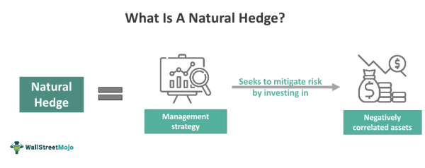

The complexities of today’s financial landscape demand robust risk management strategies to safeguard the financial well-being of businesses and investors. Among the myriad techniques available, natural hedging, financial risk management, and algorithmic trading stand out as crucial components in any strategic toolkit. This article focuses on exploring the concept of natural hedging, its role in mitigating financial risks, and the contribution of algorithmic trading to these measures.

Natural hedging offers a practical approach to managing financial risks by enabling businesses to capitalize on existing operational synergies. Unlike more conventional hedging mechanisms, which often rely on derivatives and other complex financial instruments, natural hedging leverages the inherent balance within a company’s operational setup. This strategy is particularly appealing for firms with international exposure, providing a cost-effective means to offset risks linked to currency fluctuations and market volatility.



Financial risk management is fundamental to maintaining stability and ensuring predictability in a company's financial outcomes. An effective risk management strategy integrates various methodologies, including natural hedging, to build resilience against market uncertainties. Organizations often complement these strategies with financial instruments like derivatives to manage risks that cannot be naturally offset.

Algorithmic trading introduces an additional dimension of precision and efficiency to risk management strategies. By utilizing sophisticated algorithms to execute trades based on predefined criteria, firms can enhance their hedging strategies and dynamically adjust their exposure in volatile markets. This technological advancement minimizes human errors and captures arbitrage opportunities, optimizing risk-adjusted returns.

This article is designed for finance professionals and readers interested in understanding how these strategies can reinforce business resilience amidst a dynamic economic environment. The synergistic application of natural hedging, comprehensive risk management frameworks, and algorithmic trading represents a forward-thinking approach to financial stability. By examining these concepts and their interactions, we aim to provide insights that contribute to stronger, more adaptable financial practices in the modern market landscape.

## Table of Contents

## Understanding Natural Hedging

Natural hedging is a strategy within financial risk management designed to minimize exposure to financial risks by utilizing offsetting positions in correlated assets. It contrasts sharply with traditional hedging methods predominantly reliant on financial derivatives like options and futures. Instead, natural hedging leverages an organization's existing operational structure to create a financial equilibrium. This typically involves aligning its costs and revenues in the same currency or market, thereby neutralizing potential fluctuations in exchange rates or market prices.

For instance, a corporation with operations in multiple countries might naturally hedge its exposure to foreign exchange risk by ensuring that expenses and revenues occur in the same local currency. This strategy could involve sourcing materials and labor, as well as generating sales, within the same economic zone. Such a setup not only simplifies accounting and reduces transaction costs but also protects profit margins from adverse currency movements without resorting to complex financial instruments.

The key advantage of natural hedging lies in its cost-effectiveness, particularly for enterprises with significant international operations. By minimizing dependence on external financial products, companies can conserve resources and simplify their risk management framework. Additionally, natural hedging can offer more stability in cash flow projections and financial outcomes, making it an appealing choice for organizations seeking a straightforward approach to risk management.

However, it's crucial to acknowledge the limitations of natural hedging. Although effective in mitigating certain financial risks, it is not a comprehensive risk management tool. Factors such as geopolitical risks, inflation, or broader market [volatility](/wiki/volatility-trading-strategies) can still impact a business significantly, despite a natural hedge. Consequently, natural hedging should be seen as part of a broader risk management strategy rather than a standalone solution.

In summary, natural hedging provides a practical and economical way for businesses to address specific financial risks inherent in their operations. While it serves as a vital component of an integrated risk management strategy, it must be complemented by additional tools and approaches to fully safeguard against the diverse array of financial uncertainties in today's global markets.

## Role of Financial Risk Management

Financial risk management plays a critical role in safeguarding businesses and investments from potential losses due to various financial risks. It involves a systematic approach to identifying, analyzing, and mitigating such risks, ensuring the stability and sustainability of an organization's financial health.

Natural hedging, a fundamental component of financial risk management, contributes significantly to achieving stability in cash flows and predicting earnings. By aligning an enterprise's operational setup—such as costs and revenues—in the same currency or market, natural hedging reduces exposure to exchange rate fluctuations. This alignment allows businesses to minimize risk without relying heavily on external financial instruments, paving the way for more predictable financial outcomes.

In constructing resilient financial strategies, effective risk management frameworks integrate both financial and natural hedges. This dual approach enables businesses to address a broader spectrum of financial risks. While natural hedging handles risks that can be internally matched within operational activities, financial instruments like derivatives provide a means to manage risks that cannot be naturally offset. Derivatives, including options, futures, and swaps, are employed by risk managers to hedge against [interest rate](/wiki/interest-rate-trading-strategies) fluctuations, currency volatility, and commodity price changes, complementing the natural hedging strategies.

Developing a comprehensive risk management strategy requires a deep understanding of market dynamics. Aligning these insights with business objectives ensures that the chosen strategies align with the company's risk appetite and growth plans. This alignment is crucial, as it allows businesses to not only respond effectively to current market conditions but also to anticipate and prepare for future uncertainties.

In summary, financial risk management encompasses the strategic use of both natural and financial hedging techniques to mitigate potential risks. By effectively integrating these methods, risk managers can design robust financial strategies that align with business objectives and market dynamics, thereby enhancing the long-term resilience and profitability of their organizations.

## Algorithmic Trading in Financial Risk Management

Algorithmic trading utilizes sophisticated computer algorithms to execute trades based on pre-defined rules, ensuring enhanced speed and accuracy. This approach has revolutionized financial markets by introducing efficiencies that minimize human error and capture [arbitrage](/wiki/arbitrage) opportunities often missed in traditional trading setups. By leveraging [algorithmic trading](/wiki/algorithmic-trading), financial professionals can manage risks more effectively through the use of real-time data analytics and predictive insights.

These systems can adjust trading positions dynamically in response to market volatility, making them particularly suitable for enhancing natural hedging strategies. For instance, algorithms can be programmed to buy or sell assets when they detect fluctuations in market prices, helping stabilize returns. This dynamic adjustment capability allows for swift responses to unforeseen market events, thereby optimizing hedging strategies and improving risk-adjusted returns.

Algorithmic trading also supports the management of financial risks by providing a comprehensive framework to predict potential market movements. By analyzing diverse datasets, algorithmic systems can forecast trends and patterns, thereby offering strategic insights that can be used to mitigate risks before they materialize.

The application of algorithmic trading provides several benefits for companies seeking to refine their hedging strategies. It supports complex calculations such as moving averages, volatility indices, or correlation coefficients to evaluate risk more precisely. As an example, a simple moving average (SMA) could be implemented using Python as follows:

```python
def simple_moving_average(prices, window):
    return [sum(prices[i:i+window]) / window for i in range(len(prices) - window + 1)]

# Example usage
prices = [100, 102, 104, 103, 105, 108]
sma = simple_moving_average(prices, 3)
print(sma)
```

Incorporating algorithmic trading into risk management frameworks requires technological infrastructure and expertise. However, once in place, these systems provide significant value by facilitating a quantitative approach to risk management, which conventional methods alone cannot achieve. Companies that successfully integrate algorithmic trading into their financial strategies can enhance both the efficiency of their operations and the robustness of their risk management processes. This strategic combination ensures better alignment with financial objectives while safeguarding against market uncertainties.

## Case Studies and Examples

## Case Studies and Examples

Case studies provide valuable insights into the application of natural hedging combined with algorithmic trading, showcasing how these strategies can effectively reduce financial risks.

### Multinational Corporation Example

Consider a multinational corporation that operates in various countries. This corporation has income and expenses primarily in the same foreign currency, naturally offsetting its exposure to exchange rate fluctuations. For instance, if a U.S.-based company operates in Europe, it earns revenue in euros and pays many of its expenses, such as salaries and local supplier costs, in euros. This natural hedging reduces the company’s exposure to changes in the EUR/USD exchange rate, thereby stabilizing cash flows and financial performance.

Such a corporation might integrate algorithmic trading alongside its natural hedging strategy. Algorithms can dynamically adjust hedging positions in response to market conditions, further optimizing currency exposure management. By combining a natural hedge with algorithmic trading, the company can increase efficiency and precision in its overall risk management strategy, without relying on financial derivatives that might come with higher costs or complexities.

### Hedge Fund Example

In the case of a [hedge fund](/wiki/hedge-fund-trading-strategies), algorithmic trading plays a central role in managing portfolio risks. A popular technique utilised is [pair trading](/wiki/pair-trading), a market-neutral strategy enabling investors to profit from the relative value movements between two stocks. The hedge fund uses complex algorithms to identify pairs of highly correlated assets. For example, if a company issues both stock and bonds, the prices of these assets often exhibit a strong correlation. The algorithm identifies when these assets deviate from historical price correlations, executing trades to capitalize on expected price corrections—buying the undervalued asset while shorting the overvalued counterpart.

This computerized approach not only ensures rapid decision-making but also reduces human error, enhancing the overall risk-return profile of the fund's investment strategy. Integrating pair trading algorithms with natural hedging in other aspects of the fund’s operations creates a synergistic strategy that neutralizes various financial vulnerabilities, further solidifying the fund’s resilience against market volatility.

In these examples, natural hedging and algorithmic trading are not mutually exclusive but form complementary components of sophisticated risk management frameworks. They showcase the adaptability and customization potential that these strategies offer, providing firms with robust tools to mitigate financial uncertainty in fast-paced, complex financial markets.

## Advantages and Limitations

Natural hedging is a strategic approach that enables businesses to mitigate financial risks effectively without the recurring costs associated with complex financial instruments such as derivatives. By aligning costs and revenues within the same currency or market, businesses can create a more predictable financial environment, thus offering a cost-effective risk mitigation solution. This alignment is particularly beneficial for companies with significant international operations, where exchange rate fluctuations can otherwise pose substantial risks.

One primary advantage of natural hedging is its straightforward approach, which integrates seamlessly into a company’s operations. This simplicity allows businesses to manage risks using their existing operational structures without needing to invest in or understand complicated financial products. Furthermore, when businesses employ natural hedging, they often achieve cost savings as they reduce their dependence on external hedging instruments, which can [carry](/wiki/carry-trading) high fees and complex contract terms.

Despite these advantages, natural hedging comes with limitations that should be considered. The greatest among these is its reduced flexibility. Natural hedging works best for predictable and consistent revenue and cost patterns, which means it cannot easily adapt to unexpected changes in the market or operational structures. Additionally, it is not suitable for addressing all types of financial risks, especially those that do not have offsetting positions within the business operations, such as credit risk or dramatic currency devaluation.

To complement natural hedging, businesses can incorporate algorithmic trading into their risk management strategies. Algorithmic trading offers the advantage of high-speed and efficient execution of trades, which can mitigate risks in real-time. The integration of algorithmic trading can dynamically adjust trading positions based on current market conditions, optimizing hedging strategies and improving risk-adjusted returns. However, this approach requires substantial technological infrastructure and expertise, which can be a significant barrier for some organizations.

A balanced approach that considers both natural hedging and algorithmic trading offers the most comprehensive risk management strategy. By combining the cost-effectiveness and operational alignment of natural hedging with the precision and adaptability of algorithmic trading, businesses can create a robust defense against financial risks. This synergy not only optimizes the mitigation process but also allows for adaptable strategies that can respond to even the most volatile market conditions, ensuring long-term financial stability.

## Conclusion

Natural hedging, financial risk management, and algorithmic trading collectively form a comprehensive approach to mitigating financial risks. Natural hedging, despite being a less conspicuous method, offers substantial benefits by inherently aligning operational costs and revenues to reduce exposure to market variables such as currency fluctuations. This technique allows businesses to manage risk without resorting to complex financial instruments, exemplifying its understated yet powerful nature.

In contrast, algorithmic trading introduces advanced technological capabilities that enhance precision and efficiency. Through the use of pre-defined algorithms, this approach enables rapid execution of trades, minimizing human error and optimizing opportunities for arbitrage. Algorithmic trading complements natural hedging by providing real-time data analytics and adaptive strategies, especially in volatile markets, thereby supporting dynamic risk management.

Developing a robust risk management strategy necessitates a thorough evaluation of a business's unique requirements, the prevailing economic landscape, and the resources at its disposal. An integrated framework that combines natural hedging and algorithmic trading allows for a tailored approach that addresses specific risk factors effectively. By strategically employing these methods, businesses can protect themselves against financial uncertainties, fostering resilience and ensuring long-term stability and profitability. Thus, the synergy between these strategies enhances not only risk mitigation but also the overall financial health of an organization.

## References & Further Reading

[1]: ["Financial Risk Manager Handbook"](https://www.amazon.com/Financial-Manager-Handbook-Wiley-Finance/dp/0470479612) by Philippe Jorion

[2]: ["Risk Management and Financial Institutions"](https://books.google.com/books/about/Risk_Management_and_Financial_Institutio.html?id=1J1QDwAAQBAJ) by John C. Hull

[3]: ["Algorithmic Trading: Winning Strategies and Their Rationale"](https://www.amazon.com/Algorithmic-Trading-Winning-Strategies-Rationale-ebook/dp/B00CY5HC0U) by Ernie Chan

[4]: Hull, J. (2006). ["Options, Futures, and Other Derivatives."](https://archive.org/details/optionsfuturesot0000hull_i8a4) Pearson Education.

[5]: "Natural Hedging Strategies: A Review of Theory and Practice of Currency Risk Management". Journal of Risk Finance. 