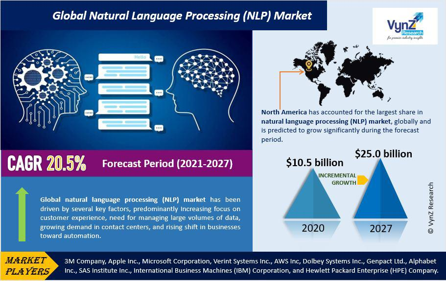

## Table of Contents

## What is Natural Language Processing (NLP) and how does it relate to markets?

Natural Language Processing, or NLP, is a part of computer science and artificial intelligence that helps computers understand and use human language. It's like teaching a computer to read, understand, and even talk like a human. NLP is used in things like Siri or Google Translate, where computers can understand what we say or write and respond in a way that makes sense.

In markets, NLP is really helpful because it can look at a lot of information very quickly. For example, it can read news articles, social media posts, and financial reports to figure out what people think about the market or specific companies. This helps people who invest money to make better choices because they can understand what's happening in the market faster and more accurately than if they had to read everything themselves.

## How can NLP be used to analyze market trends and consumer sentiment?

NLP can help analyze market trends by looking at lots of text from news, social media, and company reports. It can find patterns and topics that are popular or growing. For example, if many people start talking about electric cars, NLP can notice this trend and tell investors or businesses that electric cars are becoming more important in the market. This helps them make decisions about where to put their money or how to plan their business.

NLP also helps understand consumer sentiment, which is how people feel about products or brands. By reading what people write online, like reviews or social media posts, NLP can figure out if people are happy or unhappy with a product. If a new phone comes out and lots of people are saying good things about it, NLP can see this positive sentiment. Companies can use this information to see if their products are doing well or if they need to make changes to keep customers happy.

## What are the basic techniques used in NLP for processing market data?

One basic technique used in NLP for processing market data is text classification. This means sorting pieces of text into different groups. For example, NLP can read news articles and decide if they are talking about good news or bad news for the stock market. This helps investors quickly understand if the news might make stock prices go up or down. Another technique is sentiment analysis, where NLP looks at words and phrases to see if they show positive, negative, or neutral feelings. This is useful for figuring out how people feel about a company or product, which can affect how well the company does in the market.

Another important technique is named entity recognition (NER). This helps NLP find and label important things like company names, people, or places in text. For example, if a news article mentions "Apple Inc.", NER can recognize it as a company and not just a fruit. This makes it easier to connect different pieces of information about the same company. Topic modeling is also used, which helps find common themes in a lot of text. If many articles are talking about renewable energy, topic modeling can show this as a big trend in the market, helping investors see where the market might be going.

## Can you explain the role of machine learning in NLP applications for markets?

Machine learning plays a big role in NLP applications for markets. It helps computers learn from lots of data to get better at understanding and using human language. For example, [machine learning](/wiki/machine-learning) can teach an NLP system to recognize when people are talking about a company's stock in news articles or social media posts. The more data the system sees, the better it gets at figuring out what people mean and how it might affect the market. This is important because it helps investors and companies make smarter decisions based on what people are saying.

Another way machine learning helps is by making predictions. It can look at past data to guess what might happen next in the market. For example, if machine learning sees that certain words or phrases often come before a stock price going up or down, it can use this information to predict future movements. This is really useful for traders who want to know what might happen next so they can buy or sell stocks at the right time. Overall, machine learning makes NLP more powerful and helpful for understanding and predicting market trends.

## What are some common NLP tools and platforms used in market analysis?

There are several popular NLP tools and platforms that people use for market analysis. One of them is the Natural Language Toolkit (NLTK), which is a library in Python. NLTK is great for doing things like tokenizing text, which means breaking it into smaller parts, and doing sentiment analysis to see if people feel good or bad about something. Another tool is spaCy, which is also a Python library. It's fast and good at understanding the structure of sentences, which helps in finding important information like company names or stock symbols in market reports.

Another platform is IBM Watson, which is more of a full-service solution. It can do a lot of different NLP tasks, like understanding what people are saying and even answering questions about the market. It's useful for businesses that want to analyze a lot of data quickly. Google Cloud Natural Language API is also popular. It can help with things like finding out what people think about a product or a company by looking at what they write online. It's easy to use and works well with other Google services, which makes it a good choice for companies already using Google's tools.

## How does NLP help in automating trading decisions based on news and reports?

NLP helps automate trading decisions by reading news and reports and understanding what they mean for the market. When a new article comes out, NLP can quickly look at it and figure out if it's good or bad news for a company's stock. For example, if a company announces better-than-expected earnings, NLP can recognize this and tell the trading system to buy the stock because the price might go up. This means traders don't have to read every article themselves, which saves a lot of time and helps them make faster decisions.

This automation is really helpful because the market moves fast, and being quick can make a big difference. NLP can also look at many different sources at the same time, like news websites, social media, and financial reports. By putting all this information together, it can give a better picture of what's happening in the market. This helps trading systems make smarter choices about when to buy or sell stocks, based on a lot more information than any one person could handle on their own.

## What challenges are faced when applying NLP to financial markets?

One big challenge when using NLP in financial markets is understanding the special language that people use. Finance has its own words and phrases, like "bull market" or "bear market," that can be hard for computers to understand. If the NLP system doesn't know these terms, it might not get the right meaning from the text. Also, people in finance often use words in a way that can be confusing. For example, saying a stock "fell" could mean it went down in price, but it could also be used in a different way. This makes it hard for NLP to always understand what's being said.

Another challenge is dealing with a lot of information coming in all at once. News and social media posts about the market can come out very quickly, and it can be tough for NLP systems to keep up. If the system misses important news or takes too long to process it, traders might miss out on good opportunities. Also, sometimes the information can be wrong or misleading, which can trick the NLP system into making bad decisions. This means the system needs to be really good at telling the difference between useful information and things that aren't helpful or are just wrong.

## How can NLP be integrated with other data analytics techniques to enhance market predictions?

NLP can be combined with other data analytics techniques to make better market predictions by using the strengths of each method. For example, NLP can read and understand news articles, social media posts, and financial reports to figure out what people think about the market. This information can then be used with other data, like numbers from stock prices or trading volumes, to get a fuller picture of what's happening. By putting these different types of data together, analysts can see patterns and trends that they might miss if they only looked at one kind of information.

Another way NLP can help is by working with machine learning models that predict future market movements. NLP can provide the text data that these models need to learn from, helping them understand how certain words or phrases relate to changes in the market. For instance, if certain words often show up before a stock price goes up, the machine learning model can use this information to predict when it might happen again. By combining NLP with other data analytics techniques, like time series analysis or statistical modeling, analysts can make more accurate predictions about where the market is headed.

## What are the ethical considerations when using NLP in market analysis?

When using NLP for market analysis, it's important to think about ethical issues. One big concern is privacy. NLP systems read a lot of information from the internet, including what people say on social media. This means they might be looking at private information without people knowing. It's important to make sure that using this information doesn't hurt anyone's privacy. Companies should be clear about what data they are using and why, and they should follow rules about keeping data safe.

Another ethical issue is fairness. NLP systems can sometimes make mistakes, and these mistakes can affect people's money. For example, if the system misunderstands news or social media posts, it might tell investors to buy or sell stocks at the wrong time. This can be unfair to people who rely on these systems for advice. Also, NLP systems can sometimes treat different groups of people differently, like if they work better for one language than another. It's important to make sure that the systems are fair to everyone and don't cause harm because of mistakes or biases.

## How do advanced NLP models, like transformer models, improve market forecasting?

Advanced NLP models like transformer models help improve market forecasting by understanding text much better than older methods. These models can look at long pieces of text and see how different parts connect to each other. This is really helpful for market forecasting because they can read news articles, financial reports, and social media posts and understand the bigger picture. For example, if a transformer model reads about a new law that might affect a company, it can understand how this law might change the company's stock price. This makes the model's predictions more accurate because it's not just looking at single words or short phrases but at the whole context.

Another way transformer models help is by learning from a lot of data over time. They can see patterns in how certain words or topics relate to changes in the market. For instance, if the model notices that certain words often show up before a stock price goes up or down, it can use this information to predict future movements. This means that the more data the model sees, the better it gets at forecasting. This is a big advantage in the fast-moving world of markets, where being able to predict even a little bit better can make a big difference.

## What case studies demonstrate the successful application of NLP in market sectors?

One good example of using NLP in markets is how Bloomberg uses it to help traders. Bloomberg's system reads news articles and financial reports to understand what's happening in the market. It can tell if news is good or bad for certain companies and then gives traders advice on what to do with their stocks. This helps traders make quick decisions based on a lot of information they couldn't read all by themselves. Bloomberg's use of NLP shows how it can make trading easier and more accurate.

Another case study is from the company, AlphaSense. They use NLP to help businesses find important information from a huge amount of data, like news, reports, and social media. For example, a company might want to know what people think about their new product. AlphaSense's NLP system can read all the online talk about the product and tell the company if people like it or not. This helps the company decide if they need to change the product or keep it the same. AlphaSense's work shows how NLP can give businesses a better understanding of what their customers want.

## What future developments can we expect in NLP for market analysis and trading?

In the future, we can expect NLP to get even better at understanding the special language used in finance. This means that NLP systems will be able to read news articles, financial reports, and social media posts and understand exactly what they mean for the market. They will get better at [picking](/wiki/asset-class-picking) up on small details and understanding the big picture at the same time. This will help traders and investors make even better decisions because the NLP systems will be able to tell them more about what's happening and what might happen next in the market.

Another thing we might see is NLP working more closely with other kinds of data, like numbers from stock prices and trading volumes. By putting all this information together, NLP systems will be able to make predictions that are even more accurate. They will be able to see patterns and trends that they couldn't see before. This will make trading decisions faster and more reliable, helping traders stay ahead in the fast-moving world of markets.

## What are the advanced NLP techniques used in trading when diving deep into the subject?

Advanced NLP techniques have significantly enhanced the analytical capabilities used in trading. These methods allow traders to process vast amounts of textual data to identify trends and develop predictive models for market behavior. Techniques such as Term Frequency-Inverse Document Frequency (TFIDF), Cosine Similarity, Jaccard Similarity, Deep Learning, and Large Language Models are pivotal in extracting actionable insights.

**TFIDF** is a fundamental technique used to evaluate the importance of a word in a document relative to a collection of documents (corpus). This method helps identify key terms in financial news or reports, which might signal market shifts. The formula for TFIDF is:

$$
\text{TFIDF}(t, d, D) = \text{TF}(t, d) \times \text{IDF}(t, D)
$$

where $\text{TF}(t, d)$ is the term frequency of term $t$ in document $d$, and $\text{IDF}(t, D)$ is the inverse document frequency of term $t$ across the document corpus $D$.

**Cosine Similarity** measures the cosine of the angle between two vectors in a vector space, often used to assess the similarity between two text documents. This technique is crucial for matching financial documents or identifying duplicate textual data. The cosine similarity formula is:

$$
\text{Cosine Similarity}(A, B) = \frac{A \cdot B}{||A|| \times ||B||}
$$

where $A$ and $B$ are term frequency vectors.

**Jaccard Similarity** provides another approach to evaluating similarity by comparing the intersection and union of two sets of terms, suitable for gauging similarity in brief documents such as tweets or news headlines:

$$
\text{Jaccard Similarity}(A, B) = \frac{|A \cap B|}{|A \cup B|}
$$

This measure excels in situations where overlap and uniqueness are equally important.

**Deep Learning** has revolutionized how financial sentiment analysis is conducted using neural networks to learn hierarchical feature representations. Models such as convolutional neural networks (CNNs) and recurrent neural networks (RNNs), including Long Short-Term Memory networks (LSTMs), enable the detection of complex patterns in sequential data like news feeds or tweets. Implementing deep learning requires substantial computational resources and large datasets.

For example, a simple LSTM model in Python could be implemented as follows:

```python
from keras.models import Sequential
from keras.layers import LSTM, Dense, Embedding

model = Sequential()
model.add(Embedding(input_dim=vocab_size, output_dim=50, input_length=max_length))
model.add(LSTM(units=100))
model.add(Dense(units=1, activation='sigmoid'))

model.compile(optimizer='adam', loss='binary_crossentropy', metrics=['accuracy'])
```

**Large Language Models (LLMs)** like GPT-3 or BERT have transformed language understanding and generation. These models are pre-trained on vast datasets and fine-tuned for specific applications, such as predicting stock market trends based on sentiment analysis of tweets or analyzing quarterly earnings reports. Their ability to understand context and generate human-like text provides a significant advantage in creating sophisticated trading models.

In conclusion, NLP techniques like TFIDF, cosine and Jaccard similarity, [deep learning](/wiki/deep-learning), and LLMs enable sophisticated analysis that offers a competitive edge in trading. These tools allow traders to construct strategies based on nuanced interpretations of textual data, enhancing predictive accuracy and capturing opportunities in dynamic financial markets.

## References & Further Reading

[1] Vocabulary Profile as a Measure of Vocabulary Sophistication: This reference discusses methodologies for assessing vocabulary sophistication, which can be relevant in evaluating the linguistic complexity of textual data used in Natural Language Processing (NLP). Understanding vocabulary sophistication is beneficial for enhancing NLP models, particularly in financial contexts where precise language can significantly impact trading strategies.

[2] Russell, S., Dewey, D., & Tegmark, M. (2015). Research Priorities for Robust and Beneficial Artificial Intelligence: This research paper outlines the critical priorities for developing AI systems that are robust and beneficial. Its insights into AI's foundational principles are applicable to NLP technologies employed in trading, where reliable and efficient AI models are necessary for predicting financial trends and making informed decisions.

[3] Devlin, J., Chang, M. W., Lee, K., & Toutanova, K. (2018). BERT: Pre-training of Deep Bidirectional Transformers for Language Understanding: This paper presents BERT, an innovative approach to language model pre-training that has considerably advanced NLP capabilities. BERT's developments allow for a deeper understanding of context and nuance in natural language, which can be used to enhance sentiment analysis and predictive modeling in trading environments.

