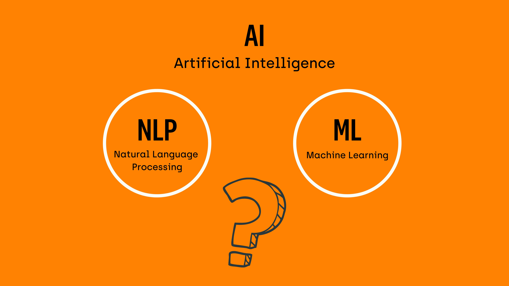

## Table of Contents

## What is Natural Language Processing (NLP)?

Natural Language Processing, or NLP, is a part of artificial intelligence that helps computers understand and work with human language. It's like teaching a computer to read, understand, and even talk back in a way that sounds natural to us. NLP is used in many things we see every day, like when we ask a smart speaker a question, or when we use a search engine to find information on the internet.

NLP involves several steps to make sense of language. First, it breaks down sentences into smaller parts like words or phrases. Then, it looks at the meaning of these parts and how they fit together to understand the whole message. This can be tricky because human language is full of nuances, like sarcasm or different meanings for the same word depending on context. NLP uses special math and computer tricks, like machine learning, to get better at understanding these nuances over time.

## How does NLP relate to machine learning?

NLP and machine learning are closely connected because machine learning helps NLP get better at understanding and working with human language. Machine learning is like teaching a computer to learn from examples. For NLP, this means showing the computer lots of text or speech and letting it figure out patterns and rules on its own. For example, if you want a computer to understand what people mean when they talk about "bank," it can learn from examples that "bank" can mean a place to keep money or the side of a river, depending on the words around it.

Once the machine learning model has learned from these examples, it can start making guesses about new texts or speeches it hasn't seen before. This is called prediction. The more examples the model sees, the better its predictions become. In NLP, these predictions help the computer understand and generate human language more naturally. For instance, a machine learning model can help a chatbot respond to questions in a way that sounds like a real person, by predicting the most likely next words based on what it has learned.

## What are some common applications of NLP in everyday life?

NLP is used in many things we do every day. For example, when you use a voice assistant like Siri or Alexa, NLP helps them understand what you're saying and give you a helpful answer. Another common use is in texting or messaging apps, where NLP can suggest words or phrases as you type, making it easier and faster to write messages. Also, when you search for something on the internet, NLP helps the search engine understand what you're looking for and show you the best results.

Another way NLP is used every day is in customer service. Many companies use chatbots that use NLP to talk to customers and help them with their questions or problems. These chatbots can understand what customers are asking and give them the right information or connect them to a human if needed. Additionally, NLP is used in language translation apps, helping people understand and communicate in different languages. So, whether you're asking for directions, shopping online, or just chatting with friends, NLP is often working behind the scenes to make things easier and more natural.

## What are the basic components of an NLP system?

The basic components of an NLP system include tokenization, which is breaking down text into smaller parts like words or sentences. This helps the computer understand the structure of the language. After tokenization, there's parsing, which is figuring out how these smaller parts fit together grammatically. This step is important for understanding the meaning of sentences. Another key component is part-of-speech tagging, where the system labels each word as a noun, verb, adjective, and so on, to better understand its role in the sentence.

The next components involve semantic analysis, which is about understanding the meaning of words and how they relate to each other. This can include named entity recognition, which identifies and classifies things like names of people, organizations, or locations in the text. Sentiment analysis is another part, where the system tries to figure out if the text expresses positive, negative, or neutral feelings. Finally, [machine learning](/wiki/machine-learning) models are often used in NLP to improve these processes over time. These models can be trained on large amounts of text data to make better predictions about language, like guessing the next word in a sentence or understanding the overall meaning of a paragraph.

In summary, an NLP system combines several steps to process and understand human language. It starts with breaking down the text into manageable parts, then works on understanding the grammar and meaning, and finally uses machine learning to refine its understanding and predictions. These components work together to make NLP useful in many applications, from simple text prediction to complex language translation.

## How do machine learning algorithms help in understanding and generating human language?

Machine learning algorithms help in understanding and generating human language by learning from large amounts of text data. When these algorithms see a lot of examples, they can start to recognize patterns in how words are used and how sentences are structured. For example, if an algorithm sees many sentences where "bank" is followed by words like "money" or "account," it learns that "bank" often refers to a financial institution. This pattern recognition helps the algorithm predict what words might come next in a sentence or understand the overall meaning of a text. The more data the algorithm processes, the better it gets at making these predictions, which is why big datasets are so important in NLP.

Once these algorithms have learned from the data, they can be used to generate new text that sounds like it was written by a human. For instance, when you use a chatbot or a text prediction tool, the machine learning model suggests words or phrases based on what it has learned. It does this by calculating the probability of different words following each other, using something called a language model. If the model has seen "I like to" followed by "eat" many times, it will suggest "eat" as a likely next word. This way, machine learning helps computers not only understand what we say but also respond in a way that feels natural and helpful.

## What is the difference between rule-based and statistical NLP methods?

Rule-based NLP methods use a set of predefined rules to understand and process language. These rules are created by experts who know a lot about language and grammar. For example, a rule might say that if a sentence starts with "Do you," it's probably a question. These methods are good for tasks where the rules are clear and don't change much, like checking spelling or grammar. But they can struggle with understanding more complex or creative language because they can't learn from new examples.

Statistical NLP methods, on the other hand, use math and data to understand language. They look at lots of text and try to find patterns. For example, if they see "bank" followed by "money" a lot, they learn that "bank" often means a place for money. These methods use machine learning to get better over time. They can handle more complex language because they can learn from new examples. But they need a lot of data to work well, and sometimes they can make mistakes if the data they learn from isn't good or if the language changes in ways they haven't seen before.

## What are some popular machine learning models used in NLP?

Some popular machine learning models used in NLP include Recurrent Neural Networks (RNNs), Long Short-Term Memory (LSTM) networks, and Transformer models. RNNs are good at understanding sequences of words because they can remember what they saw earlier in the text. This helps them understand things like grammar and context. LSTMs are a special kind of RNN that are even better at remembering long sequences, which makes them useful for tasks like translating languages or predicting the next word in a sentence. Transformer models, like the ones used in BERT and GPT, are newer and can understand and generate text even better than RNNs and LSTMs. They use something called "attention" to focus on different parts of the text at once, which helps them understand the relationships between words more effectively.

These models are trained on huge amounts of text data to learn how words and sentences work. For example, when training a model like BERT, you show it lots of sentences and ask it to predict missing words or understand the meaning of the text. The model learns by adjusting its internal math, called parameters, to make better predictions. The more data it sees, the better it gets at understanding and generating language. This is why models like BERT and GPT can do things like answer questions, summarize texts, or even write new sentences that sound like they were written by a human.

## How does training data affect the performance of NLP models?

Training data is super important for how well NLP models work. When you train an NLP model, you show it lots of examples of text. The more examples it sees, the better it gets at understanding and predicting language. If the training data is good and has lots of different kinds of sentences, the model can learn about many different ways people use language. But if the data is not good, like if it's too small or only has certain types of sentences, the model might not work well for other kinds of text. For example, if you only train a model on news articles, it might not understand casual conversations very well.

The quality of the training data also matters a lot. If the data has mistakes or is biased, the model can learn those mistakes or biases too. For instance, if the data mostly has examples from one group of people, the model might not understand language from other groups as well. This can lead to problems like the model not working fairly for everyone. So, making sure the training data is big, varied, and good quality is key to making NLP models that work well and are fair for everyone.

## What challenges are faced when processing different languages in NLP?

Processing different languages in NLP can be tricky because each language has its own rules and ways of saying things. For example, some languages, like English, put the subject before the verb, while others, like Japanese, might put the verb at the end of the sentence. This means that NLP models need to learn different patterns for each language. Also, languages have different alphabets and characters, like Chinese uses characters instead of letters, which makes it harder for computers to understand and process them. Another challenge is that some languages have fewer resources, like less text data available for training, which can make it harder to build good NLP models for those languages.

Another issue is that languages change over time and can be used differently in different places or cultures. This means that an NLP model trained on one type of text might not work well with another type. For example, slang or regional dialects can be hard for models to understand if they weren't in the training data. Plus, translating between languages is tough because words and phrases don't always have direct translations. Sometimes, the meaning of a sentence depends on the context, which can be different in each language. So, building NLP systems that work well for many languages takes a lot of work and a lot of data from different places and times.

## How can NLP be used to improve sentiment analysis?

NLP can make sentiment analysis better by understanding the feelings in text more accurately. It does this by looking at not just single words but also how those words are used together. For example, if someone says "I'm not happy," NLP can understand that "not" changes the meaning of "happy" to show a negative feeling. By using machine learning, NLP can learn from lots of examples to get better at figuring out if a text is positive, negative, or neutral. This means it can handle more complex language, like sarcasm or different ways people express emotions.

Another way NLP helps with sentiment analysis is by understanding context. Sometimes, the same word can mean different things depending on what's around it. For instance, "sick" can mean "ill" or "cool," and NLP can tell the difference by looking at the whole sentence. Also, NLP can learn about different cultures and languages, so it can understand how people from different places express their feelings. This makes sentiment analysis more accurate and useful for things like understanding customer feedback or social media posts.

## What are the latest advancements in deep learning for NLP?

The latest advancements in [deep learning](/wiki/deep-learning) for NLP have made computers much better at understanding and generating human language. One big advancement is the use of Transformer models, like BERT and GPT. These models use a special technique called "attention" to focus on different parts of the text at the same time. This helps them understand the relationships between words better than older models like RNNs and LSTMs. For example, when reading a sentence, the model can pay more attention to words that are important for understanding the overall meaning. This has made tasks like translating languages, answering questions, and summarizing texts much more accurate.

Another exciting advancement is the development of models that can learn from less data. This is important because not all languages have a lot of text available for training. Techniques like few-shot learning and transfer learning help models use what they've learned from one language or task to do well in another. This means we can build better NLP systems for languages that don't have as much data. Also, researchers are working on making models more efficient, so they can run faster and use less energy. This is important for using NLP on devices like smartphones and making it easier for everyone to use these powerful tools.

## How do transformer models like BERT and GPT impact the field of NLP?

Transformer models like BERT and GPT have changed the way computers understand and make human language. Before these models, computers used older methods like RNNs and LSTMs. These older methods were good but had trouble with long sentences and understanding the whole meaning of a text. Transformer models are different because they use a special trick called "attention." Attention helps the model focus on important parts of the text at the same time. This makes it easier for the model to understand how words relate to each other, no matter where they are in the sentence. Because of this, transformer models are better at tasks like translating languages, answering questions, and even writing new sentences that sound like they were written by a human.

Another big impact of transformer models is that they can learn from less data. This is important because not all languages have a lot of text to train on. Techniques like few-shot learning and transfer learning let these models use what they've learned from one language or task to do well in another. This means we can build better NLP systems for languages that don't have as much data. Also, these models are getting more efficient, so they can run faster and use less energy. This makes it easier to use them on devices like smartphones, making powerful language tools available to more people.

## References & Further Reading

[1]: Jurafsky, D., & Martin, J. H. (2008). ["Speech and Language Processing: An Introduction to Natural Language Processing, Computational Linguistics, and Speech Recognition"](https://www.researchgate.net/publication/200111340_Speech_and_Language_Processing_An_Introduction_to_Natural_Language_Processing_Computational_Linguistics_and_Speech_Recognition) (2nd Edition). Pearson Prentice Hall.

[2]: Vaswani, A., Shazeer, N., Parmar, N., Uszkoreit, J., Jones, L., Gomez, A. N., Kaiser, Ł., & Polosukhin, I. (2017). ["Attention is All you Need."](https://arxiv.org/abs/1706.03762) Advances in Neural Information Processing Systems 30.

[3]: Devlin, J., Chang, M. W., Lee, K., & Toutanova, K. (2019). ["BERT: Pre-training of Deep Bidirectional Transformers for Language Understanding."](https://arxiv.org/abs/1810.04805) Proceedings of NAACL-HLT 2019.

[4]: Russell, S. J., & Norvig, P. (2010). ["Artificial Intelligence: A Modern Approach."](https://api.pageplace.de/preview/DT0400.9781292401171_A41586057/preview-9781292401171_A41586057.pdf) Prentice Hall.

[5]: Goldberg, Y. (2017). ["Neural Network Methods for Natural Language Processing."](https://link.springer.com/book/10.1007/978-3-031-02165-7) Synthesis Lectures on Human Language Technologies, Morgan & Claypool Publishers.

[6]: Mikolov, T., Sutskever, I., Chen, K., Corrado, G. S., & Dean, J. (2013). ["Distributed Representations of Words and Phrases and their Compositionality."](https://arxiv.org/abs/1310.4546) Advances in Neural Information Processing Systems, 26.

[7]: Goodfellow, I., Bengio, Y., & Courville, A. (2016). ["Deep Learning."](https://www.deeplearningbook.org/) MIT Press.

[8]: Manning, C. D., Raghavan, P., & Schütze, H. (2008). ["Introduction to Information Retrieval."](https://www.cambridge.org/highereducation/books/introduction-to-information-retrieval/669D108D20F556C5C30957D63B5AB65C) Cambridge University Press.

[9]: Sutskever, I., Vinyals, O., & Le, Q. V. (2014). ["Sequence to Sequence Learning with Neural Networks."](https://arxiv.org/abs/1409.3215) Advances in Neural Information Processing Systems 27.