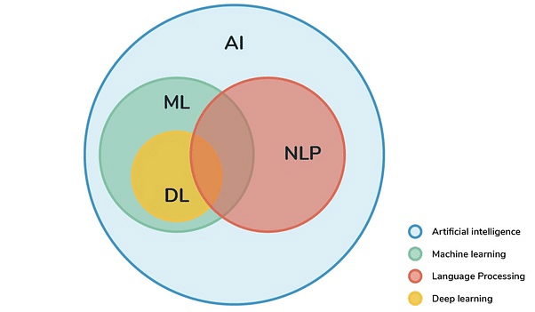

## Table of Contents

## What is Natural Language Understanding (NLU)?

Natural Language Understanding (NLU) is a part of artificial intelligence that helps computers understand and interpret human language. It's like teaching a computer to understand what people mean when they talk or write. NLU uses different methods to figure out the meaning behind words, sentences, and even whole conversations. This includes understanding the context, the emotions, and the intentions of the speaker or writer.

For example, when someone says, "It's raining cats and dogs," NLU helps the computer understand that it's not really raining animals, but that it's raining heavily. This understanding is important for things like voice assistants, chatbots, and translation software. By using NLU, these tools can respond more accurately and helpfully to what people say or write.

## How does NLU differ from Natural Language Processing (NLP)?

Natural Language Understanding (NLU) and Natural Language Processing (NLP) are closely related, but they focus on different aspects of language. NLU is a part of NLP that specifically deals with understanding the meaning behind human language. It tries to figure out what people mean when they speak or write, including understanding context, emotions, and intentions. For example, if someone says, "Can you turn on the lights?" NLU helps the computer understand that the person wants the lights turned on, not just asking if the computer can do it.

On the other hand, Natural Language Processing (NLP) is a broader field that includes NLU but also covers other aspects of language interaction. NLP involves both understanding and generating human language. It includes tasks like speech recognition, where the computer turns spoken words into text, and language generation, where the computer creates human-like responses. So, while NLU is focused on understanding, NLP encompasses both understanding and the ability to respond or generate language.

## What are the main components of an NLU system?

The main components of an NLU system include a parser, a semantic analyzer, and a context manager. The parser takes in the text or speech and breaks it down into smaller parts like words and sentences. It helps the system understand the basic structure of what is being said. The semantic analyzer then figures out the meaning of these parts. It looks at the words and how they are used to understand the overall message, including any special meanings or idioms. The context manager keeps track of the conversation or the situation, helping the system understand things like who is talking, what has been said before, and what might be meant by certain words or phrases.

Another important component is the intent classifier, which tries to figure out what the speaker or writer wants to do or achieve. For example, if someone says, "Can you book a flight to Paris?" the intent classifier would recognize that the person wants to book a flight. The NLU system also often includes a sentiment analyzer, which looks at the emotions behind the words. This helps the system understand if someone is happy, sad, angry, or neutral. All these components work together to help the computer understand human language in a way that's as close as possible to how a human would understand it.

## What are some common applications of NLU in everyday technology?

NLU is used in many everyday technologies to help them understand what people say or write. One common use is in voice assistants like Siri, Alexa, and Google Assistant. When you ask these devices to play music, set a reminder, or answer a question, NLU helps them understand what you want. It figures out the meaning behind your words, so it can do what you asked. Another use is in chatbots on websites or apps. These bots use NLU to understand customer questions and give helpful answers, making it easier for people to get the information they need without waiting for a human.

NLU also helps with language translation apps and software. When you use a tool like Google Translate, NLU works to understand the original text and then translate it into another language while keeping the meaning the same. This makes it easier for people to communicate across different languages. Additionally, NLU is used in email and messaging apps to sort and prioritize messages. For example, it can recognize important emails and move them to the top of your inbox, or suggest quick replies based on the content of a message. All these applications make technology more helpful and easier to use in our daily lives.

## How does machine learning contribute to NLU?

Machine learning helps NLU by teaching computers to get better at understanding human language over time. It uses big sets of data to train models that can figure out the meaning behind words and sentences. For example, a [machine learning](/wiki/machine-learning) model might look at thousands of examples of people asking questions to learn what kind of answers they expect. This way, when someone asks a new question, the model can use what it learned to give a good answer. The more data the model sees, the better it gets at understanding language, making NLU systems more accurate and helpful.

In NLU, machine learning also helps with things like figuring out the context and emotions in a conversation. By looking at past conversations and how people usually respond in different situations, the model can predict what someone might mean or feel. This makes the computer better at understanding not just the words, but the whole situation. For example, if someone says, "I'm feeling down today," the model might recognize the emotion and respond in a supportive way. Machine learning makes NLU systems smarter and more like how a human would understand language.

## What are the typical steps involved in developing an NLU model?

Developing an NLU model starts with collecting a lot of data. This data includes examples of the kind of language the model needs to understand, like sentences, questions, or commands. The data is then labeled to show what each piece means, such as the intent behind a sentence or the emotion it expresses. This labeled data is used to train the model. During training, the model looks at the examples and learns to recognize patterns and meanings. This step might use machine learning techniques to help the model get better at understanding language over time.

After training, the model is tested to see how well it works. This involves giving the model new examples it hasn't seen before and checking if it can understand them correctly. If the model makes mistakes, it might need more training or adjustments to improve its performance. Once the model is working well, it can be used in real applications, like voice assistants or chatbots. It's important to keep updating the model with new data to make sure it stays accurate and helpful as language and user needs change.

## What are some of the challenges faced in NLU?

One of the main challenges in NLU is understanding the context of language. People often use words and phrases that can mean different things depending on the situation. For example, if someone says, "It's cold in here," they might want the heat turned up, or they might just be making a comment about the weather. NLU systems need to figure out which meaning is right based on what has been said before and other clues. This can be hard because language is full of these kinds of ambiguities, and computers have to learn how to deal with them.

Another challenge is understanding emotions and intentions. People don't always say exactly what they mean. They might use sarcasm, or they might be polite but really want something different. NLU systems need to pick up on these subtleties to respond in the right way. This is tricky because emotions and intentions are often shown through tone of voice, facial expressions, and other non-verbal cues that computers can't easily understand. So, NLU has to rely on the words themselves and any past interactions to make its best guess.

A third challenge is dealing with different languages and dialects. NLU systems are often trained on data from one language or a specific region, but people speak in many different ways around the world. For example, the same sentence might be said differently in American English versus British English. NLU models need to be able to understand these differences to work well for everyone. This means they need to be trained on a lot of diverse data, which can be hard to collect and process.

## How do supervised and unsupervised learning approaches apply to NLU?

Supervised learning in NLU involves training a model using labeled data. This means the data has examples of sentences or phrases, and each example is tagged with what it means, like the intent or the emotion. For example, if the sentence is "Can you book a flight?" it might be labeled as an intent to book a flight. The model learns from these examples to recognize patterns and make predictions about new sentences it sees. This approach works well when you have a lot of labeled data, but collecting and labeling this data can be time-consuming and expensive.

Unsupervised learning in NLU, on the other hand, doesn't use labeled data. Instead, the model tries to find patterns and meanings in the data on its own. For example, it might group similar sentences together to understand common themes or topics. This approach is useful when you don't have labeled data, but it can be harder for the model to learn the right meanings without guidance. Both supervised and unsupervised learning have their place in NLU, and sometimes they are used together to make the model even better at understanding language.

## What role do neural networks play in advancing NLU?

Neural networks have been a game-changer for NLU because they can learn and understand language in a way that's closer to how humans do it. They do this by figuring out patterns in big sets of data, like sentences and words. For example, a [neural network](/wiki/neural-network) can learn that when people say "turn on the lights," they usually want the lights to be turned on, not just asking if it's possible. This is done by training the network on lots of examples, so it can start to understand the meaning behind different phrases and words. Neural networks can also handle things like context and emotions, which makes them really good at understanding what people mean, even when they don't say it directly.

These networks have also made NLU systems better at dealing with different languages and dialects. Because neural networks can learn from a lot of different data, they can understand how the same sentence might be said differently in different places or by different people. This means that NLU systems using neural networks can be more accurate and helpful for more people. Overall, neural networks have helped make NLU systems smarter and more like how a human would understand language, which is why they're so important in this field.

## How can NLU be evaluated and what metrics are commonly used?

Evaluating NLU involves checking how well a system understands and interprets human language. Common metrics used include accuracy, which measures how often the system gets the right answer, and precision and recall, which look at how well the system finds the correct information without including too much incorrect information. For example, if the system is supposed to recognize the intent behind a sentence, accuracy would show how often it correctly identifies the intent. Precision would show how many of the intents it identified were actually correct, while recall would show how many of the correct intents it managed to find. These metrics help developers see where the system is doing well and where it needs to improve.

Another important metric is the F1 score, which is a way to balance precision and recall into one number. The F1 score is calculated using the formula $$ F1 = 2 \times \frac{\text{precision} \times \text{recall}}{\text{precision} + \text{recall}} $$. This score is useful because it gives a single measure of a system's performance, making it easier to compare different NLU models. Besides these technical metrics, user satisfaction surveys can also be used to see how well the system works in real life. People might be asked if the system understood their requests correctly and if they were happy with the responses. This helps make sure the NLU system is not just technically good but also helpful to actual users.

## What are the latest advancements in NLU research?

Recent advancements in NLU research have focused on making systems better at understanding context and emotions. One big step forward is the use of transformer models, like BERT and its newer versions. These models can look at a whole sentence at once, not just one word at a time. This helps them understand the meaning of words based on the words around them. For example, if someone says "I'm feeling down," the model can understand that "down" means sad because of the phrase "feeling." Researchers are also working on making NLU systems better at understanding different languages and dialects, so they can be helpful to more people around the world.

Another exciting area of research is in making NLU systems more interactive and able to learn from fewer examples. This is called few-shot learning, where the system can understand new tasks or intents after seeing just a few examples. This is important because it makes it easier to add new features to NLU systems without needing a lot of new data. Researchers are also exploring ways to combine NLU with other types of AI, like computer vision, to understand not just what people say but also what they see or do. This could make systems even smarter and more helpful in understanding the full context of human communication.

## How can NLU be integrated with other AI technologies to enhance performance?

NLU can be integrated with other AI technologies like computer vision and machine learning to make systems smarter and more helpful. For example, combining NLU with computer vision allows a system to understand not just what people say, but also what they see or do. If someone says, "Can you find my red shirt?" the system can use NLU to understand the request and computer vision to look for a red shirt in a video or image. This makes the system better at understanding the full context of what's happening, which can lead to more accurate and useful responses.

Another way NLU can be enhanced is by using machine learning techniques like [reinforcement learning](/wiki/reinforcement-learning). This helps the system learn from its interactions with users over time. For example, if the system often gets a certain request wrong, it can learn from those mistakes and get better at understanding similar requests in the future. By combining NLU with these other AI technologies, the system can become more accurate, more helpful, and better at understanding the complex ways people communicate.

## References & Further Reading

[1]: Jurafsky, D., & Martin, J. H. (2019). ["Speech and Language Processing"](https://web.stanford.edu/~jurafsky/slp3/) (3rd ed.). Prentice Hall.

[2]: Russell, S. J., & Norvig, P. (2020). ["Artificial Intelligence: A Modern Approach"](https://api.pageplace.de/preview/DT0400.9781292401171_A41586057/preview-9781292401171_A41586057.pdf) (4th ed.). Pearson.

[3]: Vaswani, A., Shazeer, N., Parmar, N., Uszkoreit, J., Jones, L., Gomez, A. N., Kaiser, L., & Polosukhin, I. (2017). ["Attention Is All You Need."](https://arxiv.org/abs/1706.03762) In Advances in Neural Information Processing Systems (NeurIPS).

[4]: Young, T., Hazarika, D., Poria, S., & Cambria, E. (2018). ["Recent Trends in Deep Learning Based Natural Language Processing."](https://ieeexplore.ieee.org/abstract/document/8416973) IEEE Computational Intelligence Magazine, 13(3), 55-75.

[5]: Devlin, J., Chang, M. W., Lee, K., & Toutanova, K. (2019). ["BERT: Pre-training of Deep Bidirectional Transformers for Language Understanding."](https://arxiv.org/abs/1810.04805) In Proceedings of the 2019 Conference of the North American Chapter of the Association for Computational Linguistics.