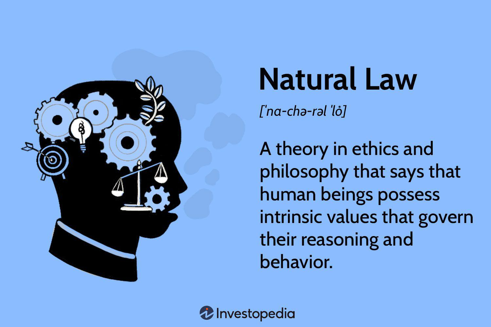

The rise of algorithmic trading has revolutionized the financial markets, fundamentally altering trade execution and market analysis. This technological evolution has not only introduced efficiencies but also necessitated an exploration of the ethical dimensions associated with these autonomous trading mechanisms. Algorithmic trading, characterized by the use of computer algorithms to execute trades at high speeds and volumes, departs significantly from traditional human-led trading practices. While offering benefits such as increased liquidity and reduced transaction costs, it also presents challenges related to fairness, transparency, and market stability.

Ethics in trading, though a longstanding concern, has become more complex with the advent of intelligent trading algorithms. These algorithms, deploying intricate mathematical models and large data sets, can inadvertently or intentionally manipulate markets, leading to ethical and regulatory scrutiny. The opacity with which these systems operate can obscure accountability, raising questions about who is responsible for algorithm-generated decisions, especially in cases of systemic failure or unintended consequences.

Natural law philosophy offers a foundational framework to navigate the moral implications of automated trading activities. Rooted in the existence of objective moral principles inherent in human nature and the world, natural law emphasizes reason and moral universals as guiding tenets for ethical conduct. In the context of rapidly advancing financial technologies, natural law principles can provide a lens through which the ethicality of trading algorithms is assessed. By advocating for values such as fairness, justice, and respect for the rights of all market participants, natural law can inform the ethical evaluation of algorithmic trading practices. 

This article will explore how these philosophical underpinnings can guide the development and implementation of ethical algorithmic trading strategies, ensuring that technological innovations align with broader societal values and contribute positively to financial market ecosystems.

## Table of Contents

## Understanding Algorithmic Trading

Algorithmic trading is a method of executing orders using automated pre-programmed trading instructions, which consider multiple variables such as time, price, and volume. This technique enables traders to make decisions and execute trades at speeds far beyond human capabilities. At its core, algorithmic trading employs mathematical models and leverages historical data and prevailing market trends to determine optimal order execution strategies.

Generally, algorithmic trading systems aim to maximize profits by exploiting market microstructures and minute movements. The fundamental principle involves analyzing vast datasets to forecast short-term market movements accurately. These algorithms may utilize a variety of strategies, such as statistical [arbitrage](/wiki/arbitrage), which involves identifying pricing inefficiencies between correlated securities, or trend-following strategies that capitalize on [momentum](/wiki/momentum) by detecting persistent movement in the market.

The benefits of [algorithmic trading](/wiki/algorithmic-trading) are manifold. Firstly, it enhances market efficiency by increasing the speed at which trades are executed, thereby narrowing the bid-ask spread and improving price discovery mechanisms. Secondly, the automation of the trading process reduces transaction costs by minimizing manual processing errors and leveraging economies of scale. Moreover, algorithmic trading contributes to improved [liquidity](/wiki/liquidity-risk-premium), as high-frequency trading platforms often act as market makers, providing continuous buy and sell quotes.

Despite these advantages, algorithmic trading introduces significant challenges regarding transparency, market manipulation, and systemic risks. The complexity and opacity of these algorithms can obscure trading intentions and impact market transparency. For example, high-frequency trading strategies may lead to market manipulation through practices like "spoofing," where large orders are placed with the intent to cancel before execution to create artificial price movements.

Moreover, the sheer speed and [volume](/wiki/volume-trading-strategy) of trades executed through algorithmic systems pose a systemic risk, exemplified by incidents such as the 2010 Flash Crash. Such scenarios arise when algorithms react to erroneous signals or feedback loops, leading to cascading sell-offs and [volatility](/wiki/volatility-trading-strategies) spikes. Addressing these challenges requires stringent regulatory oversight and the implementation of robust risk management mechanisms within algorithmic trading systems to mitigate potential adverse effects on the market ecosystem.

## Ethical Considerations in Algorithmic Trading

As algorithmic trading continues to expand within financial markets, several ethical considerations come to the forefront, raising questions about the implications of these automated systems on market dynamics and stakeholder fairness. 

One significant ethical concern is the potential for algorithms to create unfair advantages or disrupt market fairness. Algorithmic systems, especially those implementing high-frequency trading ([HFT](/wiki/high-frequency-trading-strategies)), can execute orders at speeds unachievable by human traders, potentially edging out slower market participants and creating unequal markets. The rapid speed of execution can amplify existing market disparities and potentially lead to situations where price and trade fairness are compromised. This speed advantage can result in predatory trading strategies that take advantage of minute market inefficiencies, effectively sidelining slower investors.

Accountability for algorithm-generated decisions presents another ethical dilemma. Algorithms operate based on pre-set instructions and [machine learning](/wiki/machine-learning) models. However, unintended consequences or failures may arise, leading to significant financial losses or market disruptions, as seen in past instances of market flash crashes. Determining liability in such scenarios is complex. Should accountability lie with the developers who coded the algorithms, the firms that deployed them, or the systems that failed to anticipate aberrant behavior? These questions remain largely unresolved and highlight the need for a robust framework that clearly delineates responsibility.

The ethical use of data is also paramount given the reliance of algorithmic trading on massive datasets. Algorithms often analyze extensive streams of market data, which may include proprietary or sensitive information. Ensuring the ethical use of such data involves respecting privacy and consent, adhering to data protection regulations, and maintaining transparency in data handling processes. The utilization of sensitive information without appropriate safeguards can breach ethical norms and lead to trust erosion among stakeholders.

Each of these ethical considerations points towards the necessity of integrating moral judgments into the design and implementation of algorithmic trading systems. Such integration must occur, not only in response to existing norms and regulations but also in anticipation of evolving ethical standards that prioritize fairness, accountability, and respect for data privacy.

 to Natural Law Philosophy

Natural law philosophy is a prominent ethical theory that asserts the existence of objective moral principles that are inherent in the nature of humans and the world around them. These principles, regarded as universal and immutable, form the basis for evaluating human conduct and establishing justice. Rooted in classical philosophy, natural law has significantly influenced legal systems and ethical perspectives through the ages.

At its core, natural law emphasizes the role of human reason in discerning moral truths. Human beings are seen as rational [agents](/wiki/agents) capable of understanding and applying these moral principles to their actions. This aspect of the philosophy underscores the belief in moral universals—truths that transcend cultures and epochs, providing a consistent framework for ethical decision-making.

Historically, natural law has played a crucial role in shaping legal and moral thought. It has informed the development of legal systems by advocating for a moral order that goes beyond the constraints of human-made laws. For instance, the natural rights philosophy, an offshoot of natural law, was instrumental in the formulation of foundational political documents like the United States Declaration of Independence, which asserts inalienable rights.

In the business and financial sectors, natural law principles offer moral guidance by identifying practices that are fair and just. This is especially pertinent in complex systems such as financial markets, where the pursuit of profit can sometimes obscure ethical considerations. By adhering to natural law principles, individuals and organizations are encouraged to engage in conduct that respects the dignity and rights of all stakeholders while promoting the common good.

In contemporary discussions, natural law continues to be relevant as it provides a moral compass in navigating ethical dilemmas, reminding us of the intrinsic values that should guide human behavior, irrespective of technological advancements and societal changes.

## Applying Natural Law Ethics to Algorithmic Trading

Natural law ethics, rooted in the belief in universal moral principles derived from human nature and reason, offers a robust framework to critically assess algorithmic trading practices. At its core, natural law emphasizes fairness, justice, and the common good—principles that remain pertinent when scrutinizing the conduct of trading algorithms within financial markets.

A primary consideration is the adherence of algorithms to a framework that respects the dignity and rights of all market participants. Ethical algorithmic trading necessitates designing systems that do not disproportionately benefit select entities at the expense of others, thereby ensuring market equity. This involves creating algorithms that uphold the intrinsic fairness of markets, facilitating equal opportunities for all investors and preventing exploitation of market asymmetries.

Moreover, the alignment of algorithmic trading with market efficiency should not undermine the moral principles that natural law champions. Ethical algorithm design should aim to improve liquidity and price discovery without engaging in practices that could result in manipulative behaviors or contribute to systemic risk. For instance, high-frequency trading algorithms should be assessed for their market impact, ensuring they do not lead to short-lived volatility that could harm the market's integrity.

Transparency and predictability are essential elements that natural law ethics advocates for in algorithmic trading. Transparency involves making the actions and intentions of algorithms visible and understandable to regulatory bodies and, where appropriate, to the public. This could be achieved through algorithmic transparency reports that outline the decision-making processes and potential biases embedded within trading algorithms. Predictability, on the other hand, entails ensuring that algorithmic behavior remains consistent and reliable, which helps prevent undue market disruption and fosters trust among market participants. 

Implementing transparency and predictability can be technically facilitated through documentation and testing protocols. For example, algorithms can be programmed to log all decisions and actions, allowing for after-the-fact audits by regulatory authorities. Furthermore, rigorous testing environments where algorithms are evaluated under numerous market scenarios can help identify potential unethical patterns in decision-making before live deployment.

Adopting a natural law perspective in algorithmic trading underscores the significance of ethical foresight in technological advancement. By integrating principles such as fairness, justice, and the common good into algorithm design and deployment, practitioners and regulators can harness technological growth while safeguarding the ethical integrity of financial markets.

## Case Studies and Examples

Numerous case studies provide valuable insights into the ethical dimensions of algorithmic trading, showcasing both successes and pitfalls. A prominent example of potential ethical challenges is the occurrence of market flash crashes, which can be attributed to the activities of high-frequency trading (HFT) algorithms. The Flash Crash of May 6, 2010, stands out, where the U.S. stock market saw a rapid drop, wiping out nearly $1 trillion in market value within minutes before a swift recovery. Investigations revealed that HFT algorithms, operating at incredible speeds, contributed to this volatility by executing a high volume of trades that exacerbated the market's instability. These incidents raise ethical concerns about the responsibility of algorithms in maintaining market stability and fairness.

Conversely, some algorithms have been developed with ethical considerations as a focal point, aiming to promote stability and respond to genuine market demands rather than exploiting short-term inefficiencies. For example, certain trading systems are designed to [factor](/wiki/factor-investing) in market liquidity and ensure that their trading activities do not lead to harmful spikes or precipitous drops in asset prices. These algorithms serve to enhance market efficiency and liquidity without causing unnecessary disruption, aligning with ethical principles that prioritize the well-being of all market participants.

Examining these case studies aids in understanding how ethical principles, such as fairness and accountability, are practically applied in real-world trading environments. Such analyses can inform the design of future trading algorithms to ensure they align with not only strategic financial objectives but also broader societal values. Through the lens of these examples, stakeholders can better navigate the moral landscape of algorithmic trading, ensuring that technological advancements contribute to a fairer, more stable financial market.

## Future Directions and Recommendations

As algorithmic trading continues to redefine financial markets, embedding ethical considerations in the design and deployment of trading algorithms becomes imperative. A practical approach is to integrate ethicists and regulators into the development process. This ensures that ethical guidelines are not just an afterthought but a core component of algorithm creation and implementation. By doing so, companies can anticipate potential ethical dilemmas before they manifest in trading behavior, enhancing both market integrity and public trust.

Regulatory frameworks must evolve to keep pace with technological advancements in trading systems. Traditional regulations may not adequately address the unique challenges posed by algorithmic trading, such as high-frequency trading and market manipulation risks. Policymakers need to collaborate with technologists and ethicists to develop comprehensive guidelines that reflect the complexities and potential impacts of algorithmic trading. This collaborative approach can lead to the construction of robust regulatory environments that preemptively mitigate systemic risks while fostering innovation.

Continuous education and dialogue about the moral responsibilities of individuals and organizations involved in creating and deploying financial algorithms are crucial. Educational initiatives could include workshops, certification programs, and collaborative projects between academia and industry. Such efforts can raise awareness of the ethical dimensions of algorithmic trading and equip stakeholders with the knowledge and tools to address ethical challenges proactively.

Natural law philosophy, with its emphasis on universal moral principles, offers valuable insights as financial technologies advance. It encourages a focus on fairness, justice, and the collective good, aspects often overlooked in profit-driven market practices. By applying natural law principles, market participants can strive to develop algorithms that respect the dignity and rights of all stakeholders. This philosophical approach advocates for transparency and accountability, fostering a trading environment where ethical integrity is as pivotal as economic success.

In summary, integrating ethical considerations into algorithmic trading requires a multipronged strategy involving ethical oversight, regulatory evolution, educational initiatives, and philosophical insights. As technology and markets evolve, maintaining a focus on ethics will ensure that financial systems serve the broader good, balancing innovation with responsibility.

## Conclusion

Algorithmic trading, the use of computer-driven algorithms to automate and optimize trading decisions, has introduced both significant opportunities and formidable challenges to the modern financial landscape. By employing natural law philosophy, financial professionals can establish an ethical framework that emphasizes fairness, justice, and universal moral principles. This approach not only maintains the integrity of market operations but also supports the foundational ethical values necessary for long-term sustainability.

Technological innovation in financial markets, while offering unprecedented efficiency and capabilities, must be conducted with a continuous commitment to ethical integrity. The pace of technological advancement can sometimes overshadow ethical considerations, but the integration of natural law principles into the development and deployment of algorithmic trading models serves as a vital counterbalance. This integration ensures that these technologies do not compromise fundamental moral values such as equity and transparency.

A deeper understanding of ethics within algorithmic trading fosters environments where trust and fairness prevail. By considering the rights and welfare of all market participants, ethical algorithmic practices can prevent unfair advantages and mitigate risks associated with systemic market disturbances, such as flash crashes. The aim should be to create algorithms that respect the natural justice of market interactions, thereby promoting more trustworthy and equitable financial markets.

As algorithmic trading continues to evolve, it remains essential to prioritize ethical considerations. This can be achieved through consistent regulation, ongoing education, and the valorization of moral responsibilities among those who design, implement, and regulate trading algorithms. By maintaining a robust ethical compass grounded in natural law philosophy, financial markets can evolve sustainably, ultimately benefiting society as a whole.

## References & Further Reading

[1]: "Ethics and Algorithmic Trading" by Dougherty, C. (2012). [Harvard Business Review](https://link.springer.com/article/10.1007/s10551-019-04371-w)

[2]: Bostrom, N., & Yudkowsky, E. (2014). ["The ethics of artificial intelligence."](https://www.semanticscholar.org/paper/The-Ethics-of-Artificial-Intelligence-Bostrom-Yudkowsky/787996496a300356188ba921f02f926331f80a63) The Cambridge Handbook of Artificial Intelligence.

[3]: Narang, R.K. (2013). ["Inside the Black Box: A Simple Guide to Quantitative and High Frequency Trading."](https://onlinelibrary.wiley.com/doi/book/10.1002/9781118662717) Wiley Finance.

[4]: Aldridge, I. (2013). ["High-Frequency Trading: A Practical Guide to Algorithmic Strategies and Trading Systems."](https://books.google.com/books/about/High_Frequency_Trading.html?id=8QpIsVUMhmEC) Wiley.

[5]: Patterson, S. (2013). ["Dark Pools: High-Speed Traders, A.I. Bandits, and the Threat to the Global Financial System."](https://dl.acm.org/doi/10.5555/2385786) Crown Business.