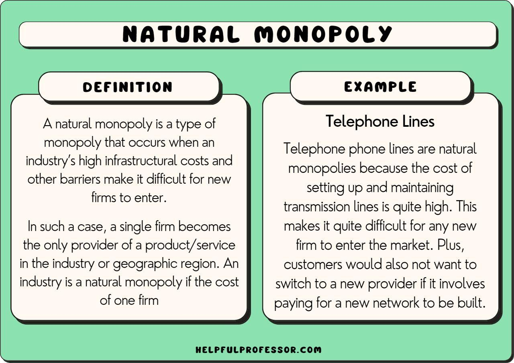

## Table of Contents

## What is a natural monopoly?

A natural monopoly happens when it's cheaper and more efficient for one company to provide a service or product than for multiple companies to do it. This often occurs in industries where the costs to start up and keep running are very high, like with utilities such as water, gas, and electricity. Because these services need a lot of infrastructure, like pipes and wires, it makes more sense for one company to build and maintain them rather than having many companies doing the same thing.

In a natural monopoly, the single company can serve everyone in the market at a lower cost than if there were several smaller companies competing. This can be good for consumers because it can lead to lower prices and better service. However, it can also be a problem because without competition, the company might not have much reason to keep prices low or improve service. That's why governments often regulate natural monopolies to make sure they don't take advantage of their position.

## How does a natural monopoly differ from other types of monopolies?

A natural monopoly is different from other types of monopolies because it happens when it's just cheaper and easier for one company to provide a service or product instead of many companies. This usually happens in industries where you need a lot of money to start and keep running, like water, gas, or electricity. Because it costs so much to build the infrastructure, like pipes and wires, it makes more sense for one company to do it all rather than having many companies building their own.

Other types of monopolies can happen for different reasons. For example, a company might become a monopoly because it's the only one that has a special technology or a patent on a product. Or, a company might buy out all its competitors to become the only one in the market. These monopolies are not natural because they don't come from the nature of the industry itself, but from other business strategies or legal rights. Governments often watch these monopolies closely to make sure they don't misuse their power, just like they do with natural monopolies.

## What are the key characteristics of a natural monopoly?

A natural monopoly happens when it's cheaper and more efficient for one company to provide a service or product than for multiple companies to do it. This usually occurs in industries where the costs to start up and keep running are very high, like with utilities such as water, gas, and electricity. Because these services need a lot of infrastructure, like pipes and wires, it makes more sense for one company to build and maintain them rather than having many companies doing the same thing. In a natural monopoly, the single company can serve everyone in the market at a lower cost than if there were several smaller companies competing.

This situation can be good for consumers because it can lead to lower prices and better service. However, it can also be a problem because without competition, the company might not have much reason to keep prices low or improve service. That's why governments often regulate natural monopolies to make sure they don't take advantage of their position. By overseeing these monopolies, governments try to protect consumers and ensure that the services remain affordable and of good quality.

## Why do natural monopolies occur?

Natural monopolies happen because it's cheaper and more efficient for one company to provide a service or product than for many companies to do it. This usually occurs in industries where you need a lot of money to start up and keep running, like with utilities such as water, gas, and electricity. Because these services need a lot of infrastructure, like pipes and wires, it makes more sense for one company to build and maintain them rather than having many companies building their own.

In a natural monopoly, the single company can serve everyone in the market at a lower cost than if there were several smaller companies competing. This can be good for consumers because it can lead to lower prices and better service. However, it can also be a problem because without competition, the company might not have much reason to keep prices low or improve service. That's why governments often regulate natural monopolies to make sure they don't take advantage of their position.

## Can you provide examples of industries where natural monopolies are common?

Natural monopolies are common in industries where it costs a lot of money to start up and keep running. One example is the water supply industry. It's very expensive to build the pipes and treatment plants needed to get water to homes and businesses. If there were many companies trying to do this, they would all have to build their own pipes and plants, which would be wasteful and expensive. So, it makes more sense for one company to do it all, and that's why water supply often becomes a natural monopoly.

Another example is the electricity industry. Just like with water, it's very costly to build the power plants and the grid of wires that [carry](/wiki/carry-trading) electricity to homes and businesses. If many companies tried to build their own grids, it would be a mess of wires and very expensive. So, it's usually better for one company to build and maintain the grid, making electricity a natural monopoly.

A third example is the gas industry. The infrastructure needed to deliver gas, like pipelines, is very expensive to build and maintain. Having multiple companies build their own pipelines would not only be costly but also inefficient. Therefore, it's more practical for one company to handle the gas supply, leading to a natural monopoly in this industry.

## What are the economic implications of a natural monopoly?

Natural monopolies can have big effects on the economy. When one company can provide a service or product more cheaply than many companies, it can lead to lower prices for consumers. This is good because people can afford the services they need, like water, gas, and electricity. Also, because the company doesn't have to worry about other companies competing with them, they can focus on making their service better and more reliable. This can be good for the economy because it helps businesses and homes run smoothly.

However, natural monopolies can also have some downsides. Without competition, the company might not have a reason to keep prices low or improve their service. They might even raise prices because they know people have no other choice. This can be bad for consumers and the economy because it makes things more expensive and can slow down economic growth. That's why governments often step in to regulate natural monopolies. They set rules to make sure the company doesn't take advantage of its position and keeps prices fair and service good.

## How do governments typically regulate natural monopolies?

Governments often regulate natural monopolies to make sure they don't take advantage of their position. They do this by setting rules that the company has to follow. One common way is to control the prices the company can charge. Governments might set a maximum price, or a price cap, so that the company can't charge too much. This helps keep the services affordable for everyone. Another way is to make the company report their costs and profits regularly. This helps the government check if the company is being fair and not making too much money at the expense of consumers.

Another important way governments regulate natural monopolies is by setting standards for the quality of service. They might require the company to meet certain levels of reliability and safety. For example, they might make rules about how often the service can be interrupted or how quickly the company must respond to problems. This helps make sure that the service is good and safe for everyone. Governments might also require the company to serve everyone in the area, even if it's not always profitable. This is called a universal service obligation, and it helps make sure that everyone can get the service they need, no matter where they live.

## What is the role of economies of scale in natural monopolies?

Economies of scale play a big role in natural monopolies. This happens when it's cheaper for one big company to provide a service than for many small companies to do it. For example, in the water industry, it costs a lot of money to build pipes and treatment plants. If many companies tried to do this, they would all have to build their own pipes and plants, which would be very expensive and wasteful. But if one company does it all, they can spread out the costs over a larger number of customers, making it cheaper for everyone.

Because of economies of scale, natural monopolies can offer services at lower prices than if there were many smaller companies competing. This is good for consumers because they can afford the services they need, like water, gas, and electricity. However, it can also be a problem because without competition, the company might not have a reason to keep prices low or improve their service. That's why governments often step in to regulate natural monopolies, making sure they don't take advantage of their position and keep prices fair and service good.

## How does the concept of a natural monopoly apply to public utilities?

Natural monopolies often happen in public utilities like water, gas, and electricity. These services need a lot of expensive stuff to work, like pipes and wires. If many companies tried to build their own pipes and wires, it would be a big mess and very costly. But if one company does it all, they can spread out the costs over a lot of people, making it cheaper for everyone. This is why it makes sense for one company to provide these services instead of many.

However, having one company in charge can be a problem too. Without other companies to compete with, the company might not have a reason to keep prices low or make their service better. This can be bad for people who need these services. That's why governments often step in to make rules for these companies. They might set a limit on how much the company can charge or make sure the service is good and safe for everyone. This helps keep things fair and makes sure people can afford the services they need.

## What are the potential benefits and drawbacks of natural monopolies for consumers?

Natural monopolies can be good for consumers because they can lead to lower prices. When it's cheaper for one big company to provide a service than for many small companies, the costs can be spread out over a lot of people. This means that services like water, gas, and electricity can be more affordable. Also, because the company doesn't have to worry about other companies competing with them, they can focus on making their service better and more reliable. This can help make life easier for people who need these services every day.

However, natural monopolies can also have some downsides for consumers. Without competition, the company might not have a reason to keep prices low or improve their service. They might even raise prices because they know people have no other choice. This can make things more expensive and harder for people to afford the services they need. That's why governments often step in to regulate natural monopolies. They set rules to make sure the company doesn't take advantage of its position and keeps prices fair and service good.

## How do technological advancements impact the existence and regulation of natural monopolies?

Technological advancements can change how natural monopolies work. New technology can make it cheaper and easier for more companies to enter industries that used to be natural monopolies. For example, in the past, it was very expensive to build the infrastructure needed for electricity, like power plants and grids. But now, with new technology like solar panels and microgrids, smaller companies can provide electricity too. This means that what used to be a natural monopoly might not be one anymore because more companies can compete.

When technology changes things, it can also affect how governments regulate natural monopolies. If new technology makes it possible for more companies to enter the market, governments might need to change their rules. They might not need to control prices as much if there's more competition. But they still need to make sure that the services are safe and reliable for everyone. So, governments have to keep up with technology to make sure their rules help consumers and keep the market fair.

## What are some case studies or historical examples of natural monopolies and their regulation?

One famous example of a natural monopoly is the American Telephone and Telegraph Company (AT&T). For many years, AT&T was the only company providing telephone service across the United States. It was a natural monopoly because building a separate telephone network for each company would have been very expensive and inefficient. The government regulated AT&T through the Federal Communications Commission (FCC), which set rules on prices and service quality. In 1982, the government decided to break up AT&T into smaller companies because they thought it would be better for competition and consumers. This shows how governments can change their approach to regulating natural monopolies over time.

Another example is the water supply in many cities around the world. In London, the water industry was once controlled by several private companies, but it was hard for them to work together and build the needed infrastructure. So, in the 20th century, the government took over and created a natural monopoly called Thames Water. The government regulates Thames Water to make sure the water is safe, the service is good, and the prices are fair. This shows how governments can step in to create and regulate natural monopolies to make sure everyone gets the services they need.

In the electricity industry, a historical example is the Tennessee Valley Authority (TVA) in the United States. Created in 1933, the TVA was a government-owned corporation that provided electricity to a large area in the southeastern U.S. It was a natural monopoly because building multiple power grids in the same area would have been wasteful. The TVA was regulated by the federal government to ensure that it provided affordable and reliable electricity to the region. This case shows how governments can directly manage natural monopolies to serve public interests.

## References & Further Reading

[1]: Viscusi, W. K., Harrington, J. E., & Vernon, J. M. (2005). ["Economics of Regulation and Antitrust."](https://mitpress.mit.edu/9780262038065/economics-of-regulation-and-antitrust/) MIT Press.

[2]: Lopez de Prado, M. (2018). ["Advances in Financial Machine Learning."](https://books.google.com/books/about/Advances_in_Financial_Machine_Learning.html?id=oU9KDwAAQBAJ) Wiley.

[3]: Liski, M., & Montero, J.-P. (2011). ["Market Power in Environmental Markets."](https://www.semanticscholar.org/paper/Market-Power-in-an-Exhaustible-Resource-Market%3A-The-Liski-Montero/ff3c20537633b803e9b3a57afc26d8a87819a6d4) The Review of Economic Studies, 78(3), 719-744.

[4]: McAfee, R. P., Mialon, H. M., & Mialon, S. H. (2007). ["Do Sunk Costs Matter?"](https://papers.ssrn.com/sol3/papers.cfm?abstract_id=1578513) The Economic Journal, 117(520), 332-346.

[5]: Jansen, S. (2020). ["Machine Learning for Algorithmic Trading."](https://github.com/stefan-jansen/machine-learning-for-trading) Packt Publishing.