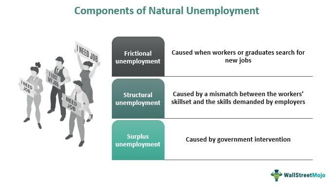

In today's dynamic economic landscape, comprehending the interaction between economic indicators and trading strategies is essential. This article explores the nuances of unemployment economics, emphasizing the natural rate of unemployment and its influence on algorithmic trading. Understanding how unemployment rates, especially their natural levels, affect financial markets provides crucial insights for traders using algorithmic strategies.

Unemployment economics significantly impacts both economic policy and trading behaviors. The natural rate of unemployment serves as a pivotal factor in economic theory, representing the level of unemployment consistent with a stable economy at equilibrium. This rate excludes cyclical fluctuations, focusing on structural and frictional unemployment components. As such, it reflects the transitions and skill gaps inherent in a healthy labor market. Recognizing these distinctions helps differentiate between voluntary labor movements and indicators of economic distress.



Algorithmic trading, a contemporary approach within financial markets, heavily relies on economic data, including unemployment rates, to inform decision-making. By incorporating unemployment data into their models, algorithmic trading systems can respond rapidly to changes, adjusting asset allocations and risk exposures accordingly. This interplay between economic indicators and trading strategies highlights the importance of understanding unemployment economics for market participants seeking to navigate complex trading environments effectively.

This article aims to bridge the gap between economic theories related to unemployment and their practical application in trading. By examining the impact of unemployment rates on financial markets, we offer insights that are valuable for traders, economists, and policymakers. This understanding not only enhances trading strategies but also informs broader economic policy decisions, underscoring the interconnectedness of economic theory and market behavior.

## Table of Contents

## Understanding the Natural Rate of Unemployment

The natural rate of unemployment represents a critical economic concept describing the level of unemployment expected in a stable economy. It is the equilibrium state, where all unemployment is "natural" or expected due to inherent economic factors rather than business cycle variations. This type of unemployment includes structural and frictional unemployment, but deliberately omits cyclical unemployment, which is caused by economic downturns.

Structural unemployment arises from mismatches between skills and job requirements or from significant changes within an economy. These changes might include shifts in industries, technological advancements, or globalization effects, which all contribute to jobs becoming obsolete or requiring new skills. Frictional unemployment, on the other hand, results from normal labor market turnover. It includes individuals transitioning between jobs, entering the workforce for the first time, or taking time for education or personal reasons before starting a new position.

Economists Milton Friedman and Edmund Phelps significantly advanced the understanding of this concept, underscoring that attempts to maintain unemployment below the natural rate could lead to accelerating inflation, a notion encapsulated in the Non-Accelerating Inflation Rate of Unemployment (NAIRU). NAIRU suggests that attempts to decrease unemployment below this natural rate would consistently drive inflation higher, disrupting economic stability without sustainable employment gains. In mathematical terms, the natural rate of unemployment can be thought of as $u = \frac{U}{L}$, where $U$ is the number of unemployed individuals and $L$ is the labor force.

Understanding the components of natural unemployment clarifies the demarcation between voluntary job switching and involuntary joblessness due to economic pressures. When unemployment exceeds the natural rate, it typically signals economic distress or an underperforming economy. Conversely, unemployment significantly below this rate might indicate overheating conditions, potentially requiring government or central bank intervention to ensure inflation remains manageable. A grasp of the natural rate of unemployment is vital in shaping both economic policy and economic forecasting and helps investors and policymakers anticipate changes in labor market dynamics and broader economic conditions.

## Impact of Unemployment Rates on Economic Policy

Unemployment rates serve as pivotal indicators for policymakers, particularly in the context of balancing inflation and employment. High natural unemployment rates often spark discussions about potential policy interventions, such as enhancing education, vocational training programs, and increasing labor market flexibility. These discussions aim to address structural issues within the labor market, thereby reducing natural unemployment over time.

The relationship between unemployment and inflation is famously illustrated by the Phillips Curve, which suggests an inverse correlation between these two variables. According to this principle, as unemployment decreases, inflation tends to increase, and vice versa. This relationship has traditionally guided economic strategies, though it has been subject to debate, especially after instances where the expected inverse relationship did not hold.

Recession-induced hysteresis presents a significant challenge in this regard. Hysteresis refers to the phenomenon where temporary disturbances, like a recession, can permanently elevate the natural rate of unemployment. This persistence can result from long-term unemployment leading to skill degradation or structural shifts in the economy that unfavorably alter the labor market equilibrium. Consequently, economic policies must consider these long-lasting impacts when designing interventions to mitigate unemployment.

Understanding these policy dynamics is crucial for traders who anticipate economic shifts. Traders rely on insights into unemployment trends to forecast economic conditions, which can significantly impact financial markets. For example, an unexpected rise in unemployment could prompt policy shifts that influence interest rates, thereby affecting asset valuations. Hence, staying attuned to how unemployment rates influence economic policy provides traders with a strategic edge in navigating market [volatility](/wiki/volatility-trading-strategies).

## Algorithmic Trading and Economic Indicators

Algorithmic trading is a prominent feature in modern financial markets, involving the use of advanced computational technologies and sophisticated algorithms to execute trades automatically. Economic indicators, particularly unemployment rates, are crucial in shaping these strategies. These indicators provide valuable insights into the economic environment and have a direct impact on market sentiment and price movements.

Automated trading systems are designed to interpret data releases on unemployment rates rapidly. These systems adjust portfolio compositions by reallocating assets and recalibrating risk exposures in response to new information. For instance, a sudden rise in unemployment might suggest economic contraction, causing the algorithms to shift towards safer assets like government bonds or gold, reducing exposure to more volatile equities.

Algorithmic trading systems leverage various strategies, including news-based trading algorithms and macroeconomic models. News-based algorithms are programmed to react to breaking economic news instantaneously, executing trades within milliseconds based on pre-set criteria. Macroeconomic models, on the other hand, incorporate broader economic indicators and forecasts to anticipate long-term trends and adjust trading strategies accordingly.

Understanding the interplay between unemployment data and market movements is fundamental for successful [algorithmic trading](/wiki/algorithmic-trading). A nuanced interpretation of how markets are likely to react to unemployment reports involves analyzing historical data and identifying patterns. Machine learning techniques can be employed to enhance this understanding further. For example, using Python, traders can harness libraries such as Scikit-learn to build predictive models that analyze historical unemployment data and its effects on market prices. 

```python
from sklearn.model_selection import train_test_split
from sklearn.ensemble import RandomForestRegressor
import pandas as pd

# Assume we have a CSV file with past unemployment data and market impact
data = pd.read_csv('unemployment_market_data.csv')

# Features include unemployment rates and economic indicators
X = data[['unemployment_rate', 'GDP', 'inflation']]
# Target is the market movement impact
y = data['market_impact']

# Splitting the dataset into training and testing
X_train, X_test, y_train, y_test = train_test_split(X, y, test_size=0.2, random_state=42)

# Initialize and train a Random Forest model
model = RandomForestRegressor(n_estimators=100, random_state=42)
model.fit(X_train, y_train)

# Predicting market impact based on test data
y_pred = model.predict(X_test)
```

Despite the sophistication of these systems, challenges persist. Data accuracy is paramount; erroneous or outdated information can lead to faulty trading decisions. Additionally, the market's reaction to unemployment data can be unpredictable, influenced by factors beyond the algorithms' control. Traders must also navigate regulatory requirements, as authorities closely monitor algorithmic trading practices to prevent market manipulation and ensure fairness.

Maintaining regulatory compliance involves adhering to stringent guidelines set by financial authorities and implementing robust risk management protocols. By effectively managing these challenges, algorithmic traders can harness economic indicators like unemployment rates to inform strategies and optimize trading outcomes.

## Case Studies: Unemployment's Market Impact through Algo Trading

Historical crises such as the 2008 financial meltdown and the COVID-19 pandemic have had profound impacts on unemployment rates, which in turn have affected financial markets and algorithmic trading strategies. These events serve as key case studies in understanding how algorithmic trading systems adapt to rapidly changing economic conditions characterized by significant unemployment shifts.

During the 2008 financial crisis, unemployment rates surged as economies around the world faced severe recessions. Algorithmic trading systems had to quickly respond to the new economic landscape. One of the critical adaptations involved the shift towards safe-haven assets. Safe havens, such as gold and government bonds, tend to attract investors during economic uncertainty due to their perceived stability. For instance, when unemployment numbers spiked, many algorithmic trading models reallocated capital from equities, which were highly volatile, to these safer assets. The algorithms were programmed to adjust portfolios dynamically based on economic indicators, including unemployment data, thereby safeguarding investments during turbulent times.

Similarly, the COVID-19 pandemic in 2020 caused unprecedented disruptions to global labor markets, marked by sharp increases in unemployment. Algorithmic trading systems were again tested for their agility and response capabilities. In the face of market volatility and skyrocketing unemployment rates, successful strategies often involved transitioning to digital and technology stocks which were buoyed by the increased demand for remote work solutions. Additionally, many algorithms incorporated real-time unemployment data to recalibrate risk exposures and optimize asset allocations. The pandemic highlighted the necessity for algorithms to account for unpredictable market reactions and non-linear relationships between unemployment rates and asset prices.

Analyzing these historical crises demonstrates that the adaptability of algorithmic trading systems is crucial during periods of economic upheaval. By studying the successes and failures of past responses, traders and developers can refine their strategies to better manage future economic disruptions. For example, incorporating [machine learning](/wiki/machine-learning) techniques can improve prediction accuracy and adaptive learning capabilities, enabling systems to better anticipate and react to changes in unemployment trends.

These lessons stress the importance of agile, data-driven decision-making in financial markets. By continuously evolving algorithmic models and integrating robust unemployment indicators, traders can enhance their ability to navigate complex market conditions. The challenge remains to develop systems that not only respond to immediate market changes but also anticipate longer-term economic shifts driven by unemployment dynamics.

## Conclusion

The natural rate of unemployment fundamentally highlights the interconnected nature of economics and finance, particularly as it pertains to algorithmic trading. By leveraging data on unemployment, traders can refine their strategies to effectively navigate the complexities of market conditions. The nuanced impacts of unemployment rates are critical both for economists shaping policies and for traders exploiting market inefficiencies. Recognizing these impacts enhances decision-making processes across both domains.

As the trading environment continuously evolves, maintaining knowledge and adaptability is crucial. Traders who can integrate economic insights into their trading decisions stand a better chance of optimizing their outcomes. For instance, real-time unemployment data might inform algorithmic adjustments in asset allocation, allowing traders to capitalize on shifting economic conditions.

Looking forward, advancements in algorithmic trading will likely continue to incorporate economic theories and real-world data. This integration promises increasingly sophisticated and precise trading models, which utilized properly, can yield optimal trading performance. As algorithms become more adept at interpreting unemployment data, they may identify subtle market signals previously undetectable to human traders, driving more efficient market responses and potentially higher returns.

## References & Further Reading

[1]: Friedman, M. (1968). ["The Role of Monetary Policy."](https://www.aeaweb.org/aer/top20/58.1.1-17.pdf) American Economic Review, 58(1), 1-17.

[2]: Phelps, E. S. (1967). ["Phillips Curves, Expectations of Inflation and Optimal Unemployment over Time."](https://www.jstor.org/stable/2552025) The Economic Journal, 79(315), 678-721.

[3]: Phillips, A. W. (1958). ["The Relation between Unemployment and the Rate of Change of Money Wage Rates in the United Kingdom, 1861-1957."](https://onlinelibrary.wiley.com/doi/full/10.1111/j.1468-0335.1958.tb00003.x) The Economic Journal, 68(270), 283-299.

[4]: Jansen, Stefan. ["Machine Learning for Algorithmic Trading - Second Edition: Predictive models to extract signals from market and alternative data for systematic trading strategies with Python"](https://www.oreilly.com/library/view/machine-learning-for/9781839217715/Text/Front_Matter.xhtml)

[5]: Aronson, David R. ["Evidence-Based Technical Analysis: Applying the Scientific Method and Statistical Inference to Trading Signals"](https://www.amazon.com/Evidence-Based-Technical-Analysis-Scientific-Statistical/dp/0470008741)