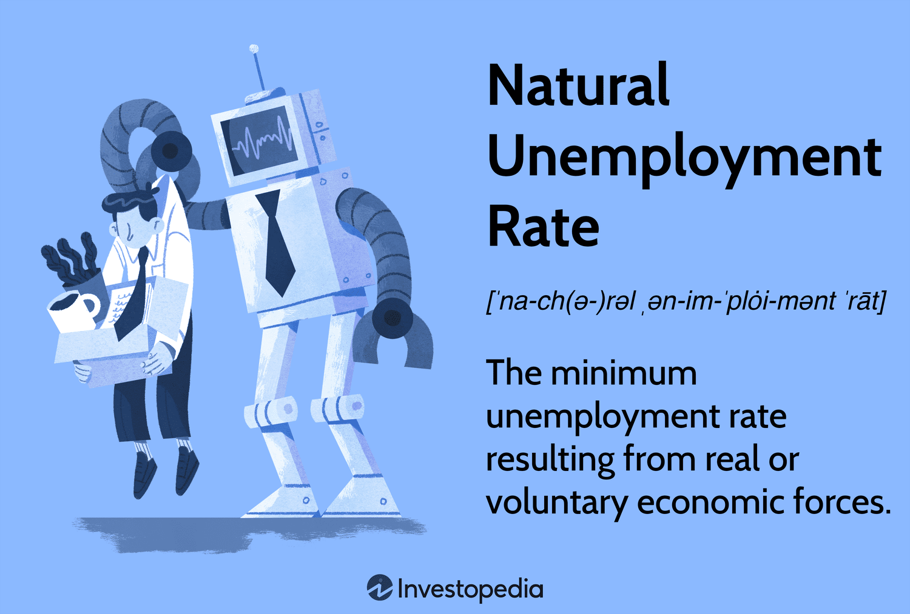

## Table of Contents

## What is the natural unemployment rate?

The natural unemployment rate is the level of unemployment that exists when the economy is at full employment. This means that the economy is working as well as it can, and the unemployment rate is as low as it can get without causing inflation to go up too much. The natural rate includes people who are between jobs or looking for new ones, even when the economy is doing well. It's not zero because there will always be some people who are temporarily out of work.

Economists think the natural rate changes over time because of things like technology, how easy it is to move between jobs, and government policies. For example, if it becomes easier for people to find new jobs quickly, the natural rate might go down. On the other hand, if it becomes harder for people to find jobs, the natural rate might go up. Understanding the natural rate helps policymakers make decisions about things like interest rates and job training programs to keep the economy stable.

## How is the natural unemployment rate different from the actual unemployment rate?

The natural unemployment rate is the level of unemployment that happens when the economy is doing as well as it can without causing too much inflation. It's like the normal amount of people who are out of work even when things are going good. This rate includes people who are just between jobs or looking for a new one. It's not zero because there will always be some people who are temporarily out of work, no matter how well the economy is doing.

The actual unemployment rate, on the other hand, is the real number of people who are out of work at any given time. This number can go up and down depending on what's happening in the economy. If the economy is doing badly, more people might lose their jobs, and the actual unemployment rate will be higher than the natural rate. If the economy is doing well, the actual rate might be lower than the natural rate. The difference between these two rates helps economists understand if the economy is doing better or worse than it should be.

## What factors contribute to the natural unemployment rate?

The natural unemployment rate is affected by many things. One big thing is how easy it is for people to find new jobs. If it's easy to switch jobs or if there are lots of job openings, the natural rate might be lower. Another thing is how much people want to work. If more people are looking for jobs, the natural rate might go up because there are more people competing for the same jobs. Also, things like technology can change the natural rate. If new technology makes some jobs go away, it might be harder for people to find work, which could make the natural rate higher.

Government policies also play a big role in the natural unemployment rate. For example, if the government makes it easier for people to get unemployment benefits, some people might take longer to find a new job, which could raise the natural rate. On the other hand, if the government helps people get trained for new jobs, it might be easier for them to find work, which could lower the natural rate. Other things like how much people move around the country or the world for jobs can also affect the natural rate. If people are more willing to move to where the jobs are, the natural rate might be lower.

## How is the natural unemployment rate calculated?

The natural unemployment rate isn't something you can see on a chart or in a report. It's more like a guess that economists make. They look at a lot of information about the economy, like how many people are looking for jobs, how easy it is to find a new job, and what the government is doing to help people get work. They also think about things like technology and how much people want to work. All these things help economists figure out what the natural unemployment rate might be.

Economists use special math models to help them guess the natural unemployment rate. These models take into account all the things that can affect unemployment, like how many people are between jobs or looking for new ones even when the economy is doing well. By putting all this information into their models, economists can come up with a number that they think is the natural rate of unemployment. This number can change over time as the economy changes, so economists keep updating their guesses to make sure they're as close to right as possible.

## Why is the natural unemployment rate important for economic policy?

The natural unemployment rate is important for economic policy because it helps policymakers understand how the economy is doing. If the actual unemployment rate is higher than the natural rate, it might mean the economy is not doing well and people need help finding jobs. On the other hand, if the actual rate is lower than the natural rate, it might mean the economy is doing too well and could cause prices to go up too fast. Knowing the natural rate helps policymakers decide if they need to do things like lower interest rates to help people get jobs or raise them to slow down the economy and keep prices stable.

Policymakers also use the natural unemployment rate to make decisions about other things like job training programs and unemployment benefits. If the natural rate is high, they might want to help people get trained for new jobs so they can find work more easily. If the natural rate is low, they might think the economy is doing well enough on its own and not need as much help. By understanding the natural rate, policymakers can make better choices to keep the economy running smoothly and help as many people as possible find good jobs.

## What is the relationship between the natural unemployment rate and inflation?

The natural unemployment rate and inflation are closely linked. When the actual unemployment rate is lower than the natural rate, it often means that the economy is doing really well. A lot of people have jobs, and they're spending money. This can make prices go up because there's more demand for things. When prices go up a lot, that's called inflation. So, if the unemployment rate is lower than the natural rate, it might cause inflation to go up.

On the other hand, if the actual unemployment rate is higher than the natural rate, it can help keep inflation in check. When more people are out of work, they're not spending as much money, so there's less demand for things. This can make prices stay the same or even go down a little. Economists call this the Phillips Curve, which shows that there's a trade-off between unemployment and inflation. Policymakers use this relationship to try to keep the economy balanced, making sure that unemployment isn't too high and inflation isn't too fast.

## How does the natural unemployment rate vary between countries?

The natural unemployment rate can be different from one country to another because each country has its own way of doing things. For example, some countries might have rules that make it easy for people to find new jobs, while other countries might have rules that make it harder. Also, things like how much people want to work, how easy it is to move around for jobs, and what kind of technology is used can be different in each country. All these things can make the natural unemployment rate higher or lower depending on where you are.

Another reason the natural unemployment rate varies between countries is because of how the economy is doing in each place. Some countries might have a lot of jobs available, which can make the natural rate lower. Other countries might not have as many jobs, which can make the natural rate higher. Government policies also play a big role. For example, if a country has good job training programs, it might be easier for people to find work, which can lower the natural rate. But if a country doesn't help people get trained for new jobs, the natural rate might be higher.

## What are the historical trends in the natural unemployment rate?

Over time, the natural unemployment rate has changed a lot. In the past, like in the 1950s and 1960s, the natural rate was thought to be around 4% to 5% in the United States. But then, in the 1970s and 1980s, it went up to around 6% to 7%. This happened because of things like oil shocks and changes in how the economy worked. Also, more women started looking for jobs, which made the natural rate go up because there were more people looking for work.

In recent years, the natural unemployment rate has been going down again. In the 1990s and 2000s, it was thought to be around 5% to 6%. But after the big recession in 2008, it went up a bit. Now, some economists think it might be around 4% to 5% again. This is because of things like new technology making it easier for people to find jobs and changes in how the government helps people get work. The natural rate keeps changing because the economy is always changing too.

## How do demographic changes affect the natural unemployment rate?

Demographic changes can have a big impact on the natural unemployment rate. When the number of people looking for jobs changes, it can make the natural rate go up or down. For example, if more young people start looking for jobs because they're finishing school, the natural rate might go up because there are more people competing for the same jobs. Also, if more older people retire, it can make the natural rate go down because there are fewer people looking for work.

Another way demographic changes affect the natural unemployment rate is through things like immigration and birth rates. If a lot of people move to a country, it can make the natural rate go up because there are more people looking for jobs. On the other hand, if fewer babies are born, it might mean fewer people will be looking for jobs in the future, which could make the natural rate go down. These changes happen slowly over time, but they can have a big effect on how many people are out of work even when the economy is doing well.

## What role do technological advancements play in altering the natural unemployment rate?

Technological advancements can change the natural unemployment rate by making some jobs go away and creating new ones. When new technology comes along, it can make old jobs that people used to do by hand not needed anymore. For example, robots can now do jobs that people used to do in factories. This can make the natural unemployment rate go up because people who used to do those jobs might have a hard time finding new ones. But technology can also make new jobs, like people who know how to work with computers or fix robots. If there are a lot of new jobs, it can make the natural rate go down because it's easier for people to find work.

Another way technology affects the natural unemployment rate is by making it easier for people to find jobs. With the internet, people can look for jobs all over the world and apply for them from home. This can make the natural rate go down because it's easier for people to find work. But if technology makes it so that only people with certain skills can get jobs, it might make the natural rate go up because not everyone can learn those skills quickly. So, technology can change the natural unemployment rate in different ways, depending on how it affects jobs and how easy it is for people to find new ones.

## How do economists forecast changes in the natural unemployment rate?

Economists use special models and a lot of information to guess how the natural unemployment rate might change. They look at things like how many people are looking for jobs, how easy it is to find a new job, and what the government is doing to help people get work. They also think about things like new technology and how much people want to work. By putting all this information into their models, economists can come up with a number that they think is the new natural rate of unemployment. This guess can change over time as the economy changes, so economists keep updating their models to make sure they're as close to right as possible.

Sometimes, economists look at past data to see how the natural unemployment rate has changed before. They might see that when more young people start looking for jobs, the natural rate goes up. Or they might notice that when new technology comes along, it can make the natural rate go down if it creates new jobs. By understanding these patterns, economists can make better guesses about what might happen in the future. It's not an exact science, but by using all this information, economists can help policymakers make good decisions to keep the economy running smoothly.

## What are the criticisms and limitations of the concept of the natural unemployment rate?

The natural unemployment rate is a useful idea, but it has some problems. One big problem is that it's hard to know exactly what the natural rate is because it's just a guess. Economists use a lot of information and special math models to figure it out, but they can still be wrong. This makes it hard for policymakers to make good decisions because they're not sure if the actual unemployment rate is too high or too low compared to the natural rate. Also, the natural rate can change over time because of things like new technology, how easy it is to find jobs, and what the government is doing. This makes it even harder to know what the natural rate is at any given time.

Another criticism is that the natural unemployment rate might not be the same for everyone. Different groups of people, like young people or people without a lot of education, might have a harder time finding jobs even when the economy is doing well. This means the natural rate might be higher for some people than others. Also, some people think that the natural rate doesn't take into account how the economy can change in big ways, like during a recession or when there's a lot of new technology. These big changes can make the natural rate go up or down a lot, which makes it hard to use as a guide for making policy decisions.

## References & Further Reading

[1]: Friedman, M. (1968). ["The Role of Monetary Policy."](https://www.aeaweb.org/aer/top20/58.1.1-17.pdf) American Economic Review, 58(1), 1-17.

[2]: Phelps, E. S. (1967). ["Phillips Curves, Expectations of Inflation and Optimal Unemployment over Time."](https://www.jstor.org/stable/2552025) The Economic Journal, 79(315), 678-721.

[3]: Phillips, A. W. (1958). ["The Relation between Unemployment and the Rate of Change of Money Wage Rates in the United Kingdom, 1861-1957."](https://onlinelibrary.wiley.com/doi/full/10.1111/j.1468-0335.1958.tb00003.x) The Economic Journal, 68(270), 283-299.

[4]: Jansen, Stefan. ["Machine Learning for Algorithmic Trading - Second Edition: Predictive models to extract signals from market and alternative data for systematic trading strategies with Python"](https://www.oreilly.com/library/view/machine-learning-for/9781839217715/Text/Front_Matter.xhtml)

[5]: Aronson, David R. ["Evidence-Based Technical Analysis: Applying the Scientific Method and Statistical Inference to Trading Signals"](https://www.amazon.com/Evidence-Based-Technical-Analysis-Scientific-Statistical/dp/0470008741)