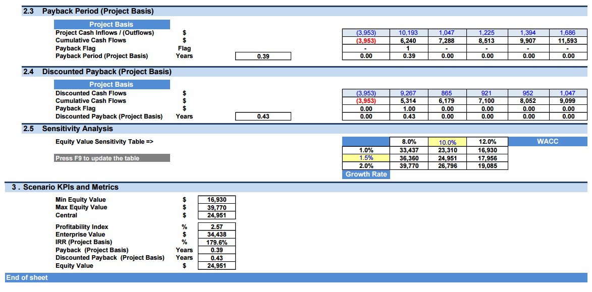

## Table of Contents

## What is NAV and how is it calculated in the context of oil, gas, and energy investments?

NAV, or Net Asset Value, is a way to figure out how much a company or fund is worth by looking at its assets and subtracting its debts. In the world of oil, gas, and energy investments, NAV helps investors understand the true value of a company that owns oil fields, gas reserves, or other energy assets. To calculate NAV, you start by adding up the value of all the company's assets, like the oil and gas reserves they own. Then, you subtract all the debts and other liabilities the company has. The result is the NAV, which gives a snapshot of the company's financial health.

Calculating the value of oil and gas reserves can be tricky because it involves estimating how much oil or gas is actually in the ground and what it might be worth in the future. Companies often hire experts to make these estimates, using things like geological data and current market prices. Once the value of the reserves is figured out, it's added to the value of other assets like equipment and cash. From this total, the company's debts, like loans and bonds, are subtracted. The final number is the NAV, which investors use to decide if a company's stock is a good buy or if it's overpriced.

## Why is NAV important for investors in the energy sector?

NAV is important for investors in the energy sector because it helps them see the real value of a company. When you invest in an energy company, you want to know if the price you're paying for the stock is fair. NAV gives you a clear number that shows what the company's assets are worth after paying off all its debts. This way, you can compare the NAV to the stock price and decide if the stock is a good deal or if it's too expensive.

In the energy sector, where companies own things like oil fields and gas reserves, knowing the NAV is especially useful. These assets can be hard to value because their worth depends on things like how much oil or gas is in the ground and what prices will be in the future. By looking at the NAV, investors can get a better idea of whether the company is managing its resources well and if it's a smart investment. This helps them make more informed choices and potentially earn more money from their investments.

## How does NAV differ between oil, gas, and other energy investments?

NAV, or Net Asset Value, is calculated the same way for oil, gas, and other energy investments, by subtracting liabilities from assets. But the value of these assets can be very different depending on what kind of energy the company deals with. For oil and gas companies, the biggest assets are usually the oil and gas reserves they own. These reserves are hard to value because it's tough to know exactly how much oil or gas is in the ground and what it will be worth in the future. Oil and gas prices can go up and down a lot, which makes it even harder to figure out the NAV accurately.

For other types of energy investments, like renewable energy companies that own wind or solar farms, the assets are more predictable. These companies have things like wind turbines or solar panels that have a clearer value because they produce energy at a more stable rate. Their NAV might not change as much as an oil or gas company's NAV because the value of their assets doesn't swing as wildly with market prices. So, while the basic idea of NAV is the same across all energy investments, the way it's calculated and how it changes over time can be very different depending on whether the company is in oil, gas, or another type of energy.

## What are the key factors that affect the NAV of energy investments?

The NAV of energy investments is affected by many things. For oil and gas companies, the biggest [factor](/wiki/factor-investing) is the price of oil and gas. If prices go up, the value of their reserves goes up too, which makes the NAV higher. But if prices drop, the NAV goes down. Another important thing is how much oil or gas is actually in the ground. Companies need to guess this, and if they get it wrong, it can change the NAV a lot. Also, the costs of getting the oil or gas out of the ground can change the NAV. If it costs more to get the oil out, the NAV goes down.

For renewable energy companies, like those with wind or solar farms, the NAV can be affected by different things. The value of their assets, like wind turbines or solar panels, can change based on how much energy they make and what the energy is worth. If the price of electricity goes up, the NAV can go up too. Also, how long the equipment lasts and how much it costs to keep it running can affect the NAV. If the equipment lasts longer or costs less to maintain, the NAV can be higher. So, while the basic idea of NAV is the same, the things that affect it can be very different depending on the type of energy investment.

## How can NAV be used to compare different energy investment opportunities?

NAV can help investors compare different energy investment opportunities by giving them a clear picture of what each company is worth. For example, if you're looking at two oil companies, you can compare their NAVs to see which one has more value after paying off its debts. If one company has a higher NAV, it might be a better investment because it shows that the company's assets are worth more than its liabilities. This helps investors decide which company is a better buy based on the value of its assets.

The same idea works for comparing different types of energy investments, like oil, gas, and renewable energy. For instance, if you're choosing between an oil company and a solar company, you can look at their NAVs to see which one has a better value. Keep in mind that the NAV of an oil company can change a lot because oil prices go up and down, while a solar company's NAV might be more stable because the value of solar panels doesn't change as much. By understanding these differences, investors can make smarter choices about where to put their money based on the NAV of each investment.

## What are the limitations of using NAV as a metric in energy investments?

Using NAV to judge energy investments has some problems. One big issue is that it's hard to know exactly how much oil or gas is in the ground. Companies have to guess, and if they guess wrong, the NAV can be way off. Also, the price of oil and gas can change a lot, which makes the NAV go up and down. This means that the NAV might not be a good measure of a company's value if the market is changing quickly.

Another problem is that NAV doesn't tell you everything about a company. It only looks at what the company owns and owes, but it doesn't show how well the company is run or if it's making money. For example, a company might have a high NAV but be losing money because it's not good at selling its oil or gas. Also, for renewable energy companies, the NAV might not show the future value of new technology or how much the company can grow. So, while NAV is useful, it's not the only thing investors should look at when deciding where to invest in the energy sector.

## How does the volatility of oil and gas prices impact the NAV of related investments?

The [volatility](/wiki/volatility-trading-strategies) of oil and gas prices has a big effect on the NAV of companies that own oil and gas reserves. When oil and gas prices go up, the value of the reserves also goes up, which makes the NAV higher. This means that if an investor looks at the NAV during a time when prices are high, the company might seem like a good investment. But if oil and gas prices drop, the value of the reserves goes down too, making the NAV lower. So, a company that looked like a good investment when prices were high might not look so good when prices fall.

Because oil and gas prices can change a lot, the NAV of these companies can be hard to trust as a steady measure of their value. Investors need to be careful because the NAV can go up and down quickly with the market. This means that looking at the NAV at just one point in time might not give a full picture of how the company is doing. It's important for investors to think about how prices might change in the future and not just rely on the NAV to make their decisions.

## Can NAV be used to predict future performance in oil, gas, and energy sectors?

NAV can give you a snapshot of how much a company is worth right now, but it's not a good tool for predicting future performance in the oil, gas, and energy sectors. The value of oil and gas reserves can change a lot because the prices of oil and gas go up and down all the time. This means that even if a company has a high NAV today, it might not stay high if oil and gas prices drop. Also, NAV doesn't show you how well a company is run or if it's making money, which are important for knowing how it will do in the future.

For renewable energy companies, like those with wind or solar farms, NAV might be a bit more stable because the value of their equipment doesn't change as much. But even then, NAV doesn't tell you about new technology the company might use or how much it can grow. So, while NAV can help you understand a company's current value, it's not enough to predict how it will do in the future. Investors need to look at other things, like how the company is managed and what's happening in the market, to make good guesses about future performance.

## How do regulatory changes influence the NAV of energy investments?

Regulatory changes can have a big impact on the NAV of energy investments. When new rules come in, they can change how much it costs for a company to do business. For example, if the government makes new rules about how oil and gas companies need to clean up their operations, it might cost the companies more money. This extra cost can lower the value of their assets, which makes the NAV go down. Also, if the rules make it harder for a company to use its oil and gas reserves, the value of those reserves might drop, and that would also lower the NAV.

For renewable energy companies, regulatory changes can work a bit differently. If the government gives more support to renewable energy, like giving tax breaks or subsidies, it can make the value of their assets go up. This would make the NAV higher because the company's equipment, like wind turbines or solar panels, becomes more valuable. But if the rules change to make it harder for renewable energy companies to operate, it could lower their NAV. So, regulatory changes are important for investors to watch because they can change the NAV of energy investments in big ways.

## What role does technological advancement play in altering the NAV of energy assets?

Technological advancements can change the NAV of energy assets a lot. For oil and gas companies, new technology can help them find more oil or gas in the ground or get it out more cheaply. If they can do this, the value of their reserves goes up, which makes their NAV higher. But if a new technology makes it easier for everyone to find oil or gas, the prices might go down because there's more of it. This could make the NAV go down because the value of their reserves would be lower.

For renewable energy companies, new technology can also change their NAV. If they can use new tech to make their wind turbines or solar panels work better or last longer, the value of their equipment goes up. This makes their NAV higher because their assets are worth more. But if a new technology comes along that makes their old equipment less useful, the value of their assets might go down, and that would lower their NAV. So, keeping up with new technology is important for energy companies because it can change how much their assets are worth.

## How do environmental, social, and governance (ESG) factors impact the NAV of energy investments?

Environmental, social, and governance ([ESG](/wiki/esg-investing)) factors can change the NAV of energy investments in big ways. If a company does well with ESG, like using clean energy or treating workers fairly, it might be worth more to investors who care about these things. This can make the NAV go up because people are willing to pay more for the company's stock. But if a company has problems with ESG, like causing a lot of pollution or not treating workers well, it might be worth less. This can make the NAV go down because investors might not want to buy the company's stock.

Also, rules about ESG can change how much a company's assets are worth. If the government makes new rules to make energy companies be better with the environment, it might cost more money to follow these rules. This can lower the value of the company's assets and make the NAV go down. On the other hand, if a company does well with ESG and gets rewards like tax breaks, it can make their assets worth more and push the NAV up. So, ESG factors are important for figuring out the NAV of energy investments.

## What advanced strategies can investors employ to optimize NAV in the oil, gas, and energy sectors?

Investors can use some smart strategies to make the NAV of oil, gas, and energy companies better. One way is to keep an eye on new technology that can help companies find more oil or gas or make their renewable energy equipment work better. If a company starts using new tech, it can make their assets worth more, which pushes the NAV up. Another way is to look at how well a company is doing with environmental, social, and governance (ESG) stuff. If a company does good things for the environment or treats workers well, it might be worth more to investors, which can also make the NAV go up.

Another strategy is to think about how rules might change. If the government makes new rules that help energy companies, like giving them money to use clean energy, it can make their assets more valuable and increase the NAV. But if the rules make it harder for companies to do business, like making them clean up pollution, it might cost them more money and lower the NAV. So, investors need to watch what's happening with rules and use this information to pick the best investments. By thinking about technology, ESG, and rules, investors can make smarter choices and help the NAV of their energy investments go up.

## What is the Net Asset Value (NAV) in Oil and Gas Investments and how can it be understood?

Net Asset Value (NAV) is a foundational metric utilized in evaluating oil and gas investments, providing an essential perspective by representing the difference between a company’s total assets and its liabilities. It serves as a critical indicator of a firm's intrinsic value, enabling investors to ascertain the financial health and operational viability of oil and gas companies. NAV calculations incorporate various elements, such as estimated reserves, production profiles, operational costs, and future commodity prices, to present a cohesive view of a company's present value.

In the oil and gas sector, NAV is instrumental in distinguishing between varying investment opportunities, empowering investors to conduct a comparative analysis among different companies. It aids in highlighting undervalued firms that may possess lucrative assets not currently reflected in their market prices. This feature makes NAV a potent tool for investment strategies oriented towards value-based investments.

The process of NAV estimation can be mathematically expressed as:

$$
\text{NAV} = (\text{Total Assets} - \text{Total Liabilities}) 
$$

However, for oil and gas companies, the NAV calculation is often adjusted to reflect expected future cash flows from proven and probable reserves. This involves discounting future net cash flows using a company's weighted average cost of capital (WACC), thus integrating future market conditions and the time value of money into the valuation.

NAV's relevance extends to assessing specific business segments within a company, especially in the diversified operations typical of large oil and gas firms. It allows investors to segment and evaluate the performance and value contributions of different operational units, such as upstream and downstream activities, helping in better strategic decision-making.

NAV's utility in estimating expected cash flows and understanding the required returns (as indicated by the WACC) supports investors in their attempt to model financial forecasts and project future financial performance. Such detailed evaluations guide investors in determining the sustainability and long-term profitability of their investments in the energy sector. 

Consequently, NAV functions not just as a valuation tool but also as a strategic instrument, equipping investors to navigate the complex financial landscapes of the oil and gas industry effectively.

## References & Further Reading

Bergstra, J., Bardenet, R., Bengio, Y., & Kégl, B. (2011). "Algorithms for Hyper-Parameter Optimization." This work focuses on the optimization of hyperparameters within [machine learning](/wiki/machine-learning) algorithms. It provides insights into techniques like grid search and random search, which are crucial for enhancing algorithmic performance in financial contexts.

"Advances in Financial Machine Learning" by Marcos Lopez de Prado. This book explores the application of machine learning techniques to financial markets. It offers valuable frameworks and tools to develop predictive models, which can be instrumental for algorithmic trading strategies, particularly in volatile markets like oil and gas.

"Machine Learning for Algorithmic Trading" by Stefan Jansen. Jansen's work serves as a comprehensive guide to implementing machine learning models for trading purposes. It covers a range of topics from data preprocessing to advanced model deployment, making it an essential resource for anyone interested in integrating machine learning into oil and gas investment strategies.

"Quantitative Trading: How to Build Your Own Algorithmic Trading Business" by Ernest P. Chan. Chan's book outlines the basics of building a successful quantitative trading strategy. It emphasizes the importance of algorithm development, backtesting, risk management, and execution, offering practical advice for investors looking to enhance their trading systems in the energy sector.

