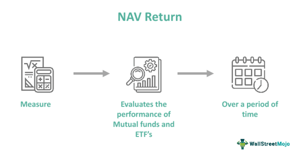

## Table of Contents

## What is NAV return and how is it calculated?

NAV return, or Net Asset Value return, is a way to measure how well a mutual fund or an investment trust is doing. It shows the percentage increase or decrease in the value of the fund's assets over a certain period. This helps investors see if their investment is growing or shrinking in value.

To calculate NAV return, you first need to know the NAV at the beginning and the end of the period you're looking at. You subtract the starting NAV from the ending NAV, then divide that number by the starting NAV. Finally, you multiply the result by 100 to get the percentage return. For example, if the NAV was $10 at the start and $12 at the end, the return would be (($12 - $10) / $10) * 100 = 20%.

## What is market return and how does it differ from NAV return?

Market return is the total return you get from an investment in the stock market, including any price changes and dividends. It shows how well the whole market or a specific index, like the S&P 500, is doing over time. When you hear about the market going up or down, they're usually talking about the market return.

NAV return, on the other hand, is specific to mutual funds or investment trusts. It measures the change in the value of the fund's assets, which includes stocks, bonds, and other investments the fund holds. The big difference is that market return looks at the overall market or a specific index, while NAV return focuses on the performance of a single fund's portfolio. Both are important, but they give you different pieces of information about how your investments are doing.

## Why is it important to compare NAV return with market return?

Comparing NAV return with market return helps you see if your mutual fund or investment trust is doing better or worse than the overall market. If your fund's NAV return is higher than the market return, it means your fund is beating the market, which is great news. But if the NAV return is lower, it might be time to think about why your fund isn't keeping up and if you should make a change.

This comparison also gives you a clearer picture of how well the people managing your fund are doing their job. They are supposed to pick investments that will do better than just following the market. By looking at both returns, you can decide if they are [earning](/wiki/earning-announcement) their fees or if you might be better off investing in a different fund or even just in the market itself.

## How can an investor use NAV return and market return to evaluate fund performance?

An investor can use NAV return and market return to see how well their mutual fund is doing compared to the overall market. By looking at the NAV return, the investor can see how much the value of their fund has grown or shrunk over time. If the NAV return is high, it means the fund's investments are doing well. But to really know if the fund is a good choice, the investor needs to compare this NAV return with the market return. If the NAV return is higher than the market return, it means the fund is beating the market, which is a good sign that the fund managers are doing a good job [picking](/wiki/asset-class-picking) investments.

On the other hand, if the NAV return is lower than the market return, it might mean the fund isn't doing as well as it could be. This could be a signal for the investor to think about why the fund isn't keeping up. Maybe the fees are too high, or maybe the fund managers aren't choosing the best investments. By comparing these two returns, the investor can make a smarter decision about whether to keep their money in the fund or look for a better option. It's like checking if your team is winning or losing compared to the whole league.

## What are the common benchmarks used for market return in different regions?

In the United States, the most common benchmark for market return is the S&P 500. This index tracks the stock performance of 500 large companies listed on stock exchanges in the U.S. It's a good way to see how the American market is doing overall. Another popular benchmark is the Dow Jones Industrial Average, which looks at 30 big companies and is often used to get a quick snapshot of the market.

In Europe, the STOXX Europe 600 is a widely used benchmark. It includes 600 companies from 17 European countries and gives a broad view of the European market. In Asia, the Nikkei 225 is a common benchmark in Japan, representing the performance of 225 top companies listed on the Tokyo Stock Exchange. For a broader view of the Asian market, investors often look at the MSCI Asia Pacific Index, which covers many countries in the region.

These benchmarks help investors see how their investments are doing compared to the overall market in their region. By comparing their fund's NAV return to these market benchmarks, investors can tell if their fund is doing better or worse than the market average, which helps them make better decisions about their investments.

## What factors can cause discrepancies between NAV return and market return?

There are several reasons why the NAV return of a mutual fund might not match the market return. One big reason is the types of investments the fund holds. If a fund mostly invests in small companies or in specific industries, its performance can be very different from the overall market, which usually includes a mix of big and small companies across many industries. Also, if the fund manager makes good or bad choices about which stocks or bonds to buy, this can make the fund's return higher or lower than the market.

Another [factor](/wiki/factor-investing) is the fees and costs that come with investing in a mutual fund. These fees can eat into the fund's returns, making the NAV return lower than the market return, even if the fund's investments are doing well. Plus, how often the fund buys and sells its investments can affect its performance. If the fund trades a lot, it might have to pay more in taxes and transaction costs, which can also make the NAV return different from the market return.

## How do fees and expenses impact the comparison between NAV return and market return?

Fees and expenses can make a big difference when you compare a fund's NAV return to the market return. When you invest in a mutual fund, you have to pay fees for things like managing the fund and other costs. These fees come out of the fund's total value, which means they can make the NAV return lower than it would be without them. If the market return doesn't have these fees, then it might look better than the fund's return, even if the fund's investments are doing just as well as the market.

This difference can make it seem like the fund is not doing as well as the market, when really, it's the fees that are causing the gap. It's important for investors to look at these fees and think about how they affect the fund's performance. By understanding the impact of fees, investors can make better choices about which funds to invest in and whether the fees are worth it for the returns they get.

## Can you explain the concept of tracking error in the context of NAV and market return?

Tracking error is a way to measure how closely a fund's return follows the market return. It tells you how much the fund's performance can differ from the market's performance over time. If a fund is trying to match the market, like an index fund, a low tracking error means it's doing a good job of sticking close to the market's returns. A high tracking error means the fund's returns are bouncing around a lot compared to the market, which might make it less predictable.

This concept is important when you compare a fund's NAV return to the market return. If a fund has a high tracking error, it might be because the fund managers are making different investment choices than the market, or maybe the fund's fees and costs are causing its returns to be different. By looking at the tracking error, investors can get a better idea of why the fund's NAV return might not match the market return, and decide if the fund is a good choice for their investment goals.

## What statistical methods are used to analyze the relationship between NAV return and market return?

To analyze the relationship between NAV return and market return, one common statistical method is correlation analysis. This method helps to see how closely the returns of a fund move with the returns of the market. If the correlation is high, it means that when the market goes up or down, the fund's NAV return tends to do the same. A low correlation means the fund's returns don't follow the market's movements as closely. This can be useful for investors to understand if their fund is behaving as expected compared to the market.

Another method is regression analysis, which can show how much of the fund's return can be explained by the market's return. In regression, you can see if the market return is a good predictor of the fund's NAV return. If the market return explains a large part of the fund's return, it suggests that the fund is closely tied to the market. If not, it might mean the fund's performance is driven by other factors, like the fund manager's choices or specific investments the fund holds. Both correlation and regression help investors understand the dynamics between their fund and the market, making it easier to make smart investment decisions.

## How does the choice of time period affect the comparison of NAV return and market return?

The choice of time period can really change how you see the comparison between a fund's NAV return and the market return. If you look at a short time, like a few weeks or months, the numbers can jump around a lot. Maybe the market had a big drop or a big jump, or maybe the fund did something special. Short times can make it hard to see the big picture because things can change a lot day to day or month to month.

But if you look at a longer time, like a few years, you get a smoother, clearer picture. Over longer times, the ups and downs even out, and you can see if the fund is really doing better or worse than the market. This helps you understand if the fund's way of picking investments is working well over time. So, choosing the right time period is important to get a fair and useful comparison between NAV return and market return.

## What are some advanced techniques for adjusting NAV return to better compare with market return?

One advanced technique for adjusting NAV return to better compare with market return is called risk-adjusted return. This method looks at how much risk the fund is taking to get its returns. A common way to do this is by using the Sharpe Ratio, which measures the extra return the fund gets for each unit of risk it takes. If a fund has a high Sharpe Ratio, it means it's doing a good job of getting good returns without taking too much risk. By comparing the Sharpe Ratios of the fund and the market, you can see if the fund is doing better than the market when you think about the risk involved.

Another technique is to use a style analysis, which breaks down the fund's investments into different categories like stocks, bonds, or other types of assets. This helps you see if the fund is doing well because it's investing in the same things as the market, or if it's doing something different. If the fund is heavily invested in one type of asset that's doing really well, it might explain why its NAV return is different from the market return. By understanding the fund's style, you can make a fairer comparison with the market return, taking into account the different ways the fund is investing its money.

## How can investors use NAV and market return data to predict future fund performance?

Investors can use NAV and market return data to predict future fund performance by looking at how well the fund has done compared to the market in the past. If a fund's NAV return has been higher than the market return for a long time, it might mean the fund managers are good at picking investments. But, past performance doesn't guarantee future results. It's just one piece of the puzzle. By looking at trends over time, investors can make guesses about whether the fund will keep doing well or if it might start to fall behind the market.

Another way to use this data is to look at how much the fund's returns move with the market's returns. If the fund's returns are closely tied to the market, it might be easier to predict how the fund will do in the future based on what's happening in the market. But if the fund's returns are all over the place compared to the market, it might be harder to predict. Investors should also think about things like the fund's fees, the types of investments it makes, and any changes in the economy or the world that could affect the fund's future performance.

## What is Understanding Market Return?

Market return represents the overall performance of a financial market or a specific index, serving as a critical benchmark for investors to assess the general movement of equity or asset prices over time. It provides a broad indicator of how investments within a particular market have performed. Typically expressed as a percentage, this return can capture gains or losses of an index over a specific period.

Market return is calculated using indices such as the S&P 500, Dow Jones Industrial Average, or other relevant benchmarks. The calculation involves observing the change in the index's value, including dividends and capital gains distributions, over a given period. The formula for calculating market return is:

$$
\text{Market Return} = \left( \frac{\text{Ending Value} - \text{Beginning Value} + \text{Dividends}}{\text{Beginning Value}} \right) \times 100
$$

Several factors influence market return, necessitating a comprehensive understanding for accurate prediction and assessment. Economic indicators such as GDP growth rates, unemployment data, and interest rates significantly impact market returns. Moreover, market sentiment, encompassing investor attitudes and expectations, can drive prices up or down, often leading to volatile market movements.

Market return varies across stocks, bonds, and commodities, each with unique characteristics. For example, stock market returns are typically volatile, influenced by company performance and broader economic conditions. Bond market returns depend largely on [interest rate](/wiki/interest-rate-trading-strategies) movements and credit risk adjustments. Commodity markets, on the other hand, are driven by supply and demand dynamics, geopolitical uncertainties, and weather conditions impacting resource availability.

The significance of market return lies in its function as a benchmark; it enables investors to evaluate the performance of individual investments or portfolios relative to the market as a whole. By comparing individual asset returns to market returns, investors can determine whether their investments are outperforming or underperforming, thereby guiding future investment decisions.

In conclusion, understanding market return is crucial for investors aiming to benchmark the performance of their portfolios and make informed decisions. It reflects not only the economic environment but also the underlying sentiments that drive market movements, offering a comprehensive view of market health.

## What is Deciphering NAV Return?

Net Asset Value (NAV) return is a vital metric for assessing the performance of mutual funds and exchange-traded funds (ETFs). It represents the change in the NAV of the fund over a specific period, reflecting the fund’s performance. Understanding NAV return is crucial for investors to evaluate investment opportunities effectively and to make informed financial decisions.

### Definition and Role

NAV return is defined as the percentage change in the net asset value of a mutual fund or [ETF](/wiki/etf-trading-strategies) over a given time frame. It is a critical measure used by investors to determine how well the fund's assets are managed by the fund's managers. Unlike market returns, which are influenced by market prices, NAV return reflects the intrinsic growth or decline in the fund's assets.

### Calculation Process

The NAV of a fund is calculated using the formula:

$$
\text{NAV} = \frac{\text{Total Assets} - \text{Total Liabilities}}{\text{Number of Outstanding Shares}}
$$

The NAV return is then calculated by taking the percentage change in NAV from one period to the next:

$$
\text{NAV Return (\%)} = \left( \frac{\text{NAV at End of Period} - \text{NAV at Start of Period}}{\text{NAV at Start of Period}} \right) \times 100
$$

#### Assets and Liabilities Considerations

In calculating the NAV, total assets include the market value of the fund's holdings such as stocks, bonds, and other securities, as well as cash and cash equivalents. Liabilities might include short-term debt, outstanding expenses, or other obligations. The NAV thus offers a snapshot of the fund’s equity value per share.

### NAV Return vs. Total Return

While NAV return focuses solely on the increase or decrease in the NAV, the Total Return takes into account other factors such as dividends and capital gains distributions. Total Return is thus a more comprehensive measure, capturing the complete earnings an investor would realize over a given period.

$$
\text{Total Return (\%)} = \left( \frac{\text{NAV at End of Period} - \text{NAV at Start of Period} + \text{Distributions}}{\text{NAV at Start of Period}} \right) \times 100
$$

### Impact of Fees, Distributions, and Dividends

Fees, distributions, and dividends have a significant impact on NAV return. Management fees and other expenses reduce the total assets of the fund, thereby lowering the NAV. Conversely, distributions and dividends, when reinvested, can enhance NAV simultaneously contributing to the fund's growth. It is crucial for investors to understand these dynamics to make a reliable assessment of a fund's performance.

### Real-world Examples

Consider a mutual fund with a starting NAV of $\$100$ and an ending NAV of $\$110$, with dividends of $\$2$ distributed during the period. The NAV return would be:

$$
\text{NAV Return (\%)} = \left( \frac{110 - 100}{100} \right) \times 100 = 10\%
$$

And the Total Return, accounting for dividends, would be:

$$
\text{Total Return (\%)} = \left( \frac{110 - 100 + 2}{100} \right) \times 100 = 12\%
$$

This example illustrates the gap between NAV return and Total Return due to dividends and highlights the importance of considering both for a complete assessment of fund performance.

Understanding NAV return's calculation and its implications allows investors to better compare mutual fund performances, assess the efficiency of fund managers, and consequently make better investment decisions.

## What are the differences between Market Return, NAV Return, and Algo Trading Returns?

Market return, NAV return, and algo trading returns are essential metrics employed by investors and financial professionals to gauge the performance of their investments and strategies. Each type of return calculation has distinct characteristics, making it suitable for specific situations and investment scenarios.

Market Return is primarily used as a benchmark for evaluating the performance of individual investments or entire portfolios. It encapsulates the overall movement in market prices, often expressed through indices like the S&P 500 or the Dow Jones Industrial Average. Market return is calculated based on price changes and dividends received over a period. The formula for market return $R$ is:

$$

R = \frac{P_t + D - P_0}{P_0} 
$$

where $P_t$ is the price at time $t$, $D$ is dividends received, and $P_0$ is the price at the start. 

NAV Return is chiefly associated with mutual funds and ETFs, reflecting the change in the net asset value per share over time. It accounts for total assets minus liabilities, divided by the number of outstanding shares. The calculation of NAV return is nuanced by fees, distributions, and dividends, making it indispensable for assessing fund performance. When investors purchase mutual fund shares, they do so based on the NAV. Thus, updated knowledge of NAV returns is crucial for evaluating fund performance sans direct influence from market price fluctuations.

Algorithmic Trading Returns are crucial for evaluating the efficacy of algorithm-driven strategies, which might target absolute returns, relative returns, or risk-adjusted metrics like the Sharpe ratio. In algorithmic contexts, strategies are often backtested to validate performance, meaning historical data is used to simulate potential future outcomes. This validation is vital, as algorithmic returns must be systematically optimized to mitigate risks inherent in automated trading.

Each return type applies in specific scenarios. Market return serves as a broad reference point for overall market health, helping investors benchmark asset performance against market averages. NAV returns indicate the success of fund management without the noise of daily market [volatility](/wiki/volatility-trading-strategies). Conversely, algo trading returns are tailored for automated strategies, utilizing complex quantitative models to generate profits.

The benefits and drawbacks of these returns are intertwined with their application context. Market returns are useful for a broad assessment but can be heavily influenced by short-term volatility. NAV returns provide clarity on fund performance but can be less transparent regarding underlying asset changes. Algo trading returns offer precision and can capitalize on market inefficiencies, albeit requiring significant technological infrastructure and expertise.

Impact on investment portfolios varies: market returns reflect overall market conditions that affect all holdings, NAV returns influence decisions based on fund management effectiveness, and algo trading returns can introduce additional return streams but with their unique risks.

Investors can integrate these returns into their strategies by employing them according to their specific investment goals. For instance, using market returns as a comparative tool, investing in funds where NAV returns are stable or growing, and selectively using algorithmic strategies to exploit market opportunities can create a balanced and informed portfolio approach. Understanding and applying these return calculations enables a more nuanced and strategic investment process.

## References & Further Reading

[1]: Bodie, Z., Kane, A., & Marcus, A. J. (2014). ["Investments"](https://www.mheducation.com/highered/product/Investments-Bodie.html). McGraw-Hill Education.

[2]: Sharpe, W. F. (1994). ["The Sharpe Ratio."](https://web.stanford.edu/~wfsharpe/art/sr/SR.htm) The Journal of Portfolio Management, 21(1), 49-58.

[3]: Huang, Y., & Wang, J. (2017). ["The informativeness of historical high and low prices: Evidence from NASDAQ stocks."](https://agupubs.onlinelibrary.wiley.com/doi/full/10.1002/2016RG000550) Journal of Empirical Finance, 41, 56-71.

[4]: Thomas, T. R., & Zielinski, E. A. (2012). ["Algorithmic Trading Revisited."](https://onlinelibrary.wiley.com/doi/full/10.1002/eji.202250218) Journal of Financial and Quantitative Analysis, 47(2), 247-270.

[5]: Fabozzi, F. J., & Focardi, S. M. (2018). ["Machine Learning for Asset Managers."](https://onlinelibrary.wiley.com/doi/book/10.1002/9781119202172) Journal of Financial Data Science, 1(1), 10-29.