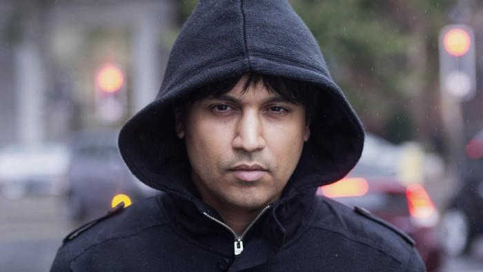

## Table of Contents

## Who is Navinder Singh Sarao?

Navinder Singh Sarao is a British trader who became famous for his involvement in the 2010 Flash Crash. He was born in 1978 and grew up in West London. Sarao was known for trading from his parents' home, using a special computer program he made to trade in the stock market. This program helped him make quick trades that could affect stock prices.

In 2015, Sarao was arrested by the FBI for his role in the Flash Crash. The Flash Crash happened on May 6, 2010, when the stock market suddenly dropped a lot and then quickly recovered. People said Sarao's trading helped cause this big drop. He faced many charges, but he said he didn't mean to cause any harm. In 2020, he admitted to some of the charges and was sentenced to time he had already served in jail, plus a fine. His case showed how one person's actions can impact the whole stock market.

## What is Navinder Singh Sarao known for?

Navinder Singh Sarao is known for his role in the 2010 Flash Crash. He was a British trader who traded from his parents' home in West London. He used a special computer program he made to trade quickly in the stock market. This program helped him make trades that could change stock prices fast.

On May 6, 2010, the stock market had a big drop and then quickly went back up. This event is called the Flash Crash. People said Sarao's trading helped cause this big drop. In 2015, he was arrested by the FBI for this. He faced many charges but said he didn't mean to cause any harm. In 2020, he admitted to some charges and was sentenced to time he had already served in jail, plus a fine. His case showed how one person's actions can affect the whole stock market.

## Where was Navinder Singh Sarao born and raised?

Navinder Singh Sarao was born in 1978. He was born in the United Kingdom. 

He grew up in West London. This is where he lived with his parents. He became known for trading from his parents' home.

## What was Navinder Singh Sarao's profession before his trading activities?

Before Navinder Singh Sarao started trading, he worked at a few different jobs. One of his jobs was at a local bank. He also tried working as a trader at a big financial company, but he did not stay there for long. He found these jobs hard and decided to leave them.

After leaving those jobs, Sarao started trading on his own. He used a computer program he made to trade from his parents' home in West London. This is how he became known in the world of trading.

## How did Navinder Singh Sarao start his trading career?

Navinder Singh Sarao started his trading career after trying a few other jobs. He worked at a local bank and also tried being a trader at a big financial company. But he found these jobs hard and did not stay long. He decided to leave these jobs and start trading on his own.

From his parents' home in West London, Sarao began trading using a computer program he made himself. This program helped him make quick trades in the stock market. He became known for his trading skills and the way he used his program to affect stock prices.

## What specific trading strategies did Navinder Singh Sarao use?

Navinder Singh Sarao used a strategy called "spoofing" to trade. Spoofing means he put in fake orders to buy or sell stocks. He would place these fake orders to trick other traders. This made them think there was a lot of interest in a stock, so they would buy or sell it. Then, Sarao would quickly cancel his fake orders and make real trades at better prices.

He also used a computer program he made to help him with these trades. The program let him make many trades very fast. This helped him take advantage of small changes in stock prices. Sarao's quick trading and spoofing helped him make money, but it also caused problems in the stock market.

## What was the impact of Navinder Singh Sarao's trading on the financial markets?

Navinder Singh Sarao's trading had a big impact on the financial markets, especially during the 2010 Flash Crash. On May 6, 2010, the stock market suddenly dropped a lot and then quickly went back up. People said Sarao's trading helped cause this big drop. He used a strategy called spoofing, where he put in fake orders to trick other traders. This made the stock market very unstable and caused a lot of confusion and panic among traders.

Sarao's actions showed how one person's trading could affect the whole market. His use of a special computer program to make quick trades and spoofing led to big changes in stock prices. This case made people think more about how to keep the stock market safe and fair. It also led to new rules to stop spoofing and other harmful trading practices.

## What legal issues did Navinder Singh Sarao face and what were the outcomes?

Navinder Singh Sarao faced many legal issues because of his trading activities. In 2015, the FBI arrested him for his role in the 2010 Flash Crash. They said he used a strategy called spoofing, where he put in fake orders to trick other traders. This made the stock market very unstable. He was charged with fraud and market manipulation. These are serious crimes that can lead to big punishments.

In 2020, Sarao admitted to some of the charges against him. He said he did not mean to cause any harm. The court sentenced him to time he had already served in jail, which was about four and a half years. He also had to pay a fine of about $12.8 million. His case showed how one person's actions can affect the whole stock market and led to new rules to stop harmful trading practices.

## How did Navinder Singh Sarao's case influence regulatory changes in financial markets?

Navinder Singh Sarao's case made a big impact on the rules for financial markets. People saw how one person's trading could cause a lot of trouble, like the 2010 Flash Crash. This made regulators want to stop harmful trading practices like spoofing. Spoofing is when someone puts in fake orders to trick other traders. After Sarao's case, new rules were made to catch and stop spoofing. These rules help keep the stock market fair and safe for everyone.

The case also made people think more about how to watch the stock market better. Regulators started using new tools and technology to see what traders were doing. They wanted to find and stop bad trading before it could cause big problems. Sarao's case showed that even one person with a computer program could affect the whole market. This led to stronger rules and better ways to keep an eye on trading activities.

## What was the role of technology in Navinder Singh Sarao's trading activities?

Technology played a big part in Navinder Singh Sarao's trading. He used a special computer program he made to trade quickly in the stock market. This program helped him make many trades fast. It let him take advantage of small changes in stock prices. Sarao could do things that would be hard to do without a computer. His program helped him use a strategy called spoofing, where he put in fake orders to trick other traders.

Sarao's use of technology showed how powerful it can be in trading. His computer program helped him affect the stock market a lot. This led to the 2010 Flash Crash, where the market dropped suddenly and then went back up. People saw how one person with a computer could cause big problems. This made regulators want to use technology to watch the market better and stop harmful trading practices.

## What are some of the key lessons learned from Navinder Singh Sarao's case?

Navinder Singh Sarao's case taught us that one person can have a big impact on the stock market. He used a computer program to trade quickly and trick other traders with fake orders. This caused the 2010 Flash Crash, where the market dropped a lot and then went back up. His actions showed how important it is to watch the market closely and stop harmful trading practices like spoofing.

The case also made people think about how to use technology to keep the market safe. After Sarao's case, new rules were made to catch and stop spoofing. Regulators started using better tools to see what traders were doing. This helps make sure the market is fair for everyone. Sarao's case was a big lesson on how technology can be powerful in trading, but it needs to be used the right way.

## What has been Navinder Singh Sarao's life like after his legal battles?

After Navinder Singh Sarao finished his legal battles, he went back to living a quiet life. He was sentenced to the time he had already served in jail, which was about four and a half years. After that, he was free to go home. He had to pay a fine of about $12.8 million, but it's not clear how he managed to pay it. Sarao now lives with his parents in West London, where he used to trade from.

Life after the legal issues has been different for Sarao. He used to be known for his trading skills and the impact he had on the stock market. Now, he stays out of the spotlight. His case made people think more about how to keep the stock market safe and fair. It also showed how one person's actions can change things a lot. Sarao's story is a reminder of the power of technology in trading and the need for good rules to stop harmful practices.

## References & Further Reading

[1]: MacKenzie, D. (2019). ["Flash Crash: A Trading Savant, a Global Manhunt, and the Most Mysterious Market Crash in History."](https://www.amazon.com/Flash-Crash/dp/0008270430) William Collins.

[2]: U.S. Commodity Futures Trading Commission and U.S. Securities and Exchange Commission. (2010). ["Findings Regarding the Market Events of May 6, 2010."](https://www.sec.gov/sec-cftc-prelimreport.pdf) Report of the Staffs of the CFTC and SEC to the Joint Advisory Committee on Emerging Regulatory Issues.

[3]: Patterson, S. (2012). ["Dark Pools: High-Speed Traders, A.I. Bandits, and the Threat to the Global Financial System."](https://dl.acm.org/doi/10.5555/2385786) Crown Business.

[4]: Aldridge, I. (2013). ["High-Frequency Trading: A Practical Guide to Algorithmic Strategies and Trading Systems,"](https://www.amazon.com/High-Frequency-Trading-Practical-Algorithmic-Strategies/dp/1118343506) 2nd Edition, Wiley.

[5]: Kirilenko, A. A., Kyle, A. S., Samadi, M., & Tuzun, T. (2017). ["The Flash Crash: High‐Frequency Trading in an Electronic Market."](https://www.jstor.org/stable/26652722) The Review of Financial Studies, 30(11), 2221–2225.