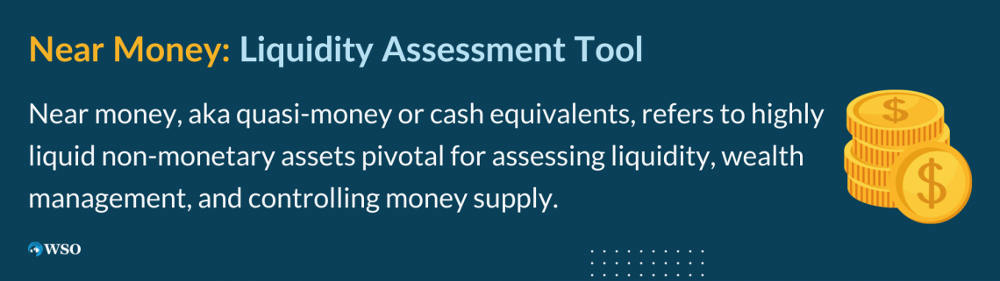

## Table of Contents

## What is near money?

Near money is a term used in economics to describe assets that are not actual cash but can be quickly turned into cash. These assets are very liquid, meaning they can be easily converted into money without losing much value. Examples of near money include savings accounts, money market funds, and short-term government bonds. People often use near money to store their wealth in a way that is safe and can be accessed when needed.

Near money is important because it helps people manage their finances more effectively. For instance, if someone needs money quickly for an emergency, they can convert their near money into cash. This makes near money a useful tool for both individuals and businesses. It also helps the economy by making it easier for money to move around and be used where it is needed.

## How does near money differ from traditional money?

Near money and traditional money are different because traditional money is what we use every day to buy things. It includes coins, paper money, and money in our checking accounts. We can use traditional money right away to pay for things we need or want. It's easy to spend and is accepted everywhere.

Near money, on the other hand, is not used directly to buy things. Instead, it's like a backup plan for money. It includes things like savings accounts and short-term bonds. These can be turned into cash quickly, but they are not as easy to use as traditional money. People keep near money to have a safe place to store their wealth and to use it when they need cash in a hurry.

## What are some common examples of near money?

Near money includes things like savings accounts. When you put money in a savings account, you can't spend it right away like cash, but you can take it out when you need it. Savings accounts are safe places to keep your money and they usually give you a little bit of interest, which means your money can grow over time.

Another example of near money is money market funds. These are like special accounts where you can put your money, and it gets mixed with money from other people. Money market funds are managed by experts who try to make your money grow a little bit while keeping it safe. You can take your money out of these funds whenever you need it, but it might take a day or two.

Short-term government bonds are also near money. When you buy a government bond, you are lending money to the government for a short time, like a few months or a year. At the end of that time, the government gives you your money back, plus a little extra as a thank you. These bonds are very safe because they are backed by the government, and you can sell them to get your money back quickly if you need to.

## Why is near money important in the economy?

Near money is important in the economy because it helps people and businesses manage their money better. When people have savings accounts or money market funds, they can keep their money safe and still use it when they need to. This is helpful because it gives people a place to store their money without having to keep it all in cash. If someone has an emergency and needs money fast, they can turn their near money into cash quickly. This makes people feel more secure and helps them plan for the future.

Near money also helps the economy by making it easier for money to move around. When people can quickly turn their savings into cash, they can spend it on things they need, which helps businesses. If businesses have money market funds or short-term bonds, they can use this money to grow or to pay for things they need to keep running. This keeps the economy moving and helps it grow. Near money is like a bridge between saving and spending, making sure that money can be used where it's needed most.

## How does near money affect liquidity in the financial system?

Near money helps make the financial system more liquid. Liquidity means how easy it is to turn something into cash. When people have savings accounts or money market funds, they can quickly turn these into cash if they need to. This makes the whole financial system more flexible because people can get money when they need it. It's like having a backup plan for money, which helps keep the economy running smoothly.

Near money also helps businesses and banks manage their money better. If a business needs cash quickly, it can sell its short-term bonds or use money from its money market funds. This helps businesses keep going even when they face unexpected costs. Banks can also use near money to make sure they have enough cash on hand to give to people who need it. This makes the financial system more stable and helps prevent problems like bank runs, where everyone wants their money back at the same time.

## What role does near money play in monetary policy?

Near money plays an important role in monetary policy because it helps central banks control the amount of money in the economy. When a central bank wants to increase the money supply, it can make it easier for people to turn their near money into cash. For example, by lowering interest rates, people might move money from savings accounts into checking accounts or spend it, which adds more money into circulation. On the other hand, if the central bank wants to decrease the money supply, it can make it harder to turn near money into cash by raising interest rates, encouraging people to keep their money in savings accounts instead of spending it.

This control over near money helps central banks manage inflation and economic growth. If there's too much money in the economy, prices can go up, which is called inflation. By making it harder to turn near money into cash, central banks can slow down spending and help keep prices stable. If the economy needs a boost, central banks can make it easier to turn near money into cash, encouraging spending and helping the economy grow. So, near money is a key tool that central banks use to keep the economy balanced.

## How do financial institutions use near money?

Financial institutions like banks use near money to help manage their money and keep the economy running smoothly. They keep some of their money in savings accounts and money market funds, which are types of near money. This helps them have cash ready when people need to take money out of their accounts. It's like having a backup plan for money, so banks can make sure they always have enough cash to give to their customers.

Banks also use near money to make loans to people and businesses. When someone wants to borrow money, the bank can use the money from its savings accounts or money market funds to give out the loan. This helps the economy because it lets people buy homes or start businesses. By using near money, banks can keep their money safe and still help the economy grow.

## What are the risks associated with near money?

Near money can be a bit risky because it's not as safe as keeping all your money in cash. One risk is that the value of near money can go up and down. For example, if you have money in a money market fund, the value of that fund can change based on what's happening in the market. If the market goes down, you might get less money back than you put in. Another risk is that it might take a little time to turn near money into cash. If you need money right away, you might have to wait a day or two to get it from a savings account or a money market fund.

Another risk is that near money can be affected by what the government does with interest rates. If the government raises interest rates, the value of your near money might go down. This can make it harder to turn your near money into cash without losing some of its value. Also, if a bank or a financial institution that holds your near money has problems, you might not be able to get your money back as quickly as you need to. So, while near money is useful, it's important to understand these risks and be ready for them.

## How has the concept of near money evolved over time?

The idea of near money has changed a lot over time. In the past, near money was mostly about things like savings accounts and short-term government bonds. People used these to keep their money safe and still be able to use it when they needed to. Back then, it was harder to turn near money into cash quickly because there were fewer ways to do it. Banks and other places where people kept their money were not as fast at giving it back.

Today, near money includes more things like money market funds and even some types of investments that can be turned into cash quickly. Technology has made a big difference. Now, people can use apps and online banking to move their money around faster than ever before. This means near money is more useful and easier to use. Also, central banks and governments have better ways to control near money, which helps them manage the economy better. So, near money has become a bigger and more important part of how we handle our money.

## What impact does near money have on inflation and economic stability?

Near money can affect inflation and economic stability in big ways. When people can easily turn their near money into cash, they might spend more money. This can make prices go up, which is called inflation. If there's too much money chasing too few things, prices rise. Central banks watch near money closely because it helps them control how much money is in the economy. If they see that near money is turning into cash too quickly, they might raise interest rates to slow things down and keep prices from going up too fast.

On the other hand, near money can also help keep the economy stable. When people and businesses have near money, they feel more secure because they know they can get cash if they need it. This can help prevent big problems like bank runs, where everyone wants their money back at the same time. Near money gives people a way to save their money safely and still use it when they need to. This helps the economy stay balanced and grow in a healthy way. So, near money is important for both controlling inflation and keeping the economy stable.

## How do regulations affect the use and effectiveness of near money?

Regulations can change how people use near money and how well it works. Governments and central banks make rules about things like savings accounts and money market funds to keep them safe and fair. These rules can make it easier or harder for people to turn their near money into cash. For example, if the rules say banks have to keep more money on hand, it might take longer for people to get their money out of savings accounts. This can make near money less useful because people can't use it as quickly when they need it.

On the other hand, good regulations can make near money more effective. When rules make sure that savings accounts and money market funds are safe, people feel more confident about using them. This can help more money move around in the economy, which can help it grow. Regulations also help central banks control how much money is in the economy, which is important for keeping prices stable and the economy healthy. So, while regulations can sometimes make near money less easy to use, they also help make it safer and more reliable.

## What are the future trends and potential developments in near money?

In the future, near money might change a lot because of new technology. More people could use digital wallets and apps to keep their money in things like savings accounts and money market funds. This could make it even easier to turn near money into cash when you need it. Also, new kinds of near money might come out, like digital currencies that are backed by banks or governments. These could be used like savings accounts but might work faster and be easier to use.

Another trend could be that rules about near money might change. Governments and central banks might make new rules to keep near money safe and to help the economy grow. They might want to make sure that new types of near money, like digital currencies, are used in a way that helps everyone. This could make near money even more important for how people and businesses manage their money. As technology and rules keep changing, near money will probably become a bigger part of our financial lives.

## References & Further Reading

[1]: Bergstra, J., Bardenet, R., Bengio, Y., & Kégl, B. (2011). ["Algorithms for Hyper-Parameter Optimization."](https://papers.nips.cc/paper/4443-algorithms-for-hyper-parameter-optimization) Advances in Neural Information Processing Systems 24.

[2]: ["Advances in Financial Machine Learning"](https://www.amazon.com/Advances-Financial-Machine-Learning-Marcos/dp/1119482089) by Marcos Lopez de Prado

[3]: ["Evidence-Based Technical Analysis: Applying the Scientific Method and Statistical Inference to Trading Signals"](https://www.amazon.com/Evidence-Based-Technical-Analysis-Scientific-Statistical/dp/0470008741) by David Aronson

[4]: ["Machine Learning for Algorithmic Trading"](https://github.com/PacktPublishing/Machine-Learning-for-Algorithmic-Trading-Second-Edition) by Stefan Jansen

[5]: ["Quantitative Trading: How to Build Your Own Algorithmic Trading Business"](https://www.amazon.com/Quantitative-Trading-Build-Algorithmic-Business/dp/1119800064) by Ernest P. Chan

[6]: [Fama, E.F. (1970). "Efficient Capital Markets: A Review of Theory and Empirical Work."](https://www.jstor.org/stable/2325486) The Journal of Finance, 25(2), 383-417.

[7]: Hull, J. (2017). ["Options, Futures, and Other Derivatives."](https://www.semanticscholar.org/paper/Options%2C-Futures%2C-and-Other-Derivatives-Hull/89bdee500c8623864fc9eb7a471546aa713acc44) Pearson Education.

[8]: Black, F., & Scholes, M. (1973). ["The Pricing of Options and Corporate Liabilities."](https://www.cs.princeton.edu/courses/archive/fall09/cos323/papers/black_scholes73.pdf) Journal of Political Economy, 81(3), 637-654.

[9]: Sharpe, W. F. (1964). ["Capital Asset Prices: A Theory of Market Equilibrium Under Conditions of Risk."](https://onlinelibrary.wiley.com/doi/full/10.1111/j.1540-6261.1964.tb02865.x) The Journal of Finance, 19(3), 425-442.