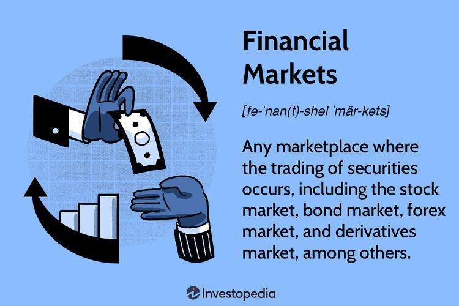

The financial landscape is undergoing rapid transformation, driven by the integration of diverse financial instruments and emerging technologies. This progression highlights the importance of understanding the interconnected dynamics of near money, financial instruments, monetary economics, and algorithmic trading. As financial systems become increasingly complex, these elements collectively play a crucial role in shaping strategies and decision-making processes within modern markets.

Near money, encompassing non-cash assets easily convertible to cash such as savings accounts and Treasury bills (T-bills), remains fundamental in liquidity management. Financial instruments like stocks, bonds, and derivatives are pivotal in facilitating capital formation, risk management, and the optimization of investment portfolios. The study of monetary economics provides insights into the mechanisms through which economies manage money, credit, and financial systems, guiding both policy makers and investors.



Meanwhile, algorithmic trading represents a technological leap, utilizing computer algorithms to execute trades with speed and precision based on pre-set rules. This practice underscores the growing reliance on technology to enhance market efficiency and decision-making in trading activities.

Understanding these concepts is essential for navigating the financial markets, offering insights into strategies and decisions needed for managing risk and optimizing opportunities. This exploration aims to provide a robust overview that supports financial professionals and interested individuals in comprehending the evolving financial ecosystem. Through an analytical lens, this article endeavors to contribute foundational knowledge, equipping readers with the necessary tools to adapt and succeed in the dynamic world of finance.

## Table of Contents

## What is Near Money?

Near money, also known as quasi-money, encompasses highly liquid non-cash assets that can be swiftly converted into cash without significant loss of value. These assets are essential components of liquidity management in both personal and corporate finance. Unlike cash, which is the most liquid asset, near money requires minimal conversion to be utilized as an immediate medium of exchange.

Typically, near money includes a variety of financial instruments such as savings accounts, Treasury bills (T-bills), certificates of deposit, and money market accounts. These instruments provide investors and financial managers with the ability to meet short-term obligations while also yielding returns that are generally higher than those offered by regular cash holdings.

**Liquidity Management**

The primary function of near money is to facilitate effective [liquidity](/wiki/liquidity-risk-premium) management. For individuals and businesses, maintaining a balance between liquid cash and near money assets is crucial for optimizing cash flow. This balance ensures that they can swiftly respond to immediate financial needs without disrupting long-term investment strategies. Near money plays a vital role in risk management by providing a buffer against unforeseen financial demands or market fluctuations.

**Distinction from Cash**

Though near money is easily convertible, it is distinct from cash in terms of liquidity and yield. Cash is the ultimate liquid asset, available for immediate transactions. However, it often offers no or minimal returns. Near money, by contrast, provides higher yields through interest or dividends, although it may require a short conversion period before becoming spendable cash. This distinction underscores its importance in financial health assessments and strategic planning.

**Examples of Near Money**

1. **Savings Accounts**: Holders can access these accounts with ease, often with little to no penalty, making them a staple for individual liquidity management.

2. **Treasury Bills (T-bills)**: Short-term government securities that are sold at a discount and mature to their face value. They are highly secure and easily marketable.

3. **Certificates of Deposit (CDs)**: Time deposits that offer fixed interest rates over specified terms. Though less liquid than savings accounts, CDs can be converted to cash, sometimes incurring a penalty.

4. **Money Market Accounts**: These accounts offer check-writing privileges and are insured by financial institutions, providing liquidity with favorable interest rates.

5. **Marketable Securities**: This category includes stocks and bonds that can be sold quickly in secondary markets to convert to cash, although their market value may fluctuate.

Understanding the nuances of near money is critical for effective risk management and cash flow optimization. By strategically employing near money instruments, individuals and corporations can maintain financial stability, meet immediate obligations, and enhance their overall economic standing.

## Financial Instruments and Their Role

Financial instruments are crucial components of the financial ecosystem, encompassing various contracts that can be bought, sold, or traded. These include stocks, bonds, and derivatives, each playing a vital role in financial markets. By enabling [capital raising](/wiki/hedge-fund-capital-raising), risk transfer, and financial investment of surplus resources, financial instruments are fundamental to economic exchanges.

### Stocks
Stocks, or equities, represent ownership shares in a corporation. When an individual buys stocks, they acquire partial ownership of the issuing company, gaining potential profit through dividends and capital appreciation. Stocks are critical for companies to raise capital, which can be used to expand operations, invest in new projects, or pay off existing debts. However, investing in stocks involves certain risks, such as market [volatility](/wiki/volatility-trading-strategies) and the risk associated with the individual company's performance.

### Bonds
Bonds are debt securities issued by corporations, municipalities, and governments to raise capital. These instruments are essentially loans from investors to the issuer, where the issuer agrees to pay back the principal amount at a specified date along with periodic interest payments. Bonds are considered less risky compared to stocks, offering more predictable returns. However, bondholders face risks such as [interest rate](/wiki/interest-rate-trading-strategies) fluctuations and credit/default risks, which can affect their returns and principal integrity.

### Derivatives
Derivatives are financial contracts whose value is dependent on an underlying asset or group of assets, such as commodities, interest rates, or currencies. Common derivatives include options, futures, forwards, and swaps. These instruments are used for hedging risks or engaging in speculative activities to potentially enhance returns. For instance, futures can hedge against price changes in commodities, while options can provide strategic leverage in investment portfolios.

#### Options and Futures
Options give investors the right, but not the obligation, to buy or sell an asset at a predetermined price before a specified expiry date. They are versatile tools used for hedging and speculative strategies, allowing investors to benefit from price movements without holding the asset. Futures, on the other hand, are contractual obligations to buy or sell an asset at a predetermined price at a future date. Used extensively for hedging, they lock in prices to manage risk associated with price fluctuations. Both options and futures require significant understanding of market conditions and strategic foresight for effective use.

### Role and Economic Impact
The interplay between these instruments and their respective markets fuels economic activity. By facilitating the flow of capital, financial instruments enable corporations and governments to undertake infrastructure projects, research and development, and other initiatives that contribute to economic growth. Furthermore, by transferring and diversifying risk, they help stabilize financial markets, reducing the systemic risk associated with market volatility. Understanding the mechanics and implications of various financial instruments is paramount to effective financial planning, ensuring informed decision-making that aligns with one's financial goals and risk appetite.

Financial instruments, with their diverse structures and uses, are indispensable to the operational efficiency and growth of financial markets. They provide a framework for capital allocation, risk management, and investment, driving economic expansion and offering opportunities for wealth creation.

## Monetary Economics: The Framework

Monetary economics is a branch of economics that examines how economies manage money, credit, and financial systems. Central to this discipline is the role of central banks and their use of monetary policy tools to influence economic conditions. These tools include manipulating interest rates, controlling the money supply, and regulating inflation rates. For example, central banks might lower interest rates to stimulate borrowing and investment or increase them to curb inflation.

The money supply is categorized into tiers to help understand how different forms of money contribute to economic activity. The most commonly referenced tiers are M1 and M2. M1 includes the most liquid forms of money, such as cash and checking deposits, while M2 encompasses M1 plus less liquid savings accounts, time deposits, and marketable securities. These categories help policymakers gauge the amount of money in circulation and its potential impact on the economy.

Interest rates are a crucial component of monetary economics. They influence borrowing costs, consumer spending, and business investment. Lower interest rates generally encourage borrowing and spending, leading to economic expansion, while higher rates aim to temper excess demand and inflation.

Inflation control is another vital aspect, as central banks strive to maintain price stability to promote sustainable economic growth. Inflation erodes purchasing power, affecting both consumers and businesses. By adjusting monetary policies, central banks aim to keep inflation within target ranges.

An understanding of monetary economics is invaluable for investors and policymakers, as it aids in forecasting economic trends and anticipating policy changes. This knowledge equips investors to predict market reactions based on central bank announcements or macroeconomic indicators.

Overall, monetary economics highlights the intricate balance required in managing economies at both national and global levels. Policymakers must weigh the impacts of their decisions on growth, employment, and inflation while navigating the complexities of interconnected financial systems.

## Algorithmic Trading: Technology in Finance

Algorithmic trading leverages computer algorithms to execute trades based on predetermined criteria, transforming the landscape of financial markets by enhancing trading efficiency and minimizing errors associated with human decision-making. By utilizing financial models and historical data analysis, these algorithms optimize trade execution at favorable prices, contributing significantly to price discovery and liquidity.

The algorithms used in trading are typically designed through complex financial modeling and the analysis of vast datasets. This process involves [backtesting](/wiki/backtesting) models against historical market data to ensure reliability under different conditions. For instance, algorithms analyze patterns through statistical methods like regression analysis or [machine learning](/wiki/machine-learning) techniques. The quantitative nature of [algorithmic trading](/wiki/algorithmic-trading) ensures that trades are executed swiftly and at the most advantageous prices, preceding manual processes.

A primary advantage of algorithmic trading lies in its speed and accuracy, allowing traders to capitalize on market opportunities that may only be available for fractions of a second. This capability is particularly advantageous in high-frequency trading ([HFT](/wiki/high-frequency-trading-strategies)), where the [volume](/wiki/volume-trading-strategy) of trades and the speed of transaction execution are critical for profitability. High-frequency traders deploy sophisticated algorithms to scan multiple markets and execute large numbers of orders in microseconds, capturing small price differentials. 

Despite its benefits, algorithmic trading is not without challenges. System failures, commonly referred to as "flash crashes," pose significant risks. These incidents can arise from technical malfunctions or erroneous market data, resulting in large-scale anomalies where market prices plunge abruptly before recovering. The Knight Capital Group incident of 2012 is a notable example, where a software glitch led to a $440 million trading loss within minutes.

Algorithmic trading also raises concerns about market manipulation and fairness. Practices such as spoofing, where orders are placed with the intent to cancel before execution to create artificial demand or supply, can distort market integrity. Regulatory bodies, like the U.S. Securities and Exchange Commission (SEC), are continuously adapting policies to mitigate such risks, ensuring transparency and fairness in trading.

In summary, while algorithmic trading enhances efficiency and accuracy in financial markets, it requires robust systems to manage technical failures and regulatory frameworks to prevent manipulative practices. As computational technology and data analytics continue to advance, the role of algorithmic trading in financial markets is poised to expand further.

## Integrating Near Money and Algorithmic Trading

Near money assets, such as money market accounts, Treasury bills, and certificates of deposit, are vital in furnishing liquidity to algorithmic trading strategies. The rapid convertibility of these assets is particularly crucial for traders who demand quick access to funds in order to execute trades promptly. The speed at which these assets can be converted into cash allows traders to capitalize on fleeting market opportunities, a necessity in the high-frequency transaction landscape where algorithmic trading prevails.

Algorithmic trading relies heavily on advanced mathematical models and historical data analysis to make informed trading decisions. The effective allocation of resources among cash, near money, and other financial instruments can be optimized using algorithmic frameworks. These frameworks are designed to evaluate the liquidity and risk profile of an asset, enabling traders to dynamically manage their portfolios. In practice, this could involve using algorithms to determine the optimal balance between cash reserves and near money assets to maximize return while minimizing risk.

### Python Example
Here is a basic Python example illustrating how one might approach the allocation:

```python
class Portfolio:
    def __init__(self, cash=0, near_money=0, other_assets=0):
        self.cash = cash
        self.near_money = near_money
        self.other_assets = other_assets

    def allocate_assets(self, market_condition):
        # Simple strategy: keep 50% in near money in volatile markets
        if market_condition == 'volatile':
            self.near_money = self.cash * 0.5
            self.cash -= self.near_money
        else:
            self.near_money = self.cash * 0.2
            self.cash -= self.near_money

        return self.cash, self.near_money

# Example Usage
portfolio = Portfolio(cash=10000)
print(portfolio.allocate_assets('volatile'))
```

The integration of near money with algorithmic trading is not static; it requires continuous assessment and adjustment. Market conditions are highly dynamic, and therefore, the strategies deployed must be flexible enough to adjust to shifts in market volatility and interest rates. This entails regular monitoring of asset values and performance metrics to ensure that the trading strategy remains aligned with broader financial objectives. Adapting to these changes helps maintain a balance between seizing immediate trading opportunities and fulfilling longer-term financial commitments. By leveraging near money in algorithmic trading, traders can effectively manage liquidity and risk, ultimately enhancing their strategic approach in financial markets.

## Conclusion

The financial markets present a dynamic ecosystem where traditional financial instruments and cutting-edge technologies intersect. A thorough comprehension of near money, monetary economics, and algorithmic trading is essential for achieving financial success in this environment. Understanding these critical elements provides a robust framework for making informed decisions and effectively managing risk.

Near money assets, while not cash, significantly enhance liquidity, enabling timely financial decisions and risk management. Monetary economics provides insight into the complex mechanisms through which central banks influence economic stability and growth, giving investors tools to predict changes in monetary policy and market behavior. Algorithmic trading further complements these insights by leveraging technology for high-speed, precise execution of trades, reducing human error and optimizing decision-making in fast-paced markets.

These concepts collectively shape decision-making processes, inform risk management strategies, and influence economic policy at multiple levels. As technology and financial strategies continue to evolve, staying abreast of these developments is crucial for recognizing and seizing market opportunities. This overview provides a foundational perspective, encouraging deeper exploration into each area, essential for those seeking to navigate and thrive in the interconnected world of modern finance.

## References & Further Reading

[1]: Bergstra, J., Bardenet, R., Bengio, Y., & Kégl, B. (2011). ["Algorithms for Hyper-Parameter Optimization."](https://papers.nips.cc/paper/4443-algorithms-for-hyper-parameter-optimization) Advances in Neural Information Processing Systems 24.

[2]: ["Advances in Financial Machine Learning"](https://www.amazon.com/Advances-Financial-Machine-Learning-Marcos/dp/1119482089) by Marcos Lopez de Prado

[3]: ["Evidence-Based Technical Analysis: Applying the Scientific Method and Statistical Inference to Trading Signals"](https://www.amazon.com/Evidence-Based-Technical-Analysis-Scientific-Statistical/dp/0470008741) by David Aronson

[4]: ["Machine Learning for Algorithmic Trading"](https://github.com/PacktPublishing/Machine-Learning-for-Algorithmic-Trading-Second-Edition) by Stefan Jansen

[5]: ["Quantitative Trading: How to Build Your Own Algorithmic Trading Business"](https://www.amazon.com/Quantitative-Trading-Build-Algorithmic-Business/dp/1119800064) by Ernest P. Chan

[6]: [Fama, E.F. (1970). "Efficient Capital Markets: A Review of Theory and Empirical Work."](https://www.jstor.org/stable/2325486) The Journal of Finance, 25(2), 383-417.

[7]: Hull, J. (2017). ["Options, Futures, and Other Derivatives."](https://www.semanticscholar.org/paper/Options%2C-Futures%2C-and-Other-Derivatives-Hull/89bdee500c8623864fc9eb7a471546aa713acc44) Pearson Education.

[8]: Black, F., & Scholes, M. (1973). ["The Pricing of Options and Corporate Liabilities."](https://www.cs.princeton.edu/courses/archive/fall09/cos323/papers/black_scholes73.pdf) Journal of Political Economy, 81(3), 637-654.

[9]: Sharpe, W. F. (1964). ["Capital Asset Prices: A Theory of Market Equilibrium Under Conditions of Risk."](https://onlinelibrary.wiley.com/doi/full/10.1111/j.1540-6261.1964.tb02865.x) The Journal of Finance, 19(3), 425-442.