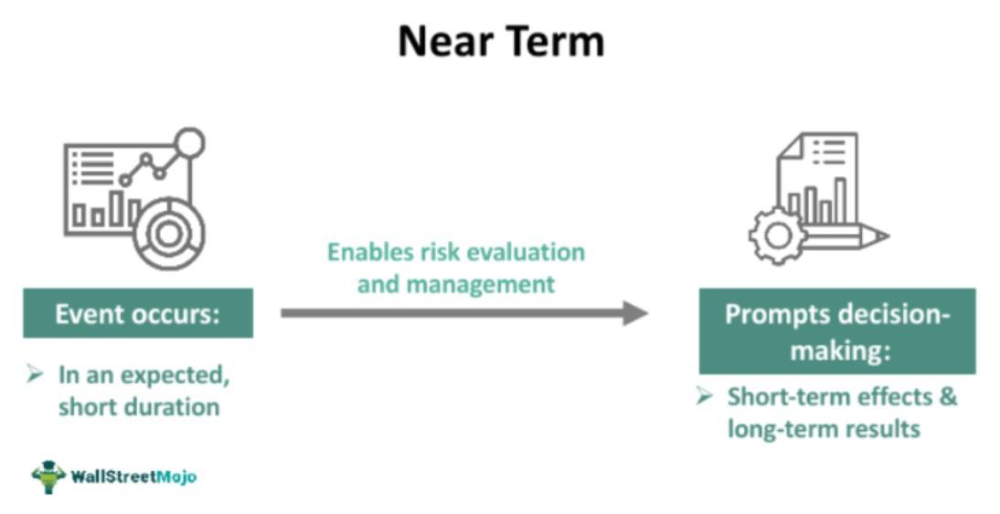

Investment strategies have undergone remarkable transformation over recent decades, driven primarily by advancements in technology and the emergence of algorithmic trading. Traditionally, investment strategies were often based on fundamental analysis and manual execution, relying heavily on the judgment and expertise of individual traders and financial planners. However, the integration of algorithmic trading into the financial planning landscape has introduced a paradigm shift, offering new levels of efficiency and precision.

Algorithmic trading involves the use of automated processes to execute trading orders at optimal speeds, often faster than any human could achieve. These algorithms are designed to follow pre-set instructions based on various parameters such as timing, price, and volume to maximize potential returns and minimize risks. The benefits of this approach are multifaceted, including increased execution speed, reduced transaction costs, and the ability to execute complex strategies across multiple markets seamlessly.



As investors and financial planners look to meet their short-term financial goals, the synergy between near-term financial planning and algorithmic trading becomes particularly compelling. Near-term financial planning is characterized by its focus on achieving financial objectives within a shorter time frame—typically ranging from a few months to a year. This necessitates a strategic approach that is both agile and responsive to market fluctuations.

Modern technology is reshaping traditional investment strategies by introducing tools that can optimize investment returns within these shorter intervals. Algorithmic trading exemplifies this by enabling real-time analysis and rapid response to market changes, thereby aligning closely with the goals of near-term financial planning. Investors can utilize these technologies to enhance decision-making processes and optimize portfolios to navigate the complexities of modern financial markets.

In summary, the convergence of algorithmic trading and near-term financial planning signifies a significant evolution in how investment strategies are developed and executed. As this dynamic landscape continues to evolve, leveraging technology is crucial for investors aiming to achieve their financial goals in today's fast-paced and increasingly complex market environment.

## Table of Contents

## Understanding Near-Term Financial Planning

Near-term financial planning is a crucial aspect of personal finance management, as it focuses on objectives that require immediate attention, typically within a few months to a year. This approach is pivotal for managing liquidity and ensures that individuals or businesses can meet upcoming financial obligations without compromising long-term goals.

This type of planning necessitates an adjustment of investment strategies to effectively anticipate financial needs and predict market conditions in the short-term. Given the volatile nature of markets, such strategies require a nimble approach, frequently revisiting and revising plans to ensure alignment with rapidly changing conditions. This involves not only assessing personal financial needs but also keeping abreast of economic indicators, market trends, and broader financial conditions that could impact the value of investments or the cost of debt.

The importance of aligning near-term goals with suitable investment strategies cannot be overstated. Ensuring that financial security and growth are balanced is fundamental. For instance, if the goal is to accumulate a specific sum within a year to make a significant purchase or investment, it is essential to select financial instruments that offer [liquidity](/wiki/liquidity-risk-premium) and minimal risk while providing adequate returns.

One commonly used strategy in near-term financial planning is maintaining a diversified portfolio that includes cash equivalents or short-term securities such as treasury bills, short-duration bonds, and money market funds. These instruments typically offer lower risk and are easier to liquidate compared to equities or long-term bonds. By carefully selecting a mix of these low-risk investments, individuals can safeguard against market [volatility](/wiki/volatility-trading-strategies) while positioning themselves to meet their financial goals.

Furthermore, this planning should incorporate emergency savings to cushion against unexpected financial shocks—a principle termed as maintaining a "rainy day fund." A sound near-term financial plan will ensure that such reserves are accessible without incurring penalties or significant losses.

Finally, near-term financial planning demands careful consideration of the timing of cash flows. It is essential to align outflows with anticipated income, ensuring that liquidity is managed efficiently. Advanced budgeting tools and financial software can be employed to project cash flows, set reminders for upcoming expenses, and adjust plans dynamically to reflect actual income and expenditure data. This strategic and data-driven approach not only aids in achieving short-term goals but also sets a strong foundation for long-term financial stability and success.

## The Role of Algorithmic Trading in Modern Investment Strategies

Algorithmic trading leverages sophisticated computer algorithms to automate trading decisions, providing an unparalleled advantage in terms of speed and efficiency compared to traditional trading methods. By executing trades at speeds impossible for human traders, [algorithmic trading](/wiki/algorithmic-trading) can capture market opportunities and manage risks more effectively, transforming modern investment strategies.

One of the primary advantages of algorithmic trading in short-term financial planning is its ability to quickly adapt to changing market conditions. Algorithms can process vast amounts of market data in real-time, identifying patterns and executing trades based on pre-defined criteria without the delay associated with human decision-making. This agility allows investors to capitalize on short-term market fluctuations, optimizing their investment portfolios and achieving financial goals within reduced time frames.

Various algorithmic trading strategies have been developed to address different market scenarios and investment goals. Two of the most widely used strategies are trend-following and mean-reversion. 

**Trend-Following Strategy:** This strategy is based on the principle that markets exhibit momentum and trends tend to persist for a certain period. Trend-following algorithms analyze historical price data to identify the direction of a market trend and execute trades accordingly. For example, if an asset is trending upwards, the algorithm will signal a buy position, often using indicators like moving averages or the MACD (Moving Average Convergence Divergence). The aim is to ride the trend as long as possible until indicators show that the trend is weakening.

**Mean-Reversion Strategy:** This strategy is predicated on the statistical notion that prices and returns eventually move back to their historical means. Mean-reversion algorithms look for assets that have deviated from their average value, under the assumption that they will revert to this mean over time. One common mean-reversion technique is pairs trading, where two correlated assets are traded against each other, buying the underperforming asset and shorting the outperforming one, thus benefiting from their convergence.

Both strategies require careful parameter tuning and risk management. Algorithmic trading systems often employ [backtesting](/wiki/backtesting)—a process where strategies are optimized using historical data—to ensure that they perform well under various market conditions. Python libraries such as `pandas` and `numpy` are commonly used to process data and identify optimal strategy parameters.

Algorithmic trading's ability to process complex datasets and execute trades at high speed makes it an indispensable tool in modern investment strategies, particularly for short-term financial planning. The efficacy of an algorithmic trading strategy hinges on the quality of its design, including the robustness of its algorithms, risk management measures, and adaptability to shifting market dynamics. As technology and data analysis methods continue to evolve, algorithmic trading will likely play an increasingly prominent role in shaping the future of financial markets.

## Designing an Effective Investment Strategy Using Algorithmic Trading

Creating a successful algorithmic trading strategy requires a structured approach, beginning with clearly defined financial goals and a thorough understanding of market conditions. Identifying personal financial objectives and assessing risk tolerance are foundational steps in designing an algorithmic strategy that aligns with an investor's needs. 

Firstly, investors must articulate their financial goals, which can range from generating short-term income to achieving long-term capital growth. Understanding the desired outcomes directs the choice of algorithmic strategies, as different approaches are better suited to varying goals. For instance, a trend-following algorithm might be fitting for investors aiming for gradual growth, while a mean-reversion strategy might suit those focusing on short-term opportunities.

Risk tolerance is another critical consideration. It dictates the degree of volatility an investor is willing to endure. High-risk strategies may offer higher potential rewards but can also lead to significant losses. Conversely, more conservative approaches may yield stable but modest returns. It is important to choose a strategy that strikes an acceptable balance between potential gain and tolerable risk.

Once goals and risk tolerance are established, the next step involves selecting the appropriate algorithmic strategy. Common strategies include:

1. **Trend-Following**: This strategy seeks to capitalize on market momentum by investing in assets that exhibit a discernible upward or downward trend. The following Python snippet provides a simple example of how one might implement a basic trend-following strategy:

   ```python
   def trend_following(prices, short_window=40, long_window=100):
       signals = pd.DataFrame(index=prices.index)
       signals['price'] = prices['Close']
       signals['short_mavg'] = prices['Close'].rolling(window=short_window, min_periods=1).mean()
       signals['long_mavg'] = prices['Close'].rolling(window=long_window, min_periods=1).mean()
       signals['signal'] = 0.0
       signals['signal'][short_window:] = np.where(signals['short_mavg'][short_window:] > signals['long_mavg'][short_window:], 1.0, 0.0)
       signals['positions'] = signals['signal'].diff()
       return signals
   ```

2. **Mean-Reversion**: This strategy is based on the assumption that prices will revert to their mean over time. It involves identifying overbought or oversold conditions and acting accordingly.

3. **Statistical Arbitrage**: This complex approach leverages statistical methods to identify and exploit price anomalies across various instruments, usually requiring sophisticated models and a significant amount of data.

Backtesting is an essential phase in the development of any algorithmic trading strategy, enabling investors to evaluate how a strategy would have performed based on historical data. Backtesting provides insights into the strategy's potential profitability and helps identify possible weaknesses. During this process, key performance metrics such as Sharpe ratio, drawdown, and return on investment should be analyzed to assess the strategy's efficacy.

Optimization follows backtesting and involves fine-tuning the algorithm's parameters to improve its performance. This iterative process seeks to enhance the strategy's robustness by simulating how minor adjustments could impact outcomes across different market conditions.

Overall, the design of an effective investment strategy using algorithmic trading involves a careful blend of goal-setting, risk assessment, strategy selection, rigorous backtesting, and ongoing optimization. Together, these elements form a comprehensive approach that seeks to leverage technology for enhanced investment decision-making.

## Key Considerations in Implementing Algorithmic Trading

Algorithmic trading offers numerous advantages, but it is not without its challenges. One of the primary pitfalls is overfitting, an issue arising when a trading algorithm performs well on historical data but fails in live trading due to excessive complexity. Overfitting occurs when an algorithm is excessively tailored to past noise, capturing patterns that are not indicative of future market behavior. This can lead to poor real-world performance. To mitigate overfitting, traders should employ techniques like cross-validation, which involves dividing the available data into several subsets, training the model on some and validating it on others.

Another issue commonly faced in algorithmic trading is data snooping bias. This occurs when a strategy is excessively tested on the same dataset, leading to misleading performance indicators. When a trading strategy is repeatedly adjusted and tested on the same set of historical data, it risks becoming exceedingly fitted to that specific dataset. To minimize this bias, it is crucial to use out-of-sample testing, which involves evaluating the strategy on data not previously used during the model development phase.

Beyond the technical challenges, algorithmic trading introduces complexities in terms of tax implications and transaction costs. Frequent trading can trigger numerous taxable events, and traders must account for short-term capital gains taxes, which can be significantly higher than long-term gains. In addition, high turnover rates in algorithmic trading can accrue substantial transaction costs, eroding potential profits. Sophisticated tax optimization strategies, such as selecting specific lots for sale to manage tax impacts, and utilizing platforms that minimize transaction costs, become essential in this context.

Continuous monitoring and adaptation of trading strategies are paramount in algorithmic trading. The financial markets are dynamic, and strategies that work under certain market conditions might underperform if conditions change. Real-time data analysis and [machine learning](/wiki/machine-learning) techniques can help in adapting strategies promptly. Traders can use Python libraries such as `pandas` for data manipulation and `scikit-learn` for predictive modeling to keep strategies aligned with evolving market trends. Here is an illustrative example of a basic framework for continuous monitoring:

```python
import pandas as pd
from sklearn.model_selection import train_test_split
from sklearn.linear_model import LinearRegression

# Load and preprocess data
data = pd.read_csv('market_data.csv')
X = data[['feature1', 'feature2', 'feature3']]
y = data['target']

# Split data for training and validation
X_train, X_test, y_train, y_test = train_test_split(X, y, test_size=0.2, random_state=42)

# Train model
model = LinearRegression()
model.fit(X_train, y_train)

# Validate model
accuracy = model.score(X_test, y_test)
print(f'Model accuracy: {accuracy:.2f}')

# This example assumes updating data periodically and re-evaluating the model's performance
```

In conclusion, while algorithmic trading provides powerful tools for optimizing investment strategies, addressing these key considerations is crucial for effective implementation. Balancing the technical aspects with tax and cost management strategies will ensure that algorithmic trading contributes positively to financial goals.

## Balancing Risk and Reward in Near-Term Financial Planning

Balancing risk and reward is a critical element of near-term financial planning, especially when utilizing automated strategies such as algorithmic trading. The inherent volatility and unpredictability of financial markets necessitate a robust approach to managing investments to safeguard against potential losses while optimizing for gains.

One effective strategy for managing risks is diversification. By spreading investments across various asset classes, investors can reduce their exposure to any single market fluctuation. This principle, often summarized by the phrase "don't put all your eggs in one basket," is foundational in constructing a resilient investment portfolio. Diversification minimizes the potential impact of a downturn in any one investment, thus stabilizing returns over the short term.

Leveraging different types of investments also plays a crucial role in risk management. In addition to stocks, bonds, and cash equivalents, investors can incorporate alternative investments such as real estate, commodities, or even cryptocurrencies to create a more balanced approach. Each asset class exhibits distinct risk and return characteristics, and their performance often correlates with different economic factors. By combining them, investors can achieve a more predictable overall return pattern, mitigating the risks associated with any single investment.

Algorithmic trading strategies should be carefully aligned with a balanced portfolio to achieve targeted financial outcomes. These strategies, such as trend-following or mean-reversion, should complement the existing investment mix. For instance, a trend-following algorithm may capitalize on sustained market movements, while a mean-reversion strategy could exploit short-term price disparities. To integrate these effectively, investors need to evaluate their individual risk tolerance and financial objectives.

Portfolio allocation can be optimized using mathematical models to maintain the desired risk-reward balance. For example, the mean-variance optimization, introduced by Harry Markowitz, can help determine the efficient frontier—a set of portfolios offering the maximum expected return for a given level of risk. The process involves solving the optimization problem:

$$
\min \frac{1}{2} w^T \Sigma w - \lambda \mu^T w
$$

where $w$ represents the weights of the assets, $\Sigma$ is the covariance matrix of asset returns, $\mu$ is the vector of expected returns, and $\lambda$ is the risk aversion parameter. Python libraries such as NumPy and SciPy can be used to implement these calculations, allowing investors to fine-tune their portfolios programmatically.

Ongoing monitoring and adjustments are essential as market conditions evolve. A dynamic approach, where algorithms and portfolio compositions are regularly re-evaluated, ensures that the investment strategy remains aligned with current market dynamics and investor goals. This continuous assessment helps safeguard the investor's capital while seeking opportunities for growth.

In summary, balancing risk and reward in near-term financial planning involves a meticulous application of diversification, leverage of varied investments, alignment of algorithmic strategies with a balanced portfolio, and continuous strategy evaluation. These practices enable investors to navigate the complexities of modern markets while striving for their financial objectives.

## Conclusion

The integration of algorithmic trading with near-term financial planning signifies a transformative shift in investment strategies. By leveraging the capabilities of advanced algorithms, investors can respond to market fluctuations with increased speed and precision, aligning short-term financial goals with real-time market conditions. This synergy allows for the optimization of investment returns while managing risk effectively.

As financial markets continue to evolve, the importance of staying informed and adaptable cannot be overstated. The rapid advancements in technology and data analytics necessitate a proactive approach, allowing investors to capitalize on emerging opportunities and mitigate potential risks. Thus, maintaining a continuous learning mindset and being open to adopting technological tools are critical factors for success in today’s dynamic financial environment.

Incorporating both automated trading strategies and human insight offers a comprehensive approach to maximizing returns. The use of technology, particularly algorithmic trading, provides a competitive edge, enabling investors to process vast amounts of data and execute trades with precision. This strategic advantage is crucial in achieving near-term financial objectives while maintaining the flexibility to adjust strategies as market conditions change.

Ultimately, the integration of these modern investment techniques represents not just an evolution, but a fundamental enhancement of traditional strategies, offering new possibilities for financial growth and stability. Embracing these advancements can lead to more informed and effective financial decision-making, empowering investors in a rapidly changing market landscape.

## References & Further Reading

[1]: Bergstra, J., Bardenet, R., Bengio, Y., & Kégl, B. (2011). ["Algorithms for Hyper-Parameter Optimization."](https://dl.acm.org/doi/10.5555/2986459.2986743) Advances in Neural Information Processing Systems 24.

[2]: ["Advances in Financial Machine Learning"](https://www.amazon.com/Advances-Financial-Machine-Learning-Marcos/dp/1119482089) by Marcos Lopez de Prado

[3]: ["Evidence-Based Technical Analysis: Applying the Scientific Method and Statistical Inference to Trading Signals"](https://www.amazon.com/Evidence-Based-Technical-Analysis-Scientific-Statistical/dp/0470008741) by David Aronson

[4]: ["Machine Learning for Algorithmic Trading"](https://github.com/stefan-jansen/machine-learning-for-trading) by Stefan Jansen

[5]: ["Quantitative Trading: How to Build Your Own Algorithmic Trading Business"](https://github.com/LucindaYa/quant-resources/blob/master/Quantitative%20Trading%20How%20to%20Build%20Your%20Own%20Algorithmic%20Trading%20Business.pdf) by Ernest P. Chan

[6]: Menkveld, A. J. (2013). ["High-frequency trading and the new market makers."](https://papers.ssrn.com/sol3/papers.cfm?abstract_id=1722924) The Review of Financial Studies, 27(3), 734-761.

[7]: Hasbrouck, J., & Saar, G. (2013). ["Low-latency trading."](https://www.sciencedirect.com/science/article/abs/pii/S1386418113000165) The Review of Financial Studies, 26(1), 209-238.