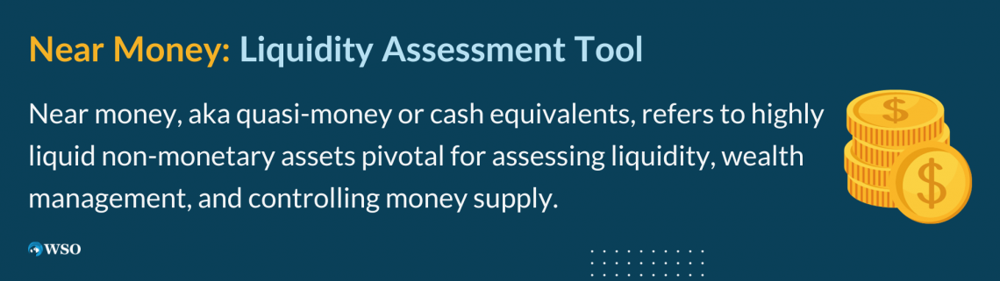

## Table of Contents

## What does 'Near the Money' mean in options trading?

In options trading, 'Near the Money' refers to an option whose strike price is close to the current market price of the underlying asset. It's a term used to describe options that are neither significantly in-the-money nor out-of-the-money. For example, if a stock is trading at $50, an option with a strike price of $49 or $51 might be considered near the money.

This term is important because near-the-money options can be more sensitive to changes in the price of the underlying asset. Traders often look at these options because they can offer a good balance between cost and potential profit. The closer an option is to being at-the-money, the more its value can change with small movements in the stock price, making it a potentially attractive choice for certain trading strategies.

## How does being 'Near the Money' affect the pricing of an option?

When an option is 'Near the Money,' its price is more sensitive to changes in the price of the underlying asset. This is because near-the-money options have a higher delta, which means their value changes more for each small move in the stock price. Traders pay more attention to these options because they can offer a good balance between cost and potential profit. The closer the option's strike price is to the current market price, the more its value can change with small movements in the stock price.

The pricing of near-the-money options also depends on other factors like time until expiration and implied [volatility](/wiki/volatility-trading-strategies). Since these options are close to being at-the-money, they often have a higher time value compared to options that are far out-of-the-money. This means that as the expiration date approaches, the price of a near-the-money option can change more dramatically. Additionally, if the market expects big price swings in the underlying asset, the implied volatility will be higher, which can increase the price of near-the-money options.

## What is the difference between 'Near the Money', 'In the Money', and 'Out of the Money' options?

'Near the Money' options are those whose strike price is close to the current market price of the stock. Imagine if a stock is trading at $50, an option with a strike price of $49 or $51 might be considered near the money. These options are neither deep in the money nor deep out of the money. They are sensitive to small changes in the stock price, which can make them attractive for traders looking to balance cost and potential profit.

'In the Money' options are those that have intrinsic value. For a call option, this means the strike price is below the current market price of the stock. For example, if a stock is at $50, a call option with a strike price of $45 is in the money because you could buy the stock for $45 and immediately sell it for $50, making a profit. For a put option, it's the opposite; the strike price is above the current market price. These options are valuable because they already have some worth even if the stock price doesn't move.

'Out of the Money' options, on the other hand, have no intrinsic value. For a call option, this means the strike price is above the current market price of the stock. Using the same example, if the stock is at $50, a call option with a strike price of $55 is out of the money because exercising it would result in a loss. For a put option, it's when the strike price is below the current market price. These options are cheaper to buy but rely on the stock price moving in the right direction before they become profitable.

## Can you explain the mechanics of how 'Near the Money' options work?

When you talk about 'Near the Money' options, you're looking at options that have a strike price close to the current price of the stock. Let's say a stock is trading at $50. An option with a strike price of $49 or $51 would be near the money. These options are interesting because they're not too far away from where the stock is trading right now. They're not deep in the money, where you could make money right away, and they're not deep out of the money, where you'd need a big move in the stock price to make any money.

The price of a near-the-money option can change a lot with small moves in the stock price. This is because they have a high delta, which means their value goes up or down more for each small change in the stock price. These options are often more expensive than options that are far out of the money because they have a higher chance of ending up in the money by the time they expire. Traders like near-the-money options because they can offer a good balance between cost and potential profit. As the expiration date gets closer, the price of these options can change even more, making them a bit of a roller coaster to trade.

## What are the advantages of trading 'Near the Money' options?

Trading 'Near the Money' options can be a good choice because they offer a nice balance between cost and potential profit. These options are not too expensive like deep in-the-money options, but they also have a better chance of making money than options that are far out of the money. This means you don't have to spend a lot of money to buy them, but you still have a good shot at making a profit if the stock price moves in the right direction.

Another advantage is that near-the-money options are very sensitive to changes in the stock price. This means their value can go up or down a lot with small moves in the stock. Traders like this because it can lead to bigger profits if they guess the direction of the stock price correctly. Plus, these options can be a good choice if you think the stock will move a bit but not a lot, because they can still make money even with smaller price changes.

## What are the risks associated with 'Near the Money' options?

Trading 'Near the Money' options can be risky because they can lose value quickly if the stock price doesn't move in the right direction. These options are sensitive to small changes in the stock price, which means if the stock goes the wrong way, even a little bit, the option can lose a lot of its value fast. This can be a problem if you're not watching the market closely or if you're not ready to make quick decisions.

Another risk is that near-the-money options can be expensive compared to options that are far out of the money. You're paying more for the chance that the stock will move in your favor, but if it doesn't, you could lose all the money you spent on the option. As the expiration date gets closer, the time value of these options goes down, which can make them lose value even if the stock price stays the same. This means you need to be right about the direction and timing of the stock's move to make money.

## How does the time to expiration influence 'Near the Money' options?

The time to expiration plays a big role in how 'Near the Money' options work. When an option is near the money, it means its strike price is close to the current price of the stock. These options have a lot of time value, which means part of their price comes from the time left until they expire. The more time there is until expiration, the more time value the option has. This is because there's more chance for the stock price to move in the right direction and make the option worth more money.

As the expiration date gets closer, the time value of near-the-money options starts to go down. This can make the option lose value even if the stock price stays the same. Traders need to be careful because if the stock doesn't move in the right direction before the option expires, they could lose all the money they spent on it. So, the time to expiration is important because it affects how much the option is worth and how much risk there is in trading it.

## What role does implied volatility play in 'Near the Money' options?

Implied volatility is a big deal when you're looking at 'Near the Money' options. It's like a guess about how much the stock price might move up or down in the future. When implied volatility is high, it means people think the stock could have big swings in price. This makes near-the-money options more expensive because there's a bigger chance they'll end up being worth something by the time they expire. So, if the market is expecting a lot of ups and downs, you'll pay more for these options.

On the other hand, when implied volatility is low, it means people think the stock will stay pretty steady. This makes near-the-money options cheaper because there's less chance of a big price move that could make them worth more. Traders need to keep an eye on implied volatility because it can change how much they pay for an option and how much they might make if the stock price moves in the right direction.

## How can traders use 'Near the Money' options in their strategies?

Traders can use 'Near the Money' options to make money if they think the stock price will move a little bit but not a lot. These options are a good choice because they're not too expensive, but they still have a good chance of making money if the stock goes up or down just a bit. For example, if a trader thinks a stock that's at $50 will go up to $52, they might buy a call option with a strike price of $51. This option is near the money and could make money if the stock hits $52, but it won't cost as much as a call option with a strike price of $45, which is deep in the money.

Another way traders use near-the-money options is to hedge their bets. If a trader owns a stock and is worried it might go down a bit, they can buy a put option with a strike price close to the current stock price. This can help protect their investment if the stock does drop. Near-the-money options are sensitive to small changes in the stock price, so they can be a good tool for managing risk. Traders need to watch the market closely and be ready to act quickly because these options can lose value fast if the stock doesn't move in the right direction.

## What are some common mistakes to avoid when trading 'Near the Money' options?

One common mistake when trading 'Near the Money' options is not paying attention to the time until the option expires. These options can lose value quickly as the expiration date gets closer, even if the stock price stays the same. Traders need to keep an eye on the calendar and make sure they have a plan for what to do if the stock doesn't move in the right direction before the option expires.

Another mistake is not considering the implied volatility of the stock. If the market expects big price swings, near-the-money options can be more expensive. Traders might pay too much for these options and then lose money if the stock doesn't move as much as expected. It's important to understand how implied volatility can affect the price of the option and make sure you're not overpaying for it.

## How do market conditions affect the performance of 'Near the Money' options?

Market conditions can really change how 'Near the Money' options do. If the market is calm and the stock prices are not moving a lot, these options might not make much money. They are sensitive to small changes in the stock price, so if the stock stays the same, the options can lose value as time goes by. Traders need to watch the market and be ready to act if they think the stock will stay steady.

On the other hand, if the market is wild and stock prices are jumping around a lot, near-the-money options can do well. When there's a lot of action in the market, these options can go up in value quickly because they have a better chance of ending up in the money. But traders need to be careful because if the stock moves the wrong way, the options can lose value fast too. So, understanding the market conditions is important for trading these options.

## What advanced techniques can be used to optimize trading 'Near the Money' options?

One advanced technique for trading 'Near the Money' options is to use delta hedging. Delta is a measure of how much the option's price will change for each small move in the stock price. By buying or selling the stock in the right amounts, traders can balance out the risk of the option. This can help them make money if the stock moves a little bit, but it takes some math and watching the market closely.

Another technique is to use options spreads, like a butterfly spread or a condor spread. These strategies involve buying and selling multiple near-the-money options at different strike prices. They can help traders make money if the stock stays in a certain range, but they can be tricky to set up and manage. Traders need to understand how these spreads work and be ready to adjust them if the market changes.

## References & Further Reading

[1]: Bergstra, J., Bardenet, R., Bengio, Y., & Kégl, B. (2011). ["Algorithms for Hyper-Parameter Optimization."](https://papers.nips.cc/paper/4443-algorithms-for-hyper-parameter-optimization) Advances in Neural Information Processing Systems 24.

[2]: ["Advances in Financial Machine Learning"](https://www.amazon.com/Advances-Financial-Machine-Learning-Marcos/dp/1119482089) by Marcos Lopez de Prado

[3]: ["Evidence-Based Technical Analysis: Applying the Scientific Method and Statistical Inference to Trading Signals"](https://www.amazon.com/Evidence-Based-Technical-Analysis-Scientific-Statistical/dp/0470008741) by David Aronson

[4]: ["Machine Learning for Algorithmic Trading"](https://github.com/stefan-jansen/machine-learning-for-trading) by Stefan Jansen

[5]: ["Quantitative Trading: How to Build Your Own Algorithmic Trading Business"](https://www.amazon.com/Quantitative-Trading-Build-Algorithmic-Business/dp/1119800064) by Ernest P. Chan