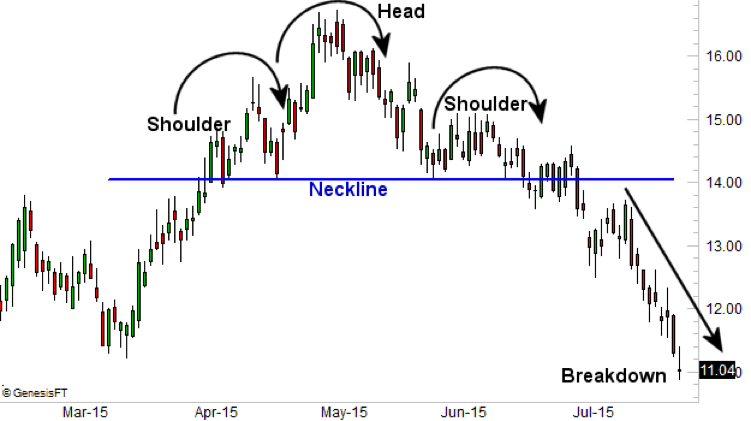

## Table of Contents

## What is a neckline in technical analysis?

A neckline in technical analysis is a line drawn on a chart that connects the lows of a price pattern, often seen in head and shoulders patterns. It acts like a support level where the price might bounce back up or break through, signaling a possible trend change. Traders watch the neckline closely because it can help them decide when to buy or sell.

When the price breaks below the neckline in a head and shoulders pattern, it usually means the price will keep falling. This break is a signal for traders to sell their stocks or go short. On the other hand, if the price bounces off the neckline and goes up, it might mean the price will keep rising, and traders might see this as a good time to buy.

## How is a neckline identified on a price chart?

To find a neckline on a price chart, you need to look at the lows of the price pattern. For example, in a head and shoulders pattern, you draw a line connecting the lowest points on either side of the "head." These low points are usually found at the bottoms of the "shoulders." The line you draw between these points is the neckline. It acts like a floor that the price might hit and bounce off of or break through.

The neckline is important because it helps traders know when the price might change direction. If the price drops below the neckline, it's a sign that the price might keep going down. This is a signal for traders to sell their stocks or start betting that the price will go down. If the price hits the neckline but then goes back up, it might mean the price will keep rising. Traders might see this as a good time to buy stocks.

## What are the different types of patterns that use a neckline?

The main pattern that uses a neckline is the head and shoulders pattern. This pattern looks like a person's head with two shoulders. It has three peaks: two smaller ones on the sides (the shoulders) and a bigger one in the middle (the head). The neckline is drawn by connecting the lowest points between the shoulders. If the price breaks below this neckline, it usually means the price will keep going down. If the price bounces off the neckline and goes up, it might mean the price will keep rising.

Another pattern that uses a neckline is the inverse head and shoulders pattern. This pattern is the opposite of the head and shoulders pattern and looks like an upside-down person. It has three troughs: two smaller ones on the sides and a bigger one in the middle. The neckline is drawn by connecting the highest points between the shoulders. If the price breaks above this neckline, it usually means the price will keep going up. If the price hits the neckline but then goes back down, it might mean the price will keep falling.

These patterns are important for traders because they help predict when the price might change direction. By watching the neckline, traders can decide when to buy or sell their stocks.

## How does a neckline help in predicting price movements?

A neckline helps in predicting price movements by acting like a boundary line on a chart. When you see a head and shoulders pattern, the neckline is drawn by connecting the lows between the shoulders. If the price breaks below this neckline, it's a sign that the price might keep going down. Traders use this as a signal to sell their stocks or start betting that the price will drop. On the other hand, if the price hits the neckline but then bounces back up, it might mean the price will keep rising, and traders might see this as a good time to buy.

For an inverse head and shoulders pattern, the neckline works in the opposite way. It's drawn by connecting the highs between the shoulders. If the price breaks above this neckline, it's a sign that the price might keep going up. Traders use this as a signal to buy stocks or start betting that the price will rise. If the price hits the neckline but then goes back down, it might mean the price will keep falling, and traders might see this as a time to sell. By watching the neckline, traders can make better guesses about where the price might go next.

## What is the significance of a neckline break in trading?

A neckline break is a big deal in trading because it tells traders that the price might be about to change direction. In a head and shoulders pattern, if the price goes below the neckline, it's a sign that the price might keep going down. Traders see this as a signal to sell their stocks or start betting that the price will drop. It's like a warning that the current trend might be over, and a new trend might be starting.

In an inverse head and shoulders pattern, a neckline break works the other way around. If the price goes above the neckline, it's a sign that the price might keep going up. Traders see this as a signal to buy stocks or start betting that the price will rise. It's like a green light that the price might be starting a new upward trend. By watching for these neckline breaks, traders can make better decisions about when to buy or sell.

## Can a neckline be used in both bullish and bearish market scenarios?

Yes, a neckline can be used in both bullish and bearish market scenarios. In a bearish scenario, you see it in the head and shoulders pattern. This pattern looks like a person's head with two shoulders. The neckline is a line you draw connecting the lowest points between the shoulders. If the price drops below this neckline, it's a sign that the price might keep going down. Traders see this as a time to sell their stocks or bet that the price will fall.

In a bullish scenario, the neckline is used in the inverse head and shoulders pattern. This pattern looks like an upside-down person. The neckline here is a line you draw connecting the highest points between the shoulders. If the price goes above this neckline, it's a sign that the price might keep going up. Traders see this as a good time to buy stocks or bet that the price will rise. So, by watching the neckline, traders can make decisions about buying or selling in both types of markets.

## How reliable is the neckline as a trading signal?

The neckline can be a helpful signal for traders, but it's not perfect. When the price breaks through the neckline in a head and shoulders pattern, it often means the price will keep going down. In an inverse head and shoulders pattern, if the price goes above the neckline, it usually means the price will keep going up. Traders use these signals to decide when to buy or sell. But sometimes, the price might break the neckline and then quickly go back to where it was before, which can trick traders.

How well the neckline works depends on things like how clear the pattern is and how much the price moves when it breaks the neckline. If the pattern is easy to see and the price moves a lot after breaking the neckline, the signal is more likely to be right. But if the pattern is hard to see or the price doesn't move much, the signal might not be as good. Traders need to use other tools and information along with the neckline to make better guesses about where the price might go next.

## What are common mistakes traders make when using the neckline?

One common mistake traders make when using the neckline is jumping into a trade too early. When the price first touches or breaks the neckline, some traders might think it's a sure sign to buy or sell. But sometimes, the price can break the neckline and then quickly go back to where it was before. This can trick traders into making bad trades. It's better to wait and see if the price keeps moving in the same direction after breaking the neckline to make sure the signal is real.

Another mistake is not using other tools along with the neckline. The neckline can be a good hint about where the price might go, but it's not perfect. Traders should also look at other things like moving averages, [volume](/wiki/volume-trading-strategy), and other chart patterns to get a better idea of what might happen next. Relying only on the neckline can lead to wrong guesses about the market. By using more tools, traders can make smarter choices about when to buy or sell.

## How can the neckline be integrated with other technical indicators for better results?

Using the neckline along with other technical indicators can help traders make better guesses about where the price might go next. One way to do this is by looking at the volume when the price breaks the neckline. If the price breaks the neckline and the volume goes up a lot, it's a stronger sign that the price will keep moving in that direction. Traders can also use moving averages to see if the price is following a trend. If the price breaks the neckline and it's also moving away from a moving average, it can be a good time to buy or sell.

Another useful tool to use with the neckline is the Relative Strength Index (RSI). The RSI helps traders see if a stock is overbought or oversold. If the price breaks the neckline and the RSI shows the stock is overbought or oversold, it can give traders more confidence in their decision to buy or sell. By combining the neckline with these other indicators, traders can get a fuller picture of what the market might do next and make smarter choices about their trades.

## What are advanced strategies for trading based on neckline formations?

One advanced strategy for trading based on neckline formations is to use the neckline break as a trigger but wait for confirmation before making a trade. When the price breaks the neckline, traders can wait for a retest of the neckline to see if it holds as a new support or resistance level. If the price bounces off the neckline and continues in the direction of the break, it confirms the trend change, giving traders a better chance of making a successful trade. This method helps avoid false breaks, where the price breaks the neckline but then quickly reverses.

Another strategy is to combine the neckline with other technical indicators like the Moving Average Convergence Divergence (MACD) or the Relative Strength Index (RSI). For example, if the price breaks the neckline in a head and shoulders pattern and the MACD shows a bearish crossover, it strengthens the signal that the price might keep falling. Similarly, if the price breaks the neckline in an inverse head and shoulders pattern and the RSI indicates the stock is oversold, it can be a strong sign to buy. By using these additional tools, traders can increase their confidence in the neckline signal and make more informed trading decisions.

## How does the volume of trades affect the validity of a neckline break?

The volume of trades can tell you a lot about how strong a neckline break is. When the price breaks the neckline and the volume goes up a lot, it means more people are trading, and it's a stronger sign that the price will keep moving in that direction. If the volume stays the same or goes down when the price breaks the neckline, it might mean the break isn't as strong, and the price could go back to where it was before.

Traders watch volume closely because it helps them decide if they should trust the neckline break. If you see a big jump in volume when the price breaks the neckline, it's like a lot of people agreeing that the price should keep going that way. But if the volume doesn't change much, it's like fewer people are sure about the price moving, so traders might wait to see what happens next before making a move.

## What historical examples illustrate successful trades based on neckline analysis?

In 2007, a lot of traders used neckline analysis to make money when the stock market started to go down. They saw a head and shoulders pattern on the S&P 500 chart. The neckline was a line that connected the lows between the shoulders. When the price broke below this neckline, traders sold their stocks or bet that the price would keep falling. The volume of trades went up a lot when the price broke the neckline, which made the signal even stronger. Many traders made good money by following this signal and getting out of the market before it crashed.

Another example happened in 2016 with the stock of Netflix. Traders saw an inverse head and shoulders pattern on the chart. The neckline was a line that connected the highs between the shoulders. When the price broke above this neckline, traders bought the stock or bet that the price would keep going up. The volume of trades also went up a lot when the price broke the neckline, which showed that a lot of people believed the price would keep rising. Many traders made good money by buying Netflix stock at that time and holding onto it as the price kept going up.

## References & Further Reading

[1]: Bergstra, J., Bardenet, R., Bengio, Y., & Kégl, B. (2011). ["Algorithms for Hyper-Parameter Optimization."](https://dl.acm.org/doi/10.5555/2986459.2986743) Advances in Neural Information Processing Systems 24.

[2]: ["Advances in Financial Machine Learning"](https://www.amazon.com/Advances-Financial-Machine-Learning-Marcos/dp/1119482089) by Marcos Lopez de Prado

[3]: ["Evidence-Based Technical Analysis: Applying the Scientific Method and Statistical Inference to Trading Signals"](https://www.amazon.com/Evidence-Based-Technical-Analysis-Scientific-Statistical/dp/0470008741) by David Aronson

[4]: ["Machine Learning for Algorithmic Trading"](https://github.com/stefan-jansen/machine-learning-for-trading) by Stefan Jansen

[5]: ["Quantitative Trading: How to Build Your Own Algorithmic Trading Business"](https://github.com/LucindaYa/quant-resources/blob/master/Quantitative%20Trading%20How%20to%20Build%20Your%20Own%20Algorithmic%20Trading%20Business.pdf) by Ernest P. Chan