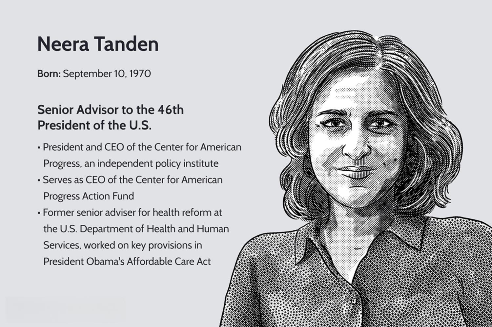

Neera Tanden is a prominent political figure in the United States, currently serving as the Director of the Domestic Policy Council under the Biden administration. With a career that includes significant roles in multiple Democratic administrations, Tanden has established herself as a key player in shaping national policies. Her contributions date back to the Clinton administration and extend through to the Obama years, reflecting her deep influence and commitment to public service. Beyond her roles in government, Tanden has been at the helm of influential think tanks such as the Center for American Progress, where her work in progressive policy advocacy solidified her reputation as a leading thinker in political strategy and policy formulation.

This article explores Tanden's political trajectory, tracing her path from her early involvement in Democratic politics to her current position within the Biden administration. Her extensive experience and strategic acumen have made her an integral part of the President's team, where she directly influences the policy agenda. The examination further investigates into Tanden's perspective on algorithmic trading, a new financial technology trend that is revolutionizing financial markets. As the intersection of technology and policy becomes increasingly significant, Tanden's insights and advocacy for regulatory frameworks that balance innovation with public interest emerge as pivotal elements of her influence in contemporary policy-making.



## Table of Contents

## Neera Tanden's Political Career

Neera Tanden, born in 1970 in Bedford, Massachusetts, has carved a significant path in American politics, particularly within the Democratic party. Her academic journey took her to the University of California, Los Angeles (UCLA), where she earned her undergraduate degree, followed by a law degree from Yale Law School.

Tanden's political involvement began with grassroots campaign work for Michael Dukakis in the 1988 U.S. presidential election. This early exposure to political campaigning set the stage for her future roles in more prominent Democratic campaigns, including those of Bill Clinton and Barack Obama. Her connections and influence within the Democratic circles grew alongside her career.

During the Clinton administration, Tanden played a pivotal role in healthcare and domestic policy initiatives. Her work focused on developing and promoting policies that aimed to uphold and expand public health and welfare services. This period was crucial for establishing her credentials and expertise in policy-making, particularly in areas affecting the American healthcare system.

Following her time in the Clinton administration, Tanden held the position of President and CEO of the Center for American Progress (CAP), a leading progressive policy institute. Under her leadership, the organization tackled a wide array of issues, including economic reform, healthcare, education, and civil rights. At CAP, Tanden became a prominent voice advocating for progressive policies, cementing her status as an influential thinker and strategist in policy advocacy. Through her efforts, CAP positioned itself as an instrumental platform in shaping and promoting a progressive agenda within the broader political discourse.

Neera Tanden's political career reflects her deep commitment to the Democratic ideals and her influence in shaping progressive policies within the United States. Her journey from campaign work to key positions in influential policy circles underscores her impact and the respect she commands in political and academic domains.

## Roles in the Biden Administration

In 2021, Neera Tanden was brought into the Biden administration as a senior advisor, a role that set the stage for her subsequent appointment as the Director of the Domestic Policy Council in 2023. This position entrusts her with significant responsibility in shaping and implementing domestic policies, placing her at the core of President Biden’s policy-making framework. Her influence is particularly notable in areas where policy decisions intersect with social justice, healthcare reform, and economic equity, aligning with the broader goals of the administration to enhance the welfare of American citizens.

Tanden's journey to this influential role was not without challenges. Her initial nomination by President Biden for the position of Director of the Office of Management and Budget (OMB) was met with controversy, resulting in her withdrawal from the nomination process. The opposition primarily stemmed from criticisms around past statements she made on social media, which drew bipartisan scrutiny. Despite this setback, her expertise and longstanding commitment to progressive policies ensured her continued prominence in the administration's strategic framework.

Through her work on the Domestic Policy Council, Tanden remains a central figure in Biden’s political strategy, striving to drive policies that are both forward-thinking and inclusive. Her active involvement in crafting policies underscores her critical role in translating the administration’s domestic agenda into actionable and effective programs.

## Algorithmic Trading: A Brief Overview

Algorithmic trading, often referred to as algo trading, leverages computer algorithms to execute financial transactions at speeds and frequencies that surpass human capability. These algorithms are programmed to follow specified instructions—such as timing, price, or quantity—that enable the automation of trading processes. This methodology is revolutionizing financial markets by enhancing operational efficiency and improving market [liquidity](/wiki/liquidity-risk-premium).

One of the primary advantages of [algorithmic trading](/wiki/algorithmic-trading) is its ability to eliminate human errors associated with manual trading. By relying on pre-defined criteria, algo trading ensures decisions are made systematically and quickly, which is critical in the highly volatile environments of financial markets.

Algorithmic trading encompasses a variety of strategies, each designed to capitalize on different market conditions. High-frequency trading ([HFT](/wiki/high-frequency-trading-strategies)) represents a subset of algorithmic trading characterized by large volumes of transactions executed in microseconds. HFT strategies aim to profit from small price discrepancies, often leveraging powerful computing systems and complex algorithms to gain a competitive edge. 

Another common strategy is statistical [arbitrage](/wiki/arbitrage), which involves making trades based on statistical models that suggest a security is mispriced relative to its historical average or another correlated asset. This strategy relies on mean-reversion theories and quantitative models to identify and act on short-term profitable opportunities.

The coding of these strategies can vary in complexity, but often involves statistical software and programming languages such as Python. Here is a simple example of a moving average crossover strategy in Python, often used in algorithmic trading:

```python
import pandas as pd

# Load historical price data
data = pd.read_csv('historical_prices.csv')
prices = data['Close']

# Calculate moving averages
short_window = 40
long_window = 100
signals = pd.DataFrame(index=data.index)
signals['Signal'] = 0.0
signals['Short_MA'] = prices.rolling(window=short_window, min_periods=1, center=False).mean()
signals['Long_MA'] = prices.rolling(window=long_window, min_periods=1, center=False).mean()

# Generate signals
signals['Signal'][short_window:] = np.where(signals['Short_MA'][short_window:] > signals['Long_MA'][short_window:], 1.0, 0.0)   
signals['Positions'] = signals['Signal'].diff()

# Display signals DataFrame
print(signals)
```

This simple moving average crossover algorithm buys a security when the short-term moving average rises above the long-term moving average, and sells when the opposite occurs. By automating such transactions, traders aim to exploit these crossover points promptly to maximize profits.

Algorithmic trading continues to reshape financial landscapes, proving instrumental in driving the evolution of modern trading practices through enhanced speed, reduced costs, and increased precision in executing strategies.

## Neera Tanden's Perspective on Financial Technology

As a policy advisor, Neera Tanden holds significant sway over how emerging financial technologies, such as algorithmic trading, are perceived and regulated within the political sphere. Her tenure at the Center for American Progress showcased her dedication to marrying progressive policy with technological progress. Tanden emphasized the need for regulatory frameworks that ensure technological advancements in finance operate in the public interest while maintaining market integrity.

Algorithmic trading, which utilizes complex algorithms for executing trades at unprecedented speeds, poses unique challenges and opportunities. Tanden's approach stresses the importance of regulatory oversight to prevent potential market abuses, such as those deriving from high-frequency trading and insider information misuse. She argues for a balance where innovation does not lead to economic disparities or vulnerabilities in financial systems.

Tanden's advocacy for a regulatory approach is intended to create a level playing field. This involves crafting policies that mitigate systemic risks and protect consumers. By promoting transparency and accountability in algorithmic operations, Tanden supports technological growth that aligns with broader societal goals. Her vision reflects an understanding that while financial markets can benefit greatly from technological advancements, there is an imperative to safeguard public interest and economic stability. 

Her stance is therefore not one of hindrance, but of cautious advancement, ensuring that the rapid pace of financial innovation does not outstrip the regulatory capacity to manage it effectively. By championing frameworks that anticipate and mitigate possible negative impacts of algorithmic trading, Tanden plays a crucial role in shaping policies that strive for a well-regulated and equitable financial landscape.

## Tanden's Influence on Policy and Financial Markets

Neera Tanden exerts significant influence on the Biden administration's policy-making process, particularly in the area of financial technology regulations. Given her extensive background in progressive policy advocacy and her pivotal role in the administration, Tanden is strategically positioned to impact the formulation of regulations surrounding emerging financial technologies, including fintech and algorithmic trading.

Her strategic input is directed towards achieving a balance between fostering economic growth and maintaining sustainable financial practices. This entails advocating for regulatory frameworks that ensure innovations in financial technology do not undermine market integrity or public interest. Tanden emphasizes the importance of integrating advanced technologies within the broader context of economic policy while addressing potential risks to ensure a resilient financial system.

Tanden's ability to adapt to and influence the rapidly evolving landscape of financial technology is demonstrated through her engagement with various stakeholders in the policy-making process. Her initiatives often include consulting with industry experts, technologists, and policymakers to develop a comprehensive understanding of the implications of new technologies. This collaborative approach ensures that policies are well-informed and forward-thinking, catering to the dynamic nature of financial markets.

The challenges associated with regulating algorithmic trading and fintech innovations are complex, often requiring nuanced policy solutions that can accommodate technological advancements. Tanden's experience and insight enable her to navigate these complexities effectively, contributing to policy solutions that encourage innovation while safeguarding economic stability and security. Her leadership is critical to shaping an environment where technological progress can occur alongside robust regulatory oversight, ensuring the U.S. financial markets remain competitive and secure.

## Conclusion

Neera Tanden's career exemplifies her unwavering commitment to progressive policy-making and governmental leadership. Her extensive experience across various Democratic administrations, including roles under Presidents Clinton, Obama, and currently Biden, underscores her crucial influence over domestic policy agendas. As the Director of the Domestic Policy Council, Tanden plays a pivotal role in steering the Biden administration's domestic policies, positioning her at the juncture where policy formulation meets implementation.

In an era where financial technologies like algorithmic trading are rapidly advancing, Tanden's perspective and advocacy are integral to ensuring these innovations are harnessed for public benefit. Her support for regulatory frameworks aims to strike a balance between fostering innovation and maintaining market integrity, a necessity in the dynamic landscape of financial markets. Her involvement in shaping these frameworks is not merely reactive but proactive, as she seeks to harmonize economic growth with sustainable practices.

Tanden's influence is indicative of her ability to adapt to the evolving needs of governance and finance, illustrating her effectiveness in shaping policies that address contemporary challenges while upholding progressive values. Her leadership is likely to continue guiding significant discussions and decisions surrounding financial technology and policy, reflecting her enduring impact on the fabric of American political and economic life.

## References & Further Reading

[1]: ["Advances in Financial Machine Learning"](https://www.amazon.com/Advances-Financial-Machine-Learning-Marcos/dp/1119482089) by Marcos Lopez de Prado

[2]: ["Evidence-Based Technical Analysis: Applying the Scientific Method and Statistical Inference to Trading Signals"](https://www.amazon.com/Evidence-Based-Technical-Analysis-Scientific-Statistical/dp/0470008741) by David Aronson

[3]: ["Machine Learning for Algorithmic Trading"](https://github.com/stefan-jansen/machine-learning-for-trading) by Stefan Jansen

[4]: ["Quantitative Trading: How to Build Your Own Algorithmic Trading Business"](https://www.amazon.com/Quantitative-Trading-Build-Algorithmic-Business/dp/1119800064) by Ernest P. Chan

[5]: ["The Evolution of Technical Analysis: Financial Prediction from Babylonian Tablets to Bloomberg Terminals"](https://archive.org/details/evolutionoftechn0000loan) by Andrew W. Lo and Jasmina Hasanhodzic

[6]: ["The Rise of the Network Society: The Information Age: Economy, Society, and Culture Volume I"](https://onlinelibrary.wiley.com/doi/book/10.1002/9781444319514) by Manuel Castells

[7]: ["High-Frequency Trading: A Practical Guide to Algorithmic Strategies and Trading Systems"](https://www.ahmetbeyefendi.com/wp-content/uploads/2020/07/High-Frequency-Trading-Irene-Aldridge.pdf) by Irene Aldridge