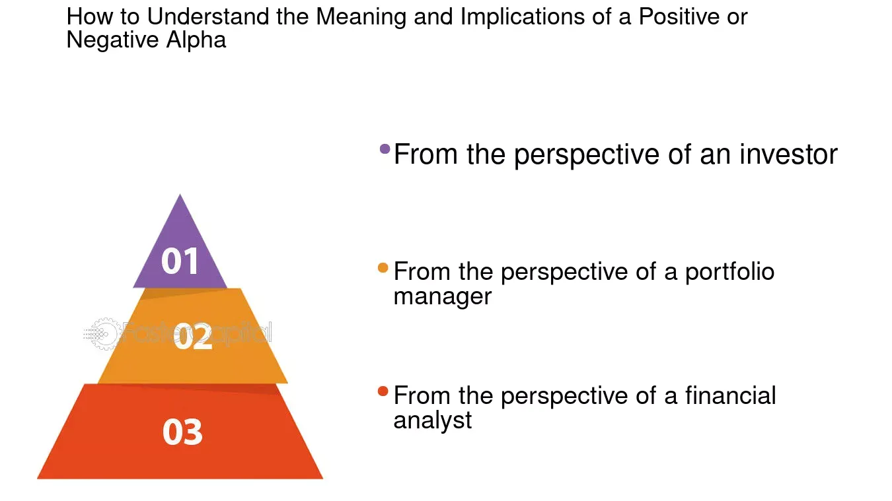

## Table of Contents

## What is alpha in the context of investments?

In the world of investments, alpha refers to the measure of an investment's performance compared to a benchmark index, like the S&P 500. It shows how much better or worse an investment is doing than the market as a whole. If an investment has a positive alpha, it means it's outperforming the market. A negative alpha means it's underperforming.

Think of alpha as a way to see if a fund manager or an investment strategy is adding value. For example, if you invest in a mutual fund and it earns a return of 10% while the market only goes up by 8%, the alpha would be positive, showing that the fund did better than expected. This can be important for investors looking to pick the best funds or strategies to grow their money.

## How is negative alpha defined?

Negative alpha means an investment is not doing as well as the overall market. If you put your money into a fund or a stock, and it grows slower than the market average, that's when you see a negative alpha. For example, if the market goes up by 10% but your investment only goes up by 7%, you have a negative alpha of 3%.

This can be disappointing because it shows that the investment isn't beating the market. It's like if you're in a race and everyone else is running faster than you. Investors often look for positive alpha because it means their money is working harder than if they just followed the market. A negative alpha can make people think about changing their investment choices to find something that might do better.

## What does a negative alpha indicate about an investment's performance?

A negative alpha means that an investment is not doing as well as the overall market. If the market goes up by a certain amount, but your investment grows less than that, you have a negative alpha. For example, if the market goes up by 10% and your investment only goes up by 8%, the alpha is negative by 2%.

This can be a sign that the investment isn't performing as well as it could. It shows that the fund manager or the strategy you're using isn't beating the market. When investors see a negative alpha, they might think about changing their investments to find something that could do better and help their money grow more.

## Can you explain the impact of negative alpha on portfolio returns?

When an investment has a negative alpha, it means it's not doing as well as the market. If you have a lot of these investments in your portfolio, it can drag down your overall returns. Imagine you're trying to grow your money, but some parts of your portfolio are not keeping up with the market. This can make it harder for your whole portfolio to do well.

For example, if the market goes up by 10% in a year, but an investment with a negative alpha only goes up by 5%, that investment is pulling your portfolio's performance down. Over time, this can add up and make a big difference in how much money you make. That's why investors often look for investments with a positive alpha, to help their portfolio beat the market and grow more.

## How might negative alpha affect long-term investment strategies?

Negative alpha can really change how you plan your long-term investments. If you have investments that keep doing worse than the market, it can slow down how much your money grows over the years. Imagine saving for something big like retirement, but some of your investments are not keeping up. This means you might not have as much money as you hoped when you need it. So, it's important to keep an eye on your investments and see if they're doing well or if you need to switch some of them to ones that might do better.

Over time, even a small negative alpha can add up and make a big difference. If your portfolio keeps falling behind the market, you might need to change your strategy. This could mean looking for new investments that have a better chance of beating the market, or maybe even working with a financial advisor to help you pick better options. The goal is to make sure your long-term plans stay on track, and dealing with negative alpha is a big part of that.

## What are common causes of negative alpha in investment portfolios?

Negative alpha in investment portfolios can happen for a few reasons. One big reason is [picking](/wiki/asset-class-picking) the wrong investments. If you choose stocks or funds that don't do as well as the market, your portfolio will have a negative alpha. Sometimes, this happens because the companies you invest in face problems like bad management or losing money. Other times, it's because the whole industry they're in is struggling.

Another reason for negative alpha is high fees. If you pay a lot to invest, like high management fees for a mutual fund, it can eat into your returns. Even if the investments themselves do okay, the fees can make your overall performance worse than the market. It's important to keep an eye on how much you're paying to invest because those costs can add up over time.

Lastly, bad timing can lead to negative alpha. If you buy investments when they're too expensive or sell them when they're too cheap, you might end up losing money compared to the market. Trying to guess the right time to buy and sell is hard, and getting it wrong can hurt your portfolio's performance. It's often better to have a long-term plan and stick with it rather than trying to time the market.

## How can investors identify negative alpha in their investments?

To spot negative alpha in your investments, you need to compare how your investments are doing with how the overall market is doing. You can do this by looking at the returns of your investments and then seeing how they stack up against a benchmark like the S&P 500. If your investments are growing slower than the market, you have a negative alpha. For example, if the market goes up by 10% in a year and your investment only goes up by 7%, then you have a negative alpha of 3%.

Another way to find negative alpha is by using tools and resources from financial websites or investment platforms. These tools can help you calculate alpha by taking into account the returns of your portfolio and the returns of the market. If the number you get is negative, it means your investments are not keeping up with the market. Watching your investments regularly and using these tools can help you see if you need to make changes to improve your portfolio's performance.

## What strategies can be used to mitigate the effects of negative alpha?

One way to deal with negative alpha is to look at your investments and see which ones are not doing well. If you find some that keep falling behind the market, you might want to sell those and put your money into different investments that have a better chance of doing well. It's like picking the best players for your team. Another thing you can do is to make sure you're not paying too much in fees. High fees can eat into your returns and make your alpha negative, so choosing low-cost investments can help.

Another strategy is to not try to guess when to buy and sell investments. Trying to time the market can lead to bad decisions and negative alpha. Instead, stick to a long-term plan and keep your investments for a while. This can help you avoid the ups and downs of the market and give your investments a better chance to grow. Also, talking to a financial advisor can be helpful. They can look at your portfolio and give you advice on how to fix any problems and find investments that might do better.

## How do professional fund managers deal with negative alpha?

Professional fund managers keep a close eye on their investments to spot negative alpha. When they see that some investments are not doing as well as the market, they might decide to sell those investments. They look for new opportunities that could do better and help their fund beat the market. They also think about the fees they charge. If the fees are too high, it can make the fund's performance worse, so they try to keep costs down to help their investors.

Another thing fund managers do is stick to a long-term plan instead of trying to guess the best times to buy and sell. They know that trying to time the market can lead to bad decisions and negative alpha. By focusing on the long term, they give their investments a better chance to grow. Sometimes, they might even use special tools and models to help them understand why their fund is not doing well and what they can do to fix it.

## Can negative alpha be a signal for adjusting asset allocation?

Yes, negative alpha can be a sign that you need to change how you spread your money across different investments. If you see that some parts of your portfolio are not doing as well as the market, it might be time to move your money around. For example, if your stocks are not keeping up with the market but your bonds are doing okay, you might want to put more money into bonds or look for different stocks that could do better.

Adjusting your asset allocation can help you get back on track and maybe even beat the market. It's like balancing your team to make sure everyone is playing their best. By moving your money from investments with negative alpha to ones that might have a positive alpha, you give your portfolio a better chance to grow over time. Keeping an eye on your investments and being ready to make changes can really help in the long run.

## What role does risk-adjusted performance play in understanding negative alpha?

When you look at negative alpha, it's important to think about risk-adjusted performance. This means you're not just looking at how much money you're making, but also how much risk you're taking to make that money. If an investment has a negative alpha, it's doing worse than the market. But if it's also taking less risk, then maybe it's not so bad. You need to see if the investment is losing money because it's too safe or because it's not a good pick.

Risk-adjusted performance helps you understand if the negative alpha is a real problem or just a sign that you're playing it safe. For example, if your investment is in a very safe place like government bonds and it has a negative alpha compared to the stock market, that might be okay because you're not taking as much risk. But if your investment is in stocks and it's still doing worse than the market, then you might need to make some changes. It's all about balancing how much you're making with how much risk you're taking.

## How can advanced quantitative models help in predicting and managing negative alpha?

Advanced quantitative models can help investors see negative alpha coming before it happens. These models use math and data to look at how investments have done in the past and guess how they might do in the future. They can spot patterns that might mean an investment will start doing worse than the market. By using these models, investors can make changes to their portfolios before the negative alpha shows up, like selling investments that are about to do badly and buying ones that might do better.

Once negative alpha is in your portfolio, these models can also help you fix it. They can tell you which investments are dragging your portfolio down and suggest ways to make things better. For example, the models might show that certain stocks or funds are not worth keeping because they keep losing money compared to the market. By following the advice from these models, investors can move their money around to investments that have a better chance of beating the market and growing over time.

## What is the role of alpha in investment strategies?

Alpha is one of the most critical performance metrics in the evaluation of investment strategies, serving as a measure of an investment's return relative to a benchmark index. This concept aids investors in determining whether an asset has outperformed or underperformed against its expected performance as determined by the comparative benchmark. Mathematically, alpha ($\alpha$) is represented as:

$$
\alpha = R_i - (R_b + \beta_i \times (R_m - R_f))
$$

where $R_i$ is the expected return of the investment, $R_b$ is the risk-free rate, $R_m$ is the return of the market, and $\beta_i$ is the beta of the investment, representing its sensitivity to market movements. Positive alpha indicates that an investment has outperformed its benchmark, reflecting superior management decisions or inherent qualities of the asset that have driven returns beyond market expectations. Conversely, negative alpha suggests that the investment underperformed relative to the benchmark, indicating potentially ineffective investment decisions or adverse conditions affecting the asset.

Investors often utilize alpha as a pivotal tool for assessing the effectiveness of their investment strategies. By isolating the returns attributable to active management rather than market fluctuations, alpha provides a clearer picture of a portfolio manager's skill. This analysis is crucial in both individual security and portfolio contexts, enabling investors to evaluate if the value added through strategic decisions justifies the risk and cost associated with active management.

Understanding and measuring alpha is vital because it transcends mere performance evaluation. It enables investors to attribute performance to managerial decisions rather than market movements, thus offering insights into the intrinsic value created by the manager's strategies. Consequently, alpha acts not just as a metric of past performance but also as a guiding tool for future investment decisions, informing investors where to allocate resources to optimize returns. This deeper understanding of alpha's implications allows for more informed and strategic investment decisions, contributing to more effective portfolio management and enhanced financial outcomes.

## How can one balance risk and return in algorithmic trading?

Algorithmic trading employs sophisticated algorithms to execute trades by adhering to predefined parameters such as alpha and sell signals. The primary aim is to optimize trading strategies by balancing potential returns against risk exposure through data-driven insights. This analytical approach enables traders to leverage complex mathematical models to inform their decisions.

One of the critical elements in this process is the use of alpha, specifically negative alpha, which provides insights into underperforming assets relative to a benchmark. By systematically incorporating negative alpha into trading models, algorithmic systems can dynamically adjust strategies to mitigate losses and enhance overall portfolio performance. A key aspect of this is the capacity to preempt adjustments in asset allocation or selling strategies before the underperformance compounds into greater losses.

For instance, algorithmic models might use the Capital Asset Pricing Model (CAPM) as a foundation to evaluate expected returns relative to market risks and performance. The formula for alpha in this context can be expressed as:

$$
\alpha = R_i - [R_f + \beta_i \times (R_m - R_f)]
$$

Where:
- $R_i$ is the return of the investment.
- $R_f$ is the risk-free rate.
- $\beta_i$ is the beta of the investment relative to the market.
- $R_m$ is the market return.

Incorporating such calculations into algorithmic frameworks allows traders to precisely quantify the excess returns an asset has generated over the expected risk-adjusted return. When alpha turns negative, it signals that the asset is underperforming when adjusted for its risk, prompting a potential sell-off or reallocation depending on the broader strategy.

Python can be utilized to implement these models efficiently. Below is a simple illustration of how such calculations can be integrated into a trading system:

```python
def calculate_alpha(asset_return, risk_free_rate, beta, market_return):
    return asset_return - (risk_free_rate + beta * (market_return - risk_free_rate))

# Example usage
alpha = calculate_alpha(asset_return=0.08, risk_free_rate=0.02, beta=1.2, market_return=0.06)

if alpha < 0:
    print("Consider adjusting portfolio: Negative Alpha Detected.")
else:
    print("Portfolio performing as expected.")

```

Moreover, by continuously monitoring these metrics, [algorithmic trading](/wiki/algorithmic-trading) systems can rapidly respond to changing market conditions, thereby safeguarding the portfolio's return potential. This dynamic capability not only mitigates risk but also ensures that the trading strategy remains aligned with the investor's risk tolerance and market forecasts.

In conclusion, the integration of negative alpha in algorithmic trading serves as a pivotal tool to proactively manage underperforming assets, adjust strategies, and maintain an optimized balance between risk and return. This functionality underscores the importance of advanced algorithmic processes in the ever-evolving landscape of financial markets.

## References & Further Reading

[1]: ["Advances in Financial Machine Learning"](https://www.amazon.com/Advances-Financial-Machine-Learning-Marcos/dp/1119482089) by Marcos Lopez de Prado

[2]: ["Evidence-Based Technical Analysis: Applying the Scientific Method and Statistical Inference to Trading Signals"](https://www.amazon.com/Evidence-Based-Technical-Analysis-Scientific-Statistical/dp/0470008741) by David Aronson

[3]: ["Machine Learning for Algorithmic Trading"](https://github.com/stefan-jansen/machine-learning-for-trading) by Stefan Jansen

[4]: ["Quantitative Trading: How to Build Your Own Algorithmic Trading Business"](https://www.amazon.com/Quantitative-Trading-Build-Algorithmic-Business/dp/1119800064) by Ernest P. Chan

[5]: Fama, E. F., & French, K. R. (1993). ["Common risk factors in the returns on stocks and bonds."](https://www.sciencedirect.com/science/article/pii/0304405X93900235) Journal of Financial Economics, 33(1), 3-56. 

[6]: Jegadeesh, N., & Titman, S. (1993). ["Returns to buying winners and selling losers: Implications for stock market efficiency."](https://www.jstor.org/stable/2328882) The Journal of Finance, 48(1), 65-91.