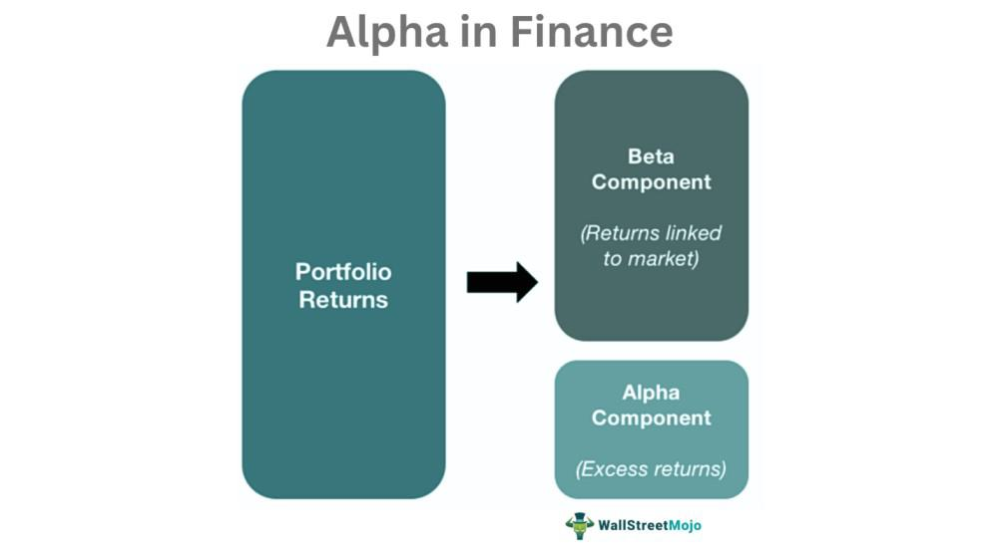

In today's fast-paced financial markets, effectively managing investments requires a keen understanding of various indicators. Among these indicators, alpha and sell signals are critical components of algorithmic trading strategies. Alpha is a measure of an investment's performance relative to a benchmark, often embodying the added value through investment decisions. Sell signals, on the other hand, are automated triggers that indicate when it is opportune to dispose of a security based on specific criteria and market conditions.

Algorithmic trading, which integrates these two elements, utilizes complex algorithms to execute trades systematically, aiming for optimized investment outcomes with minimal human intervention. The interaction between investment strategies and sell signals significantly influences negative alpha—a situation where the investment fails to meet the expected market returns. Understanding how negative alpha functions within an algorithmic trading context is pivotal, as it guides investment strategies and assists in refining trading models.



This article explores how negative alpha can act as a crucial input in investment decision-making processes. It provides insights into the implications of negative alpha, examining its potential as a sell signal in algorithmic trading ecosystems. By incorporating these elements into trading frameworks, investors can improve decision-making processes and enhance portfolio performance.

## Table of Contents

## Understanding Alpha in Investment Strategies

Alpha is one of the most critical performance metrics in the evaluation of investment strategies, serving as a measure of an investment's return relative to a benchmark index. This concept aids investors in determining whether an asset has outperformed or underperformed against its expected performance as determined by the comparative benchmark. Mathematically, alpha ($\alpha$) is represented as:

$$
\alpha = R_i - (R_b + \beta_i \times (R_m - R_f))
$$

where $R_i$ is the expected return of the investment, $R_b$ is the risk-free rate, $R_m$ is the return of the market, and $\beta_i$ is the beta of the investment, representing its sensitivity to market movements. Positive alpha indicates that an investment has outperformed its benchmark, reflecting superior management decisions or inherent qualities of the asset that have driven returns beyond market expectations. Conversely, negative alpha suggests that the investment underperformed relative to the benchmark, indicating potentially ineffective investment decisions or adverse conditions affecting the asset.

Investors often utilize alpha as a pivotal tool for assessing the effectiveness of their investment strategies. By isolating the returns attributable to active management rather than market fluctuations, alpha provides a clearer picture of a portfolio manager's skill. This analysis is crucial in both individual security and portfolio contexts, enabling investors to evaluate if the value added through strategic decisions justifies the risk and cost associated with active management.

Understanding and measuring alpha is vital because it transcends mere performance evaluation. It enables investors to attribute performance to managerial decisions rather than market movements, thus offering insights into the intrinsic value created by the manager's strategies. Consequently, alpha acts not just as a metric of past performance but also as a guiding tool for future investment decisions, informing investors where to allocate resources to optimize returns. This deeper understanding of alpha's implications allows for more informed and strategic investment decisions, contributing to more effective portfolio management and enhanced financial outcomes.

## The Role of Sell Signals in Algo Trading

Sell signals in [algorithmic trading](/wiki/algorithmic-trading) are automated triggers that alert traders to [exit](/wiki/exit-strategy) positions at the most opportune times. These signals are generated based on predefined criteria, typically utilizing a combination of technical indicators and quantitative models. The main goal is to optimize profits by exiting positions before substantial price declines occur, thereby limiting potential losses.

Technical indicators commonly used to generate sell signals include moving averages, Relative Strength Index (RSI), and Moving Average Convergence Divergence (MACD). For example, a simple moving average crossover strategy may trigger a sell signal when a short-term moving average crosses below a long-term moving average:

```python
def calculate_sma(data, window):
    return data.rolling(window=window).mean()

short_window = 20
long_window = 50

closing_prices = stock_data['Close']
short_sma = calculate_sma(closing_prices, short_window)
long_sma = calculate_sma(closing_prices, long_window)

sell_signals = (short_sma < long_sma) & (short_sma.shift(1) >= long_sma.shift(1))
```

These sell signals are more powerful when combined with quantitative models that incorporate alpha metrics. Alpha measures an investment's return relative to a benchmark, and in the context of algo trading, integrating sell signals with alpha metrics quantifies the impact of predicted market movements. This combination allows traders to make more informed decisions based on the performance of individual assets relative to the market.

The integration of these components enhances the reliability of sell signals, thereby improving the allocation of capital in automated trading systems. By precisely timing exits based on comprehensive market analysis, algo trading systems with sophisticated sell signals can react quickly to changes, ultimately optimizing the risk-adjusted returns of trading strategies.

## Negative Alpha: A Sell Signal or Not?

Negative alpha is frequently regarded as a clear indicator of an underperforming investment. Alpha, in this context, compares the performance of an investment to a market index or benchmark, reflecting the value added by the active management of a portfolio. A negative alpha arises when the investment performs worse than its benchmark, suggesting that the active management may not be successful in justifying the risk or the potential return.

However, relying solely on negative alpha as a sell signal can be misleading. It does not necessarily take into account broader investment strategy goals or current market conditions. For instance, during times of market [volatility](/wiki/volatility-trading-strategies) or downturns, even well-performing investments may show temporary negative alpha without warranting an immediate sell decision. It is essential to consider the context of the negative alpha, including the time frame of underperformance and the overall strategic objectives of the portfolio. A short-term dip in performance might be part of a larger strategy that anticipates long-term gains or involves counter-cyclical investment tactics.

In the case of diversified portfolios, negative alpha in a single asset or a sector might not indicate an immediate need to sell. Instead, it can serve as a prompt to reassess asset allocation. Diversification aims to spread risk across different assets, reducing the impact of any single underperformer. Therefore, a strategic review might be more beneficial than liquidating assets, potentially revealing opportunities for rebalancing or investing in counteracting sectors.

Algorithmic models, with their capacity for integrating vast amounts of data, can effectively [factor](/wiki/factor-investing) in negative alpha alongside other market indicators to provide comprehensive sell signals. These models can incorporate quantitative metrics such as price [momentum](/wiki/momentum), trading [volume](/wiki/volume-trading-strategy), and volatility indexes, alongside qualitative factors like news sentiment and economic indicators. By employing algorithms, investors can develop multifaceted strategies that evaluate both intrinsic and extrinsic factors affecting security performance.

For example, in Python, an algorithm might harness these considerations by integrating indicators through a weighted scoring system to evaluate whether a sell signal should be triggered:

```python
def calculate_sell_signal(alpha, momentum, volume, sentiment):
    alpha_weight = -0.5
    momentum_weight = 0.3
    volume_weight = 0.1
    sentiment_weight = 0.1

    score = (alpha_weight * alpha +
             momentum_weight * momentum +
             volume_weight * volume +
             sentiment_weight * sentiment)

    sell_threshold = -0.2
    return score < sell_threshold

alpha = -0.1  # Example negative alpha
momentum = 0.05
volume = 0.02
sentiment = 0.03

sell_signal = calculate_sell_signal(alpha, momentum, volume, sentiment)
```

In this example, the algorithm combines several indicators, each with assigned weights, to derive a comprehensive analysis of whether to issue a sell signal. This approach underscores the necessity of viewing negative alpha as part of a broader, more complex decision-making matrix, rather than as an isolated metric.

## Algorithmic Trading: Balancing Risk and Return

Algorithmic trading employs sophisticated algorithms to execute trades by adhering to predefined parameters such as alpha and sell signals. The primary aim is to optimize trading strategies by balancing potential returns against risk exposure through data-driven insights. This analytical approach enables traders to leverage complex mathematical models to inform their decisions.

One of the critical elements in this process is the use of alpha, specifically negative alpha, which provides insights into underperforming assets relative to a benchmark. By systematically incorporating negative alpha into trading models, algorithmic systems can dynamically adjust strategies to mitigate losses and enhance overall portfolio performance. A key aspect of this is the capacity to preempt adjustments in asset allocation or selling strategies before the underperformance compounds into greater losses.

For instance, algorithmic models might use the Capital Asset Pricing Model (CAPM) as a foundation to evaluate expected returns relative to market risks and performance. The formula for alpha in this context can be expressed as:

$$
\alpha = R_i - [R_f + \beta_i \times (R_m - R_f)]
$$

Where:
- $R_i$ is the return of the investment.
- $R_f$ is the risk-free rate.
- $\beta_i$ is the beta of the investment relative to the market.
- $R_m$ is the market return.

Incorporating such calculations into algorithmic frameworks allows traders to precisely quantify the excess returns an asset has generated over the expected risk-adjusted return. When alpha turns negative, it signals that the asset is underperforming when adjusted for its risk, prompting a potential sell-off or reallocation depending on the broader strategy.

Python can be utilized to implement these models efficiently. Below is a simple illustration of how such calculations can be integrated into a trading system:

```python
def calculate_alpha(asset_return, risk_free_rate, beta, market_return):
    return asset_return - (risk_free_rate + beta * (market_return - risk_free_rate))

# Example usage
alpha = calculate_alpha(asset_return=0.08, risk_free_rate=0.02, beta=1.2, market_return=0.06)

if alpha < 0:
    print("Consider adjusting portfolio: Negative Alpha Detected.")
else:
    print("Portfolio performing as expected.")

```

Moreover, by continuously monitoring these metrics, algorithmic trading systems can rapidly respond to changing market conditions, thereby safeguarding the portfolio's return potential. This dynamic capability not only mitigates risk but also ensures that the trading strategy remains aligned with the investor's risk tolerance and market forecasts.

In conclusion, the integration of negative alpha in algorithmic trading serves as a pivotal tool to proactively manage underperforming assets, adjust strategies, and maintain an optimized balance between risk and return. This functionality underscores the importance of advanced algorithmic processes in the ever-evolving landscape of financial markets.

## Conclusion

In investment strategies, sell signals and negative alpha are key components of algorithmic trading. Recognizing how negative alpha impacts sell decisions is essential for optimizing investment portfolios. Negative alpha, typically indicative of underperformance relative to a benchmark, can serve as a strategic signal for re-evaluating investments. However, it should not be the sole determinant in decision-making. Its interpretation requires context; market conditions, broader investment goals, and risk management principles are equally significant.

Incorporating negative alpha into a comprehensive analytical framework allows for more informed investment choices. Algorithmic trading systems increasingly rely on a diverse range of financial metrics. By effectively integrating negative alpha insights, these systems can adapt strategies to reflect market dynamics, potentially safeguarding against losses and capitalizing on favorable conditions. This integration enriches the decision-making process, providing a balanced view of potential risks and returns.

Harnessing the full breadth of financial data, including negative alpha, investors can refine their algorithmic strategies. This meticulous approach not only mitigates risks but also enhances the performance of their portfolios, ensuring alignment with both immediate and long-term financial objectives.

## References & Further Reading

[1]: ["Advances in Financial Machine Learning"](https://www.amazon.com/Advances-Financial-Machine-Learning-Marcos/dp/1119482089) by Marcos Lopez de Prado

[2]: ["Evidence-Based Technical Analysis: Applying the Scientific Method and Statistical Inference to Trading Signals"](https://www.amazon.com/Evidence-Based-Technical-Analysis-Scientific-Statistical/dp/0470008741) by David Aronson

[3]: ["Machine Learning for Algorithmic Trading"](https://github.com/stefan-jansen/machine-learning-for-trading) by Stefan Jansen

[4]: ["Quantitative Trading: How to Build Your Own Algorithmic Trading Business"](https://www.amazon.com/Quantitative-Trading-Build-Algorithmic-Business/dp/1119800064) by Ernest P. Chan

[5]: Fama, E. F., & French, K. R. (1993). ["Common risk factors in the returns on stocks and bonds."](https://www.sciencedirect.com/science/article/pii/0304405X93900235) Journal of Financial Economics, 33(1), 3-56. 

[6]: Jegadeesh, N., & Titman, S. (1993). ["Returns to buying winners and selling losers: Implications for stock market efficiency."](https://www.jstor.org/stable/2328882) The Journal of Finance, 48(1), 65-91.