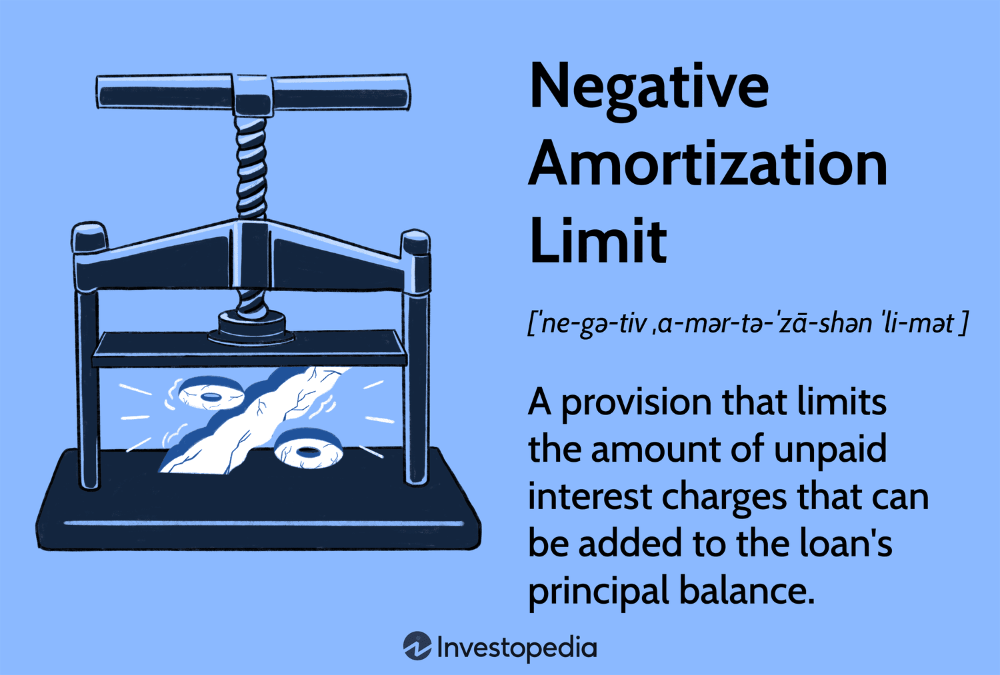

In the complex world of finance, understanding the intricacies of various financial instruments and strategies is crucial. This article will focus on the topics of negative amortization loans, loan limits, and algorithmic trading. These are vital facets of the financial markets that impact the decision-making processes of both individuals and businesses. By grasping these concepts, stakeholders can enhance their ability to make informed financial decisions, thereby optimizing their investment strategies and managing risks more effectively.

Negative amortization loans are financial instruments where the outstanding balance increases over time, often due to payments that are less than the interest due for a given period. This is commonly observed in certain Adjustable Rate Mortgages (ARMs) and specific student loans, where understanding the potential financial risks and implications can help prevent adverse financial outcomes.

Loan limits are crucial parameters set by lenders to cap the maximum amount of principal balance that can accrue due to unpaid interest. These limits are significant as they serve as a protective mechanism against excessive debt accumulation, thus minimizing the risk of defaults. By evaluating the function and significance of loan limits in lending and borrowing scenarios, one can appreciate their role in financial stability.

Algorithmic trading, a technology-driven approach to trading, leverages sophisticated algorithms and high-frequency trading strategies to execute orders at exceptional speeds. This trading method has substantial implications for financial markets, offering both advantages and risks. By examining how algorithmic trading operates, stakeholders can understand its potential benefits and drawbacks to better navigate the marketplace.

This article will expand on these three financial concepts, illustrating their applications and interconnections. Understanding negative amortization loans, loan limits, and algorithmic trading provides a comprehensive perspective of modern financial strategies. These concepts significantly influence risk management and investment decisions, impacting individual investors and large corporations alike.

## Table of Contents

## Understanding Negative Amortization Loans

Negative amortization loans are distinct financial products where the principal balance grows over time. This growth occurs because the payments made by the borrower are insufficient to cover the interest due during a given period. Instead of reducing the balance, these loans add the unpaid interest to the principal, resulting in an increased outstanding balance.

This situation is commonly observed in Adjustable Rate Mortgages (ARMs) and certain types of student loans. In ARMs, the [interest rate](/wiki/interest-rate-trading-strategies) is periodically adjusted, often leading to fluctuations in monthly payments. When borrowers opt for lower monthly payments than the interest accrued, negative amortization ensues. Similarly, certain student loans offer flexible payment options that might initially seem attractive but can lead to negative amortization if not managed carefully.

Understanding the mechanics of negative amortization is crucial for both borrowers and lenders. For borrowers, the impact of a growing loan balance can be profound. Over time, an increasing balance could lead to significantly higher monthly payments or a prolonged repayment period. This situation might ultimately result in financial distress or default if the borrower is unable to manage the rising debt effectively. For example, consider a loan where the initial interest rate is low, encouraging minimal payments that don't cover the interest accrued. As the interest compounds, the borrower's debt increases, and they might face difficulty meeting higher payment requirements in the future.

For lenders, while the initial period of low payments can attract borrowers, there is a heightened risk of default as the balance grows. To mitigate these risks, lenders often incorporate mechanisms such as payment caps and recalculations within the loan agreements.

The implications of negative amortization extend beyond just the financial terms; they also impact credit scores and future borrowing capabilities. Hence, both parties must thoroughly assess the potential outcomes and incorporate protective measures within the loan agreement to avert adverse consequences. 

Understanding negative amortization loans is vital for making informed financial decisions and avoiding pitfalls associated with compounded debt. By recognizing these implications, both borrowers and lenders can better navigate the complexities of such financial instruments and reduce associated risks.

## The Importance of Loan Limits

Loan limits are critical components in financial agreements, as they stipulate the maximum allowable principal balance that can accumulate from unpaid interest. These limits serve as safeguards for both borrowers and lenders by curtailing excessive debt growth and mitigating the risk of defaults. 

In a typical loan scenario, unpaid interest can quickly add to the principal, potentially leading to a prohibitive debt level that the borrower may struggle to repay. By capping the principal accumulation, loan limits prevent borrowers from being overwhelmed by their financial obligations. This preventative measure is especially crucial in variable-rate loan instruments, where interest rates can fluctuate, making repayment planning more complex.

From the lender's perspective, loan limits are equally significant as they help maintain the quality of their lending portfolio. By reducing the chance of borrower default, lenders can protect their financial interests and ensure a more stable flow of repayments. The imposition of loan limits, therefore, serves as a risk management tool, enabling lenders to maintain healthier credit profiles.

Moreover, loan limits play a vital role in the broader lending industry by encouraging prudent lending practices. Financial institutions are prompted to assess the repayment capacity of borrowers more thoroughly, fostering responsible lending behavior. Additionally, regulatory bodies often enforce loan limit policies to ensure that financial institutions do not engage in reckless lending practices, which could destabilize financial markets.

In summary, loan limits are essential to maintain balance in loan contracts, shielding both parties from the potential pitfalls of over-leveraging and ensuring long-term credit stability. Understanding how these limits function can aid borrowers and lenders alike in navigating the complexities of financial agreements, ultimately contributing to a more robust and sustainable lending environment.

## Algorithmic Trading: An Overview

Algorithmic trading is a method of executing financial transactions using pre-programmed instructions, typically executing trades at speeds and frequencies that are impossible for human traders. This approach utilizes complex mathematical models and algorithms to decide on aspects such as timing, price, and quantity of the order. The primary goal is to exploit small price discrepancies and inefficiencies that occur in the financial markets.

The essence of [algorithmic trading](/wiki/algorithmic-trading) lies in its ability to process vast quantities of data and execute trades based on predefined criteria and logic. High-frequency trading ([HFT](/wiki/high-frequency-trading-strategies)) is a subset of algorithmic trading that focuses on extremely high-speed transactions, leveraging high-speed networks and sophisticated algorithms. These trades occur in extremely short time frames, often in milliseconds or microseconds.

### Operation of Algorithmic Trading

1. **Algorithm Design**: The core of algorithmic trading is the algorithm itself, which is designed to identify trading opportunities based on customized criteria. These criteria could include factors such as price trends, volume, timing, and statistical correlations.

2. **Backtesting**: Before implementation, algorithms are backtested using historical market data to assess their effectiveness and profitability. This step ensures that the algorithm performs well under various market conditions and refines its decision-making parameters.

3. **Execution**: Once backtested, the algorithm is deployed to execute trades. It continuously analyzes market data and triggers orders when the criteria are met. The execution speed and efficiency make it a preferred choice for institutional investors seeking to capitalize on the smallest market movements.

4. **Monitoring and Adjustment**: Continuous monitoring allows traders to assess the algorithm's performance and make real-time adjustments as necessary. This adaptability is crucial in volatile markets where conditions can change rapidly.

### Impact on Financial Markets

Algorithmic trading can significantly impact financial markets. By providing [liquidity](/wiki/liquidity-risk-premium) and reducing the bid-ask spread, it can enhance market efficiency. However, it may also lead to increased [volatility](/wiki/volatility-trading-strategies), especially in situations of market stress, due to the large [volume](/wiki/volume-trading-strategy) of automated trades that can occur simultaneously.

### Advantages

- **Efficiency**: Algorithms execute trades at optimal prices and can process vast quantities of data far more efficiently than human traders.
- **Accuracy and Speed**: The pre-defined rules minimize human error, ensuring precise and timely execution of transactions.
- **Cost Reduction**: By automating the trade execution process, algorithmic trading can reduce transaction costs significantly.

### Risks

- **Market Volatility**: In extreme market conditions, high-frequency trading can exacerbate volatility and lead to flash crashes.
- **Technical Failures**: Reliance on technology means that technical glitches or bugs can result in significant financial losses.
- **Regulatory Concerns**: Algorithmic trading is subject to regulatory scrutiny to ensure it does not disrupt market integrity or fairness.

In summary, algorithmic trading represents a significant technological advancement in trading strategies, offering substantial benefits in speed and efficiency while posing challenges related to market impact and technical reliability. Understanding these aspects is crucial for participants in financial markets.

## Connecting the Concepts: Real-World Implications

Understanding negative amortization, loan limits, and algorithmic trading provides a comprehensive framework for modern financial decision-making and risk management. These concepts interplay to shape how financial strategies are developed and executed, both for individual investors and large corporations.

Negative amortization involves a scenario where the outstanding loan balance increases because the payments made are insufficient to cover the interest due. This can pose significant risks, particularly if compounded over time. For investors, this means that careful assessment of their loan structures and the terms associated with these loans is vital to avoid unmanageable debt levels. Corporations dealing with large real estate portfolios, such as property developers, must carefully manage loans with the potential for negative amortization to ensure that their overall debt remains sustainable and aligned with future cash flow projections.

Loan limits, on the other hand, act as a safeguard for both borrowers and lenders. By capping the amount of principal that can accumulate due to unpaid interest, loan limits help to mitigate risks associated with negative amortization. For lenders, setting appropriate loan limits is crucial to maintaining the health of their loan portfolios and reducing the risk of defaults. Borrowers benefit by having a clear understanding of their financial obligations and preventing scenarios where debt becomes unmanageable. This is particularly important for corporations engaging in leveraged buyouts or significant capital expenditures, where debt levels can quickly escalate.

Algorithmic trading introduces another layer of complexity with its ability to execute trades at speeds and volumes unmanageable by humans. This form of trading relies on pre-programmed instructions or algorithms to make trading decisions, often based on complex mathematical models or statistical analysis. For institutional investors or hedge funds, algorithmic trading can offer significant advantages in executing large orders efficiently while minimizing market impact. However, it also brings increased risk, such as the potential for market volatility or technical failures leading to significant financial losses.

In practice, the integration of these concepts necessitates a robust risk management framework. Consider a scenario where a corporation uses algorithmic trading to hedge against potential interest rate increases affecting their negatively amortizing loans. Here, an understanding of loan limits is critical to ensure that any imposed financial strategies do not inadvertently result in excessive leverage or breach of contract terms. Individual investors might face similar challenges when optimizing their portfolios to balance returns with the risks associated with different financial products.

The interconnectedness of these concepts underlines the importance of a holistic approach to financial management. Just as algorithmic trading can efficiently manage market risks, understanding the terms of loans and their amortization structures is crucial for long-term financial planning and stability. This synthesis of knowledge not only aids in prudent investment but also helps avert financial missteps in a rapidly evolving economic landscape.

## Conclusion

Navigating the complexities of finance requires a thorough understanding of key concepts like negative amortization loans and algorithmic trading. These areas represent both challenges and opportunities within the financial landscape. Understanding the dynamics of negative amortization loans can help borrowers manage debt more effectively by acknowledging how unpaid interest can compound and increase loan balances over time, potentially leading to higher long-term financial liabilities. Such insights are crucial for preventing financial strain and facilitating better fiscal planning.

Algorithmic trading, on the other hand, signifies the evolution of trading strategies through the employment of sophisticated algorithms and technology-driven decisions. Mastering these trading methods can provide competitive advantages due to their speed and efficiency in executing transactions, though it also necessitates vigilance in risk management to guard against market anomalies and systemic risk.

By acquiring a strong grasp of these financial concepts, individuals and businesses are better positioned to make informed strategic decisions that can enhance financial stability and capital growth. This article aimed to bring clarity to these important financial terms, advocating for continued education and proactive management in financial affairs. Through a commitment to learning, stakeholders can navigate financial markets more effectively, optimizing outcomes in an increasingly complex economic environment.

## References & Further Reading

[1]: Hayre, L., & Dimou, N. (2006). ["A Concise Guide to Fixed Income Risk Management."](https://books.google.com/books/about/BlackRock_s_Guide_to_Fixed_Income_Risk_M.html?id=l1zfEAAAQBAJ) Springer.

[2]: ["Advanced Credit Risk Analysis: Financial Approaches, Statistical Methods, and Mathematical Models to Assess, Price, and Manage Credit Risk"](https://www.amazon.com/Advanced-Credit-Risk-Analysis-Statistical/dp/0471852339) by Didier Cossin and Hugues Pirotte

[3]: Khandani, A. E., & Lo, A. W. (2011). ["What Happened To the Quants in August 2007?: Evidence from Factors and Transactions Data."](https://www.nber.org/papers/w14465) The Journal of Finance, 66(4), 1540-6261.

[4]: Treleaven, P., Galas, M., & Lalchand, V. (2013). ["Algorithmic Trading Review."](https://www.researchgate.net/publication/262239006_Algorithmic_Trading_Review) Communications of the ACM, 56(11), 76-85.

[5]: ["Negative Amortization: Are Adjustments Needed?"](https://fastercapital.com/content/Negative-Amortization--Avoiding-the-Pitfalls-of-Negative-Amortization-with-an-ARM-Calculator.html) Speech by William Poole, Federal Reserve Bank of St. Louis, September 2006.