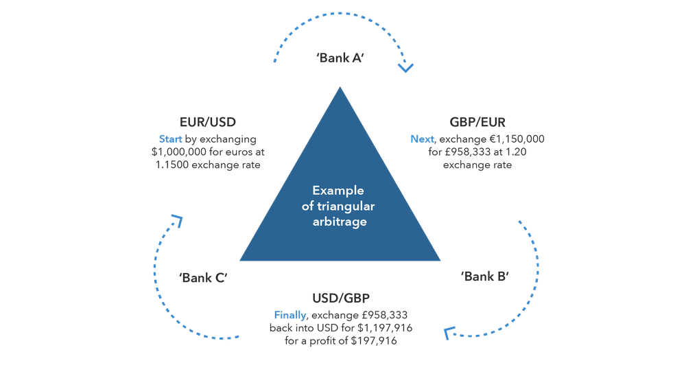

In today’s fast-paced financial world, investment strategies are continually evolving as investors strive to maximize returns while minimizing risks. Two critical concepts in this landscape are negative arbitrage and algorithmic trading, each playing a significant role in shaping modern financial strategies.

Negative arbitrage, a nuanced concept in finance, occurs when the cost of borrowing funds exceeds the yields from investments made using those funds. Essentially, it represents a situation where the returns on investments are insufficient to cover the costs of financing, leading to potential financial loss. This scenario often presents itself in the bond market, notably impacting municipal bonds and structured financial products when issuers refinance debt but cannot invest the proceeds at a rate higher than the interest rate they must pay. This results in opportunity costs and reflects inefficiencies in the market that can affect both corporate finance and broader economic activities.



On the other hand, algorithmic trading, or algo trading, has revolutionized investment management by combining technology with finance to automate and optimize trading processes. By utilizing computer algorithms to execute trades based on predetermined criteria such as timing, price, or market conditions, algorithmic trading enhances efficiency and reduces the scope for human error. Algorithms enable traders to react to market conditions rapidly, seizing fleeting opportunities that would otherwise be missed. Popular strategies within algorithmic trading include trend following, arbitrage, mean reversion, index fund rebalancing, and market timing, allowing for swift decision-making and execution that outpaces traditional trading methods.

This article explores the concepts of negative arbitrage and algorithmic trading, examining their effects on investment strategies. It highlights how investors mitigate risks associated with negative arbitrage and leverage algorithmic trading for efficient execution and diversification. Understanding these dynamics is crucial for navigating the complexities of contemporary finance and optimizing investment strategies for better outcomes in a rapidly changing environment.

## Table of Contents

## Understanding Negative Arbitrage

Negative arbitrage typically arises in the bond market when the proceeds from refinancing debt cannot be invested at a rate exceeding the interest rate that the issuer is obligated to pay. This situation is commonly seen in contexts like municipal bonds, corporate finance, and structured financial products. 

In practice, negative arbitrage represents an opportunity cost for issuers, as the potential for [earning](/wiki/earning-announcement) a higher return on investments is undermined by the prevailing market inefficiencies. For example, consider a municipality that issues refunding bonds to refinance existing debt. If the interest rate on the new bonds is lower than that of the outstanding ones but the investment opportunities available offer even lower returns, the municipality may face negative arbitrage. 

To express this mathematically, let's denote:
- $r_b$ as the interest rate of the bond issuance,
- $r_i$ as the rate of return on the investment.

Negative [arbitrage](/wiki/arbitrage) occurs when:
$$
r_i < r_b
$$

Issuers facing the risk of negative arbitrage often adopt various strategies to mitigate its impact. These may include:

1. **Debt Restructuring**: This involves altering the terms of the debt to reduce the burden of higher interest rates. By restructuring debt, issuers might defer payments, extend maturities, or even negotiate lower interest rates, thereby aligning better with available investment opportunities.

2. **Using Derivatives**: Financial derivatives, such as interest rate swaps, can be employed to hedge against interest rate fluctuations. By doing this, issuers can stabilize their cost of borrowing relative to the fluctuating returns from investments. For instance, an interest rate swap might entail exchanging a fixed interest rate for a floating one, potentially reducing exposure to adverse rate changes.

3. **Efficient Use of Proceeds**: Planning the use of borrowed funds more effectively can also help in reducing negative arbitrage. This might involve aligning the timing of investments with the receipt of bond proceeds or actively seeking higher-yielding short-term investments that match the refinancing objectives.

In conclusion, understanding negative arbitrage is crucial for managing financial efficiency in bond-related activities. By employing strategic financial tools and sound planning, issuers can minimize the adverse effects of negative arbitrage and maximize the potential gains from their fundraising efforts.

## Algorithmic Trading: An Overview

Algorithmic trading involves the use of sophisticated computer algorithms to automatically execute trading orders with the goal of boosting efficiency and minimizing human errors. This approach relies heavily on predefined criteria which may include timing, price, or specific market conditions, enabling rapid decision-making and order execution. By leveraging the computational power of algorithms, traders can respond to market shifts much quicker than humans, taking advantage of transient market opportunities that might otherwise be missed.

The algorithms themselves are often based on complex mathematical models and can be programmed in various coding languages. Python is particularly popular in the algo trading community due to its simplicity and the vast ecosystem of libraries available for data analysis and financial computations. The process typically involves [backtesting](/wiki/backtesting) strategies on historical data to ensure their viability before deployment in live markets.

Several popular strategies are employed in [algorithmic trading](/wiki/algorithmic-trading):

1. **Trend Following**: This strategy involves algorithms that identify and exploit market trends, such as recognizing bullish trends to buy or bearish trends to sell. These algorithms often use indicators like moving averages to gauge market direction.

2. **Arbitrage**: Algorithms designed for arbitrage seek price discrepancies across different markets or instruments, executing simultaneous buy and sell orders to lock in profits. This could involve exploiting differences in prices for the same asset listed on different exchanges.

3. **Mean Reversion**: This strategy is based on the theory that asset prices will revert to their historical means or averages. Algorithms using mean reversion strategies will potentially buy undervalued assets and sell overvalued ones, expecting a return to average prices.

4. **Index Fund Rebalancing**: Algorithms are used to adjust the composition of portfolios to reflect changes in an index they are tracking. This ensures that the portfolio remains aligned with the underlying index, allowing efficient participation in market movements.

5. **Market Timing**: This involves making predictions about future market movements and executing trades based on these forecasts. Algorithms for market timing often analyze a variety of indicators and historical data to predict short-term price movements.

Python Code Example - Simple Moving Average (SMA) Strategy:
```python
import pandas as pd

# Sample data
data = {'Price': [1, 2, 3, 4, 5, 6, 7, 8, 9, 10]}
df = pd.DataFrame(data)

# Calculate the moving averages
df['SMA_3'] = df['Price'].rolling(window=3).mean()

# Generate trading signals
df['Signal'] = 0
df['Signal'][3:] = np.where(df['Price'][3:] > df['SMA_3'][3:], 1, 0)
df['Position'] = df['Signal'].diff()

print(df)
```
This Python code illustrates a basic implementation of a trend-following strategy using the Simple Moving Average (SMA). The algorithm calculates a 3-period moving average and generates buy or sell signals based on the price's relation to this average.

Algorithmic trading has profoundly impacted not only how trades are executed but also how strategies are developed and tested. By utilizing vast amounts of data and executing trades at speeds unattainable by human traders, algorithms continue to redefine the financial markets. This ongoing evolution requires continuous refinement and adaptation of strategies to stay profitable in a competitive environment.

## Investment Strategies to Mitigate Negative Arbitrage

Employing advanced algorithmic trading techniques can significantly mitigate the risks associated with negative arbitrage, a situation where the cost of borrowing exceeds the returns on investments made with borrowed funds. One prominent strategy involves using [interest rate](/wiki/interest-rate-trading-strategies) swaps. An interest rate swap is a financial derivative contract in which two parties exchange interest rate payments on a specified principal amount. Typically, one party pays a fixed interest rate while the other pays a floating rate. This exchange can help align the interest payments on borrowed funds with the yields from investments, thus balancing costs and returns. 

For example, suppose an issuer has debt with a fixed interest rate but anticipates that floating rates will prove more beneficial during the debt term. An interest rate swap could allow the issuer to exchange their fixed-rate payments for floating-rate payments, potentially lowering overall borrowing costs if the floating rates drop or are expected to remain lower than the fixed rates. 

Active portfolio management is another effective approach to mitigate negative arbitrage. This method involves frequent analysis and adjustment of the investment portfolio to optimize returns relative to borrowing costs. Portfolio managers may increase or decrease exposure to different asset classes based on anticipated interest rate movements and economic conditions. By actively managing the portfolio, investors can better position themselves to capture higher yields that can offset borrowing costs.

Utilizing hedging strategies with complex financial derivatives can also play a crucial role in mitigating negative arbitrage. Instruments like options, futures, and swaps are frequently employed to hedge against interest rate fluctuations and market [volatility](/wiki/volatility-trading-strategies). This hedging ensures that adverse movements do not negatively impact the returns generated, thereby containing potential losses associated with negative arbitrage conditions.

Moreover, portfolio diversification represents a strategic way to reduce reliance on fixed-income securities prone to negative arbitrage. By incorporating a broader range of asset classes, such as equities, commodities, or real estate, investors can achieve a more stable return profile. Diversification reduces the impact of underperforming bond yields which might not cover borrowing costs. Therefore, examination of asset correlation and market trends becomes vital in selecting varied investment vehicles to optimize overall portfolio performance.

In conclusion, a combination of sophisticated algorithmic trading techniques and sound financial management practices can significantly minimize the adverse effects of negative arbitrage, enhancing the efficiency and profitability of investment portfolios.

## Real-World Applications and Examples

The bond market often showcases occurrences of negative arbitrage, particularly during periods of fluctuating interest rates. This situation can be seen when municipalities issue refunding bonds. Refunding bonds are utilized to refinance existing debt, ideally at a lower interest rate. However, when investment yields fall below the cost of borrowing, municipalities might find themselves in a negative arbitrage situation. This scenario leads to financial inefficiencies and potential losses, as the proceeds from the bonds can't be invested at higher yield rates than the interest payable on them.

Algorithmic trading has fundamentally transformed how large-scale investors with substantial portfolios operate, particularly in managing bid-ask spreads and enhancing the efficiency of trade executions. Techniques such as high-frequency trading ([HFT](/wiki/high-frequency-trading-strategies)) leverage advanced algorithms to analyze vast datasets and execute trades at speeds unattainable by human operators. This rapid trading capability allows institutions to capitalize on transient market inefficiencies, achieving marginal gains that accumulate significantly over time.

For instance, an HFT algorithm might be programmed to detect price discrepancies between different markets or securities. Upon identifying such an anomaly, the algorithm can execute thousands of small trades in fractions of a second to exploit the price differences before the market corrects them. Here's a simple illustration in Python, demonstrating a hypothetical execution of arbitrage opportunities using pseudocode:

```python
class AlgorithmicTrader:
    def __init__(self, initial_funds):
        self.funds = initial_funds
        self.portfolio = {}

    def detect_arbitrage_opportunity(self, market_data):
        for data in market_data:
            if data['price_difference'] > 0:
                self.execute_trade(data['ticker'], data['price'])

    def execute_trade(self, ticker, price):
        # Assume trade execution logic here
        self.funds -= price
        if ticker in self.portfolio:
            self.portfolio[ticker] += 1
        else:
            self.portfolio[ticker] = 1

    def run(self, market_data_stream):
        for market_data in market_data_stream:
            self.detect_arbitrage_opportunity(market_data)

# Example usage
trader = AlgorithmicTrader(10000)  # Initial funds of 10,000
market_data_stream = [{'ticker': 'XYZ', 'price_difference': 5, 'price': 95},
                      {'ticker': 'ABC', 'price_difference': -3, 'price': 103}]
trader.run(market_data_stream)
```

This code snippet represents a simplified conceptual approach, illustrating how an algorithm might operate to find and act upon small arbitrage opportunities within the constraints of available funds and predefined strategic parameters. While this example is rudimentary, real-world algorithmic trading involves complex models and infrastructure capable of executing orders, managing risk, and adapting to evolving market conditions.

## Conclusion

Both negative arbitrage and algorithmic trading are intricate components of contemporary finance, each offering distinct challenges and opportunities. Negative arbitrage often arises when the cost of borrowing surpasses the returns on investments funded by those borrowings, potentially leading to significant financial inefficiencies. Algorithmic trading, on the other hand, leverages technology to enhance trading efficiency, reduce human error, and exploit rapid market movements.

Successful investment strategies often require a delicate balance between mitigating negative arbitrage risks and utilizing the efficiency of algorithmic trading. Employing algorithmic trading techniques can compensate for the potential losses from negative arbitrage by enabling precise timing and execution, thereby maximizing returns. For instance, algorithms designed for interest rate swaps or derivatives can be programmed to hedge against rate fluctuations, ensuring that borrowing costs do not overshadow investment yields.

Understanding these dynamics is crucial for investors and traders aiming to optimize their financial outcomes. This involves a thorough grasp of both the financial instruments available and the technological tools that can enhance their use. As financial markets and technologies are in constant flux, staying updated is essential. Continuous technological advancements promise new tools and strategies, while market changes necessitate frequent reassessment of current methods.

In conclusion, negative arbitrage and algorithmic trading are emblematic of modern financial sophistication. Mastery of their complexities provides not only a hedge against loss but also the potential for considerable gain. Continuous education and adaptation in response to technological and market developments will remain critical for future success in the financial domain.

## References & Further Reading

[1]: ["Advances in Financial Machine Learning"](https://www.amazon.com/Advances-Financial-Machine-Learning-Marcos/dp/1119482089) by Marcos Lopez de Prado

[2]: ["Quantitative Trading: How to Build Your Own Algorithmic Trading Business"](https://www.amazon.com/Quantitative-Trading-Build-Algorithmic-Business/dp/1119800064) by Ernest P. Chan

[3]: ["Machine Learning for Algorithmic Trading"](https://github.com/stefan-jansen/machine-learning-for-trading) by Stefan Jansen

[4]: ["Evidence-Based Technical Analysis: Applying the Scientific Method and Statistical Inference to Trading Signals"](https://www.amazon.com/Evidence-Based-Technical-Analysis-Scientific-Statistical/dp/0470008741) by David Aronson

[5]: ["Handbook of Fixed-Income Securities"](https://www.amazon.com/Handbook-Fixed-Income-Securities-Ninth/dp/1260473899) by Frank J. Fabozzi