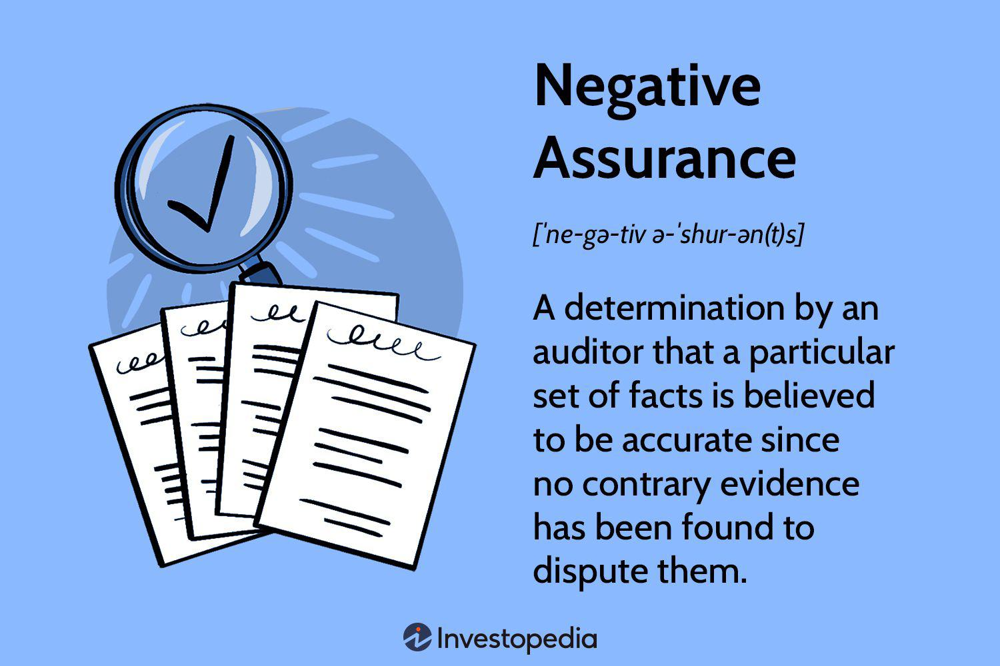

In the ever-evolving field of finance, it is crucial to grasp the intricacies of financial auditing, particularly when algorithmic trading is involved. Financial auditing serves as a safeguard, ensuring the accuracy and reliability of financial statements, which is fundamental to maintaining trust in financial markets. At the heart of financial auditing lies the concept of assurance, with negative assurance playing a significant role by offering limited guarantees about the financial state of an organization.

Negative assurance is particularly relevant in financial auditing as it provides a form of validation whereby the auditor expresses their belief that no material misstatements have been found in the financial statements. Though it does not offer absolute certainty, it provides a level of confidence that is valuable for stakeholders who rely on these financial reports to make informed decisions. This distinction is especially pertinent in algorithmic trading, where rapid processing of financial data and decision-making can be greatly influenced by the perceived reliability of financial reports.

Algorithmic trading, characterized by utilizing complex algorithms to execute trades at exceptionally high speeds, requires extremely accurate and timely financial data. In this context, negative assurance offers a practical benefit by potentially streamlining audit processes and reducing costs while still providing a degree of transparency and trust. This article seeks to explore how financial auditing, and specifically the practice of providing negative assurance, impacts the algorithmic trading environment, revealing both opportunities for efficiency and potential challenges.

## Table of Contents

## Understanding Financial Auditing

Financial auditing is a systematic process conducted by an independent entity to evaluate the financial statements of an organization. This process ensures that the financial records accurately reflect the organization's financial position and performance, thereby fostering trust among stakeholders such as investors, creditors, and regulatory authorities. The audit is typically conducted by external auditors who possess the necessary expertise and objectivity to assess the fairness and reliability of the financial information presented by an organization.

The primary objective of auditing is to provide an independent and objective evaluation of the financial statements, ensuring they are free from material misstatements whether due to fraud or error. This involves assessing various aspects, including compliance with applicable accounting standards and principles, and evaluating the appropriateness of accounting policies used by the organization.

In practice, auditors gather sufficient and appropriate evidence through a combination of techniques, such as substantive testing, analytical procedures, and risk assessments, to form an opinion on the financial statements. Substantive testing includes detail tests of transactions and balances, while analytical procedures might entail the analysis of financial ratios and trends to identify unusual patterns that require further investigation.

Upon the completion of the auditing process, auditors commonly issue an assurance report, which serves as the primary means of communication to stakeholders about the auditor's findings. The assurance report consists of several key components, including the auditor's opinion on the financial statements. This opinion can range from unqualified, indicating that the financial statements are presented fairly, to qualified, adverse, or a disclaimer, depending on the findings of the audit. The issuance of this report provides stakeholders with confidence regarding the financial health and integrity of the organization, facilitating informed decision-making.

The role of auditors extends beyond the attestation of financial statements to offering insights for improvement in a company's internal control systems and financial reporting processes. They may identify areas for enhancing efficiency, suggest more robust controls, and recommend best practices to ensure ongoing compliance and accuracy in financial reporting. 

Overall, financial auditing is a cornerstone of corporate governance and accountability, protecting stakeholder interests and ensuring transparency in financial markets.

## What Is Negative Assurance?

Negative assurance is a specific type of statement issued by auditors during financial audits. It reflects the auditor's belief that, based on the procedures and investigations conducted, no material misstatements are present in the financial statements being reviewed. This assurance arises not from conclusive evidence of accuracy, but from the absence of any evidence contradicting the financial data's correctness.

Negative assurance is typically applied in scenarios where a full-scope audit may not be necessary or feasible. During such engagements, auditors conduct limited procedures, which are less comprehensive compared to those in a traditional audit. These procedures might include analytical reviews and inquiries of management but are not as extensive as those needed to provide positive assurance. The statement issued is therefore inherently limited, as it confirms only that no discrepancies were identified, rather than guaranteeing that none exist. 

In contrast to positive assurance, which provides a definitive conclusion on the accuracy of financial statements, negative assurance offers a more conditional form of confidence. While positive assurance might state that the financial statements "present a true and fair view" based on thorough verification, negative assurance would indicate that nothing has come to the auditor's attention to suggest otherwise. This means that while stakeholders can take some reassurance from a negative assurance report, they must also recognize its constraints and the potential for undetected errors.

In professional terms, the issuance of negative assurance requires that the auditor has not encountered any inconsistencies or deviations that could suggest material misstatements. Economically, it serves a practical function by offering a cost-effective alternative to extensive audits, especially in circumstances where the additional assurance may not justify the added expense. This is particularly relevant in dynamic sectors like [algorithmic trading](/wiki/algorithmic-trading), where the fast-paced environment demands swift yet reliable evaluations.

## Comparing Positive and Negative Assurance

Positive and negative assurance represent two distinct levels of confidence provided by auditors concerning the accuracy of financial statements.

Positive assurance directly affirms the accuracy of the financial information assessed. It entails a thorough examination by auditors, who conduct detailed testing and analysis to substantiate their assertions. In a positive assurance report, the auditor states that, in their opinion, the financial statements present a true and fair view of the entity's financial position. This level of assurance is typically associated with audits of historical financial statements and involves extensive procedures such as verification of transactions, balances, and internal controls. Positive assurance is often deemed more reliable due to its comprehensive nature, providing stakeholders with a high degree of confidence in the reported financial information.

Negative assurance, on the other hand, offers a more restrained level of certainty. It signifies that, based on limited procedures concluded by the auditor, no evidence was found to suggest that the financial statements contain material misstatements. In this context, the auditor does not explicitly affirm the accuracy of the financial statements; instead, they indicate that nothing came to their attention that would cause them to believe the data is materially misstated. Negative assurance is typically employed in reviews rather than full audits, as it involves fewer rigorous procedures. This approach is commonly used for interim financial statements or specific engagements where absolute assurance is not feasible or necessary.

The distinction between these two forms of assurance is crucial for stakeholders making informed decisions. Positive assurance delivers robust confidence, suitable for stakeholders requiring a high level of certainty about financial accuracy, such as investors and regulators. While more cost-effective and quicker to produce, negative assurance warrants careful consideration by stakeholders, as it implies a limited scope of evaluation and may not uncover all potential issues within the financial statements.

In summary, while positive assurance provides thorough verification and confidence in financial statements, negative assurance offers a limited scope of certainty, highlighting the absence of detected inconsistencies. Understanding these differences helps stakeholders assess the level of scrutiny applied and the reliability of the financial information they rely upon for decision-making.

## Relevance of Negative Assurance in Algorithmic Trading

Algorithmic trading, characterized by the use of computer algorithms for executing trades at high speeds, significantly benefits from the precision and timeliness of financial data. Ensuring the reliability of this data is critical for maintaining a competitive edge in the market. Here, negative assurance plays a vital role by offering a cost-effective solution to verify data integrity without engaging in exhaustive audits.

Negative assurance provides a limited assertion by auditors that they are not aware of any material misstatements within financial statements. For algorithmic trading systems that prioritize speed and efficiency, this type of assurance can be instrumental. It allows trading firms to confirm that there are no apparent inaccuracies in their financial data, which is crucial for making fast trading decisions.

The benefits of deploying negative assurance within algorithmic trading include reduced costs compared to comprehensive audits. Given the [volume](/wiki/volume-trading-strategy) and velocity of transactions in algorithmic trading, exhaustive auditing may be impractical and cost-prohibitive. Negative assurance, therefore, serves as a pragmatic alternative that balances reliability with operational efficiency, ensuring that the data influencing trading algorithms remains consistent and dependable without the need for extensive validation processes.

For example, a trading firm might use negative assurance to verify the data feed from financial markets or brokerages. The assurance process would involve a review to ensure that no discrepancies exist that could materially impact trading strategies. This swift assessment allows the firm to continue operations with confidence, knowing that their decision-making framework is supported by data that is free from significant errors, thereby maintaining their competitive advantage in a high-frequency trading environment.

In summary, negative assurance facilitates the operational demands of algorithmic trading by providing timely and reliable data verification, a [factor](/wiki/factor-investing) that is crucial for sustaining competitive advantage in a fast-paced market setting.

## Negative Assurance in Practice: Case Studies

Negative assurance has been utilized in various financial audits, providing an illustrative view of its application in real-world scenarios. By examining specific case studies, we can understand the strengths and potential drawbacks of relying on negative assurance.

One notable case is the audit of mid-tier technology firms, where rapid innovation and fluctuating financial metrics can lead to a significant assurance challenge. These companies often face constraints related to the cost and time required for comprehensive audits. In such scenarios, negative assurance serves as a pragmatic solution, allowing auditors to state that nothing has come to their attention that would indicate material misstatements in the financial statements. This approach provides a cost-effective alternative to positive assurance, which would require a more in-depth examination and higher expenses. However, the limitation here is that negative assurance does not address all potential risks. If errors exist but are not immediately visible, they may remain undetected under this mode of auditing.

In another case within the financial services industry, audit firms engaged with investment banks operating algorithmically driven platforms. Here, the fast-paced nature of transactions and the reliance on automated systems present unique challenges. Negative assurance allows these institutions to meet regulatory requirements efficiently without impeding the rapid decision-making processes critical to their operations. This was particularly beneficial during periods of high [volatility](/wiki/volatility-trading-strategies), where quickly obtaining a degree of assurance was necessary. Nonetheless, stakeholders need to understand that this type of assurance indicates only the absence of detected discrepancies and not absolute audit accuracy. Relying solely on negative assurance without additional checks or audits could result in oversight if the implemented algorithms fail or produce inaccurate outputs.

The healthcare sector also presents an intriguing example. Hospitals and pharmaceutical companies, often subject to frequent audits due to regulatory oversight, have applied negative assurance to streamline their auditing processes. By using negative assurance, they managed to get timely statements ready for regulatory submission while reducing disruptions to everyday operations. The limitation, however, is akin to other sectors: negative assurance does not uncover every possible issue, thus necessitating ongoing internal controls and assessments to complement the assurance provided.

These case studies underline that while negative assurance is valuable for its efficiency and cost-effectiveness, its effectiveness hinges on the context of application and the awareness of its limitations by stakeholders. Without supplementing negative assurance with other oversight mechanisms, organizations risk missing significant, yet subtle, financial discrepancies.

## Challenges and Limitations of Negative Assurance

Negative assurance in financial auditing provides a limited form of validation, indicating that no evidence of material misstatements has been found. However, it inherently comes with significant limitations. One primary shortcoming is its inability to identify all types of errors. This form of assurance does not provide absolute certainty, as it merely confirms the absence of identified discrepancies rather than guaranteeing accuracy.

The challenges posed by negative assurance necessitate caution from stakeholders who may rely heavily on this form of audit. Unlike positive assurance, which offers a definitive confirmation of financial statement accuracy, negative assurance allows for the possibility of undetected errors or omissions. This is because negative assurance is typically based on limited procedures and a narrower scope of review. 

For organizations, understanding these constraints is crucial when planning their financial audits. They must weigh the cost-effectiveness of negative assurance against the potential risks of undiscovered inaccuracies. Given that negative assurance doesn't assure comprehensive accuracy, stakeholders are advised to exercise additional scrutiny and incorporate other verification methods where feasible.

Moreover, the rapidly evolving nature of financial markets and the increasing complexity of financial instruments further exacerbate the limitations of negative assurance. In particular, the intricate algorithms underpinning algorithmic trading require precise and reliable data, something that negative assurance alone can’t guarantee. As such, organizations often need to implement supplementary verification techniques to bolster assurance levels.

Overall, the challenge for financial auditing processes lies in balancing efficiency with the need for thoroughness, ensuring that stakeholders can continue to make informed decisions based on sufficiently reliable financial information.

## The Future of Financial Auditing and Assurance Services

The future of financial auditing and assurance services is being continuously reshaped by technological advancements and regulatory changes. One significant development is the increasing reliance on [artificial intelligence](/wiki/ai-artificial-intelligence) (AI) and [machine learning](/wiki/machine-learning). These technologies have the potential to complement traditional assurance methods by enhancing the accuracy, efficiency, and scope of audits. AI algorithms can rapidly process vast amounts of data, identify patterns, and detect anomalies that might be overlooked by human auditors. This capability allows for more comprehensive auditing processes, which can result in improved assurance outcomes.

Machine learning models, particularly, can analyze historical data to predict future trends and flag potential discrepancies. Auditors can leverage these models to perform risk assessments and conduct real-time monitoring of financial transactions. This proactive approach not only ensures the integrity of financial statements but also provides stakeholders with timely insights into the financial health of an organization.

In addition to technological advancements, regulatory changes are driving the evolution of auditing practices. Regulatory bodies worldwide are adapting to the digital transformation, updating standards and guidelines to incorporate emerging technologies in auditing processes. These changes aim to enhance transparency, accountability, and trust in financial reporting, benefitting both organizations and stakeholders.

As the digital landscape evolves, the role of negative assurance—a form of assurance that expresses an auditor's belief in the non-existence of material misstatements—also promises both opportunities and challenges. Negative assurance allows auditors to offer a level of confidence in the absence of evidence suggesting errors in financial statements. However, it is crucial to acknowledge its limitations, as negative assurance does not guarantee absolute accuracy.

Incorporating AI and machine learning in the provision of negative assurance can enhance the reliability of financial audits while mitigating some of the limitations inherent in this form of assurance. For instance, machine learning algorithms can be used to continuously assess and validate the data feeding into financial models used in algorithmic trading, ensuring that any discrepancies are swiftly identified and addressed. This integration can lead to more efficient and reliable assurance processes, promoting confidence in financial reports.

As the financial auditing field moves forward, the synergy between technological innovations and robust regulatory frameworks will be vital. Organizations adopting these advancements will likely experience greater precision in their auditing processes, enhancing their ability to navigate the complexities of modern financial markets effectively.

## Conclusion

Negative assurance remains a crucial component of financial auditing, providing a pragmatic approach for verifying financial statements, particularly in the context of algorithmic trading. As algorithmic trading increasingly dominates financial markets, the need for efficient and cost-effective auditing processes becomes more pronounced. Negative assurance offers a viable solution by confirming the absence of evidence that contradicts the accuracy of financial data, thus supporting the rapid decision-making essential in algorithmic trading.

The integration of negative assurance into financial audits introduces both benefits and challenges. On the one hand, its application streamlines the validation process, reducing time and costs associated with more exhaustive auditing techniques. This efficiency aligns well with the fast-paced nature of algorithmic trading, where timely data verification is paramount. However, stakeholders must recognize the inherent limitations of negative assurance, primarily its inability to provide absolute certainty. Consequently, users of financial statements must maintain a critical perspective, understanding that negative assurance is not a guarantee but a reasonable level of confidence based on the absence of contrary evidence.

As financial markets and trading methods continue to evolve, so too must the strategies and tools employed in auditing and assurance. The advent of technologies such as artificial intelligence and machine learning presents new opportunities for enhancing assurance services, potentially addressing some limitations of negative assurance. These technologies could supplement traditional methods, offering deeper insights and more robust error detection. Nonetheless, stakeholders must balance the advantages of technological advancements with the need for careful assessment of assurance reports, ensuring informed decision-making in an increasingly complex financial landscape.

## References & Further Reading

[1]: Cangemi, M. P., & Singleton, T. (2014). ["Managing the Audit Function: A Corporate Audit Department Procedures Guide."](https://archive.org/details/managingauditfun00mich) John Wiley & Sons.

[2]: Appelbaum, D., Kogan, A., & Vasarhelyi, M.A. (2017). ["Big Data and Auditing: A Perspective on the Future."](https://digitalcommons.montclair.edu/cgi/viewcontent.cgi?article=1033&context=acctg-finance-facpubs) Accounting Horizons.

[3]: Lopez de Prado, M. (2018). ["Advances in Financial Machine Learning"](https://www.amazon.com/Advances-Financial-Machine-Learning-Marcos/dp/1119482089) John Wiley & Sons.

[4]: PwC. (2015). ["The Future of Audit – Through a Wider Lens."](https://www.pwc.co.uk/who-we-are/future-of-audit/future-of-audit-report.pdf).

[5]: Zieba, M., Tomczak, S. K., & Lubieniecka, M. (2016). ["Real-Time Data Analytics and Its Impact on Algorithmic Trading Systems in Financial Markets."](https://www.springer.com/gp/book/9783319469864) In: Artificial Intelligence in Financial Markets. 

[6]: Singleton-Green, B. (2016). ["The Demand for Assurance Services: Four Points for Auditors."](https://papers.ssrn.com/sol3/cf_dev/AbsByAuth.cfm?per_id=558698) International Federation of Accountants (IFAC).

[7]: Dai, J., & Vasarhelyi, M. A. (2016). ["Imagineering Audit 4.0."](https://www.semanticscholar.org/paper/Imagineering-Audit-4.0-Dai-Vasarhelyi/eec0bb3e873c217d946e16747a182a693d24aef3) Journal of Emerging Technologies in Accounting.

[8]: Ernst & Young. (2015). ["EY's 2015 Global Hedge Fund and Investor Survey."](https://www.prnewswire.com/news-releases/hedge-funds-confront-impact-of-financial-market-regulations-and-challenges-of-evolving-prime-broker-relationships-300174427.html)