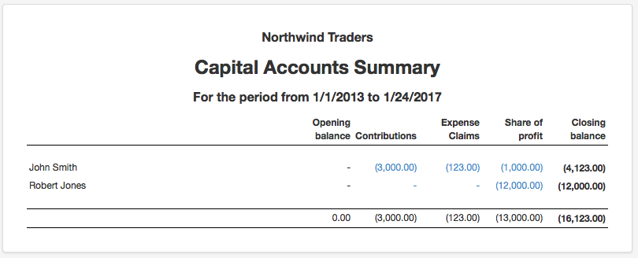

## Table of Contents

## What is a capital account?

A capital account is a part of a country's balance of payments that keeps track of the money coming in and going out for investments and other financial activities. It includes things like buying and selling stocks, bonds, and real estate in other countries. When a country's residents invest in foreign assets, it's called a capital outflow. When foreigners invest in the country's assets, it's called a capital inflow.

The capital account is important because it shows how a country is interacting with the rest of the world financially. If a country has more capital inflows than outflows, it means it is receiving more investment from abroad than it is sending out. This can help the country grow its economy. On the other hand, if there are more outflows, it might mean the country's residents are looking for better investment opportunities elsewhere.

## What does a negative balance in the capital account mean?

A negative balance in the capital account means that a country is sending more money abroad for investments than it is receiving from foreign investors. This can happen when people in the country are buying more foreign assets like stocks, bonds, or real estate than foreigners are buying in the country. It's like the country is spending more on investments outside its borders than it is getting from investments inside its borders.

Having a negative balance in the capital account isn't always bad. It can mean that the country's residents see better investment opportunities in other countries. However, if this goes on for a long time, it might lead to less money available for growth at home. It's important for a country to keep an eye on its capital account to understand how its financial interactions with the rest of the world are affecting its economy.

## How can a negative balance in the capital account occur?

A negative balance in the capital account happens when a country sends more money abroad for things like buying stocks, bonds, or real estate than it gets from foreigners investing in the country. Imagine you have a piggy bank. If you take more money out of it to buy toys from your friends than they put into it to buy toys from you, your piggy bank will have less money. That's similar to what happens with a country's capital account.

This can happen for many reasons. Sometimes, people in the country might think they can get better returns on their money by investing in other countries. For example, if another country's stock market is doing really well, people might want to buy stocks there. Also, if the country's own economy isn't doing great, people might not want to invest at home and look for better opportunities abroad. So, a negative balance in the capital account shows that more money is leaving the country for investments than coming in.

## What are the implications of a negative balance in the capital account for an individual?

A negative balance in a country's capital account can affect individuals in different ways. When a country's residents are sending more money abroad for investments, it might mean there's less money available at home for things like loans and starting businesses. This could make it harder for people to get money to buy a house or start their own company. It might also mean that the local economy isn't growing as fast as it could, which can affect job opportunities and wages.

On the other hand, if people in the country are investing abroad because they see better opportunities there, it might not be all bad for individuals. If those investments do well, the money could come back to the country, and people might have more money to spend and invest at home. But if too much money leaves the country for a long time, it could lead to less money flowing in the local economy, making things more expensive and harder to afford for everyone.

## How does a negative balance in the capital account affect a business?

A negative balance in the capital account can make things harder for businesses. When a country's residents are sending more money abroad for investments, it means there's less money available at home. This can make it tougher for businesses to get loans to grow or to start new projects. If there's less money around, businesses might have a harder time finding investors who want to put money into them. This can slow down the local economy and make it harder for businesses to create jobs and expand.

On the flip side, if people are investing abroad because they think they can get better returns there, it might not be all bad for businesses. If those investments do well, the money could come back to the country. This could mean more money for businesses to use. But if too much money keeps leaving the country, it can lead to less money flowing in the local economy. This can make things more expensive, and businesses might have to raise their prices, which could make it harder to attract customers.

## What are common causes of a negative balance in the capital account?

A negative balance in the capital account can happen when people in a country are sending more money abroad for things like buying stocks, bonds, or real estate than they are getting from foreigners who want to invest in their country. This can happen for many reasons. One reason is that people might think they can make more money by investing in other countries. For example, if another country's stock market is doing really well, people might want to buy stocks there instead of at home.

Another reason for a negative balance in the capital account is if the country's own economy isn't doing so well. If people don't feel confident about their country's economy, they might look for better investment opportunities in other countries. This can lead to more money leaving the country than coming in. Also, if a country has high taxes or strict rules about investing at home, people might choose to invest their money abroad instead.

In some cases, a negative balance in the capital account might be because of big events like a company from the country buying a big business in another country. These kinds of big deals can move a lot of money out of the country all at once. So, a negative balance in the capital account shows that more money is leaving the country for investments than coming in, and this can be influenced by many different things.

## How can a negative balance in the capital account be corrected?

A negative balance in the capital account can be fixed by making the country's economy more attractive for investors. If people see that they can make good money by investing at home, they might not want to send their money abroad as much. The government can do things like lower taxes or make it easier to start businesses. This can make people feel more confident about investing in their own country. Also, if the country's economy starts doing better, more foreigners might want to invest there, which can bring more money in.

Another way to fix a negative balance in the capital account is to make it harder for people to send their money abroad. Some countries might put rules in place to control how much money can leave the country. This can make people think twice before investing abroad. But, this can also make people unhappy because they might feel like they can't do what they want with their money. So, it's important for the government to find a good balance between keeping money at home and letting people invest where they want.

## What are the tax implications of having a negative balance in the capital account?

When a country has a negative balance in its capital account, it means more money is leaving the country for investments abroad than coming in from foreign investments. This can affect taxes in a few ways. If less money is coming into the country, the government might have less money to spend on things like roads, schools, and hospitals. To make up for this, the government might need to raise taxes on people and businesses at home. This can make people feel like they have less money to spend or invest.

On the other hand, if people are investing abroad because they think they can make more money there, they might have to pay taxes on those investments in the other country. This can be complicated because different countries have different tax rules. Sometimes, people can get a tax credit in their home country for the taxes they paid abroad, but it depends on the tax laws of both countries. So, a negative balance in the capital account can lead to higher taxes at home and more complicated tax situations for people investing abroad.

## How do different accounting methods impact the reporting of a negative balance in the capital account?

Different accounting methods can change how a negative balance in the capital account is shown. Some countries use the International Monetary Fund's (IMF) way of doing things, which splits the balance of payments into the current account and the capital account. In this method, the capital account includes things like buying and selling assets, and a negative balance means more money is going out than coming in. But other countries might use a different way of keeping track of things, like mixing the capital account with the financial account. This can make it harder to see if there's a negative balance because the numbers are put together differently.

Another way accounting methods can affect the reporting of a negative balance is by how they count certain transactions. For example, some countries might count money sent home by people working abroad as part of the capital account, while others might put it in the current account. This can make a big difference in whether the capital account looks negative or not. Also, some countries might use different rules for when to count a transaction, like if it's when the money is sent or when it's received. These differences can make it tricky to compare the capital account balances of different countries and see if they have a negative balance.

## What are the long-term effects of maintaining a negative balance in the capital account?

If a country keeps having a negative balance in its capital account for a long time, it can lead to some big changes. When more money keeps leaving the country for investments abroad than coming in, there might be less money at home for things like starting new businesses or building new roads. This can make the country's economy grow slower than it could. People might find it harder to get loans to buy houses or start their own companies because there's less money to go around. If this goes on for a long time, it can make the country's economy weaker and might even lead to fewer jobs and lower wages for people living there.

On the other hand, if people are investing abroad because they think they can make more money there, it's not all bad news. If those investments do well, the money could come back to the country, and people might have more money to spend and invest at home. But if too much money keeps leaving the country, it can make things more expensive because there's less money to buy things with. This can make life harder for everyone, especially if the government has to raise taxes to make up for the money that's gone. So, while a negative balance in the capital account can bring some benefits if the investments do well, it can also cause big problems if it goes on for too long.

## How do international standards treat a negative balance in the capital account?

International standards, like those set by the International Monetary Fund (IMF), have rules for how countries should report their capital account balances. When a country has a negative balance in its capital account, it means more money is going out of the country for investments than coming in. The IMF's rules help make sure that all countries report this in the same way, so it's easier to compare and understand what's happening with different countries' economies. This helps everyone see if a country is sending a lot of money abroad and if that might be a problem.

Even though the IMF sets these standards, different countries might still do things a bit differently. Some might mix the capital account with the financial account, which can make it harder to see if there's a negative balance. But the main idea is that a negative balance in the capital account shows that a country is investing more money abroad than it's getting from foreign investors. This can be important for understanding how a country's economy is doing and what might happen in the future.

## What advanced strategies can be used to manage a persistent negative balance in the capital account?

To manage a persistent negative balance in the capital account, a country can use some smart strategies. One way is to make the country's economy more attractive to investors. This can be done by lowering taxes, making it easier to start businesses, and improving the country's infrastructure like roads and schools. When people see that they can make good money by investing at home, they might not want to send their money abroad as much. Also, if the country's economy starts doing better, more foreigners might want to invest there, which can bring more money in and help balance out the capital account.

Another strategy is to use financial tools like currency controls or capital controls. These are rules that make it harder for people to send their money abroad. By putting limits on how much money can leave the country, the government can try to keep more money at home. But, this can also make people unhappy because they might feel like they can't do what they want with their money. So, it's important for the government to find a good balance between keeping money at home and letting people invest where they want. Using these strategies together can help a country manage a negative balance in its capital account and keep its economy strong.

## What are the implications of a negative capital account balance?

A negative balance in the capital account signifies a net outflow of capital from a nation, primarily due to domestic investors or the government purchasing foreign assets or repaying foreign debts. This scenario often occurs when the perceived return on foreign investments exceeds domestic opportunities or when a country is strengthening its foreign reserves. The implications of this outflow are multifaceted, influencing both short-term and long-term economic dynamics.

### Causes of a Negative Capital Account Balance

Several factors contribute to a negative capital account balance. An increase in foreign direct investment (FDI) by domestic entities, driven by the pursuit of higher returns or strategic business expansions, can lead to capital outflows. Additionally, portfolio investments in foreign markets, repaying foreign loans, and currency speculation can exacerbate this condition. Political instability or unfavorable economic policies at home may also drive capital out of a country as investors seek more secure environments.

### Consequences of a Negative Capital Account Balance

The consequences of a negative capital account are mixed, reflecting both potential benefits and drawbacks. On the upside, capital outflows for investment purposes might signify a robust economy with competitive corporations capable of expanding globally. Such investments can lead to accelerated growth in foreign economies that, in the long term, might benefit the originating country through dividends or boosted bilateral trade relations.

Conversely, excessive and uncontrolled outflows could signify underlying economic vulnerabilities. A prolonged negative balance might deplete a nation's foreign reserves, limiting its ability to defend its currency in foreign exchange markets and potentially leading to depreciation pressures. This situation poses risks for countries with high foreign-denominated debt, as currency devaluation increases the local currency cost of debt service, straining public finances.

### Interaction with the Current Account

Typically, a negative capital account balance is offset by a surplus in the current account, which includes trade balance, net income from abroad, and net current transfers. A surplus here indicates that a country exports more goods and services than it imports, [earning](/wiki/earning-announcement) foreign currency. This inflow can fund the capital outflows, maintaining overall balance of payments stability.

$$
\text{Balance of Payments} = \text{Current Account} + \text{Capital Account} + \text{Financial Account} = 0
$$

A strategic alignment between these accounts ensures that outflows from the capital account do not destabilize the economy, providing resilience against abrupt capital flight.

### Strategies for Managing Capital Account Deficits

Countries facing significant capital account deficits must employ strategic measures to mitigate potential adverse impacts. Enhancing investment climate through economic reforms and political stability can attract foreign investments, offsetting outflows. Additionally, maintaining adequate foreign reserves and establishing swap lines with other central banks can provide the [liquidity](/wiki/liquidity-risk-premium) and confidence needed to manage currency stability.

Government policies may also aim to incentivize domestic investments by improving infrastructure, reducing regulatory burdens, and fostering innovation ecosystems. Such initiatives can redirect potential outflows into domestic ventures, strengthening the local economy.

In summary, while a negative capital account balance indicates increased foreign asset ownership, its economic implications depend on the underlying causes and how well they are managed. Proper alignment with the current account and strategic policy responses are essential to mitigate risks and reinforce economic resilience.

## References & Further Reading

- **Investopedia's Comprehensive Guides:** Investigate Investopedia's extensive resources, offering detailed explanations and practical insights on economic balance and algorithmic trading. These guides are particularly useful for foundational understanding and practical applications in real-world scenarios.

- **Academic Texts on International Economics and Algorithmic Trading Strategies:** Consider reviewing academic textbooks and journals that focus on international economics, such as "International Economics" by Paul Krugman and Maurice Obstfeld, and comprehensive studies on algorithmic trading strategies like "Algorithmic Trading: Winning Strategies and Their Rationale" by Ernie Chan. These texts provide deep theoretical foundations and advanced strategic insights.

- **Industry Reports and Case Studies:** Analyze industry-specific reports and case studies to understand the dynamics of market movements and risk management practices. Reports by financial institutions like the Bank for International Settlements (BIS) and the International Monetary Fund (IMF) can provide data-driven insights and analyses of current market trends and challenges, helping to contextualize theoretical knowledge with practical examples.

