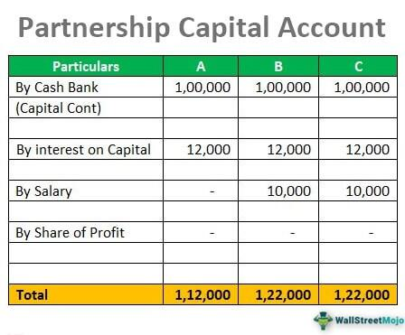

In today's dynamic financial landscape, understanding core economic and financial concepts is crucial for both policymakers and investors. This article explores the intricate interplay between economic balance, negative balance in the capital account, and the role of algorithmic trading. These concepts are fundamental to grasping the complexities of global financial systems and their implications for economic stability and market efficiency.

Economic balance serves as a measure of equilibrium between a nation's income and expenditure, incorporating key components like the current account and capital account. A negative balance in the capital account can signal an outflow of funds, which often results from increased ownership of foreign assets. This phenomenon has significant implications for a country's economic health, necessitating a comprehensive understanding of its causes and consequences.

Algorithmic trading, on the other hand, has revolutionized financial markets by enabling high-speed and high-volume transactions. Its impact on market liquidity and efficiency is profound, presenting both opportunities and challenges for market participants. By evaluating the functions and outcomes of algorithmic trading, this article aims to provide insights into how technological advancements are reshaping financial landscapes.

The following sections will explore the negative balance of the capital account and the transformative impact of algorithmic trading in detail. Moreover, we will highlight the challenges and opportunities these phenomena present for ensuring economic resilience. Such an analysis is essential for developing informed strategies that can optimize benefits while mitigating risks associated with economic and market fluctuations.

## Table of Contents

## Understanding Economic Balance

Economic balance is essential for evaluating a country's financial health by measuring the equilibrium between its income and expenditure. This concept is crucial in assessing how a nation manages its international financial interactions. 

### Components of Economic Balance

Economic balance involves several components, most notably the current account and the capital account. 

- **Current Account**: This comprises the trade balance (exports minus imports of goods and services), net income from abroad (such as interest and dividends), and net current transfers (such as foreign aid and remittances). A surplus in the current account indicates that a country exports more than it imports, reflecting a net inflow of funds.

- **Capital Account**: Although often less emphasized, the capital account records non-financial and non-produced asset transfers, such as debt forgiveness. More broadly, the financial account, closely related to the capital account, records transactions that involve financial assets and liabilities. 

The basic balance, which includes the current account and the net inflow of long-term capital, is used to assess economic stability and predict sustainability.

### Importance of Monitoring Economic Balance

Monitoring economic balance provides insights into a country's economic viability and helps predict potential long-term risks. An imbalance can indicate underlying economic issues, such as excessive reliance on foreign debt or a lack of competitiveness in international markets. Persistent deficits or surpluses might require policy interventions to ensure long-term economic stability.

### Global Context

In a global context, maintaining economic balance is challenging due to interconnected financial markets and varying economic policies. Trade relationships, foreign investments, and currency exchanges influence a nation's economic position, demanding robust mechanisms for monitoring and adjustment. 

Understanding these dynamics can help policymakers and economists develop strategies that mitigate risks and capitalize on opportunities within the international economic system. By ensuring balance, countries can achieve sustainable growth and reduce vulnerability to global economic fluctuations.

## The Implications of a Negative Capital Account Balance

A negative balance in the capital account signifies a net outflow of capital from a nation, primarily due to domestic investors or the government purchasing foreign assets or repaying foreign debts. This scenario often occurs when the perceived return on foreign investments exceeds domestic opportunities or when a country is strengthening its foreign reserves. The implications of this outflow are multifaceted, influencing both short-term and long-term economic dynamics.

### Causes of a Negative Capital Account Balance

Several factors contribute to a negative capital account balance. An increase in foreign direct investment (FDI) by domestic entities, driven by the pursuit of higher returns or strategic business expansions, can lead to capital outflows. Additionally, portfolio investments in foreign markets, repaying foreign loans, and currency speculation can exacerbate this condition. Political instability or unfavorable economic policies at home may also drive capital out of a country as investors seek more secure environments.

### Consequences of a Negative Capital Account Balance

The consequences of a negative capital account are mixed, reflecting both potential benefits and drawbacks. On the upside, capital outflows for investment purposes might signify a robust economy with competitive corporations capable of expanding globally. Such investments can lead to accelerated growth in foreign economies that, in the long term, might benefit the originating country through dividends or boosted bilateral trade relations.

Conversely, excessive and uncontrolled outflows could signify underlying economic vulnerabilities. A prolonged negative balance might deplete a nation's foreign reserves, limiting its ability to defend its currency in foreign exchange markets and potentially leading to depreciation pressures. This situation poses risks for countries with high foreign-denominated debt, as currency devaluation increases the local currency cost of debt service, straining public finances.

### Interaction with the Current Account

Typically, a negative capital account balance is offset by a surplus in the current account, which includes trade balance, net income from abroad, and net current transfers. A surplus here indicates that a country exports more goods and services than it imports, [earning](/wiki/earning-announcement) foreign currency. This inflow can fund the capital outflows, maintaining overall balance of payments stability.

$$
\text{Balance of Payments} = \text{Current Account} + \text{Capital Account} + \text{Financial Account} = 0
$$

A strategic alignment between these accounts ensures that outflows from the capital account do not destabilize the economy, providing resilience against abrupt capital flight.

### Strategies for Managing Capital Account Deficits

Countries facing significant capital account deficits must employ strategic measures to mitigate potential adverse impacts. Enhancing investment climate through economic reforms and political stability can attract foreign investments, offsetting outflows. Additionally, maintaining adequate foreign reserves and establishing swap lines with other central banks can provide the [liquidity](/wiki/liquidity-risk-premium) and confidence needed to manage currency stability.

Government policies may also aim to incentivize domestic investments by improving infrastructure, reducing regulatory burdens, and fostering innovation ecosystems. Such initiatives can redirect potential outflows into domestic ventures, strengthening the local economy.

In summary, while a negative capital account balance indicates increased foreign asset ownership, its economic implications depend on the underlying causes and how well they are managed. Proper alignment with the current account and strategic policy responses are essential to mitigate risks and reinforce economic resilience.

## Role of Algorithmic Trading in Modern Markets

Algorithmic trading, commonly known as algo trading, has dramatically transformed modern financial markets by allowing transactions at unprecedented speed and [volume](/wiki/volume-trading-strategy). This advanced trading method relies on complex algorithms to make critical trading decisions and execute orders with minimal human intervention. The aim is to take advantage of small price fluctuations in highly liquid stocks or currencies, optimizing profits from high-frequency trading.

At its core, [algorithmic trading](/wiki/algorithmic-trading) operates on pre-set rules involving timing, price, quantity, and other mathematical models. For instance, an algorithm can be designed to buy a stock when its 50-day moving average rises above the 200-day moving average, a strategy known as the Golden Cross.

The impact of algorithmic trading on market liquidity and efficiency is profound. It enhances liquidity by providing a consistent stream of buy and sell orders, often narrowing bid-ask spreads, which can lead to reduced transaction costs for all market participants. Increased liquidity typically results in more stable markets, as it becomes easier for large transactions to occur without causing significant price changes.

From a strategic standpoint, algorithmic trading uses quantitative data analysis to make informed decisions about capital allocation and risk management. Account balance plays a fundamental role in this context, as traders must ensure they have adequate capital to engage in high volume trades, while simultaneously managing the risks associated with rapid trading activities.

Advanced technologies have equipped traders with the tools to identify and exploit market opportunities. For instance, [machine learning](/wiki/machine-learning) and [artificial intelligence](/wiki/ai-artificial-intelligence) are increasingly being integrated into algorithmic strategies for deeper insights and refined execution. These technologies enable the development of adaptive algorithms that can learn from past trading data to improve their predictions and outcomes over time.

However, while algorithmic trading provides numerous benefits, it is not without risks. The high-speed nature of algo trading can amplify market [volatility](/wiki/volatility-trading-strategies), especially during periods of economic uncertainty. The "Flash Crash" of May 6, 2010, serves as a notable example where algorithmic trading contributed to significant market instability. In such instances, automatic trading systems can lead to rapid buy-sell decisions triggered by other algorithms, exacerbating price swings and potentially leading to substantial market disruptions.

Overall, algorithmic trading has reshaped the financial landscape, offering both considerable advantages in terms of efficiency and liquidity, as well as challenges related to market volatility and risk management. Navigating these complexities requires a sophisticated understanding of both the technological underpinnings and the strategic implications of this transformative trading approach.

## How Economic Balance and Algorithmic Trading Interact

The interaction between economic balance and algorithmic trading presents a complex landscape of opportunities and challenges for market participants and regulators. Algorithmic trading, which relies on pre-programmed trading instructions, plays a pivotal role during economic downturns by contributing to market liquidity. Liquidity provision is essential during such periods as it aids in market stabilization, reduces transaction costs, and facilitates the efficient allocation of capital. By executing trades with high speed and volume, algorithmic traders can act as market makers, narrowing bid-ask spreads and ensuring that participants can enter and [exit](/wiki/exit-strategy) positions with minimal slippage.

However, excessive algorithmic trading activity can sometimes exacerbate market volatility, especially during periods of negative economic growth. The rapid nature of these trades can lead to situations where price movements are amplified, resulting in short-term volatility spikes that may mislead investors about market conditions. Historical instances, such as the 2010 Flash Crash, illustrate how algorithmic trading can momentarily destabilize markets when sell-offs trigger cascading effects that overwhelm market depth.

Understanding these dynamics requires analyzing historical examples and case studies. For instance, during the 2008 financial crisis, algorithmic trading significantly contributed to market stabilization by maintaining liquidity even as traditional market makers retreated. Conversely, the aforementioned Flash Crash underscored the risks associated with high-frequency trading when high-speed interactions between algorithms led to dramatic price swings within minutes.

To manage these interactions effectively, market participants and regulators must adopt a balanced and thoughtful approach. This includes implementing robust risk management strategies and regulatory measures to curb potential excesses without stifling the beneficial aspects of algorithmic trading. Introducing circuit breakers and other safeguard mechanisms can mitigate the risk of volatility spikes, while promoting transparency and enhancing the resilience of trading systems.

In conclusion, navigating the interplay between economic balance and algorithmic trading demands a nuanced understanding of both opportunities and risks. By harnessing the stabilizing potential of algorithmic trading while implementing safeguards against volatility amplification, stakeholders can enhance economic resilience and maintain financial stability in evolving market conditions.

## Navigating Challenges and Embracing Opportunities

Addressing the challenges posed by negative capital account balances and algorithmic trading requires strategic foresight and meticulous planning. The negative balance in the capital account signals capital outflow which can strain a country’s foreign exchange reserves and potentially destabilize its economy. One potential regulatory measure involves implementing targeted capital controls. These controls can help manage the pace of capital flows to prevent abrupt economic disruptions. Additionally, enhancing transparency in capital flow data collection allows policymakers to make informed decisions and respond swiftly to volatile market conditions.

Algorithmic trading, with its capacity for high-frequency, high-volume transactions, presents both challenges and opportunities. The rapid pace of algorithmic trading can create systemic risks if not properly regulated. Regulatory frameworks need to ensure that trading algorithms are subject to rigorous testing and compliance standards, limiting the potential for market manipulation or erratic trading behaviors. Introducing circuit breakers and minimum resting times for orders can mitigate the risks of flash crashes.

Technological advancements, particularly in machine learning, present unique opportunities to refine algorithmic trading strategies. Machine learning algorithms can analyze vast data sets in real-time, enhancing decision-making processes in trading strategies. These technologies can improve market predictions and risk assessments, allowing traders to optimize their approaches dynamically. For instance, sentiment analysis from social media and news can be integrated into trading models, identifying potential market-moving events before they unfold.

Collaboration among policymakers, financial institutions, and technology developers is essential for effective market regulation. Establishing joint task forces and public-private partnerships fosters an environment where diverse expertise converges. These collaborations can develop adaptive regulatory frameworks that are both robust and flexible, capable of evolving with technological and market advancements.

Continuous innovation and adaptation are crucial in navigating future financial landscapes. As financial systems grow more complex, ongoing research and development in regulatory technologies (RegTech) can streamline the compliance process. By leveraging artificial intelligence and blockchain technologies, regulatory authorities can monitor transactions more effectively and enforce compliance with financial regulations in real-time.

In conclusion, the challenges and opportunities presented by negative capital account balances and algorithmic trading necessitate a proactive approach. By implementing regulatory measures, embracing technological advancements, and fostering collaboration, stakeholders can ensure economic stability while capitalizing on growth prospects in evolving financial markets.

## Conclusion

In conclusion, the comprehension of economic balance, the consequences of a negative capital account, and the role of algorithmic trading is essential for ensuring economic stability in a rapidly changing financial environment. The dynamic interaction between these elements mandates a strategic and well-considered integration into market practices to harness potential benefits while minimizing associated risks.

Economic balance, which reflects the equilibrium between a nation’s financial resources and liabilities, acts as a barometer for long-term sustainability. Anomalies, such as a negative capital account balance indicating an outflow of funds, must be comprehensively understood and strategically managed. Such understanding can prevent potential vulnerabilities in a nation's economic fabric and ensure robust financial health.

Similarly, algorithmic trading has transformed market operations by offering unparalleled speed and volume efficiency. However, strategic caution is necessary to prevent market volatility and risk exposure. Algorithmic trading strategies should be seamlessly integrated into broader market strategies, emphasizing capital allocation efficiency and risk management.

As financial markets continuously evolve, staying informed of technological advancements and adapting to new economic realities is crucial. This adaptability enables market participants to navigate uncertainties effectively and seize emergent opportunities. Embracing machine learning and advanced technologies can further refine algorithmic trading, making them pivotal tools for enhancing market strategies.

Effective navigation through the complexities of modern financial landscapes demands that stakeholders remain vigilant. By leveraging the insights discussed, financial institutions, policymakers, and investors can craft robust strategies, thereby fortifying themselves against economic instability and ensuring greater market resilience.

## References & Further Reading

- **Investopedia's Comprehensive Guides:** Investigate Investopedia's extensive resources, offering detailed explanations and practical insights on economic balance and algorithmic trading. These guides are particularly useful for foundational understanding and practical applications in real-world scenarios.

- **Academic Texts on International Economics and Algorithmic Trading Strategies:** Consider reviewing academic textbooks and journals that focus on international economics, such as "International Economics" by Paul Krugman and Maurice Obstfeld, and comprehensive studies on algorithmic trading strategies like "Algorithmic Trading: Winning Strategies and Their Rationale" by Ernie Chan. These texts provide deep theoretical foundations and advanced strategic insights.

- **Industry Reports and Case Studies:** Analyze industry-specific reports and case studies to understand the dynamics of market movements and risk management practices. Reports by financial institutions like the Bank for International Settlements (BIS) and the International Monetary Fund (IMF) can provide data-driven insights and analyses of current market trends and challenges, helping to contextualize theoretical knowledge with practical examples.

