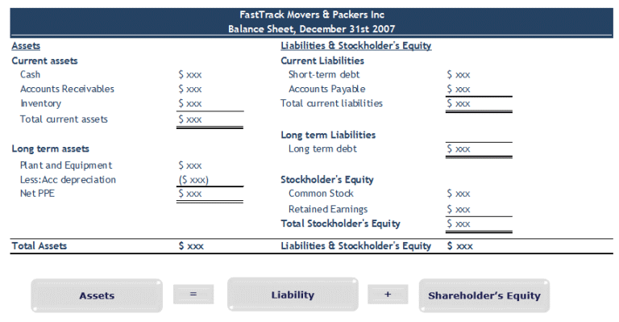

The financial markets are inherently unpredictable and complex, characterized by volatility and risk at every turn. A prominent example of these challenges is the saga involving the short selling of KaloBios Pharmaceuticals. This incident is emblematic of the dangers posed by short selling and algorithmic trading, where events can unfold with unexpected velocity, leading to severe financial repercussions.

The story of Joe Campbell, a short seller who suffered significant losses while trading KaloBios Pharmaceuticals, stands out as a cautionary illustration. Campbell's experience underscores the potential for negative balances when market behavior defies expectations. Through his ordeal, the unpredictable nature of trading, especially in volatile environments, becomes starkly apparent.

This account notably highlights the risks that can accompany algorithmic trading and short selling. Both strategies carry inherent challenges that can quickly escalate, impacting traders' financial health if not managed with vigilance and preparation. The KaloBios Pharmaceuticals episode, therefore, serves as a wake-up call for traders seeking to engage in these high-risk strategies, urging them to weigh the potential consequences carefully against possible gains in the dynamic landscape of financial markets.

## Table of Contents

## Understanding Short Selling and its Risks

Short selling is a financial strategy that entails selling borrowed shares of a stock with the expectation that the stock’s price will decrease, allowing the trader to buy back the shares at a lower price and return them to the lender while pocketing the difference. Although it can be highly lucrative if the stock price falls, short selling carries substantial risks and potentially unlimited losses, as the stock price can rise indefinitely. This strategy is often used in volatile markets and requires a deep understanding of several financial concepts, including hedging, penny stocks, and market volatility.

Hedging is a risk management strategy used to offset potential losses in an investment. For short sellers, this might involve holding a complementary asset that could appreciate if the shorted stock price rises unexpectedly. The importance of hedging is underscored when considering the unpredictable nature of many stocks, especially penny stocks—shares of small public companies that trade at low prices and have low market capitalization. These stocks are known for their volatility, presenting both opportunities and risks.

Market volatility refers to the frequency and magnitude of price movements in a security or market index. High volatility increases the likelihood of unexpected price swings, which can significantly affect a short position. Experienced traders often monitor volatility indicators and may utilize derivative instruments to protect or hedge their positions against adverse price movements.

Joe Campbell's experience with KaloBios Pharmaceuticals illustrates the dangers of maintaining an unhedged short position. Campbell shorted shares of KaloBios, a biotechnology firm, expecting the stock price to fall as the company was in financial distress. However, following unexpected news of Martin Shkreli acquiring a major stake in KaloBios, the stock price skyrocketed, leading to substantial losses for Campbell, who had not hedged his position against such an upward movement.

This incident exemplifies how quickly an unprepared short seller's position can become untenable. Without strategies like stop-loss orders or protective options to limit potential losses, traders can face dire financial consequences. As demonstrated by Campbell's case, short selling requires a high level of expertise and experience. Traders must develop robust risk management strategies to anticipate and respond to market dynamics effectively, ensuring they are prepared for all possible outcomes.

In conclusion, short selling is not a strategy for the inexperienced. It demands a nuanced approach, incorporating risk mitigation techniques and continuous market analysis to navigate the complexities and uncertainties of financial markets.

## The KaloBios Pharmaceuticals Case Study

KaloBios Pharmaceuticals was a biotechnology company that found itself under financial distress towards the end of 2015. Like many small biotech firms, KaloBios specialized in the development of novel therapeutics, but by November of that year, the company was grappling with severe financial difficulties. This precarious situation, coupled with an announcement indicating the potential cessation of operations, made KaloBios an attractive target for short sellers, who anticipated further decline in its stock price.

Short selling involves borrowing shares of a stock to sell them with the expectation that the stock will decrease in value, allowing the short seller to buy them back at a lower price, return the borrowed shares, and pocket the difference. However, this strategy carries significant risk, especially when unexpected events occur.

A key turning point for KaloBios came unexpectedly when Martin Shkreli, a controversial figure and pharmaceutical executive, made a surprising intervention. Shkreli acquired a substantial stake in the ailing firm, purchasing approximately 70% of its outstanding shares. This news resulted in an immediate and dramatic increase in the stock price, counter to the expectations of the short sellers who had bet on its decline.

This sudden market activity caught many traders off guard, particularly those with unhedged short positions. Joe Campbell, a trader who had taken such a position on KaloBios stock, found himself in a severe financial predicament. The stock price surged rapidly, causing his short position to become significantly underwater. Instead of profiting from a falling stock price, Campbell faced enormous losses as the price climbed higher.

The consequences of this price rally were profound, demonstrating how quickly market conditions can shift. Such unexpected developments exemplify the high risks associated with short selling, particularly in volatile markets where sudden news can reshape the trading landscape almost overnight. The KaloBios scenario underlines the potential pitfalls for traders who do not adequately prepare for unforeseen market movements and the importance of remaining adaptable in dynamic financial markets.

## Algorithmic Trading and Market Dynamics

Algorithmic trading, commonly known as algo trading, is a method where traders use computer algorithms to execute trades based on predefined criteria, such as timing, price, or quantity. This advanced trading technique offers the benefit of swiftly capitalizing on market opportunities that may be difficult for human traders to detect in real-time. However, its inherent automation also poses risks. Notably, the significant [volatility](/wiki/volatility-trading-strategies) introduced by [algorithmic trading](/wiki/algorithmic-trading) can have destabilizing effects on the markets.

A notable example illustrating these risks is the experience of Joe Campbell with KaloBios Pharmaceuticals. His financial predicament serves as a stark reminder of the repercussions that can ensue when algorithms fail to adapt to unforeseen market developments. Campbell's case illustrates how quickly an automated trading strategy can spiral out of control when unexpected events occur—such as Martin Shkreli's sudden and substantial investment in KaloBios, which profoundly altered the stock's trajectory.

Shkreli's strategic acquisition was a pivotal event that exemplified the capacity of influential investors to drastically affect stock prices. This unpredictable intervention underscores the need for constant vigilance and dynamic response capabilities within algorithmic trading systems. Algorithms, while efficient at processing vast quantities of data and executing trades at speeds unattainable by human traders, may lack the ability to [factor](/wiki/factor-investing) in the qualitative aspects of market sentiment and investor influence, which can lead to significant oversights.

To mitigate the risks posed by algorithmic trading, it's crucial that these systems are regularly monitored and updated to reflect changing market conditions. Advanced [machine learning](/wiki/machine-learning) techniques can enhance algorithm adaptability by continuously learning from new data. Furthermore, implementing risk management strategies, such as circuit breakers and adaptive risk controls, can help cushion against volatile market movements. 

Understanding the dynamics of trading algorithms is essential for modern traders aiming to leverage technology for competitive advantage. By recognizing the limitations and preparing for the inherent unpredictability of financial markets, traders can better safeguard their investments.

## Negative Balance Implications and Risk Management

Joe Campbell's financial ordeal stands as a stark illustration of the perils associated with inadequate risk management in trading. The sudden transition of his trading account from a balance of $37,000 to a negative $106,000 vividly underscores the inherent volatility and potential downsides of the financial markets. This extreme scenario occurred when unexpected market developments, such as the KaloBios Pharmaceuticals stock price surge triggered by Martin Shkreli's involvement, led to drastic and unforeseen consequences.

Risk management is a cornerstone of successful trading, acting as a safeguard against such severe financial hits. One crucial element in this regard is the use of protective stops. A stop-loss order is an automatic order to sell a security when it reaches a certain price, limiting the potential loss on an investment. For instance, setting a stop-loss at a price level below the entry point can mitigate potential downside. 

Furthermore, the implementation of circuit breakers in trading systems can prevent catastrophic losses. Circuit breakers are designed to temporarily halt trading when there are significant price declines, allowing traders and algorithms to recalibrate and reduce panic selling. These tools are vital for maintaining market stability during extreme volatility.

Trading on margin, where investors borrow funds to make trades, amplifies both potential gains and potential losses, requiring traders to have a robust understanding of their own risk tolerance. Leverage can exacerbate the effects of market movements, as seen in Campbell’s massive account balance swing. Therefore, a frank assessment of risk tolerance is essential before engaging in margin and leveraged trades, ensuring that traders can withstand a significant adverse move without facing financial ruin.

The rapid and extensive market movement against Campbell's position serves as a cautionary tale. Traders must be equipped for the swift pace and magnitude of market changes, incorporating strategies like diversification, position sizing, and constant monitoring of market news and conditions. This comprehensive approach can help mitigate the risks of adverse market shifts and prevent an account from plunging into a negative balance.

Campbell's story serves as a reminder that success in trading is not just about making profitable trades, but also about managing the risks associated with losses. It reinforces the importance of maintaining an effective risk management strategy, ensuring that traders are prepared for any rapid and unfavorable developments in a volatile market environment.

## Conclusion: Key Takeaways for Traders

The KaloBios Pharmaceuticals incident starkly exemplifies the unpredictable nature of financial markets, where prices can be suddenly and significantly influenced by external factors, as demonstrated by Martin Shkreli's surprising acquisition. This serves as a critical reminder of the inherent risks associated with certain trading strategies, particularly short selling. Short selling carries the potential for infinite losses since a stock's price can climb indefinitely. Thus, it requires substantial expertise and preparedness to manage such risks effectively.

Joe Campbell’s experience highlights the necessity for traders to exercise caution and adaptability. Financial markets are not only venues for growth and profit but also forums where unexpected losses can occur. To navigate these turbulent waters, traders must not only be skilled but also flexible in their strategies, ready to pivot when the market exhibits volatility beyond initial expectations.

Moreover, this narrative reinforces a fundamental principle of trading: never commit more capital to a trade than you can comfortably afford to lose. This rule is essential to maintain financial stability and avoid the catastrophic outcomes seen in situations like Campbell's, where a $37,000 account was transformed into a negative $106,000 balance almost instantaneously. Balancing potential rewards with these risks demands meticulous planning and the implementation of robust risk management strategies, including the judicious use of stop-loss orders and the careful assessment of margin requirements. By adhering to these principles, traders can better navigate the capriciousness of the financial markets while safeguarding their portfolios against unforeseen setbacks.

## References & Further Reading

[1]: Bergstra, J., Bardenet, R., Bengio, Y., & Kégl, B. (2011). ["Algorithms for Hyper-Parameter Optimization."](https://dl.acm.org/doi/10.5555/2986459.2986743) Advances in Neural Information Processing Systems 24.

[2]: ["Advances in Financial Machine Learning"](https://www.amazon.com/Advances-Financial-Machine-Learning-Marcos/dp/1119482089) by Marcos Lopez de Prado

[3]: ["Evidence-Based Technical Analysis: Applying the Scientific Method and Statistical Inference to Trading Signals"](https://www.amazon.com/Evidence-Based-Technical-Analysis-Scientific-Statistical/dp/0470008741) by David Aronson

[4]: ["Machine Learning for Algorithmic Trading"](https://github.com/stefan-jansen/machine-learning-for-trading) by Stefan Jansen

[5]: ["Quantitative Trading: How to Build Your Own Algorithmic Trading Business"](https://www.amazon.com/Quantitative-Trading-Build-Algorithmic-Business/dp/1119800064) by Ernest P. Chan