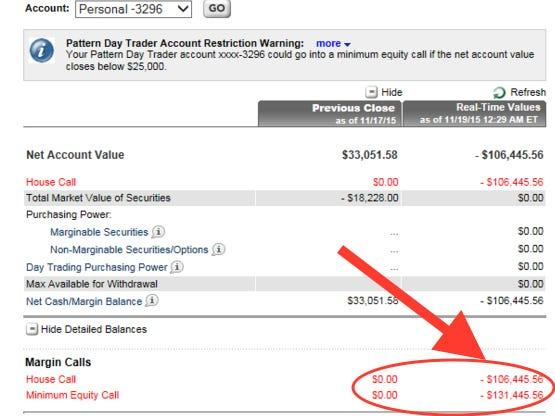

## Table of Contents

## What is short selling and how does it work?

Short selling is when someone borrows a stock or asset from someone else and sells it right away, hoping to buy it back later at a lower price. They make money if the price goes down because they can buy it back cheaper than they sold it. But if the price goes up, they lose money because they have to buy it back at a higher price than they sold it.

Here's how it works: Imagine you think the price of a stock, let's call it XYZ, is going to drop. You borrow 100 shares of XYZ from someone else and sell them for $10 each, so you get $1,000. If the price drops to $8 per share, you can buy back the 100 shares for $800, return the shares to the person you borrowed them from, and keep the $200 difference as profit. But if the price goes up to $12 per share, you have to buy back the 100 shares for $1,200, losing $200 in the process.

## What is a negative balance in the context of short selling?

A negative balance in short selling happens when the price of the stock you borrowed goes up instead of down. When you short sell, you borrow a stock and sell it, hoping to buy it back cheaper later. But if the price goes up, you have to buy it back at a higher price than you sold it for. This means you lose money, and that loss shows up as a negative balance in your account.

For example, let's say you borrowed and sold 100 shares of a stock at $10 each, so you got $1,000. If the price goes up to $12 per share, you have to buy back those 100 shares at $1,200. You now have a negative balance of $200 because you lost that much money. This negative balance is what you owe until you close out the short position or add more money to your account.

## Who is KaloBios Pharmaceuticals and what do they do?

KaloBios Pharmaceuticals is a company that used to work on making new medicines. They focused on treatments for serious diseases, like lung infections and cancer. Their goal was to help people who were very sick by creating drugs that could fight these diseases better than what was already available.

The company ran into money problems and had to stop working in 2015. They tried to find new ways to keep going, but in the end, they couldn't make it work. KaloBios was once a hopeful company in the world of medicine, but it couldn't stay in business.

## What are the risks associated with short selling KaloBios Pharmaceuticals stock?

Short selling KaloBios Pharmaceuticals stock comes with a lot of risks. One big risk is that the stock price could go up instead of down. If you short sell a stock and it goes up, you lose money. This can happen if there's good news about the company or if other people start buying the stock. Since KaloBios was a small company that had money problems, it could be hard to predict what will happen to its stock price.

Another risk is that KaloBios could have a sudden change in its situation. For example, if they got new money or a new partner, the stock price could jump up quickly. This would make it very expensive for you to buy back the stock you borrowed, leading to big losses. Also, because KaloBios was not doing well and stopped working, there might not be many people willing to lend you their stock to short sell, making it harder to do.

Lastly, short selling can lead to unlimited losses. Unlike buying a stock where the most you can lose is what you paid for it, with short selling, there's no limit to how much you could lose if the stock price keeps going up. This makes short selling KaloBios stock very risky, especially since the company was already struggling and its future was uncertain.

## How can an E*TRADE account holder engage in short selling?

To start short selling with an E*TRADE account, you first need to have a margin account. This is different from a regular account because it lets you borrow money or stocks from E*TRADE. If you don't have a margin account yet, you can apply for one on their website or by calling customer service. Once you have a margin account, you can look for stocks you think will go down in price. When you find one, you can place a short sell order through the E*TRADE platform. This means you're borrowing the stock from E*TRADE and selling it right away.

After you've short sold the stock, you need to keep an eye on its price. If the price goes down like you hoped, you can buy the stock back at the lower price and return it to E*TRADE, keeping the difference as profit. But if the price goes up, you'll lose money because you have to buy it back at a higher price than you sold it for. Remember, short selling can be risky, so it's important to understand what you're doing and be ready to handle any losses. E*TRADE has tools and resources to help you learn more about short selling and manage your trades.

## What are the specific rules and regulations for short selling on E*TRADE?

When you want to short sell on E*TRADE, you need to have a margin account. This is because short selling means borrowing stocks from E*TRADE to sell them, hoping to buy them back later at a lower price. E*TRADE has rules about how much money you need to have in your account to do this. They call this the "margin requirement," and it's usually a percentage of the value of the stocks you want to short sell. If the stock price goes up instead of down, you might get a "margin call," which means you need to add more money to your account or close your short position.

E*TRADE also follows rules set by the Financial Industry Regulatory Authority (FINRA) and the Securities and Exchange Commission (SEC). One important rule is the "uptick rule," which says you can only short sell a stock if its price is going up a little bit. This is to stop the stock price from falling too fast. Another rule is that you can't short sell a stock if you don't believe you can borrow it. E*TRADE checks to make sure there are enough shares available to borrow before letting you short sell. It's important to know these rules to avoid getting into trouble or losing a lot of money.

## What led to the negative balance in the short selling of KaloBios Pharmaceuticals by an E*TRADE account holder?

An E*TRADE account holder who short sold KaloBios Pharmaceuticals stock likely ended up with a negative balance because the stock price went up instead of down. When you short sell, you borrow a stock and sell it, hoping to buy it back later at a lower price. But if the price goes up, you have to buy it back at a higher price than you sold it for, which means you lose money. This loss shows up as a negative balance in your account.

In the case of KaloBios, the stock price might have gone up because of unexpected news or events. For example, if there was news about a potential new investor or a partnership, the stock price could have jumped. Since KaloBios was a small company with money problems, any good news could have a big effect on its stock price. The E*TRADE account holder would then have to buy back the stock at the higher price, leading to a negative balance in their account.

## How does margin trading relate to the negative balance in this scenario?

Margin trading is when you borrow money from your broker, like E*TRADE, to buy more stocks than you could with just your own money. When you short sell, you're also using margin because you're borrowing the stock to sell it. If the stock price goes up instead of down, you have to buy it back at a higher price. This can lead to a negative balance because you lose money on the difference between the price you sold it for and the higher price you have to buy it back at.

In the case of KaloBios Pharmaceuticals, if an E*TRADE account holder short sold the stock and it went up in price, they would have to buy it back at that higher price. This would cause a negative balance in their account because they lost money. Margin trading made this possible because it allowed them to borrow the stock in the first place, but it also increased the risk of ending up with a negative balance if things didn't go as planned.

## What are the potential financial consequences of a negative balance in short selling?

When you short sell and end up with a negative balance, it means you lost money. You borrowed a stock and sold it, hoping the price would go down. But if the price goes up, you have to buy it back at a higher price than you sold it for. The difference between these prices is your loss, and it shows up as a negative balance in your account. This can be a big problem because you now owe money to your broker, like E*TRADE, for the amount you lost.

If you have a negative balance, you might get a margin call from your broker. This means they want you to add more money to your account to cover the losses or close your short position. If you can't add more money, the broker might sell some of your other investments to cover the negative balance. This can lead to even more losses if those investments were doing well. So, a negative balance from short selling can not only cost you money but also force you to sell other assets, making your financial situation worse.

## What steps can an E*TRADE account holder take to mitigate the risks of a negative balance?

To avoid a negative balance when short selling on E*TRADE, you should always have a plan. This means setting a stop-loss order, which is like a safety net. It tells E*TRADE to buy back the stock you short sold if the price goes up to a certain level. This can help stop your losses from getting too big. Also, make sure you have enough money in your account to cover any losses. E*TRADE might ask you to add more money if your losses are too big, so it's good to be ready for that.

Another way to lower the risk is to keep an eye on the stock you short sold. News about the company can change the stock price quickly, so staying updated can help you decide when to buy back the stock. It's also smart not to short sell too much of your money on one stock. Spreading your money around different investments can help protect you if one of them goes the wrong way. By being careful and having a plan, you can make short selling less risky.

## How does the volatility of KaloBios Pharmaceuticals stock affect short selling strategies?

The ups and downs of KaloBios Pharmaceuticals stock can make short selling very tricky. Because the stock price can change a lot and fast, it's hard to guess what will happen next. If you short sell KaloBios stock and it suddenly goes up because of some good news or a new investor, you could lose a lot of money quickly. This means you need to be very careful and watch the stock closely. You might want to use a stop-loss order to help limit your losses if the price starts to go up.

Because KaloBios was a small company with money problems, its stock could be even more unpredictable. Any small news could make the stock price jump or drop a lot. This makes it really important to have a plan for when to buy back the stock you short sold. You should also not put too much of your money into short selling KaloBios stock because the risk is high. By being ready for big changes and having a way to stop your losses, you can handle the [volatility](/wiki/volatility-trading-strategies) better.

## What are the expert strategies for managing and recovering from a negative balance in short selling?

When you have a negative balance from short selling, the first thing to do is to stay calm and look at your options. One good strategy is to add more money to your account to cover the losses. This can help you avoid a margin call from your broker, where they might force you to close your position or sell other investments. Another strategy is to use a stop-loss order, which automatically buys back the stock if the price goes up to a certain level. This can help stop your losses from getting too big. It's also smart to talk to your broker about your situation. They might have advice or be able to give you more time to fix the negative balance.

Another way to recover from a negative balance is to look at your other investments. If you have other stocks that are doing well, you might be able to sell some of them to cover the losses from your short sell. This can be a tough choice, but it might help you avoid even bigger problems. It's also important to learn from what happened. Think about why the stock price went up and how you can do better next time. Maybe you need to do more research or be quicker to act when things start to go wrong. By using these strategies, you can manage and recover from a negative balance in short selling.

## References & Further Reading

[1]: Bergstra, J., Bardenet, R., Bengio, Y., & Kégl, B. (2011). ["Algorithms for Hyper-Parameter Optimization."](https://dl.acm.org/doi/10.5555/2986459.2986743) Advances in Neural Information Processing Systems 24.

[2]: ["Advances in Financial Machine Learning"](https://www.amazon.com/Advances-Financial-Machine-Learning-Marcos/dp/1119482089) by Marcos Lopez de Prado

[3]: ["Evidence-Based Technical Analysis: Applying the Scientific Method and Statistical Inference to Trading Signals"](https://www.amazon.com/Evidence-Based-Technical-Analysis-Scientific-Statistical/dp/0470008741) by David Aronson

[4]: ["Machine Learning for Algorithmic Trading"](https://github.com/stefan-jansen/machine-learning-for-trading) by Stefan Jansen

[5]: ["Quantitative Trading: How to Build Your Own Algorithmic Trading Business"](https://www.amazon.com/Quantitative-Trading-Build-Algorithmic-Business/dp/1119800064) by Ernest P. Chan