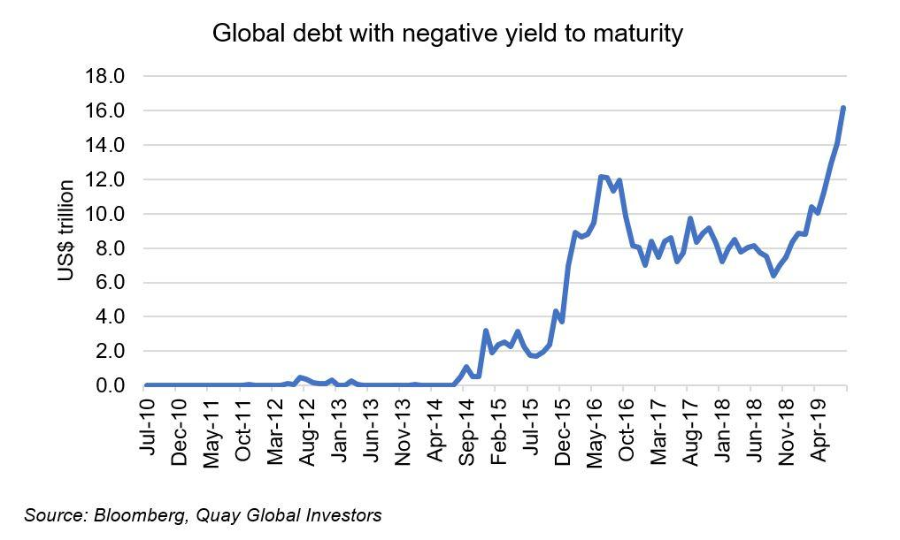

## Table of Contents

## What are bond yields and how are they calculated?

Bond yields are a way to measure the return an investor can expect from a bond. They show how much money you will earn from the bond's interest payments compared to the price you paid for the bond. If you buy a bond for less than its face value, the yield will be higher because you are getting the same interest payments but for a lower cost.

To calculate a bond's yield, you need to know the bond's annual interest payment, its current market price, and its face value. The most common way to calculate yield is the yield to maturity (YTM). This calculation takes into account the bond's annual interest payments and the gain or loss you will make when the bond matures. It's a bit like figuring out the average return you will get each year if you hold the bond until it matures. There are online calculators and financial software that can help you figure out the YTM, but the basic idea is to find the interest rate that makes the present value of all future cash flows from the bond equal to its current price.

## What does it mean when bond yields are negative?

When bond yields are negative, it means that investors are willing to pay more for a bond than they will get back when it matures. In other words, they are losing money on the investment. This might sound strange, but it can happen when people are really worried about the economy and just want to keep their money safe, even if it means losing a little bit.

Negative yields usually happen in countries that are seen as very safe places to invest, like Germany or Japan. Investors might choose to accept a small loss on these bonds because they think it's better than risking their money in riskier investments. It's a sign that people are feeling nervous about the future and are willing to pay to keep their money secure.

## Why would an investor buy a bond with a negative yield?

An investor might buy a bond with a negative yield because they want to keep their money safe, even if it means losing a little bit. Imagine you have money and you're worried about the economy. You might think that putting your money in a very safe place, like a bond from a strong country like Germany, is better than risking it in stocks or other investments that could lose a lot more.

Negative yields can also happen when people expect interest rates to go down even more. If an investor buys a bond with a negative yield now, they might be able to sell it later for a higher price if interest rates drop. This is because bond prices go up when interest rates go down. So, even though they lose a bit at first, they could make money if they sell the bond before it matures.

## How do negative bond yields affect the economy?

Negative bond yields can make people feel more worried about the economy. When investors are willing to lose money just to keep their money safe, it shows they are scared about the future. This fear can make them less likely to spend or invest in other ways, which can slow down the economy. If lots of people and businesses are not spending, it can lead to less growth and maybe even a recession.

On the other hand, negative yields can also help the economy in some ways. When bond yields are negative, it can push people to look for other places to put their money, like stocks or real estate. This can help keep money moving around in the economy. Also, if a country's central bank sets negative interest rates to make bond yields negative, it can encourage banks to lend more money, which can help businesses grow and create jobs. So, while negative yields can show that people are worried, they can also be used to try to boost the economy.

## What are the historical instances of negative bond yields?

Negative bond yields are not common, but they have happened a few times in history. One of the earliest examples was in Switzerland in 1973. The Swiss government issued a bond with a negative yield because investors were worried about the economy and wanted to keep their money safe. Another big time for negative yields was in Europe and Japan starting around 2014. Many countries in Europe, like Germany and France, had bonds with negative yields. Japan also had negative yields on some of its government bonds. This happened because people were worried about the global economy and wanted to keep their money in safe places.

In recent years, negative yields have become more common. For example, in 2020, when the COVID-19 pandemic started, lots of countries saw their bond yields go negative. Investors were very scared about what would happen to the economy and wanted to keep their money safe, even if it meant losing a little bit. Negative yields have been used by central banks in places like Europe and Japan as a way to try to help their economies. By making bond yields negative, they hoped to encourage people to spend and invest in other ways, which could help the economy grow.

## How do negative bond yields impact retirement planning?

Negative bond yields can make it harder for people to save for retirement. When bond yields are negative, it means that the money people put into bonds will actually lose value over time. This is a big problem for retirees who often depend on bonds to give them a steady and safe income. If their bonds are losing money, they might have to take money out of other investments, like stocks, which can be riskier and more unpredictable.

On the other hand, negative bond yields can push people to look for other ways to save for retirement. They might choose to invest more in stocks or real estate, which can offer higher returns. This can be good because it might help their savings grow faster. But it also means they have to take on more risk, which can be scary, especially when they are close to retirement and want to keep their money safe. So, negative bond yields make retirement planning trickier, and people need to be careful and think about different ways to save and invest their money.

## What strategies can investors use to mitigate risks associated with negative yields?

When bond yields are negative, investors can look for other places to put their money. One way is to invest in stocks or real estate, which might give them a better return. These investments can be riskier, but they might help their savings grow faster. Another option is to look at bonds from different countries or companies that still have positive yields. By spreading their money around in different kinds of investments, investors can lower the risk of losing money on negative-yield bonds.

Investors can also think about changing how long they plan to keep their money in bonds. If they think interest rates will go down even more, they might buy bonds with negative yields now and sell them later at a higher price. This can work because bond prices go up when interest rates go down. But this strategy needs careful planning and understanding of the market. It's important for investors to keep learning and watching the economy so they can make smart choices about where to put their money.

## How do negative bond yields influence global investment strategies?

Negative bond yields make investors think differently about where to put their money around the world. When bonds in one country have negative yields, investors might look for better places to invest. They might move their money to countries where bonds still give them a good return, or they might choose to invest more in stocks or real estate. This can change how money moves around the world and affect different countries' economies. If a lot of money leaves a country because of negative yields, it can make their currency weaker and their economy slower.

On the other hand, negative yields can also make investors take more risks. If safe investments like bonds are losing money, people might decide to try riskier investments that could give them a bigger return. This can lead to more money going into stocks, real estate, or even new kinds of investments like cryptocurrencies. As a result, global investment strategies become more about finding the right balance between safety and growth, and investors need to be more careful and keep an eye on what's happening in the world economy.

## What role do central banks play in the creation of negative bond yields?

Central banks can make bond yields go negative by setting very low or even negative interest rates. When a central bank like the European Central Bank or the Bank of Japan does this, it makes it cheaper for banks to borrow money. This can lead to more lending and spending in the economy, which is good when the economy is slow. But it also means that the interest people get from bonds goes down. If the central bank's rates are low enough, bond yields can drop below zero, making investors lose money on their bonds.

Central banks use negative interest rates to try to help the economy grow. By making bond yields negative, they hope to encourage people to spend their money instead of keeping it in safe investments like bonds. This can help businesses grow and create jobs. But it also makes it harder for people who want to save money safely, like retirees, because they can't earn as much from bonds. So, central banks have to be careful and think about how their actions affect different parts of the economy.

## How do negative bond yields affect different types of bonds, such as government versus corporate bonds?

Negative bond yields affect government and corporate bonds in different ways. Government bonds, especially from countries seen as safe like Germany or Japan, are more likely to have negative yields. This happens because investors are willing to lose a little money to keep their money safe in these countries. When central banks set very low or negative interest rates, it pushes government bond yields down. This can make it harder for governments to borrow money because they have to pay less interest to investors.

Corporate bonds, on the other hand, are less likely to have negative yields. Companies are seen as riskier than governments, so investors want a higher return to put their money in corporate bonds. But when government bond yields are negative, it can make corporate bonds look more attractive. Investors might be willing to take a bit more risk with corporate bonds if they can get a positive return. Still, if the economy is really bad, even some corporate bonds might have negative yields, especially if investors are very worried about the future.

## What are the potential long-term effects of sustained negative bond yields on financial markets?

If negative bond yields keep happening for a long time, it can change how people think about investing. People might start to look for other places to put their money, like stocks or real estate, because they want to make some money instead of losing it on bonds. This can make stock prices go up and make more people want to buy houses or other property. But it also means that people are taking more risks with their money. If everyone is trying to make money in the same places, it can make those markets grow too fast and maybe even crash if something goes wrong.

In the long run, negative bond yields can also make it harder for banks to make money. Banks usually make money by borrowing at low rates and lending at higher rates. But if bond yields are negative, it means they might have to pay to keep their money safe, which can hurt their profits. This can make banks lend less money, which can slow down the economy. Governments might also find it harder to borrow money if they have to pay less interest on their bonds. So, while negative yields can help the economy in the short term, they can cause big problems if they last too long.

## How can advanced investors use negative bond yields to their advantage in portfolio diversification?

Advanced investors can use negative bond yields to their advantage by looking for other places to put their money where they can make more. When bond yields are negative, it means that safe investments like bonds are losing money. So, investors might decide to put more of their money into stocks or real estate, which can give them a bigger return. By spreading their money around in different kinds of investments, they can lower the risk of losing money on negative-yield bonds. This way, they can keep their money growing even when bond yields are low.

Another way advanced investors can use negative bond yields is by trying to guess what will happen next with interest rates. If they think interest rates will go down even more, they might buy bonds with negative yields now and sell them later at a higher price. This can work because bond prices go up when interest rates go down. But this strategy needs careful planning and understanding of the market. By being smart about where and when they invest, advanced investors can turn negative bond yields into an opportunity to make their portfolio stronger and more diverse.

## What are the reasons behind the purchase of negative-yielding bonds?

Negative-yielding bonds, despite their seemingly counterintuitive nature, continue to attract investors due to several inherent strategic reasons. 

Asset allocation is critical for hedge funds and mutual funds, many of which have mandates to maintain a balanced portfolio that includes sovereign bonds, regardless of yield levels. When yields are negative, these bonds still serve as crucial tools for risk mitigation. For example, even at a negative yield, bonds can stabilize a portfolio by offsetting more volatile equities or other riskier assets. This is essential for maintaining a desired risk-return profile and adhering to regulatory requirements or investment mandates.

The safe-haven status of bonds, especially government securities from stable economies, remains a compelling [factor](/wiki/factor-investing). In periods of economic uncertainty or market turbulence, capital preservation becomes a priority. Although the yield is negative, the potential loss from holding such bonds may be smaller than losses incurred through more volatile asset classes during a downturn. The stability offered by these instruments can be paramount in uncertain times.

Currency gains present another dimension where investors can derive value from negative-yielding bonds. Institutional investors operating with a global portfolio might capitalize on favorable foreign exchange movements. For instance, if a Japanese investor buys a negative-yielding German bond and the euro appreciates against the yen during the holding period, the currency gain could offset the negative yield, potentially resulting in a net positive return. The formula to determine the net return can be represented as:

$$
\text{Net Return} = \left( \frac{\text{Principal + Interest in Foreign Currency} \times \text{Exchange Rate Change}}{\text{Initial Investment}} \right) - 1
$$

This interplay between exchange rates and bond yields requires sophisticated models to predict currency movements reliably. Python libraries like `[forex](/wiki/forex-system)-python` can help simulate and estimate exchange rate changes, aiding investors in making informed decisions.

In summary, negative-yielding bonds continue to hold appeal due to strategic asset allocation requirements, their role as defensive assets during market uncertainties, and opportunities for currency gains that can mitigate or even surpass the inherent yield loss.

## References & Further Reading

[1]: Black, F., & Scholes, M. (1973). ["The Pricing of Options and Corporate Liabilities."](https://www.cs.princeton.edu/courses/archive/fall09/cos323/papers/black_scholes73.pdf) Journal of Political Economy, 81(3), 637-654.

[2]: Bernanke, B. S., & Reinhart, V. R. (2004). ["Conducting Monetary Policy at Very Low Short-Term Interest Rates."](https://www.aeaweb.org/articles?id=10.1257/0002828041302118) Brookings Papers on Economic Activity, 2004(2), 1-100.

[3]: Shin, H. S. (2019). ["The Bank of Japan’s Monetary Policy: Evolving Practices and Law."](https://scholar.google.com/citations?user=Wozc0GgAAAAJ&hl=en) Discussion Papers of the Japan Institute for Policy Studies, JiPS‐DP 01‐06.

[4]: Borio, C., & Disyatat, P. (2010). ["Unconventional Monetary Policies: An Appraisal."](https://www.bis.org/publ/work292.htm) The Manchester School, 78, 53-89.

[5]: "Central Banking after the Great Recession: Lessons Learned, Challenges Ahead" by David Wessel in ["Central Banking, Monetary Policies, and the Implication for Transition Economies"](https://www.ebay.com/itm/135474079169), edited by Byung-Joo Kang and Yung Chul Park.