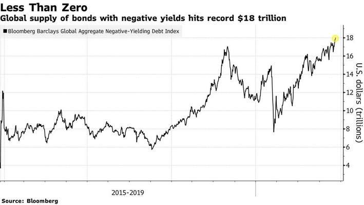

## Table of Contents

## What are bond yields?

Bond yields are the returns an investor can expect to earn from a bond. When you buy a bond, you are essentially lending money to the issuer, which could be a government or a corporation. In return, the issuer promises to pay you interest periodically and return your principal when the bond matures. The yield of a bond is a way to measure the income it generates relative to its price. It's usually expressed as an annual percentage rate.

The most common type of yield is the yield to maturity (YTM), which calculates the total interest the bond will earn if held until it matures. YTM takes into account the bond's current market price, its face value, the coupon interest rate, and the time remaining until maturity. Bond yields are important because they help investors compare the potential returns of different bonds. When bond yields go up, it often means that bond prices are going down, and vice versa. This inverse relationship is key to understanding how bonds work in the financial markets.

## What does a negative bond yield mean?

A negative bond yield means that the bond's price is so high that the interest you get from it is less than what you paid for it. Imagine you buy a bond for more than its face value, and when it matures, you get back less money than you spent. This can happen when people are willing to pay more for the safety of the bond, even if it means losing a little money.

Negative yields are not common, but they can happen in tough economic times. When people are scared about the future, they might put their money into bonds even if they lose a bit, because they think it's safer than other investments. Governments in countries like Japan and some in Europe have had negative-yielding bonds. It's a sign that investors are very worried and are willing to accept a small loss to keep their money safe.

## How can bond yields become negative?

Bond yields can become negative when people are really worried about the economy. They might think that keeping their money in a safe place, like government bonds, is better than risking it in other investments. So, they're willing to pay more for these bonds, even if it means they'll get back less money when the bond matures. This happens because everyone wants the safety of the bond, and they're okay with losing a little money to feel secure.

When a lot of people want to buy these bonds, the price goes up. If the price goes up high enough, the interest you get from the bond isn't enough to cover what you paid for it. That's when the yield becomes negative. It's like paying someone to hold your money for you because you think it's safer that way. This usually happens in countries where the economy is shaky, and people are looking for any safe place to put their money.

## What are the implications of negative bond yields for investors?

Negative bond yields mean that investors are actually losing money on their investment. If you buy a bond with a negative yield, you will get back less money than you paid for it when the bond matures. This might sound strange, but it happens when people are really worried about the economy and want to keep their money safe, even if it means losing a little bit. They think it's better to lose a small amount than to risk losing a lot in other investments.

For investors, this can be tough because they're used to making money from their investments, not losing it. But in times when bond yields are negative, they might still choose to buy these bonds because they believe it's the safest option. It's like paying for insurance; you hope you won't need it, but you feel better knowing it's there. So, even though negative yields mean losing money, some investors see it as a necessary cost for peace of mind during uncertain times.

## In which countries have negative bond yields been observed?

Negative bond yields have been seen in a few countries, mostly in Europe and Japan. In Europe, countries like Germany, Switzerland, and some Scandinavian countries have had bonds with negative yields. This happened because people were really worried about the economy and wanted to keep their money safe, even if it meant losing a little bit.

In Japan, negative bond yields have also been common. People there were willing to pay more for government bonds, even though they knew they would get back less money when the bonds matured. This shows how worried people were about the economy and how much they valued safety over making money from their investments.

## How do negative bond yields affect the economy?

Negative bond yields can make people feel safer about their money, but they can also mess with the economy. When bond yields go negative, it means people are willing to lose a little money just to keep it safe. This can slow down the economy because people might not want to spend or invest in other things if they're worried about the future. If everyone is saving their money instead of spending it, businesses might not grow as much, and the economy can get stuck.

On the other hand, negative bond yields can also push banks and investors to look for other places to put their money. They might invest in things like stocks or real estate instead of bonds. This can help some parts of the economy grow, but it can also make things risky if too much money moves into these other investments. So, negative bond yields can have both good and bad effects on the economy, depending on how people and businesses react to them.

## What are the historical precedents for negative bond yields?

Negative bond yields are not something new, but they have become more common in recent years. One of the earliest examples of negative yields happened in Switzerland in 2015. People were so worried about the economy that they were willing to pay to keep their money safe in Swiss government bonds. This showed how much people valued safety over making money from their investments.

Since then, negative bond yields have been seen in other places too. In Europe, countries like Germany and some Scandinavian countries have had bonds with negative yields. Japan has also seen a lot of negative yields. These cases show that when people are really worried about the economy, they might choose to lose a little money just to feel secure. This trend has been more common since the global financial crisis in 2008, as people have been more cautious about where they put their money.

## How do central banks respond to negative bond yields?

Central banks often see negative bond yields as a sign that people are really worried about the economy. When they see this, they might try to do things to make people feel better about spending and investing again. One thing they might do is lower interest rates even more, to make it cheaper for people to borrow money. They hope this will get people to spend more and help the economy grow. Central banks might also use other tools, like buying bonds themselves, to push up bond prices and bring down yields even more.

Sometimes, central banks might worry that negative yields could cause problems. If people and businesses are too scared to spend, it can make the economy slow down even more. So, central banks might try to talk to people and explain that things will get better, to make them feel more confident. They might also work with governments to come up with plans to help the economy, like spending more on things like roads and schools. All these actions are meant to make people feel safer and encourage them to spend and invest again, even when bond yields are negative.

## What strategies can investors use to navigate negative bond yield environments?

When bond yields are negative, investors need to think carefully about where to put their money. One strategy is to look for other investments that might give them a better return. This could mean investing in stocks, real estate, or even other types of bonds that still have positive yields. By spreading their money around, investors can try to balance out the losses from negative-yielding bonds with gains from other investments.

Another approach is to keep some money in negative-yielding bonds anyway, because they can still be a safe place to park money during uncertain times. Even though investors might lose a little money, they might feel it's worth it for the security. Some investors might also try to time the market, buying bonds when they think yields will go up again, but this can be risky and hard to get right. In the end, the best strategy depends on how much risk an investor is willing to take and how long they plan to keep their money invested.

## How do negative bond yields impact pension funds and insurance companies?

Negative bond yields can be a big problem for pension funds and insurance companies. These groups often put a lot of their money into bonds because they are usually safe and give a steady return. But when bond yields go negative, it means they are losing money on these investments. This can make it hard for them to pay out the money they promised to people who have pensions or insurance policies. They might need to find other ways to make up for the losses, which can be tricky.

To deal with negative yields, pension funds and insurance companies might start looking at other investments like stocks or real estate. These can be riskier, but they might offer better returns. Sometimes, they might also need to change how much they promise to pay out or raise the prices of their services. It's all about balancing the need for safety with the need to make enough money to keep their promises to their clients.

## What are the potential long-term effects of sustained negative bond yields?

If negative bond yields keep happening for a long time, it could make the economy act in strange ways. People might start saving more money instead of spending it because they're worried about the future. This can slow down the economy because businesses won't grow as much if people aren't buying things. Also, banks might not want to lend money if they can't make a profit from it, which can make it harder for people and businesses to borrow money. All of this can lead to a situation where the economy doesn't grow as fast as it should.

On the other hand, if negative bond yields last a long time, it might push investors to look for other places to put their money. They might start investing more in stocks or real estate, which could help those parts of the economy grow. But this can also make things risky because if too much money moves into these other investments, it could create bubbles that might burst later. So, while negative bond yields can help some parts of the economy, they can also cause problems if they stick around for too long.

## How do negative bond yields influence global financial markets and capital flows?

Negative bond yields can change how money moves around the world. When a country has negative bond yields, investors might decide to take their money out and put it into countries where they can still make a profit from bonds. This can make the country with negative yields lose money, which can make its currency weaker. On the other hand, countries with positive yields might see more money coming in, which can make their currency stronger. This movement of money can affect how much things cost in different countries and can make the global economy more complicated.

If negative bond yields last a long time, it can also make investors look for other places to put their money. They might start investing more in stocks or real estate in other countries, which can push up prices in those markets. This can help some parts of the global economy grow, but it can also make things risky. If too much money moves into these other investments, it could create bubbles that might burst later. So, negative bond yields can have a big impact on how money moves around the world and can make the global financial markets more unpredictable.

## References & Further Reading

[1]: Borio, C., & Gambacorta, L. (2017). ["Monetary policy and bank lending in a low interest rate environment: diminishing effectiveness?"](https://www.bis.org/publ/work612.pdf) Bank for International Settlements Working Paper No. 612.

[2]: Krishnamurthy, A., & Vissing-Jorgensen, A. (2011). ["The effects of quantitative easing on interest rates: channels and implications for policy."](https://www.nber.org/papers/w17555) National Bureau of Economic Research Working Paper No. 17555.

[3]: Negishi, K. (2016). ["Bank of Japan's Negative Interest Rate Policy."](https://www.boj.or.jp/en/mopo/mpmdeci/mpr_2016/k160129a.pdf) Bank of Japan Research Paper.

[4]: Lopez de Prado, M. (2018). ["Advances in Financial Machine Learning."](https://www.amazon.com/Advances-Financial-Machine-Learning-Marcos/dp/1119482089) Wiley Finance.

[5]: Breedon, F., & Turner, P. (2016). ["Negative Interest Rates: Lessons from the ECB."](https://onlinelibrary.wiley.com/doi/10.1111/jmcb.12328) VOX, CEPR Policy Portal.