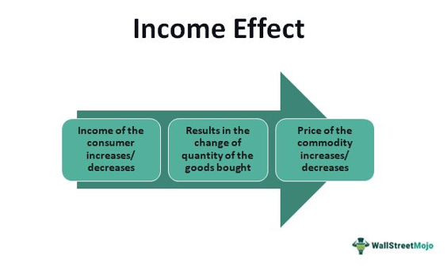

In the complex world of finance, derivatives stand as pivotal instruments offering strategic opportunities for investors aiming to manage risk and enhance returns. Derivatives, such as options, futures, and swaps, are financial contracts whose value is derived from underlying entities like assets, interest rates, or market indices. They play a significant role in financial markets, enabling investors to hedge against potential risks or to speculate on future price movements, thus serving as fundamental tools in modern risk management strategies.

Among the various derivative strategies, the concept of a 'negative butterfly' in bond trading presents distinctive opportunities for navigating interest rate risks. This strategy involves a specific non-parallel shift in the yield curve, characterized by short and long-term interest rates moving more favorably than medium-term rates, often creating a hump-like effect in the yield curve. Investors can potentially profit from these shifts by adjusting their bond portfolios, typically selling higher-yielding intermediate bonds while purchasing lower-yielding short and long-term bonds.



The advent of algorithmic trading has further transformed the approach to managing these risks, facilitating efficient and calculated responses to market changes. Algorithmic trading utilizes advanced computer algorithms to execute trades at high speed, capitalizing on market conditions and discrepancies in real-time. This technology is particularly valuable in implementing negative butterfly strategies, where the rapid detection and response to yield curve shifts can hugely impact the success of a trade.

This article explores the intersection of financial derivatives, negative butterfly strategies, interest rate risk, and algorithmic trading. It aims to highlight the interplay between these complex elements and elucidate how they collectively represent sophisticated approaches to risk management in the financial world.

## Table of Contents

## Understanding Financial Derivatives

Financial derivatives are financial instruments whose value is derived from the performance of an underlying asset, interest rate, or index. These instruments can take various forms, including options, futures, contracts for difference (CFDs), and swaps, each serving distinct functions such as hedging, speculation, and arbitrage.

Options are contracts that provide the holder the right, but not the obligation, to buy or sell an asset at a predetermined price on or before a specified date. Futures, on the other hand, obligate the parties involved to transact an asset at a predetermined future date and price, offering less flexibility but higher certainty of execution compared to options. Contracts for difference are financial products that allow traders to speculate on the price movement of an asset without actually owning it, paying or receiving the difference in asset value between the opening and closing of the contract. Swaps are derivative contracts through which two parties exchange cash flows or liabilities from two different financial instruments, commonly used in interest rate and currency markets.

Derivatives are pivotal within financial markets, granting investors the ability to hedge potential risks associated with unfavorable price movements of underlying entities. For instance, through options, investors can secure against negative price fluctuations while still participating in favorable market trends. Similarly, through swaps, companies can manage [interest rate](/wiki/interest-rate-trading-strategies) risks by exchanging variable interest payments for fixed ones, stabilizing their interest expenses.

Speculation with derivatives allows traders to leverage positions on future price movements without the need to commit full capital in the underlying assets. This increased leverage can lead to significant gains but also amplifies potential losses. Moreover, derivatives facilitate [arbitrage](/wiki/arbitrage) opportunities by exploiting price inefficiencies between related assets across different markets, contributing to market efficiency.

In the context of sophisticated trading strategies, derivatives play a significant role in risk management, particularly through complex approaches like the negative butterfly strategy. Such strategies involve intricate combinations of derivative instruments to exploit specific yield curve movements, such as non-parallel shifts affecting intermediate-term interest rates differently compared to short- and long-term rates. These advanced techniques enable traders to fine-tune their risk exposure and optimize returns in nuanced and dynamic interest rate environments.

## What is a Negative Butterfly in Interest Rate Risk?

A negative butterfly in interest rate risk refers to a particular shape change in the yield curve, characterized by non-parallel movements where short and long-term interest rates react more favorably compared to medium-term rates. This shift manifests as a hump-shaped curve, providing strategic opportunities for traders who anticipate and accurately respond to these changes. A typical manifestation involves a downward shift in medium-term yields relative to both short and long-term yields, which can be visualized mathematically as an alteration in the second derivative of the yield curve, reflecting its convexity.

To capitalize on a negative butterfly shift, traders might strategically sell intermediate bonds, which become less attractive due to their higher yields, and purchase bonds at the short and long ends of the curve, where rates are more favorable. This approach seeks to exploit the movement in interest rates to optimize the portfolio’s performance. The strategy implicitly assumes that the negative butterfly shift will either persist long enough or revert in a way that the bond price movements benefit the trader. 

Understanding the intricacies of negative butterfly shifts is crucial for effectively managing interest rate risks. These shifts can be influenced by various macroeconomic factors, including central bank policies, inflation expectations, and market sentiment. Traders and portfolio managers must be adept at interpreting signals from economic data and market indicators to successfully navigate these shifts.

Practical application of these strategies requires robust modeling of the yield curve and its anticipated movements. Tools such as polynomial curve fitting or spline interpolation may be used to model the yield curve, allowing investors to measure and interpret potential convexity changes. For example, in Python, using libraries like `numpy` and `scipy`, one could fit a curve to the current yield data to analyze how shifts might affect bond portfolio values.

```python
import numpy as np
from scipy import interpolate
import matplotlib.pyplot as plt

# Example yield data for short, intermediate, and long-term
maturities = np.array([1, 5, 10, 20, 30])
yields = np.array([0.5, 1.5, 2.0, 2.5, 3.0])

# Fit a cubic spline to model the yield curve
spline = interpolate.CubicSpline(maturities, yields)

# Generate a range of maturities for detailed curve
maturity_range = np.linspace(1, 30, 100)

# Plot the yield curve
plt.plot(maturity_range, spline(maturity_range), label='Yield Curve')
plt.scatter(maturities, yields, color='red', label='Maturities')
plt.title('Modeling the Yield Curve')
plt.xlabel('Maturity (years)')
plt.ylabel('Yield (%)')
plt.legend()
plt.show()
```

Strategic positioning in response to negative butterfly shifts requires not only accurate forecast models and market insights but also the agility to respond swiftly as market conditions evolve. Understanding these dynamics at a deep level is essential for bond portfolio managers aiming to mitigate interest rate risk through sophisticated derivative strategies.

## Algorithmic Trading in Managing Interest Rate Risks

Algorithmic trading leverages sophisticated computer algorithms to facilitate the rapid execution of trades, taking advantage of market conditions and price discrepancies. In environments where interest rates are prone to frequent adjustments, [algorithmic trading](/wiki/algorithmic-trading) becomes an invaluable tool for managing risk, particularly through strategies like the negative butterfly.

Negative butterfly strategies are complex and rely on identifying specific shifts in the yield curve. These are characterized by non-parallel movements where short-term and long-term interest rates experience more favorable changes compared to intermediate-term rates. Effectively capitalizing on these shifts requires precision and speed, which are inherent advantages of algorithmic trading. Algorithms can quickly detect patterns or shifts in the yield curve and execute trades across various platforms almost instantaneously. For instance, an algorithm might simultaneously sell intermediate bonds while buying short and long-term bonds, adjusting positions faster than manual processes allow.

The efficiency of algorithmic trading lies not only in its speed but also in its accuracy. Algorithms are capable of processing vast amounts of market data in real-time, identifying potential arbitrage opportunities or deviations in interest rate expectations that human traders might miss. The capacity to conduct real-time analysis ensures that investment strategies can adapt to rapidly changing market conditions. For instance, if an unexpected central bank announcement causes a sudden shift in interest rates, algorithms can recalibrate trading strategies in seconds.

Moreover, the integration of algorithmic trading into risk management is transformative for modern finance. By incorporating these techniques, financial institutions can enhance their ability to make informed decisions, mitigating risks associated with [volatility](/wiki/volatility-trading-strategies) in interest rates. Algorithms analyze a combination of market indicators, economic data, and predictive analytics to optimize trade execution. This not only improves potential for profit but also safeguards against negative outcomes.

Python is widely used in developing these trading algorithms due to its robust libraries like NumPy, Pandas, and SciPy, which facilitate data analysis and manipulation. For example:

```python
import numpy as np
import pandas as pd

# Simulating yield curve data
yield_data = pd.DataFrame({
    'Short Term': np.random.uniform(0.01, 0.03, 100),
    'Medium Term': np.random.uniform(0.02, 0.04, 100),
    'Long Term': np.random.uniform(0.03, 0.05, 100)
})

# Detecting a negative butterfly shift
def detect_negative_butterfly(yield_data):
    conditions = (yield_data['Short Term'] < yield_data['Medium Term']) & (yield_data['Long Term'] < yield_data['Medium Term'])
    return yield_data[conditions]

negative_butterfly_signals = detect_negative_butterfly(yield_data)

# Output detected signals
print(negative_butterfly_signals)
```

This snippet identifies negative butterfly scenarios in simulated yield curve data, highlighting the potential for algorithmic strategies to autonomously recognize profitable patterns. The application of such technology not only amplifies the responsiveness of financial operations but also enhances the strategic positioning of portfolios in the face of evolving interest rate landscapes. As financial markets become increasingly complex, the necessity for integrating algorithmic solutions in risk management will continue to grow, ensuring sustained relevance in the field of finance.

## The Benefits and Challenges of Using Negative Butterfly Strategies

Negative butterfly strategies serve as sophisticated tools for investors aiming to navigate the complexities of interest rate movements. These strategies are primarily designed to hedge against the adverse shifts in interest rates and offer opportunities for arbitrage profits. By focusing on variations in medium-term interest rates relative to short and long-term rates, investors can effectively manage their exposure to interest rate risks.

One of the primary benefits of employing negative butterfly strategies is the potential for portfolio diversification. By strategically selling intermediate bonds while acquiring short and long-term bonds, traders create a diversified bond portfolio. This diversification allows investors to mitigate risks associated with significant interest rate changes, thereby reducing overall portfolio volatility.

Moreover, these strategies enable traders to capture potential arbitrage opportunities. When interest rates experience a non-parallel shift—typified by a rise in medium-term rates—a negative butterfly strategy can yield profits. By correctly anticipating such shifts, traders can exploit yield differentials across various maturities, enhancing returns.

However, the successful implementation of negative butterfly strategies is fraught with challenges. A key difficulty lies in accurately predicting market movements. Misjudging the timing or magnitude of interest rate changes can result in limited profitability or even losses. This requires a deep understanding of macroeconomic indicators and yield curve analytics.

Additionally, traders must be mindful of time decay and transaction costs. The temporal nature of interest rate changes means that the benefits of negative butterfly strategies can diminish over time. If market conditions do not change as anticipated, the costs incurred from executing trades may erode potential profits.

Moreover, the specific market environment profoundly impacts the viability of these strategies. Factors such as [liquidity](/wiki/liquidity-risk-premium), economic outlook, and monetary policy decisions can alter interest rate trajectories in unexpected ways, adding another layer of complexity to the application of negative butterfly strategies.

In conclusion, while negative butterfly strategies provide valuable tools for hedging and profit generation, their success hinges on precise market analysis and strategic execution. Traders need to balance potential returns with the inherent risks and transaction costs, constantly adapting to the evolving market landscape.

## Case Studies: Successful Application of Negative Butterfly Strategies

Examining real-world applications of negative butterfly strategies offers significant insights into their effectiveness in managing interest rate risks. One such case involved a sovereign debt crisis in which a financial institution correctly anticipated a substantial non-parallel yield curve shift indicative of a negative butterfly pattern. The institution adjusted its bond portfolio by selling higher-yielding intermediate bonds and simultaneously purchasing a mix of lower-yielding short-term and long-term bonds. This strategic move allowed for an arbitrage opportunity, resulting in considerable profits while also securing the portfolio against adverse interest rate movements.

Robust analytical frameworks and real-time market data are crucial for capitalizing on such strategies. For instance, during volatile periods when market conditions can fluctuate rapidly, the ability to process large sets of historical and current market data is vital. Many successful applications involve the utilization of algorithmic trading systems that incorporate [machine learning](/wiki/machine-learning) to predict and react to yield curve shifts efficiently. A framework might utilize a Gaussian Process to model yield curve changes, enabling the system to swiftly identify the emergence of a negative butterfly formation. Such models typically represent the yield at time $t$ for a specific term $x$ as:

$$
Y_t(x) = \mu(x) + \sum_i w_i \phi_i(x) + \epsilon_t(x)
$$

where $\mu(x)$ is a deterministic function, $\phi_i(x)$ are basis functions, $w_i$ are weights, and $\epsilon_t(x)$ captures noise.

These instances highlight the importance of having a dynamic, data-driven approach to derivative strategies. The successful application of a negative butterfly strategy requires not only the ability to predict shifts in the yield curve but also the flexibility to adjust trading positions quickly and efficiently. In less successful cases, misinterpretation of the yield curve data or delays in decision-making led to either negligible profits or potential losses. By studying both successful and unsuccessful implementations, traders can refine their strategies, improving their forecasting accuracy and timing of trades.

Endeavors in this regard underscore the need for advanced technology and analytical skills, alongside an understanding of market mechanics, to optimize the use of negative butterfly strategies in interest rate risk management. By learning from empirical examples, traders and financial institutions can enhance their capabilities in navigating complex financial markets.

## Conclusion

Negative butterfly strategies and algorithmic trading exemplify advanced methodologies in addressing interest rate risks through the application of financial derivatives. These strategies, though intricate, present substantial advantages when employed by individuals and institutions adept at navigating their complexities. This expertise is crucial as the financial landscape continually benefits from technological advancements that require ongoing learning and adaptability.

Algorithmic trading, leveraging computer algorithms for high-speed, high-frequency trade executions, serves as a cornerstone of modern risk management techniques. By employing sophisticated algorithms, market participants can swiftly respond to non-parallel shifts in yield curves, such as negative butterflies, thereby optimizing trading outcomes. This capability highlights a crucial benefit: the ability to automate the detection and management of interest rate risks, which is increasingly essential in volatile financial environments.

However, the effective application of negative butterfly strategies demands a deep understanding of the underlying market mechanics and a robust framework for predicting yield curve movements. As these strategies expand in their application, they underscore the importance of continued education and adaptation to the emerging technologies that redefine finance practices. Markets are dynamic and ever-evolving, necessitating a comprehensive grasp of these innovative strategies and their successful implementation.

The expansion of such trading strategies will likely continue, with professionals needing to understand precise mechanics and applications for successful use. As these sophisticated strategies become more integral to risk management, their role in the financial sector will likely increase, offering a competitive edge to those equipped with the requisite knowledge and technological capabilities.

## References & Further Reading

[1]: Chance, D. M. & Brooks, R. (2015). ["An Introduction to Derivatives and Risk Management."](https://books.google.com/books/about/Introduction_to_Derivatives_and_Risk_Man.html?id=b8PgBQAAQBAJ) Cengage Learning.

[2]: Hull, J. C. (2017). ["Options, Futures, and Other Derivatives."](https://www.semanticscholar.org/paper/Options%2C-Futures%2C-and-Other-Derivatives-Hull/89bdee500c8623864fc9eb7a471546aa713acc44) Pearson.

[3]: Litterman, R. & Scheinkman, J. (1991). ["Common Factors Affecting Bond Returns."](https://www.pm-research.com/content/iijfixinc/1/1/54) Journal of Fixed Income.

[4]: Marcos, J. (2018). ["Advances in Financial Machine Learning."](https://www.amazon.com/Advances-Financial-Machine-Learning-Marcos/dp/1119482089) Wiley.

[5]: Jansen, S. (2018). ["Machine Learning for Algorithmic Trading: Predictive models to extract signals from market and alternative data for systematic trading strategies with Python."](https://www.amazon.com/Machine-Learning-Algorithmic-Trading-alternative/dp/1839217715) Packt Publishing.

[6]: Chan, E. (2013). ["Algorithmic Trading: Winning Strategies and Their Rationale."](https://github.com/ftvision/quant_trading_echan_book) Wiley.