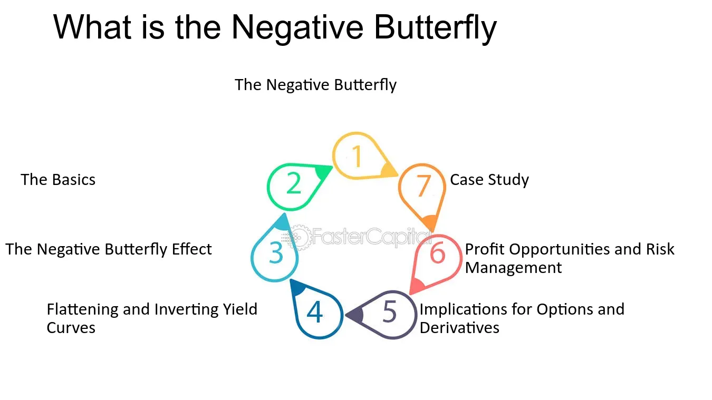

## Table of Contents

## What is a Negative Butterfly?

A Negative Butterfly is a term used in finance, especially in options trading. It describes a strategy where a trader expects a big move in the price of an asset, but they are not sure if it will go up or down. They use this strategy to make money if the price moves a lot in either direction.

To set up a Negative Butterfly, a trader buys and sells different options at different prices. They might buy options that are far away from the current price and sell options that are closer. If the price of the asset stays the same or only moves a little, the trader could lose money. But if the price moves a lot, they could make a profit.

## How does a Negative Butterfly differ from a regular Butterfly?

A Negative Butterfly and a regular Butterfly are both options trading strategies, but they work in opposite ways. A regular Butterfly is used when a trader thinks the price of an asset will stay about the same. They make money if the price doesn't move much. To set up a regular Butterfly, a trader buys options at two different prices and sells options at a price in the middle. If the price stays close to the middle price, the trader makes a profit.

On the other hand, a Negative Butterfly is used when a trader expects the price to move a lot, but they don't know if it will go up or down. They make money if the price moves far away from the current price. To set up a Negative Butterfly, a trader buys options that are far from the current price and sells options that are closer. If the price moves a lot in either direction, the trader can make a profit, but if the price stays the same or only moves a little, they might lose money.

In simple terms, a regular Butterfly is good for small price movements, while a Negative Butterfly is good for big price movements. Both strategies involve buying and selling options, but they are set up differently to take advantage of different market conditions.

## What are the basic components of a Negative Butterfly?

A Negative Butterfly is made up of options that a trader buys and sells. The trader buys options that are far away from the current price of the asset. These could be call options if they think the price might go up a lot, or put options if they think it might go down a lot. At the same time, the trader sells options that are closer to the current price. These could be both call and put options, depending on the strategy.

The goal is to make money if the price of the asset moves a lot. If the price stays the same or only moves a little, the trader might lose money because the options they sold will be worth more than the options they bought. But if the price moves far away from the current price, the options they bought will become more valuable and could make up for the loss from the options they sold. This way, the trader can profit from big price movements in either direction.

## Can you explain the mechanism behind a Negative Butterfly?

A Negative Butterfly is an options trading strategy where a trader buys options that are far away from the current price of an asset and sells options that are closer to the current price. The trader might buy call options if they think the price could go up a lot, or put options if they think it could go down a lot. They also sell options at prices closer to the current price, which could be both calls and puts. This setup is meant to take advantage of big price movements in either direction.

If the price of the asset stays the same or only moves a little, the trader might lose money. This is because the options they sold will be worth more than the options they bought. But if the price moves a lot, either up or down, the options they bought will become more valuable. If the price moves far enough away from the current price, the profit from the options they bought can be more than the loss from the options they sold. This way, the trader can make money from big price swings.

## What are the common applications of Negative Butterflies?

Traders use Negative Butterflies when they think a big price move is coming, but they're not sure if it will go up or down. This strategy helps them make money if the price moves a lot in either direction. For example, if there's big news coming out about a company, like earnings reports or big announcements, traders might use a Negative Butterfly. They want to take advantage of the big price swing that could happen after the news.

Negative Butterflies are also used in markets where there's a lot of uncertainty. For instance, during times of economic uncertainty or big events like elections, traders might use this strategy. They expect the price to move a lot because of the uncertainty, but they don't know which way it will go. By using a Negative Butterfly, they can profit from the big move, no matter which direction it takes.

## How does the performance of a Negative Butterfly compare to other similar financial instruments?

A Negative Butterfly is a special options strategy that traders use when they think a big price move is coming, but they're not sure which way it will go. Compared to other strategies like a Long Straddle or a Long Strangle, a Negative Butterfly can be a bit less risky. In a Long Straddle, a trader buys a call and a put at the same price, hoping the price will move a lot in either direction. A Long Strangle is similar, but the options are bought at different prices. Both of these strategies can make a lot of money if the price moves a lot, but they also cost more upfront. A Negative Butterfly, on the other hand, involves both buying and selling options, which can make it cheaper to set up.

The performance of a Negative Butterfly compared to other strategies depends a lot on how much the price moves. If the price moves just a little, a Negative Butterfly might lose money, while a Long Straddle or Long Strangle might break even or make a small profit. But if the price moves a lot, all three strategies can make money. The difference is that a Negative Butterfly has a smaller potential profit than a Long Straddle or Long Strangle, but it also has a smaller potential loss. This makes it a good choice for traders who want to take advantage of big price moves but don't want to risk as much money upfront.

## What are the key factors to consider when implementing a Negative Butterfly strategy?

When you're thinking about using a Negative Butterfly, it's important to look at how much the price of the asset might move. This strategy works best if you think the price will change a lot, but you're not sure if it will go up or down. You should check things like upcoming news or events that could make the price move a lot. Also, think about how much it will cost to set up the Negative Butterfly. It's usually cheaper than some other strategies like a Long Straddle or Long Strangle, but you still need to have enough money to buy and sell the options.

Another thing to consider is how long you want to keep the Negative Butterfly open. Options have expiration dates, so you need to pick a time that gives the price enough chance to move a lot. If the price doesn't move enough before the options expire, you could lose money. Also, think about how much risk you're okay with. A Negative Butterfly can lose money if the price doesn't move much, so make sure you're comfortable with that possibility. It's a good idea to understand the potential profits and losses before you start, so you can decide if it's the right strategy for you.

## How do market conditions affect the effectiveness of a Negative Butterfly?

Market conditions play a big role in how well a Negative Butterfly works. This strategy is best when you think the price of an asset will move a lot, but you're not sure if it will go up or down. If there's a lot of news or big events coming up, like earnings reports or elections, it can make the price move a lot. That's when a Negative Butterfly can be really effective. But if the market is calm and the price isn't moving much, the strategy might not work well. You could lose money if the price stays the same or only moves a little.

Another thing to think about is how much the options cost. In a busy market with a lot of trading, options might be more expensive. This can make it more costly to set up a Negative Butterfly. But if the market is quiet, options might be cheaper, which can make the strategy less expensive to use. So, you need to look at both how much the price might move and how much it will cost to set up the strategy. This way, you can decide if a Negative Butterfly is a good choice for the current market conditions.

## What are the potential risks associated with using a Negative Butterfly?

One big risk of using a Negative Butterfly is that you might lose money if the price of the asset doesn't move enough. This strategy works best when the price moves a lot, but if it stays the same or only moves a little, the options you sold will be worth more than the options you bought. That means you could end up losing money. It's important to think about how likely it is that the price will move a lot before you use this strategy.

Another risk is how much it costs to set up a Negative Butterfly. You need to buy and sell options, and the price of these options can change depending on the market. If the options are expensive, it can cost you more to start the strategy. Also, you need to think about how long you want to keep the options. If you pick the wrong time, the options might expire before the price moves enough, and you could lose money. So, it's important to understand both the cost and the timing when you're thinking about using a Negative Butterfly.

## Can you discuss any historical examples where Negative Butterflies were successfully used?

One historical example where a Negative Butterfly might have been successfully used was during the 2008 financial crisis. Many traders expected big price moves in the stock market because of the uncertainty around the economy and the housing market. They weren't sure if the market would go up or down, but they knew it would likely move a lot. By using a Negative Butterfly, traders could have made money if the market moved significantly in either direction. This strategy would have allowed them to profit from the big swings in stock prices that happened during the crisis.

Another example could be during the Brexit vote in 2016. The uncertainty about whether the UK would leave the European Union led to big price movements in the British pound and other assets. Traders who thought the price would move a lot but weren't sure which way could have used a Negative Butterfly to take advantage of the situation. If the price moved enough after the vote, they could have made money from the strategy. This shows how Negative Butterflies can be useful in times of big events and uncertainty.

## How can one optimize a Negative Butterfly strategy using advanced quantitative methods?

To optimize a Negative Butterfly strategy using advanced quantitative methods, you can use math and computer models to help you make better choices. One way to do this is by using something called "Monte Carlo simulations." This is a method where you run a lot of different scenarios on a computer to see how the strategy might work in different situations. By doing this, you can figure out the best times to use a Negative Butterfly and how much the price needs to move for you to make money. You can also use these simulations to see how much risk you're taking and decide if it's worth it.

Another way to optimize is by using "volatility forecasting." This means trying to guess how much the price of the asset might move in the future. If you think the price will move a lot, a Negative Butterfly could be a good choice. You can use math models to look at past price movements and other information to make these guesses. By doing this, you can pick the right options to buy and sell for your Negative Butterfly. This can help you set up the strategy in a way that gives you the best chance of making money while keeping your risk as low as possible.

## What are the latest research developments and future trends in the use of Negative Butterflies?

The latest research in options trading is looking at how to use Negative Butterflies better. One big thing researchers are doing is using computers to run a lot of different scenarios. This helps them see how a Negative Butterfly might work in different market conditions. They are also trying to make better guesses about how much the price of an asset might move in the future. This can help traders pick the right options to use in their Negative Butterfly strategy. By doing all this, researchers hope to make the strategy work better and help traders make more money with less risk.

In the future, we might see more people using Negative Butterflies because of new technology. Computers and math models are getting better at figuring out the best times to use this strategy. Also, more traders are learning about options and how to use them to make money. As more people understand how Negative Butterflies work, they might use them more often, especially when there's a lot of uncertainty in the market. This could make Negative Butterflies a more common and important part of options trading.

## What are some successful applications of negative butterfly strategies as shown in case studies?

Examining real-world applications of negative butterfly strategies offers significant insights into their effectiveness in managing interest rate risks. One such case involved a sovereign debt crisis in which a financial institution correctly anticipated a substantial non-parallel yield curve shift indicative of a negative butterfly pattern. The institution adjusted its bond portfolio by selling higher-yielding intermediate bonds and simultaneously purchasing a mix of lower-yielding short-term and long-term bonds. This strategic move allowed for an arbitrage opportunity, resulting in considerable profits while also securing the portfolio against adverse interest rate movements.

Robust analytical frameworks and real-time market data are crucial for capitalizing on such strategies. For instance, during volatile periods when market conditions can fluctuate rapidly, the ability to process large sets of historical and current market data is vital. Many successful applications involve the utilization of algorithmic trading systems that incorporate [machine learning](/wiki/machine-learning) to predict and react to yield curve shifts efficiently. A framework might utilize a Gaussian Process to model yield curve changes, enabling the system to swiftly identify the emergence of a negative butterfly formation. Such models typically represent the yield at time $t$ for a specific term $x$ as:

$$
Y_t(x) = \mu(x) + \sum_i w_i \phi_i(x) + \epsilon_t(x)
$$

where $\mu(x)$ is a deterministic function, $\phi_i(x)$ are basis functions, $w_i$ are weights, and $\epsilon_t(x)$ captures noise.

These instances highlight the importance of having a dynamic, data-driven approach to derivative strategies. The successful application of a negative butterfly strategy requires not only the ability to predict shifts in the yield curve but also the flexibility to adjust trading positions quickly and efficiently. In less successful cases, misinterpretation of the yield curve data or delays in decision-making led to either negligible profits or potential losses. By studying both successful and unsuccessful implementations, traders can refine their strategies, improving their forecasting accuracy and timing of trades.

Endeavors in this regard underscore the need for advanced technology and analytical skills, alongside an understanding of market mechanics, to optimize the use of negative butterfly strategies in interest rate risk management. By learning from empirical examples, traders and financial institutions can enhance their capabilities in navigating complex financial markets.

## References & Further Reading

[1]: Chance, D. M. & Brooks, R. (2015). ["An Introduction to Derivatives and Risk Management."](https://books.google.com/books/about/Introduction_to_Derivatives_and_Risk_Man.html?id=b8PgBQAAQBAJ) Cengage Learning.

[2]: Hull, J. C. (2017). ["Options, Futures, and Other Derivatives."](https://www.semanticscholar.org/paper/Options%2C-Futures%2C-and-Other-Derivatives-Hull/89bdee500c8623864fc9eb7a471546aa713acc44) Pearson.

[3]: Litterman, R. & Scheinkman, J. (1991). ["Common Factors Affecting Bond Returns."](https://www.pm-research.com/content/iijfixinc/1/1/54) Journal of Fixed Income.

[4]: Marcos, J. (2018). ["Advances in Financial Machine Learning."](https://www.amazon.com/Advances-Financial-Machine-Learning-Marcos/dp/1119482089) Wiley.

[5]: Jansen, S. (2018). ["Machine Learning for Algorithmic Trading: Predictive models to extract signals from market and alternative data for systematic trading strategies with Python."](https://www.amazon.com/Machine-Learning-Algorithmic-Trading-alternative/dp/1839217715) Packt Publishing.

[6]: Chan, E. (2013). ["Algorithmic Trading: Winning Strategies and Their Rationale."](https://github.com/ftvision/quant_trading_echan_book) Wiley.