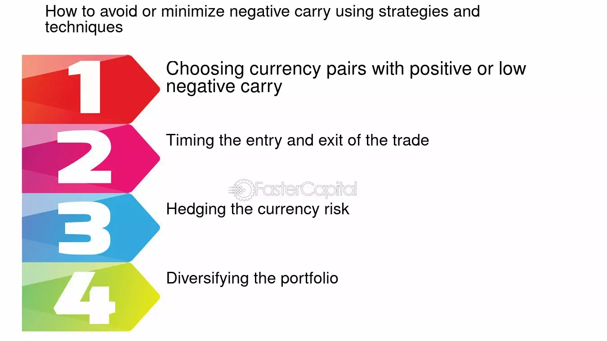

## Table of Contents

## What is a negative carry pair?

A negative carry pair is a term used in finance, especially in forex trading. It happens when you borrow money in a currency that has a high interest rate and then use that money to buy a currency with a lower interest rate. This means you end up paying more in interest on the borrowed money than you earn from the currency you bought. Traders might do this if they think the currency they bought will increase in value more than the interest they lose.

For example, if you borrow Japanese yen, which often has a low interest rate, and use it to buy US dollars, which might have a higher interest rate, this would usually be a positive carry trade. But if you do the opposite—borrow US dollars to buy Japanese yen—you would be in a negative carry situation. You would be paying more in interest on the US dollars than you earn on the yen. People might still do this if they believe the yen will go up in value enough to cover the interest difference and make a profit.

## How does a negative carry pair differ from a positive carry pair?

A negative carry pair and a positive carry pair are opposite strategies in forex trading. In a negative carry pair, you borrow money in a currency with a high interest rate and use it to buy a currency with a lower interest rate. This means you lose money on the interest difference because you pay more interest on the borrowed money than you earn on the currency you bought. Traders might choose this strategy if they believe the currency they bought will increase in value enough to cover the interest they lose and still make a profit.

On the other hand, a positive carry pair involves borrowing money in a currency with a low interest rate and using it to buy a currency with a higher interest rate. This way, you earn more interest on the currency you bought than you pay on the borrowed money. Traders use this strategy to make money from the interest difference, hoping that the currency they bought will either stay the same or increase in value. The main difference between the two is whether the interest earned is more or less than the interest paid.

## What are the key components of a negative carry pair?

A negative carry pair involves two main parts: the currency you borrow and the currency you buy. The currency you borrow has a high interest rate, and the currency you buy has a low interest rate. This means you have to pay more interest on the borrowed money than you earn from the currency you bought. 

Traders might choose a negative carry pair if they think the currency they bought will go up in value a lot. Even though they lose money on the interest difference, they hope the increase in the currency's value will be bigger than the interest they lose. So, the key to a negative carry pair is the belief that the currency you buy will grow in value enough to make up for the interest loss.

## Can you explain the concept of carry in forex trading?

In forex trading, the concept of carry refers to the interest rate difference between two currencies that a trader borrows and invests in. When you borrow one currency to buy another, you have to pay interest on the borrowed currency and you earn interest on the currency you bought. The difference between the interest you pay and the interest you earn is called the carry. If the interest you earn is higher than the interest you pay, it's called a positive carry, and if the interest you pay is higher than the interest you earn, it's called a negative carry.

Traders use the carry strategy to make money from this interest rate difference. For example, if you borrow a currency with a low interest rate and use it to buy a currency with a higher interest rate, you can earn money from the positive carry. This is often called a carry trade. However, the value of currencies can change, so traders also need to consider how the exchange rate might affect their profits or losses. If the currency you bought goes down in value, it might wipe out any gains from the interest difference.

## What are the risks associated with trading negative carry pairs?

Trading negative carry pairs can be risky. One big risk is that you lose money on the interest difference. Since you borrow money with a high interest rate and buy a currency with a low interest rate, you have to pay more interest than you earn. This means you start losing money right away, and you need the currency you bought to go up in value a lot to make up for this loss.

Another risk is that the currency you bought might not go up in value as much as you hoped. If it stays the same or goes down, you will lose even more money because you are already losing on the interest difference. This can lead to big losses if the currency moves against you.

Lastly, there's the risk of sudden changes in the market. Economic news or events can make currency values change quickly. If this happens, it can be hard to predict how much the currency you bought will change, making it even riskier to trade negative carry pairs.

## How do interest rates affect negative carry pairs?

Interest rates are super important when you trade negative carry pairs. In a negative carry pair, you borrow money from a country where the interest rate is high and use it to buy a currency from a country where the interest rate is low. This means you have to pay more interest on the money you borrowed than what you earn from the currency you bought. So, if the interest rate difference is big, you lose more money every day you hold onto the trade.

Even though you start losing money right away because of the interest rate difference, you might still want to do this if you think the currency you bought will go up in value a lot. If the currency you bought goes up enough, it can make up for the money you lose on the interest. But if it doesn't go up as much as you hoped, or if it goes down, you will lose even more money. So, interest rates can make negative carry pairs risky because you need the currency to go up a lot to make it worth it.

## What are some common examples of negative carry pairs?

A common example of a negative carry pair is when traders borrow US dollars, which often have a higher interest rate, and use them to buy Japanese yen, which usually have a lower interest rate. This means the trader has to pay more interest on the US dollars they borrowed than they earn on the yen they bought. They would do this if they believe the yen will go up in value a lot, making up for the money they lose on interest.

Another example is borrowing British pounds, which might have a higher interest rate, to buy Swiss francs, which typically have a lower interest rate. Again, the trader would be losing money every day due to the interest rate difference. They would hope that the Swiss franc increases in value enough to cover the interest they are losing and still make a profit.

## How can a trader identify a negative carry pair?

To identify a negative carry pair, a trader needs to look at the interest rates of two different currencies. A negative carry pair happens when you borrow money in a currency with a high interest rate and use it to buy a currency with a lower interest rate. For example, if you borrow US dollars, which have a higher interest rate, and use them to buy Japanese yen, which have a lower interest rate, you would be in a negative carry situation. You would have to pay more interest on the borrowed US dollars than you earn on the yen.

Traders can find out the interest rates of different countries by looking at economic reports or using financial websites that list interest rates. Once they know the interest rates, they can see if borrowing one currency to buy another would result in a negative carry. It's important for traders to think about not just the interest rates but also whether they believe the currency they are buying will go up in value enough to make up for the money they lose on interest.

## What strategies can be used to trade negative carry pairs effectively?

Trading negative carry pairs can be tricky, but there are some strategies that can help. One important strategy is to have a strong belief that the currency you are buying will go up in value a lot. Since you lose money every day because of the interest rate difference, you need the currency to increase enough to cover that loss and still make a profit. This means you should do a lot of research and analysis to make sure you have good reasons to think the currency will go up. Another part of this strategy is to set clear goals for how much you want the currency to go up and be ready to get out of the trade if it doesn't happen.

Another strategy is to use stop-loss orders. These are orders that automatically close your trade if the currency you bought goes down too much. This can help you avoid big losses if the currency doesn't go up like you hoped. It's important to set your stop-loss at a level that protects you but also gives the currency enough room to move. Also, keeping an eye on economic news and events that could affect currency values is a good idea. If something big happens that could change the value of the currencies you're trading, you might want to adjust your strategy or get out of the trade quickly.

## How do market conditions influence the performance of negative carry pairs?

Market conditions can really affect how well negative carry pairs do. When the market is stable and things are going well, it might be easier for the currency you bought to go up in value like you hoped. But if the market is shaky or there's a lot of uncertainty, it can be harder for the currency to go up enough to make up for the interest you're losing. Big events like changes in a country's interest rates, economic reports, or even political news can make currencies move a lot. If these events make the currency you bought go down, you could lose even more money.

So, keeping an eye on what's happening in the market is really important when you're trading negative carry pairs. If you see signs that the market might get rough, you might want to think twice about starting a negative carry trade or maybe get out of one you're already in. Also, knowing how different currencies might react to market changes can help you pick the right time to trade. It's all about balancing the risk of losing money on interest with the chance that the currency you bought will go up enough to make it worth it.

## What are the long-term implications of holding a negative carry pair?

Holding a negative carry pair for a long time can be risky because you lose money every day due to the interest rate difference. If you borrow money with a high interest rate and buy a currency with a low interest rate, you have to pay more interest than you earn. Over time, these daily losses can add up to a lot of money. If the currency you bought doesn't go up in value enough to cover these losses, you will end up losing money overall. This means you need to be very sure that the currency you bought will increase in value a lot to make the trade worth it.

In the long run, market conditions can also affect how well your negative carry pair does. If the market stays stable and things go well, the currency you bought might go up like you hoped. But if there are big changes or bad news, the currency could go down, making your losses even bigger. So, you need to keep watching the market and be ready to change your plan if things start to look bad. Trading negative carry pairs over a long time is all about balancing the risk of losing money on interest with the chance that the currency will go up enough to make it worth it.

## How can advanced traders use negative carry pairs to hedge other investments?

Advanced traders can use negative carry pairs to hedge other investments by balancing out risks. If a trader has an investment that might lose value because of changes in currency values, they can use a negative carry pair to protect themselves. For example, if a trader has a lot of money in US dollars and they think the dollar might go down compared to the yen, they could borrow dollars and buy yen. Even though they lose money every day because of the interest rate difference, if the yen goes up in value like they thought, it can help cover any losses from their other investments in dollars.

The key to using negative carry pairs as a hedge is to understand how different currencies move together. Traders need to pick the right currencies to borrow and buy so that the negative carry pair works as a good hedge. If the currency they buy goes up when their other investments go down, it can help balance out their losses. But they need to be careful because if the currency they buy doesn't go up enough, they could lose even more money on the interest they pay. So, it's all about making smart choices and keeping an eye on how the market is doing.

## What are Currency Pairs in Forex Trading?

Forex trading is fundamentally based on the concept of currency pairs, which involve the simultaneous buying and selling of two different currencies. Each currency pair consists of a base currency and a quote currency. In any currency pair, the base currency is the one you are buying or selling, while the quote currency represents the value needed to buy one unit of the base currency. For example, in the EUR/USD pair, EUR is the base currency and USD is the quote currency. The exchange rate indicates how much USD (quote currency) is required to purchase one EUR (base currency).

The notation of currency pairs can be represented mathematically as follows:

$$

\text{Exchange Rate} = \frac{\text{Base Currency}}{\text{Quote Currency}}
$$

Traders engage in [forex](/wiki/forex-system) by predicting fluctuations in these rates, which are influenced by an array of factors. Key determinants of currency pair movements include geopolitical events, such as political stability or instability in a region; economic data, such as GDP growth rates or employment figures; and central bank actions, particularly [interest rate](/wiki/interest-rate-trading-strategies) changes. These factors combine to cause shifts in supply and demand dynamics, ultimately impacting currency values.

Understanding these dynamics is crucial for traders, as it allows them to anticipate market movements and devise effective trading strategies. Successful forex trading often hinges on the ability to analyze trends and forecast changes in currency valuations accurately. For instance, if a trader anticipates that the Euro will strengthen against the US Dollar due to positive economic data from the Eurozone, they might opt to buy the EUR/USD pair hoping to sell it later at a higher rate.

Moreover, currency pairs are categorized into different groups, such as major, minor, and exotic pairs, based on their trading [volume](/wiki/volume-trading-strategy) and the economies involved. Major pairs typically include the most heavily traded currencies, like EUR/USD or GBP/USD, and tend to have lower spreads due to high [liquidity](/wiki/liquidity-risk-premium). Minor pairs, like EUR/GBP, exclude the US Dollar and generally have slightly higher spreads. Exotic pairs involve a major currency paired with the currency of a developing economy, which often results in higher [volatility](/wiki/volatility-trading-strategies) and spreads.

A thorough understanding of these categories and their characteristics is essential for traders aiming to navigate the forex market efficiently. Consequently, an analysis of currency pairs forms the bedrock of strategic decision-making in forex trading, enabling traders to optimize their investment outcomes by aligning their strategies with market insights.

## What is Understanding Negative Carry Pairs?

A negative [carry](/wiki/carry-trading) pair in forex trading occurs when the borrowed currency has a higher interest rate than the currency being invested in. This scenario creates a financial environment where, instead of [earning](/wiki/earning-announcement) on interest differentials, the trader incurs a cost—essentially paying more interest on the borrowed amount than what is gained from the invested currency.

In these strategies, traders target the appreciation of the currency with a lower interest rate relative to the higher interest rate currency. If the low-interest currency appreciates as expected, the increase in its value can offset the higher interest costs and yield profit. However, this reliance on currency movement forecasting sets negative carry trades apart from positive carry trades, where traders earn from interest rate differentials in addition to any currency appreciation.

The mathematical basis of a negative carry trade can be expressed through the equation:

$$
\text{Net Profit} = (\text{Currency Price Change}) - (\text{Interest Rate Differential})
$$

where:

- $\text{Currency Price Change}$ is the change in value of the invested currency compared to the borrowed currency.
- $\text{Interest Rate Differential}$ represents the cost due to the higher interest rate of the borrowed currency.

The success of a negative carry trade hinges on accurately predicting currency movements, an exercise fraught with inherent risks due to volatile market conditions. To profit, traders need the low-interest currency to appreciate significantly enough to cover both the higher interest liabilities and transaction costs. Consequently, the strategy requires sophisticated analysis and constant market monitoring to adjust positions promptly in response to market shifts and ensure that the anticipated currency appreciation materializes in alignment with predictions.

## References & Further Reading

[1]: Bergstra, J., Bardenet, R., Bengio, Y., & Kégl, B. (2011). ["Algorithms for Hyper-Parameter Optimization."](https://dl.acm.org/doi/10.5555/2986459.2986743) Advances in Neural Information Processing Systems 24.

[2]: ["Advances in Financial Machine Learning"](https://www.amazon.com/Advances-Financial-Machine-Learning-Marcos/dp/1119482089) by Marcos Lopez de Prado

[3]: ["Evidence-Based Technical Analysis: Applying the Scientific Method and Statistical Inference to Trading Signals"](https://www.amazon.com/Evidence-Based-Technical-Analysis-Scientific-Statistical/dp/0470008741) by David Aronson

[4]: ["Machine Learning for Algorithmic Trading"](https://github.com/stefan-jansen/machine-learning-for-trading) by Stefan Jansen

[5]: ["Quantitative Trading: How to Build Your Own Algorithmic Trading Business"](https://www.amazon.com/Quantitative-Trading-Build-Algorithmic-Business/dp/1119800064) by Ernest P. Chan