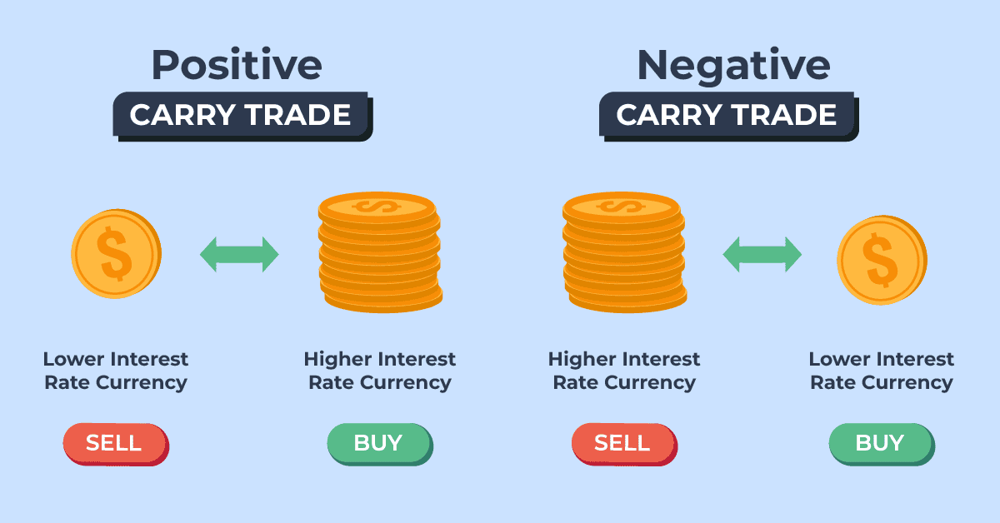

## Table of Contents

## What is negative carry?

Negative carry is when the cost of holding an investment is more than the income it makes. Imagine you buy a bond that pays you $100 every year, but you have to pay $150 every year to keep it. That's negative carry because you're losing $50 each year.

This situation often happens in financial markets when interest rates change. For example, if you borrow money at a high interest rate to invest in something that earns a lower interest rate, you'll have negative carry. It's important for investors to watch out for this because it can eat into their profits over time.

## What is positive carry?

Positive carry is when the income from an investment is more than the cost of holding it. For example, if you buy a bond that pays you $200 every year, but it only costs you $100 a year to keep, that's positive carry. You're making an extra $100 each year just by holding onto the investment.

This situation is good for investors because it means they are earning more money than they are spending to maintain their investment. Positive carry often happens when interest rates are favorable, like when you can borrow money at a low rate and invest it in something that earns a higher rate. It's a key concept in finance because it can help investors grow their wealth over time.

## How do negative and positive carry affect investment decisions?

Negative and positive carry play a big role in deciding where to invest money. When an investment has a negative carry, it means you're losing money every year just to keep it. This can make the investment less attractive because it's eating into your profits. For example, if you have to pay more in interest on a loan than what you earn from the investment, you might think twice before putting your money there. Investors often try to avoid negative carry situations unless they believe the investment will grow a lot in value over time, which could make up for the yearly losses.

On the other hand, positive carry can make an investment very appealing. If you're earning more from an investment than it costs to hold onto it, you're making extra money each year. This can be a big draw for investors because it means their money is working for them, growing over time without any extra effort. For instance, buying a bond that pays more interest than the cost of borrowing the money to buy it can be a smart move. Investors often look for positive carry opportunities to increase their returns and build wealth steadily.

## Can you provide a simple example of negative carry?

Imagine you borrow $10,000 from the bank at an interest rate of 5% to buy a bond. This means you have to pay $500 every year to the bank just for borrowing the money. Now, let's say the bond you bought only pays you $300 every year. In this case, you're spending more money to keep the bond than you're earning from it. This is an example of negative carry because you're losing $200 each year.

Negative carry can make investments less attractive because it means you're losing money over time. In our example, even if the bond's value goes up a little bit, you're still losing $200 every year. So, unless you think the bond's value will go up a lot to make up for those yearly losses, it might not be a good investment. Investors need to be careful and think about these costs when deciding where to put their money.

## Can you provide a simple example of positive carry?

Imagine you have $10,000 and you put it into a savings account that gives you 3% interest every year. That means you earn $300 every year just for keeping your money in the account. Now, let's say you have to pay a small fee of $100 every year to keep the account open. In this case, you're still making $200 more each year than you're spending. This is an example of positive carry because you're earning more money than it costs you to keep the investment.

Positive carry can make investments really attractive. In our example, the savings account is a good choice because you're making extra money every year without doing anything extra. Investors love finding opportunities like this because it means their money is working for them, helping them grow their wealth over time.

## What are the key factors that contribute to negative carry?

Negative carry happens when the cost of keeping an investment is more than what you earn from it. This can happen because of high borrowing costs. For example, if you borrow money at a high interest rate to buy something that doesn't earn much, you end up paying more in interest than you get back from the investment. Another reason can be low returns on the investment itself. If the bond or stock you buy doesn't pay much, it can lead to negative carry if you have any costs to hold onto it.

Changes in the market can also cause negative carry. If interest rates go up after you've borrowed money, your costs can become higher than your earnings. This means what was a good investment before might turn into a negative carry situation. It's important for investors to keep an eye on these factors because they can affect how much money they make or lose over time.

## What are the key factors that contribute to positive carry?

Positive carry happens when the money you make from an investment is more than what it costs to keep it. This can happen if you borrow money at a low interest rate and invest it in something that earns more. For example, if you can borrow at 2% but invest in a bond that pays 4%, you're making more money than you're spending.

Another reason for positive carry is when the investment itself gives high returns. If you buy a stock or a bond that pays a lot, and the costs to keep it are low, you end up with positive carry. It's great for investors because it means their money is growing without extra effort. Keeping an eye on interest rates and choosing investments with good returns can help create positive carry situations.

## How can an investor identify negative carry in financial instruments?

To spot negative carry in financial instruments, an investor needs to compare the income they get from the investment with the costs of holding it. For example, if you buy a bond, you need to look at how much interest it pays you each year. Then, you check if you have any costs, like interest on a loan you took to buy the bond or fees to keep it. If the costs are more than the interest you earn, that's negative carry.

It's important to keep an eye on changes in interest rates because they can turn a good investment into a negative carry situation. If you borrowed money at a low rate but rates go up, your costs could become higher than your earnings. Also, if the investment's value goes down, it might not be worth keeping if you're losing money every year. By regularly checking these factors, an investor can identify negative carry and decide if they should keep or sell the investment.

## How can an investor identify positive carry in financial instruments?

To spot positive carry in financial instruments, an investor should compare the money they earn from the investment with the costs of holding it. For example, if you buy a bond, you need to look at how much interest it pays you every year. Then, you check any costs, like fees or interest on a loan you took to buy the bond. If the interest you earn is more than the costs, that's positive carry. It's like making extra money just for holding onto the investment.

It's also important to keep an eye on interest rates because they can affect positive carry. If you borrowed money at a low rate and invest it in something that pays more, you can have positive carry. For instance, if you borrow at 2% but your bond pays 4%, you're earning more than you're spending. By regularly checking these factors, an investor can find and keep investments that have positive carry, helping their money grow over time.

## What strategies can be used to mitigate the effects of negative carry?

One way to deal with negative carry is to look for investments that might not pay much now but could grow a lot in value over time. For example, if you buy a stock that doesn't pay much in dividends but you think it will be worth a lot more in the future, the potential growth could make up for the yearly losses. This means you're betting on the investment's future value to offset the negative carry you're facing right now.

Another strategy is to keep an eye on interest rates and try to borrow money at the lowest rate possible. If you can borrow at a lower rate, it can help reduce the cost of holding the investment, making it less negative. Sometimes, you can also switch to investments with lower holding costs or find ways to cut down on fees. By doing this, you can make the negative carry less of a problem and maybe even turn it into positive carry over time.

## How can positive carry be maximized in a portfolio?

To make the most out of positive carry in a portfolio, investors should look for investments that pay more than they cost to keep. This means finding bonds or stocks that give high returns while keeping the costs low. For example, if you can borrow money at a low interest rate and use it to buy a bond that pays a higher interest rate, you're making more money than you're spending. It's like getting extra money every year just for holding onto the investment. By choosing the right investments and keeping an eye on fees, you can make sure your portfolio has more positive carry.

Another way to maximize positive carry is to keep an eye on interest rates and be ready to make changes. If interest rates go down, you might want to borrow more money at the lower rate and invest it in things that still pay well. Also, if you find investments that are doing better than expected, you can put more money into them. By staying flexible and adjusting your portfolio as needed, you can keep the positive carry growing. This helps your money work harder for you over time, making your investments more profitable.

## What are the advanced implications of carry in forex trading and how do they influence market dynamics?

In forex trading, carry plays a big role in how traders make decisions and how the market moves. Positive carry happens when a trader borrows money in a currency with a low interest rate and then uses that money to buy a currency with a higher interest rate. This can lead to profits from the difference in interest rates, which is called the carry trade. Many traders look for these opportunities because they can make money even if the exchange rates don't change much. But, if the exchange rates do change a lot, it can affect the profits or even turn the positive carry into a loss. So, traders need to watch the market closely and be ready to adjust their strategies.

The carry trade can also influence the whole forex market. When lots of traders do carry trades, it can push up the value of the currency with the higher interest rate because more people want to buy it. This can lead to bigger moves in the market and sometimes even cause big swings in currency values. On the other hand, if everyone starts to sell the high-interest currency at the same time, maybe because they think the exchange rates will change, it can cause the currency to drop quickly. This is why carry trades can add a lot of excitement and risk to forex trading, and traders need to be careful and think about how their actions might affect the market.

## What is the Understanding Positive Carry Investment Strategy?

Positive carry refers to an investment strategy where an investor borrows (or sells) an asset with a lower yield and invests in an asset with a higher yield. This strategy capitalizes on the difference, or spread, between the interest rates of the two assets, generating returns from this differential. Mathematically, the carry of an asset can be described as:

$$
\text{Carry} = (\text{Yield of the Long Asset} - \text{Yield of the Short Asset}) \times \text{Notional Amount}
$$

### Financial Instruments and Markets

Positive [carry](/wiki/carry-trading) strategies are commonly applied in several financial markets, notably in currency pairs and bonds.

**Currency Pairs:** In the foreign exchange market, a trader might borrow a currency with a relatively low interest rate, such as the Japanese yen, to purchase a currency with a higher interest rate, such as the Australian dollar. This is known as a carry trade. If the interest rate differential remains positive and the exchange rate is stable or moves favorably, the trader profits from the difference in interest rates.

**Bonds:** Another common area for positive carry is in the bond market. Investors may engage in a strategy called "carry and roll" where they invest in longer-term bonds with higher yields and fund them through the issuance or shorting of shorter-term, lower-yielding bonds.

### Benefits of Positive Carry Strategies

1. **Steady Income:** Positive carry strategies can provide a consistent income stream from the differential in interest rates or yields, appealing to investors seeking predictable returns.

2. **Risk Diversification:** By holding a diversified portfolio that leverages different interest rates across various macroeconomic environments, investors can achieve portfolio diversification, mitigating specific market risks.

3. **Leverage Opportunities:** These strategies can be particularly beneficial for leveraged portfolios, where the cost of borrowing is lower than the returns from the yield spread.

### Successful Positive Carry Trade Examples

One famous example of a successful positive carry trade is the Japanese yen carry trade, prominent in the early 2000s. Investors would borrow yen at very low rates and invest in high-yield currencies like the Australian or New Zealand dollars. During periods when global economies were stable, and risk appetite was high, investors reaped substantial gains from these trades.

Another example is during the sovereign debt crisis in the Eurozone, where investors engaged in positive carry trades by borrowing at near-zero interest rates in euros and investing in U.S. Treasury bonds with higher yields, benefiting from both the [interest rate](/wiki/interest-rate-trading-strategies) differential and a relative dollar appreciation during periods of risk aversion.

Overall, while positive carry strategies offer substantial benefits, they are not without risk, particularly if the yield spreads compress or if there are significant exchange rate movements.

## References & Further Reading

[1]: Gyntelberg, J., & Remolona, E. (2007). ["Risk in Carry Trades: A Look at Target Currencies in Asia and the Pacific."](https://www.bis.org/publ/qtrpdf/r_qt0712h.pdf) BIS Quarterly Review.

[2]: Clarida, R., Davis, J., & Pedersen, N. (2009). ["Currency Carry Trade Regimes: Beyond the Fama Regression Model."](https://papers.ssrn.com/sol3/papers.cfm?abstract_id=1510473) NBER Working Paper No. 15523.

[3]: Burnside, C., Eichenbaum, M., & Rebelo, S. (2008). ["Carry Trade: The Gains of Diversification."](https://www.jstor.org/stable/40282667) Journal of Financial Economics.

[4]: Lyons, R. K. (2001). ["The Microstructure Approach to Exchange Rates."](https://direct.mit.edu/books/monograph/2004/The-Microstructure-Approach-to-Exchange-Rates) MIT Press.

[5]: Menkhoff, L., Sarno, L., Schmeling, M., & Schrimpf, A. (2012). ["Carry Trades and Global Foreign Exchange Volatility."](https://onlinelibrary.wiley.com/doi/abs/10.1111/j.1540-6261.2012.01728.x) Review of Economic Studies.