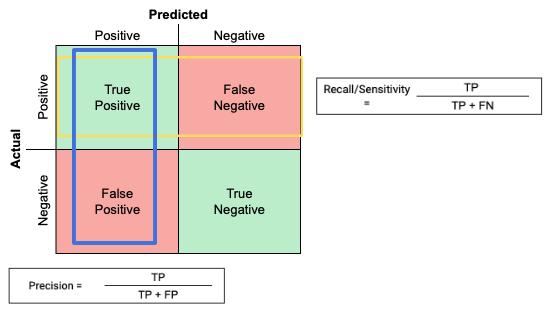

## Table of Contents

## What is the negative class in machine learning?

In machine learning, the negative class refers to the category or group that a model is trying to identify as not belonging to the positive class. For example, if you're training a model to detect spam emails, the positive class would be 'spam' and the negative class would be 'not spam' or 'ham'. The concept of negative and positive classes is important because it helps in defining what the model should look for and what it should not consider as the target outcome.

The negative class plays a crucial role in binary classification problems, where the goal is to categorize data into one of two groups. For instance, in a medical diagnosis scenario, the positive class might be 'disease present' and the negative class 'disease absent'. The performance of a model can often be evaluated based on how well it distinguishes between these two classes, using metrics like accuracy, precision, recall, and F1-score. Understanding the negative class helps in tuning the model to reduce false positives and false negatives, thereby improving its overall effectiveness.

## Why is the concept of negative class important in classification problems?

The concept of negative class is important in classification problems because it helps us understand what the model should not identify as the target outcome. In simple terms, if a model is trying to find something specific, like a disease, the negative class is everything that is not that disease. This helps the model to learn the difference between what it should and shouldn't be looking for, making its predictions more accurate.

For example, if you're using a model to detect spam emails, the positive class is 'spam' and the negative class is 'not spam' or 'ham'. By clearly defining these classes, the model can better understand the characteristics of spam and non-spam emails. This clarity helps in reducing mistakes, like labeling a normal email as spam (false positive) or missing a spam email (false negative), which improves the overall performance of the model.

## How does the negative class affect the performance of a machine learning model?

The negative class plays a big role in how well a [machine learning](/wiki/machine-learning) model works. When a model is trying to tell the difference between two things, like spam and not spam, it needs to know what the negative class looks like. If the model doesn't understand the negative class well, it might make more mistakes. For example, it might think a normal email is spam because it doesn't know what a normal email should look like. This can lead to more false positives, where the model wrongly says something is in the positive class.

Understanding the negative class also helps the model to catch everything it should. If the model knows what the negative class looks like, it can better spot things that are not in the positive class. This means fewer false negatives, where the model misses something it should have caught. By getting both the positive and negative classes right, the model can be more accurate and reliable. This is important for making sure the model works well in real life, whether it's sorting emails, diagnosing diseases, or any other task.

## Can you explain the difference between positive and negative classes in binary classification?

In binary classification, the positive class is what the model is trying to find or identify. For example, if you're using a model to detect spam emails, the positive class would be 'spam'. The model looks for signs or patterns that match this class. On the other hand, the negative class is everything that is not the positive class. In the spam email example, the negative class would be 'not spam' or 'ham'. The model needs to understand what the negative class looks like to avoid labeling normal emails as spam.

Understanding both the positive and negative classes is important for the model to work well. If the model knows what the positive class looks like but not the negative class, it might make mistakes. For example, it might think a normal email is spam because it doesn't know what a normal email should look like. This can lead to more false positives, where the model wrongly says something is in the positive class. By getting both classes right, the model can be more accurate and reliable. This is important for making sure the model works well in real life, whether it's sorting emails, diagnosing diseases, or any other task.

## What are some common metrics used to evaluate the performance on the negative class?

In machine learning, we use special numbers to see how well a model is doing with the negative class. One common number is called specificity. Specificity tells us how good the model is at finding things that are not in the positive class. It's calculated by looking at the number of true negatives (things that are really in the negative class) divided by the total number of things that are actually in the negative class. The formula for specificity is $$ \text{Specificity} = \frac{\text{True Negatives}}{\text{True Negatives} + \text{False Positives}} $$. A high specificity means the model is good at not calling things positive when they're not.

Another important number is the false positive rate. This tells us how often the model wrongly says something is in the positive class when it's really in the negative class. The false positive rate is the opposite of specificity, and it's calculated as $$ \text{False Positive Rate} = \frac{\text{False Positives}}{\text{False Positives} + \text{True Negatives}} $$. A low false positive rate means the model is good at avoiding mistakes where it says something is positive when it's not. Both specificity and false positive rate help us understand how well the model is doing with the negative class, which is important for making sure the model works well in real life.

## How can imbalance between positive and negative classes impact model training?

When there's an imbalance between the positive and negative classes, it means one class has a lot more examples than the other. This can make it hard for the model to learn well. If the model sees a lot more examples of the negative class, it might start to think that almost everything is in the negative class. This can lead to the model missing a lot of the positive class examples, which is called a high false negative rate. For example, if you're trying to detect a rare disease, the model might miss a lot of cases because it's used to seeing mostly healthy people.

To fix this problem, people use different tricks. One common trick is called oversampling, where you make more copies of the positive class examples so the model sees them more often. Another trick is undersampling, where you use fewer examples from the negative class. There are also special ways to change how the model learns, like using different weights for the positive and negative classes. These methods help the model pay more attention to the less common class, making it better at finding both positive and negative examples.

## What techniques can be used to handle an imbalanced negative class in datasets?

When you have more examples of the negative class than the positive class in your dataset, it can be hard for your model to learn well. This is called class imbalance. If the model sees a lot more negative examples, it might start thinking that almost everything is negative. This can lead to the model missing a lot of the positive examples, which is not good. For example, if you're trying to find a rare disease, the model might miss many cases because it's used to seeing mostly healthy people.

To fix this problem, you can use different techniques. One way is oversampling, where you make more copies of the positive class examples so the model sees them more often. Another way is undersampling, where you use fewer examples from the negative class. There are also special methods to change how the model learns, like using different weights for the positive and negative classes. These methods help the model pay more attention to the less common class, making it better at finding both positive and negative examples.

## How does the choice of threshold affect the classification of the negative class?

The threshold in a binary classification model is like a dividing line that decides if something is in the positive or negative class. When you change this threshold, you change how the model treats the negative class. If you set the threshold high, the model will be very careful about calling something positive. This means it might miss some positive examples but will be good at not calling negative examples positive, which is good for the negative class. On the other hand, if you set the threshold low, the model will be more likely to call things positive, which can lead to more mistakes where it says negative examples are positive.

Choosing the right threshold depends on what you care about more. If it's important to avoid calling negative examples positive, like in a medical test where you don't want to scare people with false alarms, you would set a high threshold. This makes the model better at catching the negative class but might miss some positive cases. If you want to catch as many positive cases as possible, even if it means more false alarms, you would set a lower threshold. This can help find more positive cases but might label more negative examples as positive, which can be a problem depending on what you're using the model for.

## What are the implications of misclassifying the negative class in real-world applications?

Misclassifying the negative class in real-world applications can have serious consequences. For example, in medical diagnosis, if a model wrongly says a healthy person has a disease, it can cause a lot of worry and lead to unnecessary treatments. This is called a false positive. On the other hand, if the model misses a disease and says a sick person is healthy, it's a false negative, which can delay important treatment and make the disease worse.

In another example, like email spam filtering, misclassifying the negative class can be annoying but less harmful. If the model labels a normal email as spam, you might miss important messages. But if it misses a spam email, your inbox might get cluttered, but it's not as serious as a medical misdiagnosis. The key is to find the right balance so the model works well for what you need it to do.

## Can you discuss any advanced methods for improving the detection of the negative class?

One advanced method to improve the detection of the negative class is called anomaly detection. This method focuses on finding things that are unusual or different from what the model usually sees. For example, if you're trying to find fraud in credit card transactions, the model learns what normal transactions look like and then flags anything that looks different as possibly being fraud. This helps the model to be better at spotting the negative class, which in this case is 'not fraud'. By focusing on what's unusual, the model can catch more of the negative class examples that might be missed with regular methods.

Another method is using ensemble techniques, like Random Forests or Boosting. These methods combine many simple models to make one strong model. Each simple model might make different kinds of mistakes, but when you put them together, they can be better at finding the negative class. For example, if one model is good at catching some types of negative examples but misses others, another model might catch the ones the first model missed. By combining them, you can get a model that's good at finding all kinds of negative class examples. This can help reduce false positives and false negatives, making the model more reliable in real-world use.

## How do multi-class classification problems handle the concept of a negative class?

In multi-class classification, the idea of a negative class changes a bit because you're not just looking for one thing. Instead of having just one positive and one negative class, you have many classes, and each class can be thought of as positive when you're trying to find it. For example, if you're sorting pictures into categories like 'dog', 'cat', and 'bird', each category is a positive class when you're trying to find that specific type of animal. The other categories become the negative class for that specific task. So, when looking for 'dog', 'cat' and 'bird' are the negative class.

To handle this, models in multi-class classification use different ways to tell the classes apart. One common way is called the "one-vs-rest" approach. In this method, the model treats one class as the positive class and all the other classes as the negative class. It does this for each class, so if you have three classes, the model will run three different checks. Another way is the "one-vs-one" approach, where the model compares each class to every other class, making many small models. Both methods help the model learn the differences between all the classes, making it better at sorting things into the right group.

## What are the current research trends focused on optimizing performance for the negative class in machine learning?

One of the current research trends in machine learning is improving how models handle the negative class, especially in imbalanced datasets. Researchers are working on new ways to make sure models don't miss examples from the negative class. One popular method is called focal loss, which helps the model focus more on hard-to-classify examples. Focal loss adjusts the weights of the loss function so that the model pays more attention to the examples it often gets wrong, which can be important for the negative class. Another trend is using generative models like GANs (Generative Adversarial Networks) to create more examples of the minority class, helping the model learn better from fewer examples.

Another area of focus is developing better evaluation metrics that give a clearer picture of how well the model is doing with the negative class. Traditional metrics like accuracy can be misleading when the classes are imbalanced, so researchers are looking at metrics like the Area Under the Precision-Recall Curve (AUPRC). The AUPRC is good because it focuses on the model's performance on the positive class while still considering the negative class. The formula for AUPRC is calculated by integrating the precision and recall at different thresholds, and it can be expressed as $$ \text{AUPRC} = \int_{0}^{1} \text{precision}(\text{recall}) \, d\text{recall} $$. By using these advanced metrics, researchers can better understand and improve the model's performance on the negative class, leading to more reliable models in real-world applications.