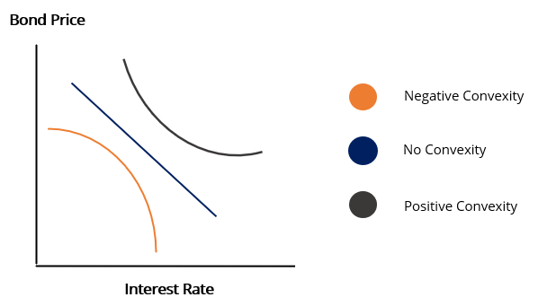

Bonds have played an integral role in financial markets, historically providing investors with a relatively stable form of investment. As a fundamental component within finance, understanding the mechanics of bond pricing and the risks, such as negative convexity, are vital for making informed investment choices. This article aims to elucidate the concepts of bond pricing, delve into the intricacies of negative convexity, and explore how these notions are integrated into the modern landscape of algorithmic trading.

Bond pricing is multifaceted, influenced by a mix of factors including interest rate fluctuations, the duration of the bond, and the creditworthiness of the issuer. The interplay between these elements can affect both the value of the bond and the investment strategy as a whole. Furthermore, negative convexity, commonly found in callable bonds and mortgage-backed securities, can add an additional layer of complexity to bond pricing. This characteristic leads to more unpredictable changes in bond prices triggered by shifts in interest rates, and addressing these challenges becomes essential for effective portfolio management.

Algorithmic trading introduces an additional dimension to the understanding and management of bonds. Leveraging advanced algorithms, investors can analyze vast datasets efficiently to make strategic decisions, thereby optimizing their trade execution processes. The application of algorithmic trading in bonds can be particularly effective in managing bonds with negative convexity, providing timely insights and enhancing decision-making capabilities.

Gaining a comprehensive understanding of these financial concepts not only empowers individual investors but also equips institutional traders with the knowledge necessary to navigate the ever-evolving financial landscape. By exploring bond pricing, negative convexity, and the role of algorithms, this article aims to offer insights that will prove beneficial for crafting robust investment strategies for both individuals and institutions alike.

## Table of Contents

## Bond Pricing Basics

Bond pricing is a multifaceted process influenced by several key variables including interest rates, bond term duration, and the creditworthiness of the issuer. At its core, the valuation of a bond is intrinsically linked to the prevailing interest rates, a foundational principle of fixed-income investments. Generally, the price of a bond inversely correlates with changes in interest rates. This means that as interest rates rise, bond prices tend to fall, and conversely, bond prices tend to rise when interest rates decline. This inverse relationship is critical for investors as it directly impacts the potential returns from fixed-income securities.

One of the factors affecting bond pricing is the bond's coupon rate—essentially, the interest rate the bond pays to its holder—relative to the prevailing market interest rates. For instance, if a bond has a coupon rate that is higher than the current market rate, the bond is more attractive, and its price is likely to increase. Conversely, if the coupon rate is lower than the market rate, the bond’s price might decrease as it becomes less attractive to investors seeking higher returns.

An essential concept in understanding bond pricing is the yield curve, which is a graphical representation of interest rates across different maturity dates for bonds of the same credit quality. Generally, a normal yield curve slopes upwards, reflecting higher yields for bonds with longer maturities due to the increased risk over time. However, yield curves can become flat or inverted, signaling different economic expectations, which in turn affects bond pricing.

Duration is another crucial aspect when analyzing bond prices. It measures the sensitivity of a bond's price to changes in interest rates; specifically, it approximates the percentage change in price for a 1% change in interest rates. A higher duration implies greater sensitivity to [interest rate](/wiki/interest-rate-trading-strategies) changes, which can lead to larger fluctuations in the bond’s price.

Convexity further refines this understanding by accounting for how duration changes as interest rates change. Unlike duration, convexity measures the curvature in the relationship between bond prices and yields, providing a more accurate prediction of a bond's price changes as interest rates fluctuate. Positive convexity indicates that as interest rates move, the duration effect is more pronounced in price gains than in declines, offering investors some level of protection against interest rate variability.

Successfully predicting bond prices involves a thorough comprehension of these concepts, coupled with a strategic approach to managing risks and maximizing returns. Investors and financial analysts employ a variety of analytical tools and models, including Discounted Cash Flow (DCF) analysis, to estimate the present value of expected future cash flows. Within a programming environment like Python, libraries such as numpy and pandas can be utilized to perform complex calculations and simulations to refine bond pricing strategies.

Understanding these fundamental principles allows investors to make informed decisions, optimize their portfolios, and effectively manage risks associated with interest rate movements and other market changes.

## Understanding Negative Convexity

Negative convexity is a complex phenomenon often encountered in certain fixed-income securities such as callable bonds and mortgage-backed securities (MBS). It impacts how these bonds respond to changes in interest rates, leading to less predictable pricing dynamics.

Callable bonds allow the issuer to repay the bond before its maturity date, a feature that adds uncertainty to its valuation. When interest rates decline, the issuer is incentivized to refinance the debt at a lower rate, leading to early redemption of the bond. This results in a scenario where callable bonds exhibit negative convexity; although interest rates fall, the price appreciation of these bonds is limited compared to non-callable bonds.

Mortgage-backed securities, on the other hand, bundle a multitude of mortgages into one security. The inherent option for homeowners to refinance their mortgages introduces negative convexity. As rates decrease, refinancing becomes more appealing, leading to higher prepayment rates and, consequently, lower-than-expected price gains of the MBS. Conversely, when interest rates rise, these securities often exhibit steeper price declines than their non-callable counterparts, exacerbated by reduced prepayment rates.

Mathematically, convexity is a measure of the curvature in the relationship between a bond's price and interest rates. It's second derivative nature is represented as:

$$
C = \frac{1}{P} \sum_{t=1}^{T} \frac{C_t}{(1+y)^t} \times \frac{t(t+1)}{(1+y)^2}
$$

where $C$ is the convexity, $P$ is the current bond price, $C_t$ represents the cash flows, $y$ is the yield, and $t$ denotes the time period in years.

The presence of negative convexity requires investors to employ advanced risk management techniques. One strategy includes diversification across a variety of bonds with differing convexity profiles to balance potential risks and returns. Moreover, investing in financial derivatives like options and swaps can provide hedges against adverse interest rate movements. The dynamic nature of bond markets necessitates continuous monitoring so portfolio adjustments can be made proactively.

In summary, negative convexity presents unique challenges in bond valuation and portfolio management. Mastering techniques to manage these risks is crucial for mitigating potential losses while maximizing returns in fluctuating interest rate environments.

## Algorithmic Trading in Bonds

Algorithmic trading leverages advanced technology to execute orders using predefined strategies that account for critical trading variables such as speed, price, and [volume](/wiki/volume-trading-strategy). This method has gained significant traction in bond markets, where large datasets are analyzed to identify profitable trading opportunities. By systematically processing vast amounts of information, [algorithmic trading](/wiki/algorithmic-trading) systems can derive insights that are not easily identifiable through manual trading methods.

One of the main advantages of using algorithmic strategies in bond trading is their ability to dynamically adjust to real-time market data. This allows for enhanced execution efficiency, ensuring that trades are conducted at the optimal time to maximize returns or minimize risks. The capacity to react swiftly to market changes is particularly beneficial in trading negatively convex bonds, which present unique challenges due to their price behavior under varying interest rate scenarios.

Negatively convex bonds, such as certain callable bonds or mortgage-backed securities, can experience unpredictable price movements. Algorithmic trading systems can be programmed to determine optimal entry and [exit](/wiki/exit-strategy) points, thus managing the risks associated with these securities. By precisely timing trades, algorithms help mitigate potential losses and capitalize on favorable market shifts.

The capabilities of bond trading algorithms are continuously being improved through advancements in [artificial intelligence](/wiki/ai-artificial-intelligence) (AI) and [machine learning](/wiki/machine-learning) (ML). These technologies allow for the development of more sophisticated algorithms that can process and learn from historical data, enabling more accurate predictions and trade decisions. AI and ML facilitate the creation of adaptive strategies that evolve as market conditions change, enhancing the effectiveness of algorithmic trading in managing bond portfolios.

Incorporating Python or other programming languages into trading strategies is common in this field due to their robust libraries and computational efficiency. For example, Python libraries such as `pandas` for data manipulation and `scikit-learn` for machine learning provide the tools necessary for developing and testing trading algorithms.

By employing these advanced technologies and methodologies, investors can gain a competitive edge in bond markets, particularly when dealing with complex financial instruments like negatively convex bonds. The ongoing evolution of algorithmic trading, fueled by technological advancements, promises to offer even greater capabilities and opportunities in the future.

## Risk Management and Strategies

Effective risk management is crucial when handling bonds with negative convexity, as these instruments pose unique challenges due to their unpredictable price changes in response to interest rate fluctuations. Implementing a robust risk management strategy involves several key approaches that can mitigate potential downsides.

Diversification is a fundamental strategy in managing risk across a bond portfolio. By spreading investments across various bond types with different convexity profiles, investors can balance the potential for negative surprises from individual holdings. For instance, pairing negatively convex bonds, such as callable bonds or mortgage-backed securities, with positively convex instruments can help stabilize portfolio returns. This mix aims to exploit the differing sensitivities to interest rate changes across bond types.

Financial derivatives provide another layer of protection against interest rate [volatility](/wiki/volatility-trading-strategies). Options and swaps can be used to hedge against adverse movements, allowing investors to lock in favorable rates or mitigate losses. For example, interest rate swaps can effectively transform the liability profile of a bond portfolio, providing a defense mechanism against rising rates which can lead to price declines in negatively convex bonds.

Furthermore, constant monitoring of market conditions is imperative. Vigilant investors can adjust their portfolios to reflect current interest rate environments and anticipated changes. This proactive approach may involve reallocating assets towards bonds with a more favorable convexity profile or increasing exposure to derivatives that hedge against predicted market shifts.

Algorithmic tools and software have become indispensable in modern bond trading and risk management. These platforms enable the analysis of large datasets, offering insights that support data-driven investment decisions. Algorithms can monitor market conditions in real-time and suggest adjustments to the portfolio, optimizing entry and exit points based on current and projected trends. This technological edge is increasingly important as bond markets become more complex and interconnected.

In summary, effective risk management for negatively convex bonds requires a multi-faceted approach encompassing diversification, the use of derivatives, active monitoring, and the adoption of advanced algorithmic tools. By integrating these strategies, investors can better navigate the intricacies of bond markets, improving the resilience and performance of their portfolios in the face of interest rate uncertainties.

## Conclusion

Understanding and effectively managing bond pricing and negative convexity are essential components of successful investment strategies. The interplay between these elements can significantly affect the risk and return profile of a portfolio. Algorithmic trading has emerged as a powerful tool in navigating the complex landscape of modern financial markets. It allows investors to leverage sophisticated techniques, such as real-time data analysis and automated decision-making, to enhance the precision and efficiency of bond trading strategies.

With the right tools and insights, investors can make informed and strategic decisions that optimize their portfolios. This includes recognizing opportunities to capitalize on mispricings, adjusting for changes in interest rate environments, and mitigating risks associated with negative convexity. As technology advances, so too will the methods that investors use to trade and manage risk within bond markets. Innovations in machine learning, data analytics, and financial modeling continue to augment the capabilities of algorithmic systems. 

Staying informed and adaptable is vital to capitalizing on the best opportunities within an increasingly dynamic financial landscape. Investors must remain vigilant, continuously updating their knowledge and strategies to keep pace with evolving market conditions. By adopting a mindset of continual learning and adaptability, investors can better position themselves to manage risks and achieve their investment objectives in a landscape characterized by rapid changes and abundant possibilities.

## References & Further Reading

[1]: Fabozzi, F. J. (2007). ["Fixed Income Analysis, Second Edition."](https://books.google.com/books/about/Fixed_Income_Analysis.html?id=lujLawVLS3YC) Wiley Finance.

[2]: ["Bond Markets, Analysis, and Strategies"](https://www.amazon.com/Bond-Markets-Analysis-Strategies-tenth/dp/026204627X) by Frank J. Fabozzi

[3]: Hull, J. C. (2018). ["Options, Futures, and Other Derivatives, Tenth Edition."](https://www.semanticscholar.org/paper/Options%2C-Futures%2C-and-Other-Derivatives-Hull/89bdee500c8623864fc9eb7a471546aa713acc44) Pearson.

[4]: ["The Handbook of Mortgage-Backed Securities"](https://www.amazon.com/Handbook-Mortgage-Backed-Securities-7th/dp/0198785771) by Frank J. Fabozzi

[5]: ["Algorithmic Trading and DMA: An Introduction to Direct Access Trading Strategies"](https://www.amazon.com/Algorithmic-Trading-DMA-introduction-strategies/dp/0956399207) by Barry Johnson