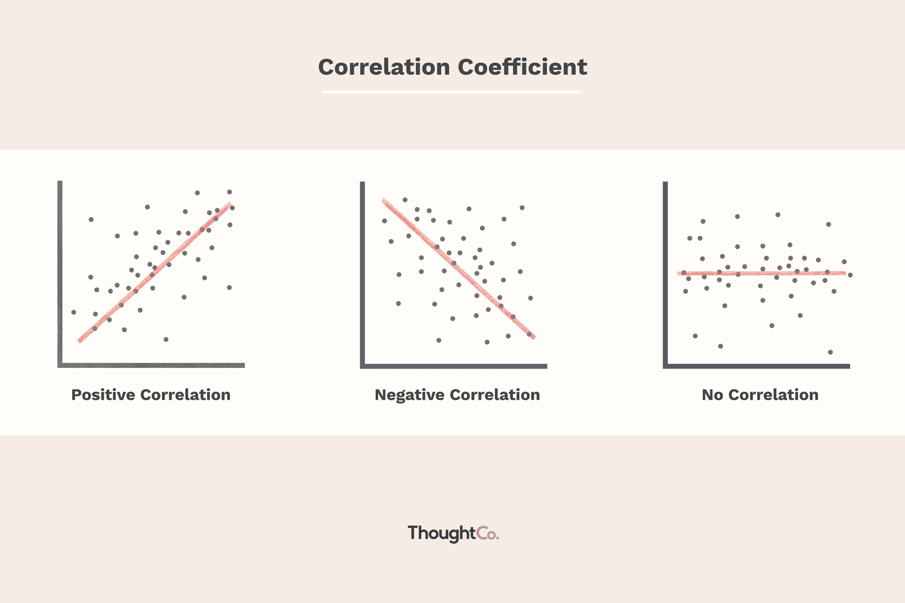

In the world of data analysis and finance, understanding the relationships between variables is crucial. Interactions between variables can significantly impact decision-making processes and strategic planning across various fields. Negative correlation, a fundamental concept in statistics, represents a relationship where two variables move in opposite directions. This notion holds significant implications, particularly in areas like algorithmic trading.

Algorithmic trading, or algo trading, involves the use of automated processes to execute trading decisions at high speeds and frequencies. This method relies heavily on statistical analysis to discern patterns and relationships between different market factors. Negative correlation emerges as a key consideration in this domain, as it can aid traders in hedging strategies and risk management. By understanding how negatively correlated assets behave, traders can better anticipate market movements and adjust their portfolios accordingly.



The correlation coefficient, a statistical measure, quantifies the strength and direction of the relationship between two variables. It ranges from -1 to 1, where values closer to -1 indicate a strong negative correlation. Such quantitative assessments are instrumental in parsing complex data sets, allowing for a clearer interpretation of market dynamics.

Through the strategic use of negative correlations, traders aim to enhance their decision-making and trading strategies. By incorporating these statistical tools, they can potentially improve their predictive models and achieve more optimized trading outcomes. This article discusses how negative correlations and the correlation coefficient play an integral role in algo trading, helping professionals navigate the fast-paced and often volatile financial markets. Join us as we explore these interconnections and their practical applications in the ever-evolving field of algorithmic trading.

## Table of Contents

## Understanding Negative Correlation

Negative correlation is a fundamental statistical concept that occurs when two variables move in opposite directions. This means that an increase in one variable is associated with a decrease in the other, and vice versa. Mathematically, this relationship is quantified using the correlation coefficient, a value that typically ranges from -1 to 1. A correlation coefficient less than zero signifies a negative correlation, indicating an inverse relationship between the variables being analyzed.

Understanding negative correlation is pivotal in numerous fields like finance, meteorology, psychology, and more. For instance, in finance, investors often examine the correlation between different asset classes to manage risk and portfolio diversification. A classic example is the inverse relationship observed between stocks and bonds. When stock prices decline, bond prices often rise, providing a hedge against market volatility.

In the context of meteorology, consider the inverse relationship between temperature and heating demand. As temperatures decrease during winter months, the demand for heating energy typically increases. This negative correlation assists in energy planning and management.

Similarly, in the field of psychology, researchers might explore the relationship between stress levels and quality of sleep. A negative correlation in this scenario might suggest that as stress increases, the quality of sleep decreases, highlighting areas for therapeutic intervention.

The statistical representation of negative correlation through the correlation coefficient $r$ can be computed using the formula:

$$
r = \frac{n(\sum xy) - (\sum x)(\sum y)}{\sqrt{[n\sum x^2 - (\sum x)^2][n\sum y^2 - (\sum y)^2]}}
$$

where:
- $n$ is the number of data points,
- $x$ and $y$ are the two variables being analyzed,
- $\sum xy$ is the sum of the product of paired scores,
- $\sum x$ and $\sum y$ are the sums of the variables,
- $\sum x^2$ and $\sum y^2$ are the sums of the squares of the variables.

Ultimately, negative correlations are an essential tool for deciphering complex interactions between variables, helping researchers and practitioners make informed decisions based on empirical data. By illustrating the connected nature of variables, negative correlations foster a deeper understanding of how changes in one [factor](/wiki/factor-investing) can influence another, enabling strategic adjustments across industries and disciplines.

## The Correlation Coefficient: A Measure of Relationship

The correlation coefficient is a statistical metric that expresses the degree of linear relationship between two variables, commonly represented by $r$. It can take on values from -1 to 1, where values closer to -1 imply a strong negative correlation, meaning as one variable increases, the other tends to decrease. Conversely, a coefficient near 1 indicates a strong positive correlation, whereby both variables move in tandem. A coefficient of 0 signifies no linear relationship between the variables.

Understanding these coefficients facilitates the decoding of complex data relationships, as they provide a numeric summary of the association's strength and direction. Calculating the correlation coefficient involves several steps, and the most commonly used method is Pearson's correlation coefficient. The Pearson correlation is defined as:

$$
r = \frac{\sum (X - \bar{X})(Y - \bar{Y})}{\sqrt{\sum (X - \bar{X})^2 \sum (Y - \bar{Y})^2}}
$$

Where:
- $X$ and $Y$ are the variables being compared.
- $\bar{X}$ and $\bar{Y}$ are the mean values of $X$ and $Y$, respectively.

Interpreting the correlation coefficient involves assessing both the magnitude and the sign of $r$. For instance:
- $r > 0.7$ or $r < -0.7$ suggests a strong correlation.
- $0.3 < r < 0.7$ or $-0.7 < r < -0.3$ indicates a moderate correlation.
- $-0.3 < r < 0.3$ implies a weak or no correlation.

Besides Pearson's correlation, there are other types such as Spearman's rank correlation and Kendall's tau, which are non-parametric and used when data do not meet Pearson's assumptions, like normality or linearity. These methods rely on rankings of the data instead of raw values.

Choosing the right correlation coefficient depends largely on the data's nature and distribution. Pearson's correlation is suitable for continuous and normally distributed data, while Spearman's rank and Kendall's tau are more appropriate for ordinal data or non-linear relationships.

In practice, understanding how to compute and apply these coefficients enables analysts to reveal and quantify the connections between variables, which is particularly useful in fields such as finance, where identifying relationships between economic indicators can drive strategic actions. For example, in Python, calculating Pearson's correlation can be easily done using libraries like NumPy and Pandas:

```python
import pandas as pd

# Sample data
data = {'Variable1': [1, 2, 3, 4, 5], 'Variable2': [5, 4, 3, 2, 1]}
df = pd.DataFrame(data)

# Calculate Pearson correlation
pearson_correlation = df.corr(method='pearson')
print(pearson_correlation)
```

This code snippet demonstrates the simplicity and power of using Python to compute correlation coefficients, thereby assisting analysts and traders in their data-driven decision-making processes.

## Negative Correlation in Algorithmic Trading

Algorithmic trading, often referred to as algo trading, involves using computer programs to execute trading strategies efficiently and accurately. In this context, understanding negative correlation is crucial for several reasons, particularly in risk management and strategic execution.

Negative correlation occurs when two financial instruments move in opposite directions. In [algorithmic trading](/wiki/algorithmic-trading), this relationship can be leveraged to hedge portfolios and optimize the return on investment. By identifying negatively correlated assets or asset classes, traders can balance potential losses in one position with gains in another, thereby mitigating overall risk.

One of the primary strategies utilizing negative correlations involves portfolio diversification. For example, a trader might invest in both a stock expected to perform well in an economic upturn and another asset that typically thrives in a downturn, such as government bonds. This approach reduces exposure to market [volatility](/wiki/volatility-trading-strategies), as losses in one asset are offset by gains in another.

Additionally, traders often use statistical models and algorithms to identify and monitor negative correlations. A common tool is the Pearson correlation coefficient, which measures the linear relationship between two variables. In Python, the `numpy` library offers a straightforward way to compute this:

```python
import numpy as np

# Sample data representing two asset price changes
asset1_returns = np.array([0.01, -0.02, 0.03, -0.01])
asset2_returns = np.array([-0.01, 0.02, -0.03, 0.01])

# Calculate the Pearson correlation coefficient
correlation_coefficient = np.corrcoef(asset1_returns, asset2_returns)[0, 1]
print(f"Correlation Coefficient: {correlation_coefficient}")
```

A strong negative value suggests that the assets typically move in opposite directions, indicating a potential hedging opportunity.

Real-world examples of leveraging negative correlation include pairs trading, where a trader identifies two securities with a historical price relationship. If the correlation between their price movements turns negative, the trader might short one asset while taking a long position in the other, expecting the spread between their prices to revert to the mean.

Another strategy involves using negatively correlated indicators to predict market movements. For instance, volatility indices often have a negative correlation with stock indices; during market downturns, volatility typically rises. Traders can develop algorithms that issue buy or sell signals based on these inverse relationships.

However, successfully employing these strategies requires constant monitoring and adjustment. Market conditions can change rapidly, altering correlation patterns. Therefore, ongoing data analysis and model refinement are necessary for maintaining an effective algorithmic trading strategy.

In conclusion, understanding and applying negative correlations in algorithmic trading can result in enhanced predictive models and strategies. By incorporating these relationships into trading algorithms, traders improve their decision-making processes and potentially achieve more favorable investment outcomes.

## Challenges and Considerations

Relying solely on negative correlations in algorithmic trading presents specific challenges and risks that traders must navigate carefully. One prominent issue arises from the inherent complexity and dynamism of financial markets. Correlation patterns between assets or indicators can shift unexpectedly due to changing market conditions, such as economic events, shifts in investor sentiment, or regulatory changes. For example, a negative correlation observed during a period of economic stability might dissipate during times of market upheaval, leading to inaccurate assumptions and potential financial losses.

Another challenge lies in the over-reliance on correlation metrics without considering the broader context of the data. Correlation does not imply causation, meaning that even a statistically significant negative correlation does not guarantee a causal relationship. Traders must be wary of spurious correlations, where two variables appear correlated due to random chance or an unseen factor influencing both. This underscores the importance of a comprehensive analysis that includes not only correlation but also other statistical, fundamental, or technical indicators to build a more robust trading strategy.

Algorithmic trading strategies that depend heavily on negative correlations should also be adaptable to account for evolving markets. Static models may not perform well over time, so it is vital to regularly update and backtest trading algorithms with fresh data to ensure their relevance. For instance, employing [machine learning](/wiki/machine-learning) techniques can help in dynamically assessing correlations and revealing hidden patterns that might not be apparent through traditional statistical methods alone.

Additionally, incorporating risk management practices is crucial when dealing with correlation-based strategies. Techniques such as diversification, position sizing, and stop-loss orders can help mitigate potential losses arising from incorrect correlation assumptions. Regularly reviewing and adjusting these strategies will enhance their effectiveness in the face of uncertain market conditions.

Overall, while negative correlations can offer valuable insights for trading strategies, their limitations necessitate a holistic approach that combines ongoing data analysis, strategic adaptation, and robust risk management. This multifaceted strategy will better equip traders to harness the benefits of negative correlations while navigating the complexities of financial markets.

## Conclusion

Negative correlation and the correlation coefficient serve as essential tools in data analysis and financial trading. In algorithmic trading, these statistical measures provide a structured approach to making informed decisions and optimizing trading strategies by identifying relationships between assets that move inversely.

However, the effectiveness of these tools is not without limitations. Traders must recognize that relying solely on negative correlations can be risky due to the complex nature of financial markets. Correlation patterns can change over time as market conditions evolve, which could impact the reliability of strategies based solely on these metrics. Therefore, maintaining an awareness of these limitations and using correlation insights within a comprehensive analytical framework is crucial.

Continuous learning and adaptation are vital for leveraging statistical measures in rapidly changing markets. Algorithmic traders must be committed to ongoing analysis and strategy refinement to keep pace with market dynamics and ensure the continued efficacy of their trading models.

By thoroughly understanding and strategically leveraging negative correlations and the correlation coefficient, traders can refine their trading approaches and improve their performance. These tools, when effectively applied, enable traders to develop robust, data-driven strategies that can lead to better outcomes in the competitive landscape of financial trading.

## References & Further Reading

[1]: Bergstra, J., Bardenet, R., Bengio, Y., & Kégl, B. (2011). ["Algorithms for Hyper-Parameter Optimization."](https://dl.acm.org/doi/10.5555/2986459.2986743) Advances in Neural Information Processing Systems 24.

[2]: ["Advances in Financial Machine Learning"](https://www.amazon.com/Advances-Financial-Machine-Learning-Marcos/dp/1119482089) by Marcos Lopez de Prado

[3]: ["Evidence-Based Technical Analysis: Applying the Scientific Method and Statistical Inference to Trading Signals"](https://www.amazon.com/Evidence-Based-Technical-Analysis-Scientific-Statistical/dp/0470008741) by David Aronson

[4]: ["Machine Learning for Algorithmic Trading"](https://github.com/PacktPublishing/Machine-Learning-for-Algorithmic-Trading-Second-Edition) by Stefan Jansen

[5]: ["Quantitative Trading: How to Build Your Own Algorithmic Trading Business"](https://books.google.com/books/about/Quantitative_Trading.html?id=j70yEAAAQBAJ) by Ernest P. Chan