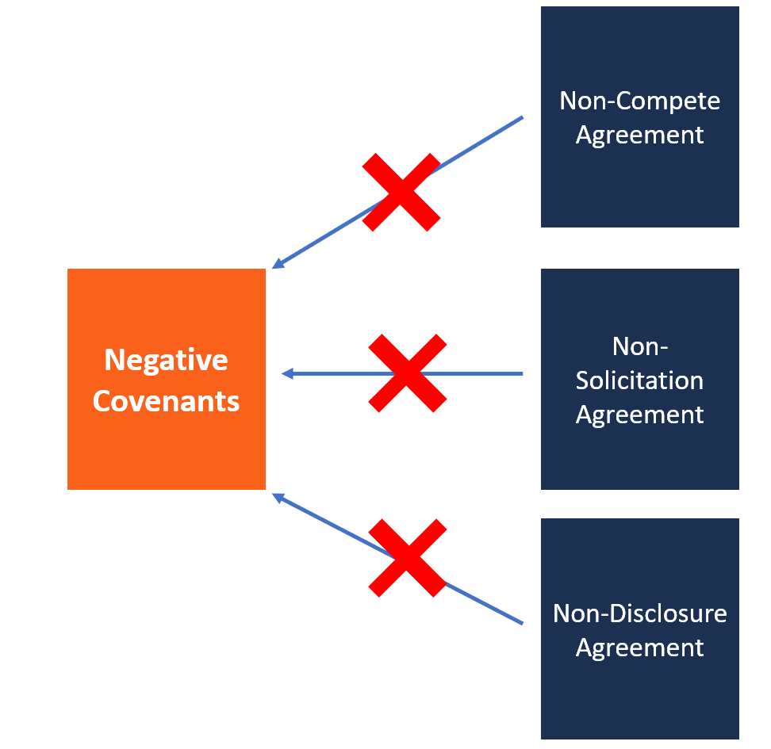

## Table of Contents

## What is a negative covenant in a contract?

A negative covenant in a contract is a promise by one party to not do certain things. It's like a rule that says "don't do this" to protect the other party's interests. For example, in a loan agreement, a borrower might agree not to take on more debt. This helps the lender feel safer about the loan.

Negative covenants are common in many types of contracts, like business deals and employment agreements. They help set boundaries and keep things fair. For instance, an employee might agree not to work for a competitor for a certain time after leaving the job. This protects the company's secrets and gives them peace of mind.

## How does a negative covenant differ from a positive covenant?

A negative covenant and a positive covenant are two types of promises in a contract, but they work in opposite ways. A negative covenant is a promise not to do something. It's like a rule that says "don't do this." For example, if you borrow money, you might promise not to take on more debt. This helps the lender feel safer because it limits what you can do.

On the other hand, a positive covenant is a promise to do something. It's like a rule that says "do this." For instance, if you rent a house, you might promise to keep it in good condition. This helps the landlord because it makes sure you take care of the property. So, while negative covenants set limits, positive covenants set requirements.

## Can you provide examples of common negative covenants in business contracts?

In business contracts, negative covenants are promises not to do certain things. One common example is in loan agreements where a company promises not to take on more debt. This helps the lender feel safe because it means the company won't borrow more money and risk not being able to pay back the original loan. Another example is in employment contracts where an employee agrees not to work for a competitor for a certain time after leaving the job. This protects the company's secrets and keeps their business safe.

Another type of negative covenant often seen in business contracts is a non-disclosure agreement (NDA). In an NDA, a person or company agrees not to share confidential information they learn during the contract. This helps businesses keep their private information private. In franchise agreements, a franchisee might promise not to open a similar business nearby. This protects the franchisor's brand and ensures the franchisee doesn't compete with them directly.

These examples show how negative covenants can be used in different ways to protect the interests of the parties involved in a contract. They set boundaries and help maintain trust and fairness in business relationships.

## Why are negative covenants included in contracts?

Negative covenants are included in contracts to protect one party from the actions of the other. They set rules about what the other party is not allowed to do. This helps keep things fair and safe. For example, if a company borrows money, a negative covenant might say they can't borrow more money from someone else. This makes the lender feel safer because it means the company won't take on too much debt and risk not being able to pay back the loan.

These covenants are also important for keeping business secrets safe. In an employment contract, an employee might agree not to work for a competitor for a while after leaving the job. This protects the company's private information and helps them trust their employees. By setting these boundaries, negative covenants help build trust and make sure everyone follows the rules.

## What are the consequences of breaching a negative covenant?

If someone breaks a negative covenant, there can be serious consequences. The other party might take legal action against them. This could mean going to court and having to pay money, called damages, to make up for any harm caused. The court might also make the person who broke the covenant stop doing whatever they promised not to do. This is called an injunction.

Breaking a negative covenant can also hurt a person's or a company's reputation. If others find out they didn't keep their promise, it might be hard for them to make deals in the future. People might not trust them anymore. This can lead to lost business and other problems. So, it's important to follow negative covenants to avoid these issues.

## How can a negative covenant be enforced?

When someone breaks a negative covenant, the other party can go to court to enforce it. They might ask the court to make the person stop doing what they promised not to do. This is called an injunction. For example, if an employee promised not to work for a competitor and they do it anyway, the court might order them to stop working there.

The court can also make the person who broke the covenant pay money to the other party. This money, called damages, is meant to make up for any harm caused by breaking the promise. If a company borrowed money and promised not to take on more debt but did it anyway, they might have to pay the lender for any losses. Enforcing a negative covenant helps make sure people follow the rules and keeps business relationships fair and trustworthy.

## Are there any limitations or exceptions to negative covenants?

Yes, there are limitations and exceptions to negative covenants. One big limitation is that they have to be fair and reasonable. If a negative covenant is too strict or lasts too long, a court might not enforce it. For example, if an employee is told they can't work for any company in the same industry for 10 years after leaving their job, a court might say that's too long and not fair.

Another exception is when breaking a negative covenant is needed to follow the law. If a new law says you have to do something that goes against your negative covenant, you can break it without getting in trouble. Also, sometimes both parties can agree to change or remove a negative covenant if they both want to. This can happen if their situation changes and the covenant isn't needed anymore.

## How do negative covenants affect the flexibility of a business?

Negative covenants can make a business less flexible. When a business agrees to a negative covenant, it promises not to do certain things. For example, if a company borrows money and promises not to take on more debt, it can't borrow more money even if it needs to. This can limit the company's ability to grow or respond to new opportunities. It's like having your hands tied behind your back; you can't do everything you might want to do.

However, negative covenants can also help a business in some ways. They can make other people, like lenders or partners, feel more secure. When a business follows the rules set by negative covenants, it builds trust. This trust can lead to better deals and relationships. So, while negative covenants might limit what a business can do, they can also help it in the long run by making it more trustworthy and stable.

## What role do negative covenants play in loan agreements?

In loan agreements, negative covenants are promises that the borrower makes to the lender about what they will not do. These promises help the lender feel safer about giving the loan. For example, a borrower might promise not to take on more debt. This means the lender doesn't have to worry about the borrower borrowing more money and not being able to pay back the original loan. Negative covenants set rules that keep the borrower from doing things that could make it harder for them to pay back the loan.

These covenants can limit what the borrower can do, but they also help build trust between the borrower and the lender. When a borrower follows the rules set by negative covenants, the lender feels more confident that the loan will be paid back. This trust can lead to better loan terms and a stronger relationship between the borrower and the lender. So, while negative covenants might make things a bit harder for the borrower, they play an important role in making sure the loan agreement works well for both sides.

## How are negative covenants negotiated in contract discussions?

When people are making a contract, they talk about negative covenants to make sure everyone is happy with the rules. The person who wants the negative covenant, like a lender, will say why it's important for them. They might say they need it to feel safe about the deal. The other person, like a borrower, might say the covenant is too strict and could make it hard for them to do business. They might ask for the covenant to be less strict or to last for a shorter time. Both sides keep talking until they agree on what the negative covenant should be.

Sometimes, the person who doesn't want the negative covenant might offer something else instead. For example, a borrower might agree to give the lender more information about their business to make them feel safer. This way, the lender might not need the negative covenant as much. The key is to find a balance where both sides feel okay with the rules. By talking and listening to each other, they can make a contract that works for everyone.

## What legal considerations should be taken into account when drafting negative covenants?

When you're writing negative covenants in a contract, you need to make sure they are fair and not too strict. If a negative covenant is too hard on one side, a court might not let it be enforced. For example, if an employee agrees not to work for a competitor for too long, like 10 years, a court might say that's not fair. It's important to make sure the negative covenant is clear and specific so everyone knows what they can't do. This helps avoid confusion and disagreements later on.

Also, you need to think about the laws that might affect the negative covenant. Some laws might say you can't have certain kinds of negative covenants. For example, laws about competition or worker rights might limit what you can put in an employment contract. It's a good idea to check with a lawyer to make sure your negative covenant follows all the rules. This way, you can be sure it will be strong and hold up in court if there's a problem.

## How have courts interpreted negative covenants in recent case law?

In recent case law, courts have looked at negative covenants to make sure they are fair and reasonable. They check if the covenant is too hard on one side or if it goes on for too long. For example, if a company says an employee can't work for a competitor for 10 years after leaving, a court might say that's too long and not fair. Courts want to make sure that negative covenants don't stop people from [earning](/wiki/earning-announcement) a living or doing business in a way that is too strict.

Courts also look at the specific words used in the negative covenant. They want to make sure the covenant is clear and easy to understand. If the words are confusing or too broad, the court might not enforce the covenant. This helps keep things fair and makes sure everyone knows what they can and can't do. By looking at these things, courts try to balance the needs of both sides and make sure the negative covenant is used in a fair way.

## References & Further Reading

[1]: Myers, S. C. (1977). ["The determinants of corporate borrowing."](https://www.sciencedirect.com/science/article/abs/pii/0304405X77900150)90015-0) Journal of Financial Economics, 5(2), 147-175.

[2]: Smith, C. W., & Warner, J. B. (1979). ["On Financial Contracting: An Analysis of Bond Covenants."](https://www.sciencedirect.com/science/article/pii/0304405X79900114) Journal of Financial Economics, 7(2), 117-161.

[3]: Bergstra, J., Bardenet, R., Bengio, Y., & Kégl, B. (2011). ["Algorithms for Hyper-Parameter Optimization."](https://dl.acm.org/doi/10.5555/2986459.2986743) Advances in Neural Information Processing Systems 24.

[4]: Lopez de Prado, M. (2018). ["Advances in Financial Machine Learning."](https://www.amazon.com/Advances-Financial-Machine-Learning-Marcos/dp/1119482089) Wiley.

[5]: Arnason, D. (2006). ["Evidence-Based Technical Analysis: Applying the Scientific Method and Statistical Inference to Trading Signals."](https://www.amazon.com/Evidence-Based-Technical-Analysis-Scientific-Statistical/dp/0470008741) Wiley.

[6]: Jansen, S. (2020). ["Machine Learning for Algorithmic Trading."](https://github.com/stefan-jansen/machine-learning-for-trading) Packt Publishing.

[7]: Chan, E. P. (2009). ["Quantitative Trading: How to Build Your Own Algorithmic Trading Business."](https://github.com/ftvision/quant_trading_echan_book) Wiley.