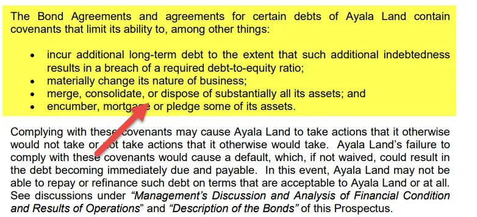

The complex world of modern commerce often necessitates restrictive agreements known as negative covenants. These covenants are integral to financial and legal contracts, serving as mechanisms to restrict specific actions by the contracting parties in order to safeguard particular interests and maintain stability. These contractual obligations become paramount, especially in corporate finance deals and day-to-day business operations, playing a crucial role in safeguarding lender interests and ensuring market stability[1].

Negative covenants are primarily designed to protect the financial health and operational integrity of contractual parties, especially lenders or investors. By imposing limitations on actions like incurring additional debt, paying substantial dividends, or disposing of significant assets, these covenants work as preventative measures against financial mismanagement or unfavorable shifts in business strategy. This proactive approach is particularly useful in complex financial landscapes where the stakes are high and the margin for error is minimal.



Furthermore, the practical relevance of negative covenants extends across various sectors, with specific adaptations and implementations to suit diverse industry needs. These covenants hold significant weight in financial contracts, ensuring that borrowers maintain a stable financial profile, thereby protecting lender investments and prioritizing financial obligations. They are also crucial in scenarios like acquisitions and mergers, where they help prevent actions that could destabilize financial structures or undermine investor interests.

A specific area where negative covenants have gained increasing importance is in algorithmic trading environments. In these scenarios, where rapid market changes and strategic financial moves are a norm, negative covenants act as risk management tools. They ensure that trading activities are conducted within defined risk parameters, thereby aligning trading strategies with broader financial goals and enhancing investor confidence.

This article explores the concept of negative covenants, their critical role in restrictive agreements, and their implications within contracts across different sectors, with a special focus on algorithmic trading environments. Understanding these covenants is paramount for anyone engaged in modern commerce to ensure an optimal balance between protection and flexibility as markets continue to evolve.

[1] Myers, S. C. (1977). The determinants of corporate borrowing. Journal of Financial Economics, 5(2), 147-175.

## Table of Contents

## What are Negative Covenants?

Negative covenants, also referred to as restrictive covenants, are integral components of contractual agreements designed to limit or prohibit specific actions by the party subject to the covenant. These clauses are essential for maintaining control over a party's financial and operational activities, primarily in scenarios involving borrower-lender relationships.

At their core, negative covenants serve to safeguard the interests of lenders by ensuring that borrowers uphold a stable financial profile. This is achieved by curbing actions that could jeopardize the borrower's ability to meet financial obligations or diminish the value of the lender's investment. Common forms of these covenants involve stipulations that restrict a company from incurring additional debt, distributing excessive dividends, or disposing of substantial assets without obtaining prior approval from the lender.

For instance, a negative covenant might prohibit a borrower from taking on new debt that would increase the company's debt-to-equity ratio beyond a specified threshold. This measure helps ensure that the borrower remains within a financial structure capable of meeting repayment obligations. Similarly, restrictions on the payment of dividends protect the lender by preventing the borrower from diverting cash flows that could otherwise be used to service debt.

Another critical aspect is the restriction on asset sales, which prevents companies from offloading key assets, potentially undermining their operational capacity and stability. For example, a manufacturing company might be bound by a covenant that requires lender consent before selling crucial production facilities or market inventories.

In summary, negative covenants are instrumental in preserving the financial health of borrowing entities, thereby safeguarding lender investments. By imposing such restrictions, lenders can prioritize financial commitments and mitigate risks associated with borrowers engaging in financially detrimental actions.

## The Importance of Restrictive Agreements

Restrictive agreements, often encapsulated in the form of negative covenants, play a pivotal role in risk management for financial transactions. These agreements are designed to enforce sound financial practices among borrowers and mitigate potential risks that could adversely affect investors. 

In corporate finance and mergers and acquisitions (M&A), negative covenants serve to prevent actions that could compromise financial stability. For instance, they may restrict overly aggressive expansion policies or limit additional borrowing to ensure that companies maintain the capacity to meet their existing financial commitments. This is crucial for preserving investor confidence and maintaining equilibrium within financial systems. According to Smith and Warner (1979), these covenants are fundamental for aligning the objectives of lenders and borrowers and ensuring the latter adhere to sustainable financial trajectories.

Beyond financial contracts, restrictive agreements are integral to employment agreements, particularly in safeguarding proprietary and confidential information. In an era where intellectual property and data are critical assets, these covenants prevent employees from disclosing sensitive information or engaging with competitors, thereby protecting organizational interests. For example, non-compete clauses and confidentiality agreements help maintain competitive advantage and secure intellectual capital.

Overall, while restrictive agreements place limitations on certain actions to manage risk and protect interests, they are indispensable for structuring stable financial environments and preserving the integrity of confidential information. As markets continue to evolve, leveraging these agreements effectively will be essential for businesses and investors seeking to navigate complex financial landscapes.

## Contract Obligations in the Context of Algo Trading

Algorithmic trading environments are characterized by their rapid-paced operations and sensitivity to market fluctuations. In this context, negative covenants serve as essential instruments to manage associated risks effectively. These covenants are embedded within contracts to impose specific restrictions, thereby aligning trading practices with the broader financial strategies and safeguarding the interests of investors and firms alike.

One of the primary functions of restrictive agreements in algo trading contracts is to establish risk thresholds for trading securities. By defining these thresholds, financial institutions can ensure that [algorithmic trading](/wiki/algorithmic-trading) strategies do not undertake excessive risk, which could jeopardize financial stability. For example, a covenant might specify that trades must not exceed a particular leverage ratio, thereby mitigating the risk of significant losses during volatile market conditions. This is crucial since excessive leveraging can magnify losses, especially in high-frequency trading environments where decisions are executed within milliseconds.

Additionally, these covenants often include clauses that restrict particularly high-risk activities. High-frequency trading algorithms, for instance, may be limited in terms of the [volume](/wiki/volume-trading-strategy) of trades they can execute within a specific timeframe if market conditions exceed predefined [volatility](/wiki/volatility-trading-strategies) bands. This kind of restriction helps to maintain the integrity of algorithm performance and can reinforce investor confidence by demonstrating a commitment to minimizing unnecessary exposure to risk.

Implementing such covenants requires sophisticated monitoring and compliance systems that are often supported by advanced technologies, including [machine learning](/wiki/machine-learning) and real-time data analytics. These systems can automatically enforce restrictions by halting or adjusting trading activities that breach covenant limits. For example, Python-based monitoring tools can be deployed to track trading parameters continuously, ensuring adherence to the covenants. Here is a sample Python snippet that illustrates a basic monitoring approach:

```python
def check_trade_compliance(trades, max_leverage, volatility_threshold):
    compliant_trades = []
    for trade in trades:
        if trade['leverage'] <= max_leverage and trade['volatility'] <= volatility_threshold:
            compliant_trades.append(trade)
    return compliant_trades

# Sample trade data
trades = [
    {'id': 1, 'leverage': 5, 'volatility': 0.02},
    {'id': 2, 'leverage': 8, 'volatility': 0.03},
    {'id': 3, 'leverage': 10, 'volatility': 0.015}
]

# Compliance check
compliant_trades = check_trade_compliance(trades, 7, 0.025)
print(compliant_trades)
```

This piece of code evaluates a list of trades against specified leverage and volatility limits, facilitating real-time decision-making to ensure compliance with contractual obligations. By using such methods, firms can efficiently manage the dual objectives of maximizing the algorithm's performance while adhering to the protective measures stipulated in their trading contracts. This fine balance strengthens the trust of stakeholders and contributes to the long-term sustainability of the trading ecosystem.

## Balancing Flexibility and Protection

While negative covenants effectively protect lender interests by maintaining financial prudence, the challenge lies in ensuring they do not impede a company's ability to innovate and grow. The essence of these covenants is to prevent borrowers from engaging in activities that could compromise their financial stability. However, if implemented too rigidly, they may restrict a company's operational flexibility, impeding its capacity to adapt to changing markets and capitalize on emerging opportunities.

Over-restrictive covenants can lead to several challenges, such as limiting a company's ability to raise capital through issuing additional debt or making strategic investments. For instance, a covenant limiting capital expenditures might prevent a company from investing in new projects or technology that could drive growth. Similarly, restrictions on dividend payments can affect a company's ability to attract and retain investors, thereby influencing its market valuation and access to capital.

Negotiating these covenants requires strategic insight, taking into account both the lender's desire for security and the borrower's need for operational flexibility. A well-structured covenant should provide a safety net that protects financial interests while allowing enough leeway for the company to pursue its growth objectives. This balance can be achieved through the inclusion of specific terms that allow adjustments based on financial performance metrics or predefined conditions.

For instance, performance-based covenants can be more adaptive, permitting actions contingent upon meeting certain financial criteria. A company may be allowed to take on additional debt if its debt-to-equity ratio remains below a certain threshold. This conditional flexibility encourages companies to maintain robust financial health while pursuing developmental goals.

Additionally, covenants can include exceptions for specific types of transactions that align with the company’s strategic goals, such as reinvestment of proceeds from asset sales into agreed-upon avenues for growth. Incorporating these mechanisms into covenant negotiations ensures that protective measures do not come at the expense of a company's strategic initiatives.

In conclusion, while negative covenants are essential for protecting lender interests, recognizing the importance of maintaining a balance with flexibility is crucial. This balance supports the evolving needs of businesses amid dynamic market conditions, ensuring protection and adaptability coexist within financial agreements.

## Conclusion

Negative covenants are indispensable tools for managing financial risk and protecting investments in various business environments. These contractual provisions act as guardians of financial stability by ensuring that parties within a contract adhere to predetermined financial strategies and limits. This is especially critical in maintaining the equilibrium between risk and reward in sectors such as corporate finance and algorithmic trading, where the stakes are often high.

In the complex landscape of algorithmic trading, negative covenants are essential for safeguarding against the volatility inherent in market operations. They offer a framework to control high-risk activities, such as excessive leveraging or unrestricted asset trading, thereby aligning trading practices with overarching financial goals. By setting boundaries on trading behavior, these covenants increase investor trust and promote algorithm performance, which is vital for seamless trading operations.

The increasing complexity and dynamic nature of modern markets underscore the growing importance of negative covenants. As financial environments continue to evolve, the sophistication of these covenants is expected to rise. This evolution necessitates continuous learning and strategic adaptation from all market participants to ensure that protective measures remain effective without stifling growth and innovation. Successfully balancing the dual objectives of protection and operational flexibility is key to harnessing the full potential of negative covenants, empowering businesses to navigate the intricacies of modern commerce while securing their financial footing.

## References & Further Reading

[1]: Myers, S. C. (1977). ["The determinants of corporate borrowing."](https://www.sciencedirect.com/science/article/abs/pii/0304405X77900150)90015-0) Journal of Financial Economics, 5(2), 147-175.

[2]: Smith, C. W., & Warner, J. B. (1979). ["On Financial Contracting: An Analysis of Bond Covenants."](https://www.sciencedirect.com/science/article/pii/0304405X79900114) Journal of Financial Economics, 7(2), 117-161.

[3]: Bergstra, J., Bardenet, R., Bengio, Y., & Kégl, B. (2011). ["Algorithms for Hyper-Parameter Optimization."](https://dl.acm.org/doi/10.5555/2986459.2986743) Advances in Neural Information Processing Systems 24.

[4]: Lopez de Prado, M. (2018). ["Advances in Financial Machine Learning."](https://www.amazon.com/Advances-Financial-Machine-Learning-Marcos/dp/1119482089) Wiley.

[5]: Arnason, D. (2006). ["Evidence-Based Technical Analysis: Applying the Scientific Method and Statistical Inference to Trading Signals."](https://www.amazon.com/Evidence-Based-Technical-Analysis-Scientific-Statistical/dp/0470008741) Wiley.

[6]: Jansen, S. (2020). ["Machine Learning for Algorithmic Trading."](https://github.com/stefan-jansen/machine-learning-for-trading) Packt Publishing.

[7]: Chan, E. P. (2009). ["Quantitative Trading: How to Build Your Own Algorithmic Trading Business."](https://github.com/ftvision/quant_trading_echan_book) Wiley.