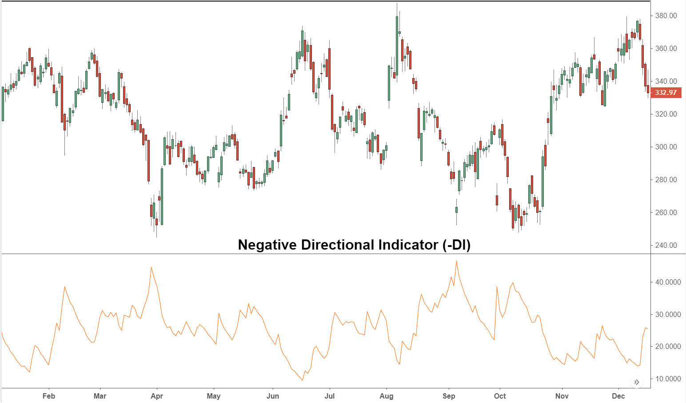

## Table of Contents

## What is the Negative Directional Indicator (DMI)?

The Negative Directional Indicator (DMI) is a technical analysis tool used in trading to measure the strength of a downward price movement in a market. It is part of the Directional Movement System developed by J. Welles Wilder, which also includes the Positive Directional Indicator (DMI+). The Negative DMI helps traders identify periods when the market is experiencing bearish pressure, which can be useful for making decisions about when to sell or short a security.

The calculation of the Negative Directional Indicator involves comparing the current low price to the previous low price. If the current low is lower than the previous low, the difference is considered a "minus directional movement" (-DM). This value is then smoothed over time, typically using a 14-day period, to create the Negative DMI line on a chart. Traders often use the Negative DMI in conjunction with the Positive DMI and the Average Directional Index (ADX) to get a fuller picture of market trends and momentum.

## How is the Negative Directional Indicator calculated?

The Negative Directional Indicator (DMI) is calculated by comparing the current low price of a security to its previous low price. If the current low is lower than the previous low, the difference between these two lows is called the "minus directional movement" or -DM. If the current low is higher than the previous low, the -DM is set to zero. This process is repeated for each period, typically a day, to find the -DM for that period.

Once the -DM values are determined, they are smoothed over time to create the Negative DMI line. This smoothing is usually done using a 14-day exponential moving average (EMA). The formula for the first 14-day period is the sum of the -DM values divided by 14. For subsequent periods, the Negative DMI is calculated using the formula: Previous Negative DMI - (Previous Negative DMI / 14) + Current -DM. This smoothed value is what traders see on charts as the Negative DMI line, helping them understand the strength of downward price movements.

## What does the Negative Directional Indicator measure?

The Negative Directional Indicator measures how strong the downward price movement is in a market. It is part of a set of tools called the Directional Movement System, made by J. Welles Wilder. The Negative Directional Indicator, often called -DMI, looks at the difference between the current low price and the previous low price. If the current low is lower, it means the market is moving down, and the -DMI will show this.

Traders use the -DMI to understand when the market is going down. They look at this indicator to decide if it's a good time to sell or short a security. The -DMI is usually used with other indicators like the Positive Directional Indicator and the Average Directional Index to get a full picture of market trends. This helps traders make better decisions based on the strength of the downward movement.

## How can the Negative Directional Indicator be used in trading?

The Negative Directional Indicator, or -DMI, helps traders see when prices are going down in the market. It does this by comparing the current low price to the previous low price. If the current low is lower, it shows that the market is moving down. Traders can use this information to decide when to sell a security or to short it, hoping to make a profit from the downward movement. By watching the -DMI, traders can spot when the downward trend is strong and might continue, helping them make better trading decisions.

Traders often use the -DMI along with the Positive Directional Indicator, or +DMI, and the Average Directional Index, or ADX. The +DMI shows the strength of upward price movements, and the ADX tells how strong the overall trend is. When the -DMI is higher than the +DMI, it means the downward movement is stronger than the upward movement. This can be a signal for traders to sell or short. By using all three indicators together, traders get a fuller picture of the market's direction and can make more informed choices about their trades.

## What is the difference between the Negative Directional Indicator and the Positive Directional Indicator?

The Negative Directional Indicator, or -DMI, measures how strong the downward price movement is in a market. It does this by looking at the difference between the current low price and the previous low price. If the current low is lower, it means the market is moving down, and the -DMI will show this. Traders use the -DMI to decide if it's a good time to sell or short a security, hoping to make a profit from the downward movement.

The Positive Directional Indicator, or +DMI, is different because it measures the strength of the upward price movement. It looks at the difference between the current high price and the previous high price. If the current high is higher, it means the market is moving up, and the +DMI will show this. Traders use the +DMI to decide if it's a good time to buy a security, hoping to make a profit from the upward movement. By comparing the -DMI and the +DMI, traders can see which direction the market is moving more strongly.

## How does the Negative Directional Indicator interact with other technical indicators?

The Negative Directional Indicator, or -DMI, works well with other technical indicators to help traders understand the market better. One important indicator it works with is the Positive Directional Indicator, or +DMI. The -DMI shows how strong the downward movement is, while the +DMI shows how strong the upward movement is. By comparing these two, traders can see which direction the market is moving more strongly. For example, if the -DMI is higher than the +DMI, it means the market is moving down more strongly, which might be a good time to sell or short.

Another important indicator that the -DMI interacts with is the Average Directional Index, or ADX. The ADX tells how strong the overall trend is, whether it's up or down. When the ADX is high, it means the trend is strong, and traders can use the -DMI to see if that strong trend is downward. If the ADX is low, it means the trend is weak, and the -DMI might not be as useful because the market isn't moving strongly in any direction. By using the -DMI with the ADX and +DMI, traders get a fuller picture of the market's direction and can make better trading decisions.

## What are common strategies that incorporate the Negative Directional Indicator?

One common strategy that uses the Negative Directional Indicator, or -DMI, is called trend following. In this strategy, traders watch the -DMI along with the Positive Directional Indicator, or +DMI, and the Average Directional Index, or ADX. When the -DMI is higher than the +DMI and the ADX is also high, it means the market is in a strong downward trend. Traders might use this signal to sell their securities or start short selling, hoping to make money as the price goes down. They keep watching the -DMI and the other indicators to see if the downward trend continues or if it starts to weaken.

Another strategy is called divergence. This is when the price of a security is moving one way, but the -DMI is moving the opposite way. For example, if the price is going up but the -DMI is going up too, it might mean the upward movement is weak and could reverse soon. Traders might use this signal to sell their securities before the price starts to fall. By combining the -DMI with other indicators like the Relative Strength Index, or RSI, traders can get a better idea of when the market might change direction and make trades based on that.

## Can the Negative Directional Indicator predict market trends accurately?

The Negative Directional Indicator, or -DMI, is a tool that traders use to see how strong the downward movement in the market is. It doesn't predict market trends perfectly because the market can be unpredictable. The -DMI looks at the difference between the current low price and the previous low price. If the current low is lower, it means the market is moving down. Traders use this information to decide when to sell or short a security, hoping to make a profit from the downward movement. But, because the market can change quickly, the -DMI is just one piece of the puzzle and should be used with other indicators to get a better picture of what might happen next.

When traders use the -DMI along with other indicators like the Positive Directional Indicator and the Average Directional Index, they can get a fuller picture of the market's direction. For example, if the -DMI is higher than the +DMI and the ADX is high, it might mean the market is in a strong downward trend. Traders might use this signal to make trades, but they need to remember that no indicator can predict the future with certainty. The -DMI is helpful for understanding current trends and making informed decisions, but it's not a crystal ball for the market.

## What are the limitations of using the Negative Directional Indicator?

The Negative Directional Indicator, or -DMI, is a helpful tool for traders, but it has some limits. One big limit is that it can't predict the future perfectly. The market can change quickly, and even if the -DMI shows a strong downward trend, that trend might not last. Also, the -DMI only looks at the downward movement, so it doesn't give a full picture of the market on its own. Traders need to use it with other indicators to get a better idea of what's happening.

Another limit of the -DMI is that it can give false signals. Sometimes, the -DMI might show a strong downward trend, but the market might not follow that trend for long. This can lead traders to make trades that don't work out. Also, the -DMI uses past data to make its calculations, so it might not catch sudden changes in the market. Traders need to be careful and use the -DMI along with other tools to make the best decisions.

## How can the settings of the Negative Directional Indicator be optimized for different markets?

The settings of the Negative Directional Indicator, or -DMI, can be changed to work better in different markets. The most common setting is a 14-day period, but traders might want to use a shorter period like 7 days for markets that move quickly, or a longer period like 21 days for markets that move slowly. By trying different time periods, traders can see which one fits the market they are trading in the best. It's important to test these changes in a practice account first to see how they work before using them with real money.

Another way to optimize the -DMI is to use it with other indicators like the Positive Directional Indicator and the Average Directional Index. By changing the settings of these indicators to match the market, traders can get a clearer picture of what's happening. For example, in a fast-moving market, shorter periods for all indicators might help catch trends quicker. In a slow-moving market, longer periods might give a better view of the overall trend. Testing different combinations of settings can help traders find the best way to use the -DMI for their specific market.

## What advanced techniques can be applied to enhance the effectiveness of the Negative Directional Indicator?

One advanced technique to make the Negative Directional Indicator, or -DMI, work better is to use it with other indicators in a smart way. For example, traders can combine the -DMI with the Positive Directional Indicator, or +DMI, and the Average Directional Index, or ADX, to get a full picture of the market's trend. By setting up rules like only trading when the -DMI is higher than the +DMI and the ADX is above a certain level, traders can avoid false signals and focus on strong trends. Another technique is to use the -DMI with price action patterns, like looking for bearish candlestick patterns when the -DMI is rising. This can help confirm that the downward trend is likely to continue, giving traders more confidence in their decisions.

Another way to improve the -DMI is by using it with different time frames. Traders can look at the -DMI on both short-term and long-term charts to see if the downward trend is happening in both time frames. If the -DMI is showing a strong downward move on both a daily and a weekly chart, it might be a more reliable signal. Additionally, traders can use the -DMI in a divergence strategy, where they watch for times when the price is going up but the -DMI is going down. This can be a sign that the upward move is weak and might reverse soon. By using these advanced techniques, traders can make the -DMI a more powerful tool in their trading strategy.

## How does the Negative Directional Indicator perform in various market conditions, such as bull and bear markets?

The Negative Directional Indicator, or -DMI, works differently in bull and bear markets. In a bear market, where prices are going down, the -DMI can be very helpful. It shows how strong the downward movement is by comparing the current low price to the previous low price. If the -DMI is high and rising, it means the market is moving down strongly. Traders might use this signal to sell their securities or start short selling, hoping to make money as the price keeps falling. The -DMI is especially useful in bear markets because it helps traders spot and follow the downward trend.

In a bull market, where prices are going up, the -DMI is less useful on its own. It still shows the strength of any downward movements, but these movements are usually weaker and shorter in a bull market. Traders might use the -DMI along with the Positive Directional Indicator, or +DMI, to see if the upward trend is getting weaker. If the -DMI starts to rise and gets close to or above the +DMI, it might mean the bull market is losing steam and could turn into a bear market soon. By using the -DMI with other indicators, traders can get a better idea of what's happening in the market, even in a bull market.

## What is the Negative Directional Indicator (-DI) and how is it calculated?

The Negative Directional Indicator (-DI) is a significant tool for traders and analysts aiming to identify and confirm bearish trends in financial markets. By providing insights into the strength of downward price movements, the -DI helps traders anticipate potential market declines.

The calculation of the -DI begins with determining the negative directional movement (-DM). Negative directional movement occurs when the current low is lower than the previous low, allowing for the capturing of downward price action. If a day records a lower high and a lower low compared to the prior day, the -DM captures the extent of this move.

To smooth out [volatility](/wiki/volatility-trading-strategies) and emphasize the prevailing trend over noise, the -DM is typically averaged over a set period, often defaulted to 14 days. This smoothing process involves averaging the daily -DMs over the specified period. Afterward, the smoothed -DM is expressed as a percentage of the smoothed true range of the asset, which accounts for price gaps and limit moves that can occur between trading sessions. The formula for calculating the -DI is as follows:

$$
\text{-DI} = \left( \frac{\text{Smoothed -DM}}{\text{Smoothed True Range}} \right) \times 100
$$

This formula produces a value that reflects the relative strength of downward movement over the selected period.

When the -DI is rising, it suggests that bearish pressure is intensifying. This trend can signal a potential increase in selling activity, providing a strategic cue for traders who employ short-selling or other strategies aimed at capitalizing on declining markets. By monitoring changes in the -DI, traders can adapt their positions accordingly, aiming to mitigate risk or capitalize on anticipated downtrends.

## References & Further Reading

[1]: Wilder, J. W. (1978). ["New Concepts in Technical Trading Systems"](https://archive.org/details/newconceptsintec00wild) by J. Welles Wilder Jr. 

[2]: DiNapoli, J. (1998). ["DiNapoli Levels: The Practical Application of Fibonacci Analysis to Investment Markets"](https://www.amazon.com/DiNapoli-Levels-Practical-Application-Investment/dp/1891159046) by Joe DiNapoli

[3]: Arnold, G. (2008). ["Technical Analysis of Stocks and Trends."](https://www.amazon.com/Technical-Analysis-Stock-Trends-8th/dp/0814406807) in Corporate Financial Management, 4th Edition

[4]: Murphy, J. J. (1999). ["Technical Analysis of the Financial Markets: A Comprehensive Guide to Trading Methods and Applications"](https://archive.org/details/technicalanalysi0000murp) by John J. Murphy

[5]: Pring, M. J. (2002). ["Technical Analysis Explained, 4th Edition: The Successful Investor's Guide to Spotting Investment Trends and Turning Points"](https://www.amazon.com/Technical-Analysis-Explained-Fifth-Successful/dp/0071825177) by Martin J. Pring