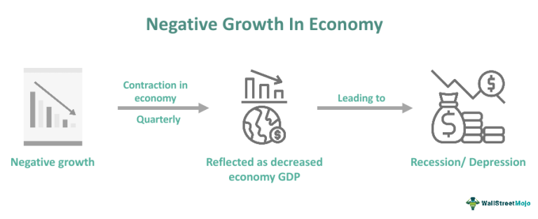

In the ever-evolving landscape of financial markets, grasping the intricate relationships between economic variables and market techniques is fundamental. This article addresses the economic impact of two significant yet challenging phenomena: negative growth and algorithmic trading.

Negative growth is typically seen as a precursor to economic downturns, marked by a decline in key economic indicators such as Gross Domestic Product (GDP). Factors contributing to negative growth include decreasing business sales, earnings, high unemployment, and reduced consumer confidence. Such contraction phases often coincide with economic recessions, presenting substantial policy challenges that threaten both national and global economic stability.



Conversely, algorithmic trading represents a revolutionary shift in financial markets, characterized by the use of computer algorithms to execute trades based on predetermined criteria. This advancement has significantly influenced market efficiency, transaction speed, liquidity, and volatility. High-frequency and sophisticated trading strategies have emerged, enabling traders to leverage technological advancements for maximizing gains.

The strategic interaction between negative growth and algorithmic trading raises compelling questions about their combined impact on the broader economy. Key considerations include how these disparate forces may intersect and influence market dynamics, investor behavior, and policy responses. Together, these phenomena shape the economic landscape in complex ways that offer both challenges and opportunities.

By exploring these intricate topics, the article aims to provide valuable insights into their implications for investors, policymakers, and the financial ecosystem at large. Understanding these economic impacts is essential for navigating future financial landscapes, promoting stability, and enhancing resilience amid changing economic conditions.

## Table of Contents

## Understanding Negative Growth

Negative growth represents a reduction in the economic output of a country, typically identified through a decline in the Gross Domestic Product (GDP). This phenomenon signifies a contraction in the economy, which can manifest due to various underlying factors. These include declining business sales and earnings, elevated unemployment rates, and diminished consumer confidence. As economic activities slow down, the reduction in consumer spending further exacerbates the contraction, creating a feedback loop that can persist if not addressed through timely interventions.

A decline in GDP signifies that the total market value of all finished goods and services produced within a country over a specific period has reduced. Mathematically, negative growth can be expressed by a negative change in GDP over time:

$$
\Delta \text{GDP} < 0
$$

$$
\Delta \text{GDP} = \text{GDP}_{\text{current}} - \text{GDP}_{\text{previous}}
$$

where $\Delta \text{GDP}$ is the change in GDP between the current and previous periods.

Such periods of negative growth are often precursor to economic recessions, defined as two consecutive quarters of negative GDP growth. This contraction necessitates significant policy measures to mitigate its adverse effects. Governments and central banks may resort to fiscal stimulus or monetary policy tools to spur economic activity and restore confidence.

Moreover, the consequences of negative growth extend beyond national borders, affecting global markets and international trade. Reduced economic activity in one significant economy can lead to decreased demand for imports, impacting trading partners. Consequently, this can lead to a domino effect, influencing global investment patterns, altering trade balances, and affecting financial stability across interconnected economies.

The existing dynamics of negative growth thus present considerable challenges for policymakers and economic stakeholders, who must balance efforts to stimulate short-term recovery with long-term economic stability. As such, understanding and navigating these contractions remain a critical concern within national and international economic discourse.

## Economic Impact of Negative Growth

Negative growth, commonly signified by a decrease in Gross Domestic Product (GDP), is a fundamental indicator associated with economic recessions or depressions. This economic contraction often results in diminished consumer spending as individuals and households exercise caution in uncertain economic climates. Consequently, businesses experience a drop in demand, which can lead to a cyclical downturn in industrial production. 

In periods of negative growth, unemployment rates typically rise as companies seek to curtail costs by reducing their workforce. The relationship between GDP and unemployment can be illustrated by Okun’s Law, which posits that for every 1% increase in the unemployment rate, a country’s GDP tends to be roughly an additional 2% lower than its potential GDP. 

The adverse effects of negative growth extend into investor confidence, as markets tend to react negatively to GDP contractions. Investors may perceive a riskier economic environment, leading to decreased investment activity. This decline in confidence can significantly impact capital flows and valuations in both domestic and international markets.

Additionally, governments may face constrained resources due to falling tax revenues and increased pressure on public services. Policymakers often resort to monetary and fiscal policies, such as [interest rate](/wiki/interest-rate-trading-strategies) adjustments or stimulus packages, to counteract negative growth effects. However, these interventions come with challenges, including budget deficits and potential inflationary pressures if not carefully managed.

On a global scale, negative growth can disrupt international trade balances by altering exchange rates. A nation's currency may depreciate as a result of decreased economic stability and reduced foreign investment, making exports more competitive but increasing the cost of imports. These changes can prompt shifts in global trade dynamics and necessitate recalibrations in policy to stabilize the economy.

Overall, negative growth poses significant challenges to economic stability, requiring coordinated efforts among policymakers, investors, and market participants to mitigate its impacts and promote recovery.

## Algorithmic Trading: An Overview

Algorithmic trading, often referred to as algo trading, involves the utilization of computer algorithms to execute trades at speeds and frequencies impossible for human traders. These algorithms are designed to follow pre-defined criteria, such as timing, price, quantity, or a mathematical model, and operate without the need for human intervention.

# Transformational Impact on Financial Markets

Algorithmic trading has dramatically altered how financial markets function, significantly influencing transaction speed, market [liquidity](/wiki/liquidity-risk-premium), and trading efficiency. By employing sophisticated algorithms, traders can execute trades in milliseconds or even microseconds, which drastically reduces the time it takes to enter or [exit](/wiki/exit-strategy) positions and allows market participants to react to market conditions more swiftly than ever before.

The impact on market liquidity has been profound. Algo trading contributes to the depth and breadth of the market by enabling continuous buying and selling, which enhances the ease with which securities can be traded without causing large price changes. This continuous activity narrows the bid-ask spread, making markets more cost-effective for all participants.

# High-Frequency Trading and Complex Strategies

A major subset of [algorithmic trading](/wiki/algorithmic-trading) is high-frequency trading ([HFT](/wiki/high-frequency-trading-strategies)), which is characterized by a high turnover rate and the execution of large numbers of orders at extremely fast speeds. HFT employs complex algorithms and high-powered computers to capture market inefficiencies or [arbitrage](/wiki/arbitrage) opportunities across different markets or asset classes.

Complex algorithmic strategies leverage technology to maximize returns, employing various statistical, quantitative, and technical analysis methods. Examples include market-making strategies, arbitrage strategies, and trend-following strategies, each designed to exploit different aspects of the market. 

For instance, a simple moving average crossover strategy, a type of trend-following approach, might involve programming an algorithm with the following Python function to trigger a buy when the short-term moving average exceeds the long-term moving average:

```python
def moving_average_crossover(short_window, long_window, prices):
    short_mavg = prices.rolling(window=short_window).mean()
    long_mavg = prices.rolling(window=long_window).mean()
    signals = (short_mavg > long_mavg).astype(int)
    return signals
```

# Risks and Systemic Implications

Despite its advantages, algorithmic trading carries inherent risks that can affect market dynamics. The speed and [volume](/wiki/volume-trading-strategy) of trading can amplify market [volatility](/wiki/volatility-trading-strategies), particularly in times of economic stress or sudden news events, potentially leading to rapid swings in asset prices.

Systemic risks are also a concern, as the same algorithms that provide liquidity can trigger large sell-offs if market conditions deteriorate, leading to flash crashes or significant market disruptions. The "Flash Crash" of May 6, 2010, is a notable example where automated trading systems were believed to have exacerbated a sharp decline in U.S. stock indices.

Additionally, complex algorithmic systems might be vulnerable to technical failures, which can result in massive losses or contribute to broader financial instability. Thus, it's crucial for market participants and regulators to monitor these systems continuously and implement robust safeguards to mitigate potential adverse effects on financial markets.

## Impact of Algorithmic Trading on Economic Growth

Algorithmic trading plays a significant role in shaping economic growth, presenting both opportunities and challenges for financial markets. It automates and accelerates the trading process by using pre-programmed algorithms, significantly influencing both short-term price dynamics and long-term economic indicators.

One of the primary benefits of algorithmic trading is the enhancement of market efficiency. By executing trades at high speed, algorithmic trading facilitates liquidity, which refers to the ease with which assets can be bought or sold without affecting their price. High liquidity typically results in narrower bid-ask spreads—the difference between the highest price a buyer is willing to pay and the lowest price a seller is willing to accept—leading to lower transaction costs for market participants. These improvements in efficiency and cost reduction can foster economic stability and potentially contribute to economic growth.

Despite these benefits, the complexity and speed characteristic of algorithmic strategies can sometimes lead to market surprises and heightened economic uncertainties. For instance, the rapid execution of trades can occasionally cause drastic fluctuations in asset prices, heightening volatility. Such market volatility can be seen during events known as "flash crashes," where prices plummet and recover within seconds. These incidents underscore the potential for algorithmic trading to exacerbate economic uncertainties, particularly during periods of financial instability.

The relationship between algorithmic trading and economic growth necessitates a nuanced understanding to maximize its benefits. During periods of negative growth, leveraging algorithmic trading as a stabilizing tool requires careful management to mitigate its destabilizing consequences. This involves scrutinizing both regulatory frameworks and technological advancements to ensure the potential risks are counterbalanced by safeguards that enhance economic stability. Balancing the positive contributions of algorithmic trading with the need to manage its inherent risks is crucial for sustaining economic growth and resilience.

## Algorithmic Trading and Negative Growth: A Dual Impact

The convergence of negative growth conditions and heightened algorithmic trading activity creates a multifaceted economic scenario. During periods of negative growth, financial markets often experience decreased liquidity and increased uncertainty, challenging traditional trading practices. Algorithmic trading, given its ability to execute large volumes of trades swiftly, can serve a dual role under these circumstances.

On one hand, algorithmic trading can stabilize markets by maintaining liquidity levels. Algorithms are designed to execute trades based on predefined criteria, responding to market signals with speed and precision that surpasses human capabilities. This capacity can act as a counterbalance to the fears that typically permeate markets during economic contractions, ensuring that there is continuous buying and selling activity. This liquidity supports price discovery and can prevent the market from stalling during uncertain times. 

Conversely, the very nature of algorithmic trading that provides these benefits can also amplify market fluctuations. The rapid execution and volume-based nature of algorithmic trades, particularly in high-frequency trading, can exacerbate price swings and induce greater volatility. Algorithms that react to market signals without consideration of broader economic contexts may unintentionally contribute to market instability. Historical case studies, such as the 2010 Flash Crash, provide examples of how algorithmic trading can exacerbate existing market tensions under adverse conditions.

Managing the dual impacts of algorithmic trading during negative growth periods necessitates a combination of historical analysis and predictive modeling. Leveraging big data and [machine learning](/wiki/machine-learning) technologies, predictive models can simulate complex market interactions and forecast potential adverse scenarios. For instance, by analyzing large datasets that include past market behavior during downturns, it's possible to identify patterns and potential triggers for algorithm-induced volatility. Advanced modeling techniques, such as agent-based modeling, can provide insights into how individual algorithmic strategies might interact under negative growth conditions, offering a blueprint for mitigating risks.

The financial ecosystem needs to explore regulatory frameworks and technological advancements to mitigate potential adverse consequences. Regulatory bodies could consider implementing controls such as circuit breakers and transaction taxes to deter overly aggressive trading practices during unstable economic times. Furthermore, the development of more sophisticated algorithms that incorporate macroeconomic indicators into trading decisions could enhance the positive contributions of algorithmic trading.

Finally, evolving technology offers opportunities to improve algorithmic trading strategies. Machine learning and [artificial intelligence](/wiki/ai-artificial-intelligence) can help design adaptive algorithms that react not only to market signals but also to broader economic indicators, potentially reducing unintended negative impacts. Collaboration among policymakers, technologists, and financial market participants will be crucial to harness the benefits of algorithmic trading while managing the risks it presents during periods of negative economic growth.

## Opportunities and Challenges Ahead

The future of algorithmic trading presents significant opportunities to enhance economic growth. Particularly, advancements in machine learning and predictive analytics are paving the way for more resilient trading strategies. These strategies could effectively adjust to negative growth scenarios, offering a buffer against economic downturns. Machine learning algorithms, capable of processing vast datasets, can identify subtle market patterns and predict future trends.

For instance, predictive models using historical market data can be employed to forecast economic conditions and adapt trading strategies accordingly. By utilizing techniques such as [reinforcement learning](/wiki/reinforcement-learning), algorithms can continuously improve by learning from past trading successes and failures. This could lead to the development of self-correcting systems that adapt in real-time to fluctuating economic environments.

```python
import numpy as np
from sklearn.model_selection import train_test_split
from sklearn.ensemble import RandomForestRegressor

# Sample code snippet for using machine learning to predict stock prices
# Assuming data array contains historical stock prices and features
data = np.random.rand(1000, 10)  # Dummy data
labels = np.random.rand(1000)  # Dummy stock prices

# Train-test split
X_train, X_test, y_train, y_test = train_test_split(data, labels, test_size=0.2)

# Random Forest for prediction
model = RandomForestRegressor()
model.fit(X_train, y_train)

# Predicting stock prices
predictions = model.predict(X_test)
```

However, integrating machine learning and predictive algorithms into trading systems is not without challenges. The ethical and regulatory implications of high-frequency trading (HFT) practices remain a significant concern. HFT can lead to market volatility, as rapid trades might exaggerate price movements, potentially harming long-term investors. Regulators worldwide are examining the impact of these technologies to ensure market fairness and stability.

Collaboration among stakeholders—regulatory bodies, financial institutions, and technology developers—is crucial to navigate these challenges. Working together can foster a balance between technological advancement and economic stability. It is essential to develop frameworks that manage risks associated with high-speed trading while encouraging innovation. Implementing robust risk management practices and ensuring transparent operations will be vital in maximizing the benefits of algorithmic trading.

In summary, while the road ahead is fraught with challenges, the potential for algorithmic trading to contribute positively to economic growth is considerable. Through technological innovation, strategic regulatory oversight, and collaborative efforts, it is possible to build a financial ecosystem that is both resilient and adaptive to changing economic landscapes.

## Conclusion

Understanding the economic impacts of negative growth and algorithmic trading is crucial for navigating the intricate tapestry of future financial landscapes. While the interplay between these forces can yield both counteractive and exacerbating effects, the key lies in their effective management and strategic foresight. Negative growth, as a marker of economic contraction, presents challenges that can either be mitigated or amplified by the dynamic mechanisms of algorithmic trading. This dual impact necessitates a balanced approach to maximize potential benefits and minimize adverse outcomes.

An informed strategy requires collaboration among policymakers, economists, and market participants. Policymakers must anticipate potential disruptions and coordinate regulatory measures that ensure market stability while nurturing innovation. By incorporating economic analyses and market simulations, economists and analysts can develop predictive models that help identify emerging trends and inform decision-making. Meanwhile, market participants, including institutional investors and trading firms, must remain vigilant to industry shifts, adapting strategies to the evolving market conditions and algorithmic developments.

Ultimately, the adaptability and innovation embedded within financial systems will determine their resilience to the complexities posed by negative growth and algorithmic trading influences. Leveraging technological advancements, such as machine learning and big data analytics, will empower stakeholders to design nimble frameworks that can withstand and thrive amidst economic uncertainties. As the financial landscape continues to evolve, the integration of these technologies could foster a robust symbiotic relationship, harmonizing the intricacies of economic stability with the potential of algorithmic trading.

## References & Further Reading

[1]: Bergstra, J., Bardenet, R., Bengio, Y., & Kégl, B. (2011). ["Algorithms for Hyper-Parameter Optimization."](https://dl.acm.org/doi/10.5555/2986459.2986743) Advances in Neural Information Processing Systems 24.

[2]: ["Advances in Financial Machine Learning"](https://www.amazon.com/Advances-Financial-Machine-Learning-Marcos/dp/1119482089) by Marcos Lopez de Prado

[3]: ["Evidence-Based Technical Analysis: Applying the Scientific Method and Statistical Inference to Trading Signals"](https://www.amazon.com/Evidence-Based-Technical-Analysis-Scientific-Statistical/dp/0470008741) by David Aronson

[4]: ["Machine Learning for Algorithmic Trading"](https://github.com/stefan-jansen/machine-learning-for-trading) by Stefan Jansen

[5]: ["Quantitative Trading: How to Build Your Own Algorithmic Trading Business"](https://www.amazon.com/Quantitative-Trading-Build-Algorithmic-Business/dp/1119800064) by Ernest P. Chan