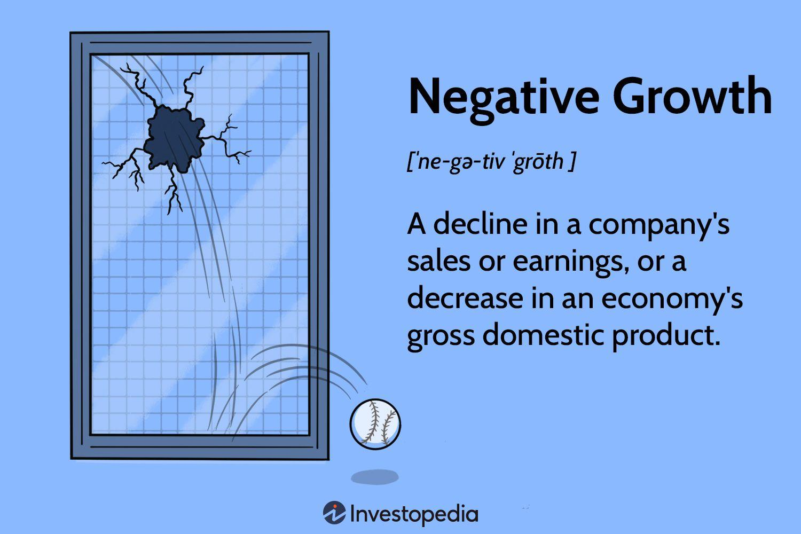

## Table of Contents

## What is negative economic growth?

Negative economic growth happens when a country's economy gets smaller over time. This means that the total value of all goods and services produced in a country goes down. It's often measured by a drop in Gross Domestic Product (GDP) for two quarters in a row. When this happens, it's called a recession. People might lose their jobs, and businesses might struggle because fewer people are buying things.

This can be caused by many things, like a big drop in demand for products, high levels of debt, or even global events like a financial crisis or a pandemic. When an economy is shrinking, it can lead to less money for government programs and services, which can make life harder for many people. Governments and central banks often try to help by lowering interest rates or spending more money to boost the economy, but it can take time to turn things around.

## How is negative economic growth measured?

Negative economic growth is measured by looking at the Gross Domestic Product (GDP) of a country. GDP is the total value of all goods and services produced in a country over a certain period, usually a year or a quarter. If the GDP goes down compared to the previous period, it means the economy is shrinking. Economists pay close attention to this because a drop in GDP for two quarters in a row is called a recession.

To measure GDP, economists add up the value of everything produced, from cars and computers to haircuts and hamburgers. They use data from businesses, government records, and surveys to get an accurate picture. If the total value is less than it was before, that's negative growth. This can be shown as a percentage decrease, like saying the economy shrank by 2% this year. It's an important number because it helps us understand how well the economy is doing and what might need to be done to help it grow again.

## What are the common causes of negative economic growth?

Negative economic growth can happen for many reasons. One big reason is when people stop buying as much stuff. This can happen if they lose their jobs or feel unsure about the future, so they save their money instead of spending it. When people buy less, businesses sell less, and they might have to let workers go or close down. This makes the problem worse because now even more people have less money to spend. Another cause can be big debts. If a country or its people owe a lot of money, they might have to spend more on paying back those debts and less on buying things, which can slow down the economy.

Another reason for negative growth can be big events like a financial crisis or a global health crisis like a pandemic. These events can disrupt how businesses work and how people live their lives. For example, during a pandemic, many businesses might have to close, and people might stay home to avoid getting sick. This means less economic activity, which can lead to negative growth. Governments and central banks often try to help by lowering interest rates or spending more money to get the economy moving again, but it can take time to see improvements.

Sometimes, negative growth can also be caused by changes in the world economy. If a country relies a lot on selling things to other countries, and those countries start buying less, it can hurt the economy. This is called a drop in exports. Also, if the prices of things like oil or other important resources go up a lot, it can make it harder for businesses to keep their costs down, which can lead to negative growth. All these factors can work together to make the economy shrink.

## Can you explain the difference between a recession and negative economic growth?

Negative economic growth means that the economy is getting smaller instead of bigger. This happens when the total value of all the things made and sold in a country goes down. Economists look at something called Gross Domestic Product (GDP) to see if the economy is growing or shrinking. If GDP goes down, that's negative growth. It's like if you had less money in your pocket this month than last month.

A recession is a bit more specific. It's when the economy has negative growth for a while, usually two quarters in a row. A quarter is three months, so if GDP goes down for six months straight, that's a recession. It's like if you had less money in your pocket for half a year. Recessions can make it hard for people to find jobs and can cause businesses to struggle. So, all recessions have negative economic growth, but not all negative growth means a recession yet.

## What immediate effects does negative economic growth have on employment?

When an economy starts to shrink, one of the first things that happens is that businesses might not sell as much stuff as before. Because they are selling less, they might not need as many workers. So, they might let some people go or not hire new people. This can lead to more people being out of work, and it can be hard for people to find new jobs because other businesses might be doing the same thing.

As more people lose their jobs, they have less money to spend on things they want or need. This can make the problem worse because now even fewer people are buying things, so businesses sell even less. It can become a cycle where negative growth leads to more job losses, which leads to even more negative growth. This can be tough on families and communities as people struggle to make ends meet.

## How does negative economic growth impact inflation?

When the economy starts to shrink, it can affect inflation in different ways. Inflation is when the prices of things go up over time. Usually, when the economy is growing, people have more money to spend, and businesses might raise their prices because more people want to buy their stuff. But when the economy is shrinking, people might not have as much money to spend. So, businesses might not be able to raise their prices as much, and sometimes prices might even go down. This is called deflation, which is the opposite of inflation.

But it's not always that simple. Sometimes, even when the economy is shrinking, prices can still go up. This can happen if the cost of making things goes up, like if the price of oil or other important stuff goes up. Or, if a country's money becomes worth less compared to other countries' money, things that are bought from other countries might cost more. So, negative economic growth can lead to lower inflation or even deflation, but it depends on a lot of other things too.

## What are the long-term effects of sustained negative economic growth on a country's economy?

When a country has negative economic growth for a long time, it can really hurt the economy in the long run. People might lose their jobs and have a hard time finding new ones because businesses are not doing well. This can lead to more people being poor and needing help from the government. The government might have less money to spend on things like schools and hospitals because they are getting less tax money from people and businesses. This can make life harder for everyone and can make it tough for the country to grow again.

Over time, if the economy keeps shrinking, businesses might move to other countries where the economy is doing better. This can make it even harder for the country to recover because now it has even fewer jobs and less money coming in. Also, if people see that the economy is not doing well, they might not want to invest their money in new businesses or projects. This can slow down innovation and make it harder for the economy to start growing again. So, long-term negative growth can create a cycle that is tough to break.

## How do governments typically respond to periods of negative economic growth?

When a country's economy starts to shrink, governments usually try to do things to help it grow again. One common thing they do is spend more money on things like building roads or helping people who are out of work. This is called fiscal policy. By spending more, the government hopes to get people working and spending money again, which can help the economy. They might also cut taxes so people and businesses have more money to spend or invest. This can help boost the economy too.

Another thing governments do is work with the central bank, which can change interest rates. If the central bank lowers interest rates, it can make it cheaper for people to borrow money. This can encourage people to buy things like houses or cars, and businesses to invest in new projects. Both of these things can help the economy grow. Sometimes, the central bank might also print more money to help the economy, but this has to be done carefully because it can lead to higher prices if too much money is printed.

Governments might also try to help specific parts of the economy that are struggling the most. For example, they might give money to industries like farming or manufacturing to help them keep going. They might also make it easier for businesses to get loans or help people who lost their jobs find new ones. All these actions are meant to stop the economy from shrinking and get it growing again, but it can take time and a lot of effort to turn things around.

## What role do interest rates play in managing negative economic growth?

When the economy is shrinking, the central bank might lower interest rates to help. Interest rates are what you pay to borrow money or what you get for saving it. If interest rates go down, it's cheaper for people to borrow money. This can make them feel more like buying things, like houses or cars, because they don't have to pay back as much. It can also make businesses more likely to borrow money to start new projects or grow. All of this can help the economy start growing again.

But lowering interest rates isn't always the answer. If people are worried about the future, they might not borrow or spend more even if rates go down. Also, if rates are already very low, there might not be much room to lower them more. In these cases, the central bank might need to try other things, like buying bonds to put more money into the economy. But they have to be careful because too much money can make prices go up too fast, which can cause other problems. So, interest rates are an important tool, but they're just one part of trying to fix negative economic growth.

## How does negative economic growth affect international trade and global economic relations?

When a country's economy starts shrinking, it can change how it trades with other countries. If people in the country have less money to spend, they might buy fewer things from other countries. This can hurt the economies of the countries that were selling to them. Also, if a country's businesses are struggling, they might not be able to sell as much stuff to other countries. This can make the global economy weaker because countries are all connected through trade.

Negative economic growth can also affect how countries work together. If a country's economy is doing badly, it might ask other countries for help or loans. But other countries might be worried about lending money to a country with a shrinking economy because they might not get their money back. This can cause tension between countries. Also, if many countries are struggling at the same time, it can be harder for them to help each other, and the whole world economy can slow down.

## What are some historical examples of countries experiencing negative economic growth and their recovery strategies?

One big example of negative economic growth happened in the United States during the Great Depression in the 1930s. The economy shrank a lot, and many people lost their jobs and homes. To try to fix this, the government started something called the New Deal. This was a bunch of programs to help people get jobs and money. They built roads, bridges, and other things to get people working again. The government also changed some rules to help banks and businesses. It took a long time, but these things helped the economy start growing again.

Another example is Japan in the 1990s. Japan had a big economic bubble that burst, and their economy started shrinking. They called it the "Lost Decade" because it took a long time to get better. The government tried to help by spending a lot of money on building things and cutting taxes. They also lowered interest rates to make it easier for people and businesses to borrow money. But it was hard to get the economy growing again, and it took many years before things really started to improve.

A more recent example is Greece during the European debt crisis that started in 2009. Greece had a lot of debt and their economy started to shrink. They had to ask for help from other countries in Europe and the International Monetary Fund. To get this help, Greece had to make a lot of changes, like cutting spending and raising taxes. This was hard on people in Greece, but it helped them get their economy back on track over time. It was a tough road, but with help from other countries and making big changes, Greece started to see growth again.

## What advanced economic theories explain the dynamics of negative economic growth and potential recovery mechanisms?

One advanced economic theory that helps explain negative economic growth is the Keynesian theory. This theory says that when people and businesses stop spending money, the economy can shrink. To fix this, the government should spend more money to get the economy moving again. This can mean building things like roads and bridges, or helping people who are out of work. Keynesian theory also talks about something called the "multiplier effect." This means that when the government spends money, it can lead to even more spending by people and businesses, which helps the economy grow. So, according to this theory, the best way to recover from negative growth is for the government to take action and boost spending.

Another theory is the Austrian school of economics, which has a different view. Austrian economists think that negative economic growth happens because of too much borrowing and spending in the past. They believe that trying to fix the problem by spending more money can make things worse in the long run. Instead, they say the economy should be allowed to fix itself by letting businesses fail if they need to and letting prices fall. This can be painful, but they think it's the best way to get the economy healthy again. So, their recovery strategy is more about waiting it out and not trying to control things too much.

A third theory to consider is the Monetarist approach, led by economists like Milton Friedman. Monetarists believe that negative economic growth can be caused by problems with the money supply. If there's too little money in the economy, people and businesses can't spend enough, and the economy shrinks. To fix this, they say the central bank should control the money supply carefully. By making sure there's enough money but not too much, the economy can start growing again. So, their recovery plan focuses on the central bank taking action to manage the money supply and keep inflation in check.

## What is Understanding Negative Growth?

Negative growth represents a reduction in the economic output of a country, typically identified through a decline in the Gross Domestic Product (GDP). This phenomenon signifies a contraction in the economy, which can manifest due to various underlying factors. These include declining business sales and earnings, elevated unemployment rates, and diminished consumer confidence. As economic activities slow down, the reduction in consumer spending further exacerbates the contraction, creating a feedback loop that can persist if not addressed through timely interventions.

A decline in GDP signifies that the total market value of all finished goods and services produced within a country over a specific period has reduced. Mathematically, negative growth can be expressed by a negative change in GDP over time:

$$
\Delta \text{GDP} < 0
$$

$$
\Delta \text{GDP} = \text{GDP}_{\text{current}} - \text{GDP}_{\text{previous}}
$$

where $\Delta \text{GDP}$ is the change in GDP between the current and previous periods.

Such periods of negative growth are often precursor to economic recessions, defined as two consecutive quarters of negative GDP growth. This contraction necessitates significant policy measures to mitigate its adverse effects. Governments and central banks may resort to fiscal stimulus or monetary policy tools to spur economic activity and restore confidence.

Moreover, the consequences of negative growth extend beyond national borders, affecting global markets and international trade. Reduced economic activity in one significant economy can lead to decreased demand for imports, impacting trading partners. Consequently, this can lead to a domino effect, influencing global investment patterns, altering trade balances, and affecting financial stability across interconnected economies.

The existing dynamics of negative growth thus present considerable challenges for policymakers and economic stakeholders, who must balance efforts to stimulate short-term recovery with long-term economic stability. As such, understanding and navigating these contractions remain a critical concern within national and international economic discourse.

## References & Further Reading

[1]: Bergstra, J., Bardenet, R., Bengio, Y., & Kégl, B. (2011). ["Algorithms for Hyper-Parameter Optimization."](https://dl.acm.org/doi/10.5555/2986459.2986743) Advances in Neural Information Processing Systems 24.

[2]: ["Advances in Financial Machine Learning"](https://www.amazon.com/Advances-Financial-Machine-Learning-Marcos/dp/1119482089) by Marcos Lopez de Prado

[3]: ["Evidence-Based Technical Analysis: Applying the Scientific Method and Statistical Inference to Trading Signals"](https://www.amazon.com/Evidence-Based-Technical-Analysis-Scientific-Statistical/dp/0470008741) by David Aronson

[4]: ["Machine Learning for Algorithmic Trading"](https://github.com/stefan-jansen/machine-learning-for-trading) by Stefan Jansen

[5]: ["Quantitative Trading: How to Build Your Own Algorithmic Trading Business"](https://www.amazon.com/Quantitative-Trading-Build-Algorithmic-Business/dp/1119800064) by Ernest P. Chan