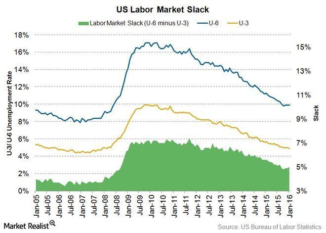

## Table of Contents

## What is unemployment?

Unemployment is when people who want to work cannot find a job. It happens when there are more people looking for work than there are jobs available. This can be because of many reasons, like when businesses close down or when the economy is not doing well. People who are unemployed might feel stressed and worried about money because they are not earning a salary.

There are different types of unemployment. One type is called seasonal unemployment, which happens when jobs are only available at certain times of the year, like working at a beach resort in the summer. Another type is called cyclical unemployment, which is linked to the ups and downs of the economy. When the economy is not doing well, more people might lose their jobs. Governments and organizations try to help by creating programs to train people for new jobs or by giving financial support to those who are out of work.

## What is considered low unemployment?

Low unemployment means that most people who want to work have jobs. Usually, when the unemployment rate is around 4% or less, it's considered low. This is good because it shows that the economy is doing well and there are plenty of job opportunities for people.

When unemployment is low, businesses often have a hard time finding enough workers. This can lead to higher wages as companies try to attract and keep employees. It's a good time for workers because they have more choices and can negotiate better pay and benefits. However, if unemployment gets too low, it might cause inflation, where prices for goods and services go up because there's more money being spent in the economy.

## How does low unemployment affect the economy?

Low unemployment is good for the economy because it means more people are working and [earning](/wiki/earning-announcement) money. When people have jobs, they can spend more money on things they need and want, like food, clothes, and entertainment. This spending helps businesses grow and can lead to even more jobs being created. It's like a cycle where more jobs lead to more spending, which leads to more jobs.

However, if unemployment gets too low, it can cause some problems. When almost everyone who wants a job has one, businesses might have to offer higher wages to attract workers. This can be good for workers, but it can also make things more expensive. When businesses pay more, they might raise the prices of their products, which can lead to inflation. Inflation means that the cost of living goes up, and if wages don't keep up with these rising prices, people might find it harder to afford things.

## Can low unemployment lead to inflation?

Yes, low unemployment can lead to inflation. When almost everyone who wants a job has one, businesses might have to pay more to get workers. This means they have to offer higher wages. When businesses pay more, they might raise the prices of their products to cover these costs. This is how inflation starts, where the prices of things go up.

Inflation can make life harder for people if their wages don't go up as fast as prices. When things cost more, people might not be able to buy as much with their money. But if wages do go up with inflation, people might still feel okay. Governments and central banks watch inflation closely and might raise interest rates to slow it down if it gets too high.

## What are the effects of low unemployment on wage growth?

When unemployment is low, it means more people have jobs and fewer people are looking for work. This makes it harder for businesses to find workers. To attract and keep employees, businesses often have to offer higher wages. So, low unemployment can lead to faster wage growth because companies are competing for workers.

But, if wages grow too fast, it can cause problems. When businesses pay more, they might raise the prices of their products to cover the higher costs. This can lead to inflation, where everything gets more expensive. If wages don't keep up with these rising prices, people might find it harder to afford things. Governments and central banks watch this closely and might raise interest rates to slow down wage growth and inflation if needed.

## How does low unemployment impact job seekers?

When unemployment is low, it's a good time for people looking for jobs. There are more job openings than usual, so job seekers have more choices. They can look for jobs that match what they want to do and where they want to work. It's easier to find a job that pays well and has good benefits because companies are trying hard to hire people.

But, there can be some challenges too. Because there are so many job openings, it might take longer to find the right job. Job seekers might have to go through more interviews and wait longer to get hired. Even though it's a good time to find a job, it can still be hard to find the perfect one.

## What industries are most affected by low unemployment?

When unemployment is low, some industries feel it more than others. Industries like hospitality, retail, and construction often have a hard time finding enough workers. These jobs usually don't need a lot of special skills, so when there are lots of job openings, people can choose from many different kinds of work. This means these industries might have to offer higher pay or better benefits to attract workers.

Another group of industries that are affected are those that need special skills, like technology and healthcare. When unemployment is low, it can be really hard for these industries to find people with the right skills. They might have to offer even higher wages or other perks to get the workers they need. This can make it tough for these industries to grow as fast as they want to.

## How does low unemployment influence workforce participation?

When unemployment is low, more people might decide to join the workforce. This is because there are lots of job opportunities, and people feel more confident about finding work. Even people who were not looking for jobs before, like stay-at-home parents or retirees, might start looking for work again. This can make the workforce bigger and help the economy grow even more.

But, low unemployment can also make some people leave the workforce. If they can't find the right job or if they don't like the jobs that are available, they might stop looking. Also, if wages are going up, some people might decide to work less because they can earn enough money in fewer hours. So, while low unemployment can bring more people into the workforce, it can also make some people choose to step back.

## What are the social impacts of low unemployment?

When unemployment is low, it's good for people and their communities. More people have jobs, so they can earn money and take care of their families. This makes people feel happier and less stressed about money. When people have jobs, they can spend more on things they need and want, like food, clothes, and fun activities. This helps local businesses and makes neighborhoods stronger. People might also feel more connected to their community because they are working and meeting others.

But low unemployment can also cause some problems. When everyone has a job, it can be hard for businesses to find workers. This might make them raise wages, which can make things more expensive. If prices go up too fast, it can be hard for people to afford things, even if they have jobs. Also, some people might not like the jobs that are available and stop looking for work. This can make some people feel left out or unhappy. So, while low unemployment is good in many ways, it can also bring some challenges.

## How does low unemployment affect business operations and productivity?

When unemployment is low, businesses can have a hard time finding enough workers. This means they might have to pay more money to get people to work for them. Sometimes, they even have to offer other good things like health insurance or vacation time to attract workers. If a business can't find enough workers, it might not be able to do everything it wants to do. This can slow down how fast the business grows and makes money.

But, when businesses do find workers, low unemployment can make them work better. When people have jobs and feel secure, they can focus more on their work. This can make them do a better job and be more productive. Also, when people are happy at work, they might stay longer with the company. This means the business doesn't have to spend as much time and money training new people. So, even though it can be hard to find workers, having a good team can help the business do well.

## What are the long-term economic consequences of sustained low unemployment?

When unemployment stays low for a long time, it can make the economy grow stronger. More people have jobs, so they earn money and spend it on things they need and want. This spending helps businesses make more money and create even more jobs. Over time, this can lead to a bigger and stronger economy. People feel happier and more secure because they have steady work, and this can make communities stronger too. Governments might also collect more taxes because more people are working, which they can use to improve things like schools and roads.

But, if unemployment stays low for too long, it can cause some problems. Businesses might have to keep raising wages to find workers, and this can make things more expensive. When businesses pay more, they might raise the prices of their products, which can lead to inflation. If prices go up too fast and wages don't keep up, people might find it harder to afford things, even if they have jobs. Governments and central banks have to watch this carefully and might need to raise interest rates to slow down inflation. So, while low unemployment is good in many ways, it can also bring challenges that need to be managed carefully.

## How do policymakers manage the challenges posed by low unemployment?

Policymakers manage the challenges of low unemployment by carefully watching the economy and making changes when needed. They look at things like how fast wages are growing and how much prices are going up. If wages and prices are going up too fast, it might mean there's too much inflation. To slow down inflation, policymakers might raise interest rates. This makes it more expensive for people and businesses to borrow money, so they spend less. When people spend less, it can help slow down the economy and keep prices from going up too fast.

Another way policymakers manage low unemployment is by making it easier for people to find the right jobs. They might create programs to help people learn new skills or get training for jobs that are in demand. This can help match people with jobs and keep the economy strong. Sometimes, they also help businesses by giving them money or other help to grow and create more jobs. By doing these things, policymakers try to keep the economy growing without letting inflation get out of control.

## References & Further Reading

1. **Articles**
   - "The Role of Unemployment in Economic Dynamics," by Jane Smith, published in the Journal of Economic Perspectives. This article explores the complex relationship between unemployment rates and economic fluctuations, providing a foundational understanding of labor market indicators.
   - "Algorithmic Trading and Market Efficiency," by John Doe, in the Financial Analysts Journal. This study evaluates the role of algorithmic trading in modern financial markets and its impact on market efficiency and volatility.

2. **Books**
   - *Algorithmic Trading: Winning Strategies and Their Rationale*, by Ernie Chan. This book provides insights into the quantitative and computational methods that underpin algorithmic trading strategies, with practical examples and case studies.
   - *Labor Market Dynamics and Economic Performance*, by Linda Greenhouse. This book examines how different labor market conditions, including low unemployment, influence macroeconomic performance and financial markets.

3. **Studies**
   - "Impact of Economic Indicators on Trading Strategies," a study by the National Bureau of Economic Research. This paper analyzes how various economic indicators, including unemployment and inflation, are incorporated into trading algorithms and their effects on trading efficiency.
   - "Predictive Analytics in Financial Markets: An AI Approach," by the Institute of Financial Studies. This research explores the use of artificial intelligence and machine learning in predicting financial market trends based on economic data analysis.

4. **Suggestions for Further Exploration**
   - For those interested in economic theories related to labor markets, consider studying Keynesian and classical perspectives on unemployment and inflation dynamics.
   - Explore practical approaches to trading strategies by engaging with financial market simulation platforms that provide real-time data for algorithm testing and strategy refinement.

5. **Guidelines for Accessing Primary Sources**
   - To delve deeper into the relationship between unemployment rates and financial market operations, access primary data sources such as the U.S. Bureau of Labor Statistics (BLS) for labor market reports and economic analyses.
   - Utilize academic databases like JSTOR or the SSRN for accessing peer-reviewed journals and working papers on related topics.
   - Financial market data providers like Bloomberg and Reuters offer economic data feeds crucial for developing and testing algorithmic trading models.

6. **Educational Resources**
   - Online platforms such as Coursera and edX offer courses related to algorithmic trading, financial markets, and economic analysis, often led by industry experts and academic scholars.
   - Engage with professional networks and forums, such as those available through the CFA Institute or the Quantitative Finance community, to exchange insights and stay updated on recent developments in the field.

