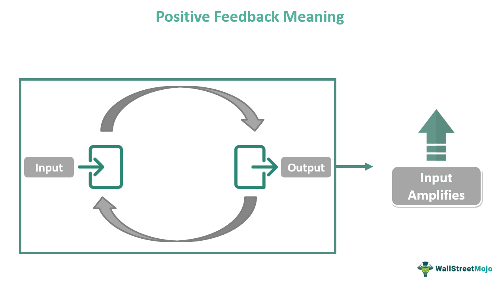

Feedback mechanisms play a crucial role in both control systems and trading, facilitating the maintenance of balance and responsiveness across various systems. Negative feedback, in particular, is of utmost importance within control systems, shaping disciplines ranging from engineering to financial markets. This article examines the complexity of negative feedback mechanisms within control systems and their application in algorithmic trading. These mechanisms are vital as they help manage system responses to external changes, aiming to minimize deviations from desired targets.

In engineering, negative feedback is employed to achieve stability and precision in systems, such as maintaining the speed of a motor or the temperature of a process. The concept can be illustrated by considering a simple control system where an error signal is generated by subtracting the output from a desired reference input. This error is then used to adjust the system input in a manner that reduces errors over time—an essential quality for maintaining equilibrium.



The financial markets also benefit from negative feedback, where these mechanisms contribute to dampening excessive swings in asset prices, ensuring smoother and more stable market behaviors. In algorithmic trading, negative feedback is utilized within trading algorithms to manage and exploit market volatility. These algorithms are designed to react to market conditions by automatically buying undervalued and selling overvalued securities, consistent with predefined criteria. By doing so, they form self-regulating systems that capitalize on corrections in market prices.

Negative feedback mechanisms influence market dynamics by serving as stabilizing forces, reducing the amplitude of fluctuations, and facilitating equilibrium. Understanding these feedback loops is crucial for traders and market analysts, as it empowers them to anticipate market movements and refine strategies accordingly. As we proceed, this article will further explore how these mechanisms function, their impacts, and their strategic application within trading environments.

## Table of Contents

## Understanding Negative Feedback Mechanisms

Negative feedback mechanisms play a crucial role in ensuring the stability and equilibrium of various systems by counteracting deviations from a set point or desired state. In essence, negative feedback occurs when the output of a system is routed back into the system to diminish amplification and promote consistency and predictability. This is the opposite of positive feedback, which amplifies deviations and can lead to instability.

In engineering, negative feedback is a fundamental principle employed across various domains, including electronics, systems engineering, and robotics. For instance, in electronic amplifiers, negative feedback is used to reduce distortion and expand bandwidth. Within this context, a portion of the output signal is inverted and fed back into the input. The result is a reduction in gain variations, distortion, and an improvement in the system's linearity. Mathematically, this can be represented by the formula:

$$
A_f = \frac{A}{1 + A \cdot \beta}
$$

where $A_f$ is the overall gain with feedback, $A$ is the open-loop gain, and $\beta$ is the feedback factor.

In the fields of economics and finance, negative feedback functions similarly to stabilize systems by counteracting irrational market movements. Financial markets often experience [volatility](/wiki/volatility-trading-strategies) due to various factors, including investor sentiment, macroeconomic events, and speculative activities. Negative feedback mechanisms can mitigate these excessive fluctuations, ensuring smoother price actions. For example, in stock markets, when asset prices rise excessively, negative feedback mechanisms might include an increase in interest rates or a reduction in money supply, which helps in correcting the overvaluation. Conversely, when prices fall sharply, measures to stimulate demand—such as lowering interest rates—are examples of negative feedback intended to boost market activity and restore equilibrium.

These feedback loops operate on the principle of self-regulation, fostering conditions wherein the market naturally adjusts to moderate extreme conditions. Such dynamics are essential for maintaining a balanced economic environment, preventing the kind of bubbles and crashes prompted by unchecked positive feedback.

Understanding these mechanisms is significant for traders, policymakers, and engineers who seek to optimize their systems, whether they're designing reliable circuits or stabilizing financial markets, and underscores the versatility of negative feedback across different fields.

## Role of Negative Feedback in Algorithmic Trading

Algorithmic trading systems are intricate constructs that employ feedback mechanisms to achieve precision and efficiency in executing trades. At the heart of this process lies the principle of negative feedback, a key tool for managing market volatility. Negative feedback systems work by attenuating the effects of deviations from a predetermined standard, thereby promoting equilibrium.

In [algorithmic trading](/wiki/algorithmic-trading), utilizing negative feedback involves continuous assessment and adjustment of trading actions based on the observed discrepancies of asset prices from their estimated fair values. Consider a scenario where an asset is overvalued; a trading algorithm employing negative feedback might sell the asset, applying downward pressure that counteracts the overvaluation. Conversely, if an asset is undervalued, the algorithm might buy, providing upward pressure to mitigate the undervaluation.

The underlying mechanics can be expressed through a feedback control loop, where the error $e(t)$ is ascertained as the difference between the desired state $r(t)$ and the measured state $y(t)$. The control action $u(t)$ aimed at reducing this error is derived from:

$$
e(t) = r(t) - y(t)
$$

$$
u(t) = K \cdot e(t)
$$

Here, $K$ represents a constant gain parameter modulating the responsiveness of the algorithm. The feedback loop continually updates $u(t)$ based on $e(t)$, effecting adaptive trading decisions that strive to restore balance.

In practice, such negative feedback systems render the algorithm self-regulating, inherently capable of countering market inefficiencies and extremes. For instance, during market overreaction leading to sharp price drop or surge, the algorithm strategically executes trades anticipating a mean reversion—profiting as the prices gradually return to their normal levels. This characteristic proves beneficial in volatile markets, making trading systems not just reactive, but predictively proactive.

Implementing negative feedback into trading strategies requires a judicious balance of parameters to ensure the feedback does not introduce excessive damping or, conversely, under-actuated corrections. Advanced algorithmic models might incorporate [machine learning](/wiki/machine-learning) techniques to dynamically adjust $K$ in response to changing market conditions, refining the feedback loop for optimal performance. This level of sophistication highlights the indispensable role that negative feedback plays in the efficacy and reliability of modern algorithmic trading systems.

## Impact on Market Dynamics

Feedback loops, integral to market behavior, encompass both negative and positive variations that fundamentally influence market dynamics. Negative feedback mechanisms, in particular, serve as a vital tool for reducing market volatility, acting as a stabilizing force that promotes equilibrium across financial markets.

Negative feedback operates by counteracting deviations from a target value or equilibrium. In trading terms, this manifests as a system's automatic correction in response to excessive price movements, thereby mitigating sharp fluctuations. This counteraction can help sustain orderly markets, providing a dampening effect on price volatility and smoothing out erratic price swings. For instance, when asset prices rise swiftly due to exuberance, negative feedback mechanisms, such as contrarian trading strategies, may trigger selling pressure, contributing to a return towards fundamental value.

The stabilizing influence of negative feedback extends to its capability to foster [liquidity](/wiki/liquidity-risk-premium) and resilience amidst financial disturbances. By attracting more participants who anticipate corrective movements, these mechanisms can create deeper and more liquid markets, which are essential for absorbing shocks and maintaining continuous price discovery processes. The inherent ability of negative feedback systems to encourage price corrections makes them indispensable for market efficiency and integrity.

Understanding feedback loops is essential for traders and market analysts, as these mechanisms provide critical insights into predicting market movements and shaping strategies. For traders, recognizing the presence of negative feedback can signal potential reversals or corrections, allowing them to align their trades accordingly. Analysts can utilize feedback loop analysis to discern underlying market dynamics, which is crucial for constructing risk management frameworks and anticipating shifts in market sentiment.

Incorporating mathematical models can further enhance the comprehension and application of feedback mechanisms. For example, one could employ a simple moving average (SMA) to identify trend reversals triggered by feedback loops. In Python, this might be implemented as follows:

```python
import pandas as pd

# Sample data of asset prices
data = {'price': [100, 102, 101, 99, 98, 100, 101]}
df = pd.DataFrame(data)

# Calculate the simple moving average
df['SMA'] = df['price'].rolling(window=3).mean()

# Detecting feedback by identifying price crosses with its SMA
df['Signal'] = 0  # Default to no signal
df['Signal'][df['price'] > df['SMA']] = 1  # Positive feedback, potential overvaluation
df['Signal'][df['price'] < df['SMA']] = -1  # Negative feedback, potential undervaluation

# Review the result
print(df)
```

This model assists in identifying when prices deviate significantly from their local average, indicating potential corrections driven by feedback loops. Such tools are instrumental in capitalizing on the natural tendencies of markets to correct themselves over time.

Ultimately, the grasp of feedback loops, particularly negative feedback, is not merely academic but a practical necessity in contemporary trading environments. The continuous interplay between feedback mechanisms and market forces shapes the landscape of trading, demanding acute awareness and strategic foresight from market participants.

## Case Studies of Feedback Mechanisms in Historical Events

Several historical market events underscore the significance of feedback mechanisms in influencing market stability. The 1987 Black Monday crash and the 2010 Flash Crash are prime examples where feedback loops played a crucial role in market dynamics.

The 1987 Black Monday crash, one of the most severe stock market crashes in U.S. history, was notably influenced by a combination of market psychology and feedback mechanisms known as program trading. Program trading involved the use of computer algorithms that automatically executed trades based on predefined market conditions. During that period, portfolio insurance strategies, which were designed to hedge against market downturns, inadvertently contributed to the crash. As stock prices began to drop, these algorithms started selling large quantities of stocks to mitigate losses, amplifying the market's downward [momentum](/wiki/momentum). The negative feedback loop created by the successive selling reinforced the decline, highlighting how automated feedback mechanisms can exacerbate market instability when improperly calibrated.

In a similar vein, the 2010 Flash Crash demonstrated the dramatic effect feedback loops can have on market stability. On May 6, 2010, the U.S. stock market experienced a rapid and deep crash in a matter of minutes, followed by a swift recovery. A confluence of factors, including high-frequency trading algorithms and large sell orders, led to a feedback loop of increased selling pressure and reduced liquidity. Algorithms that were designed to trade based on market conditions began to respond to each other's actions, creating a cascade effect. This event illustrated how even well-intentioned feedback mechanisms in algorithmic trading can lead to unintended market consequences, especially when they lack sufficient safeguards like circuit breakers to halt trading amidst extreme volatility.

Both historical events underscore the dual nature of feedback mechanisms. While designed to stabilize and protect market participants, they can also facilitate rapid market destabilization without adequate control measures. Analyzing these events through the lens of feedback mechanisms offers valuable insights into the complex interplay between technology, trader psychology, and market dynamics. Understanding these interactions is crucial for developing systems that can prevent similar occurrences in the future.

## Strategic Utilization of Feedback in Trading Systems

Traders utilize feedback mechanisms in trading systems to navigate and profit from market corrections. Negative feedback, in particular, plays a vital role in forming contrarian strategies. In these strategies, traders position themselves against current market trends, banking on the anticipation that overreactions in pricing will self-correct due to the stabilizing effect of negative feedback mechanisms. When prices deviate excessively from their intrinsic values, negative feedback helps in identifying these misalignments, allowing traders to enter or [exit](/wiki/exit-strategy) positions at optimal points. For example, when a stock is overvalued, a contrarian strategy using negative feedback might signal a short position, expecting the price to revert to its mean.

In addition, sophisticated algorithmic trading systems incorporate adaptive strategies that learn and adjust based on real-time market feedback. These systems employ feedback loops to continuously update their trading models, ensuring they remain responsive to current market conditions. This adaptability is often powered by machine learning algorithms that analyze large datasets to detect patterns and predict future price movements. 

Python is a popular language for implementing such systems, due to its rich ecosystem of libraries like Pandas for data manipulation, NumPy for numerical computing, and TensorFlow or PyTorch for machine learning. Below is a simple example of how a negative feedback loop might be designed in a trading algorithm using Python:

```python
import numpy as np
import pandas as pd

# Simulate a simple price series
np.random.seed(42)  # For reproducibility
price_series = np.random.normal(100, 1, 1000)  # Generate random price data

# Calculate moving average as the feedback mechanism
moving_average = pd.Series(price_series).rolling(window=50).mean()

# Define a simple contrarian trading strategy
def contrarian_strategy(prices, moving_average):
    signal = np.where(prices < moving_average, 1, -1)  # Buy when price is below moving average, sell when above
    return signal

# Simulate signals
signals = contrarian_strategy(price_series, moving_average)

# Print first 10 signals
print(signals[:10])
```

This code generates a random price series and computes a 50-period moving average to serve as a feedback mechanism. A basic contrarian strategy generates buy and sell signals based on whether the price is below or above the moving average. This simple example demonstrates how feedback can support informed trading decisions by providing signals that anticipate mean reversion in prices. 

Such feedback-driven strategies require careful design and optimization to account for potential risks and ensure that the trading system remains robust under varying market conditions. Additionally, continuous monitoring and recalibration are necessary to maintain their efficacy as market dynamics evolve. Through strategic utilization of feedback mechanisms, traders not only aim to enhance profitability but also contribute to market stability.

## Challenges and Considerations

Negative feedback mechanisms, while beneficial for maintaining stability in algorithmic trading, present several challenges and require careful consideration. One primary challenge is the risk of operational failure. If feedback loops are inadequately designed, they may lead to unintended market consequences, exacerbating volatility rather than mitigating it. This can occur when the feedback loop incorporates incorrect or outdated market data, leading to erroneous decisions by the trading algorithms. Consequently, it is imperative that these systems are designed with robust safeguards and regularly updated to account for dynamic market conditions.

Additionally, regulatory oversight plays a crucial role in the responsible deployment of feedback mechanisms within trading environments. Regulators must ensure that these systems do not contribute to systemic risks, such as cascading failures or flash crashes. For instance, during the 2010 Flash Crash, poorly controlled feedback loops within automated trading systems intensified market instability, highlighting the necessity for stringent regulatory frameworks. Regulators should mandate transparency and limits on the speed and frequency of trades executed by algorithms to mitigate potential negative impacts on the broader financial system.

Technological advancements are also essential to enhance the sophistication and reliability of feedback mechanisms. Innovations in [artificial intelligence](/wiki/ai-artificial-intelligence) and machine learning can improve the adaptability and accuracy of feedback systems, enabling them to respond more effectively to real-time market changes. However, the integration of such technologies must be approached cautiously. Developers should prioritize creating systems that not only optimize trading performance but also incorporate ethical considerations and fail-safes to prevent exploitation or unforeseen disruptions.

Finally, it is important for developers and traders to engage in continuous testing and simulation of feedback systems. By using synthetic data to simulate various market scenarios, they can identify potential weaknesses and rectify them before deployment. This proactive approach allows for the fine-tuning of algorithms to ensure their stability and effectiveness in live trading conditions.

In summary, while negative feedback mechanisms are invaluable for stabilizing algorithmic trading systems, they must be meticulously designed and regulated. By addressing operational risks, ensuring regulatory compliance, leveraging technological innovations, and committing to rigorous testing, market participants can harness the benefits of feedback loops while minimizing their potential drawbacks.

## Conclusion

Negative feedback mechanisms play a vital role in both control systems and the financial markets by promoting stability and enhancing efficiency. These mechanisms are designed to counteract disruptions, reducing the amplitude of fluctuations and bringing systems closer to a desired equilibrium. In the context of algorithmic trading, negative feedback structures are particularly valuable as they help manage risks and improve trading performance by moderating price movements.

Algorithmic trading systems often deploy negative feedback loops to automatically adjust trading strategies based on real-time market data. This adaptability is fundamental for stabilizing price actions, as it allows traders to respond promptly to discrepancies between an asset's market price and its intrinsic value. By mitigating excessive price volatility, these systems reduce the probability of large, unexpected losses and contribute to a more orderly market environment. This can be mathematically expressed as:

$$
P(t+1) = P(t) + \alpha \cdot \left(V_{\text{market}}(t) - V_{\text{intrinsic}}(t)\right)
$$

where $P(t)$ is the price at time $t$, $\alpha$ is the feedback factor, $V_{\text{market}}(t)$ is the observed market value, and $V_{\text{intrinsic}}(t)$ is the calculated intrinsic value.

A comprehensive understanding of feedback systems empowers traders and system designers to create more sophisticated trading algorithms. These algorithms can anticipate market corrections, exploiting opportunities for profit while maintaining a focus on risk reduction. By incorporating feedback mechanisms, traders can implement smarter strategies that synergize with existing market dynamics, enhancing predictive accuracy and improving decision-making processes.

In conclusion, the strategic application of negative feedback mechanisms is instrumental for achieving stability and efficiency in financial markets. Traders leveraging these principles can better withstand market volatility, manage risks, and ultimately enhance their trading outcomes through a harmonious integration of predictive and reactive techniques.

## References & Further Reading

[1]: Bergstra, J., Bardenet, R., Bengio, Y., & Kégl, B. (2011). ["Algorithms for Hyper-Parameter Optimization."](https://papers.nips.cc/paper/4443-algorithms-for-hyper-parameter-optimization) Advances in Neural Information Processing Systems 24.

[2]: ["Advances in Financial Machine Learning"](https://www.amazon.com/Advances-Financial-Machine-Learning-Marcos/dp/1119482089) by Marcos Lopez de Prado

[3]: ["Evidence-Based Technical Analysis: Applying the Scientific Method and Statistical Inference to Trading Signals"](https://www.amazon.com/Evidence-Based-Technical-Analysis-Scientific-Statistical/dp/0470008741) by David Aronson

[4]: ["Machine Learning for Algorithmic Trading"](https://github.com/stefan-jansen/machine-learning-for-trading) by Stefan Jansen

[5]: ["Quantitative Trading: How to Build Your Own Algorithmic Trading Business"](https://www.amazon.com/Quantitative-Trading-Build-Algorithmic-Business/dp/1119800064) by Ernest P. Chan