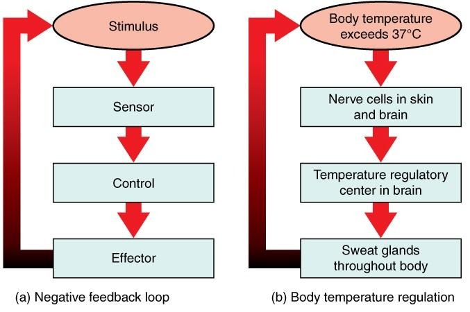

## Table of Contents

## What is negative feedback?

Negative feedback is a process that helps to keep things stable. Imagine you're trying to keep a room at a comfortable temperature. If the room gets too hot, a thermostat can turn on the air conditioning to cool it down. This is like negative feedback because it works to reduce the difference between the current temperature and the desired temperature.

In the human body, negative feedback helps control things like body temperature and blood sugar levels. For example, if your blood sugar gets too high, your body releases insulin to lower it. This process keeps your blood sugar within a normal range. Negative feedback is important because it helps maintain balance and prevent extreme changes.

## How does negative feedback differ from positive feedback?

Negative feedback and positive feedback are two ways that systems can respond to changes. Negative feedback works to bring things back to normal. For example, if you're too hot, your body sweats to cool you down. This helps keep your body temperature stable. Negative feedback is like a balancing act, always trying to keep things in check.

Positive feedback, on the other hand, makes changes even bigger. It's like when you're excited and your excitement grows more and more. In the body, positive feedback can happen during childbirth. When a baby is being born, contractions get stronger and closer together, helping the baby come out. Positive feedback is less common than negative feedback and can lead to big changes quickly.

So, negative feedback keeps things steady, while positive feedback pushes changes forward. Both are important, but they work in opposite ways.

## Can you provide a simple example of negative feedback in everyday life?

Imagine you're driving a car and you want to keep a steady speed. You see a speedometer that shows how fast you're going. If you're going too fast, you take your foot off the gas a little bit. This makes the car slow down until it's at the right speed again. This is an example of negative feedback because you're doing something to get back to the speed you want.

It's like when you're filling a bathtub with water. You turn on the tap and watch the water level. If the water gets too high, you turn the tap down or off to stop the water from overflowing. By adjusting the tap, you're using negative feedback to keep the water at the right level.

## What are the basic components of a negative feedback system?

A negative feedback system has a few main parts that work together to keep things steady. First, there's a sensor that keeps an eye on what's happening. It checks things like temperature or speed and sends this information to the control center. The control center is like the brain of the system. It looks at the information from the sensor and decides if something needs to be changed to get back to normal.

Next, if the control center sees that things are off, it sends a signal to an effector. The effector is the part that actually does something to fix the problem. For example, if you're too hot, the effector might be your sweat glands, which start working to cool you down. Once the effector does its job, the sensor checks again to see if everything is back to normal. This cycle keeps repeating to keep everything balanced.

So, the basic parts of a negative feedback system are the sensor, which watches what's happening; the control center, which decides what to do; and the effector, which takes action to make things right again. Together, they work to keep things steady and prevent big changes.

## How does negative feedback help maintain homeostasis in the body?

Negative feedback helps keep our bodies in balance, which is called homeostasis. Imagine your body is like a house that needs to stay at the right temperature. If it gets too hot, your body sweats to cool you down. This is negative feedback because it works to bring your body back to the normal temperature. It's like having a thermostat that turns on the air conditioning when it's too warm. By doing this, negative feedback helps keep everything inside your body just right, so you can stay healthy and feel good.

For example, when you eat food, your blood sugar might go up. Your body uses negative feedback to manage this. There's a sensor in your body that checks your blood sugar level. If it's too high, your body releases a hormone called insulin. Insulin helps lower your blood sugar by moving it into your cells. Once your blood sugar is back to normal, the sensor stops sending signals, and your body stops releasing insulin. This way, negative feedback keeps your blood sugar from getting too high or too low, helping you stay healthy.

## What role does negative feedback play in biological systems?

Negative feedback is really important in biological systems because it helps keep things steady. Think of it like a seesaw that always tries to stay level. In our bodies, negative feedback helps control things like body temperature, blood sugar, and even the amount of water in our cells. When something gets out of balance, like if you get too hot, negative feedback kicks in. It makes you sweat to cool down, bringing your body temperature back to normal. This way, negative feedback keeps our bodies working right, so we can stay healthy.

Another way negative feedback helps in biological systems is by keeping hormone levels in check. Hormones are like messengers in our body that tell different parts what to do. If there's too much of a certain hormone, negative feedback can slow down its production. For example, if you have enough thyroid hormone, your brain tells the thyroid gland to make less. This balance is important because too much or too little of a hormone can make us feel sick. By using negative feedback, our bodies can keep hormone levels just right, helping us feel good and stay healthy.

## How is negative feedback used in electronic circuits?

Negative feedback is used in electronic circuits to make them work better and be more stable. Imagine you have an amplifier that makes sounds louder. If the amplifier gets too loud, it can start to sound bad or even damage the speakers. Negative feedback helps by taking some of the output sound and sending it back to the input in a way that makes the amplifier quieter. This keeps the sound at just the right level, so it stays clear and doesn't hurt your ears.

In a simple way, negative feedback in an electronic circuit works like this: There's a part of the circuit that watches the output, like a sensor. If the output is too high, this part sends a signal back to the input to lower it. This makes the circuit more stable and helps it work better. It's like having a helper that keeps everything in check, making sure the circuit does what it's supposed to do without going out of control.

## What are some common misconceptions about negative feedback?

One common misconception about negative feedback is that it's always bad or harmful. People often think the word "negative" means something is wrong or bad. But in systems like our bodies or electronic circuits, negative feedback is really helpful. It works to keep things balanced and stable, like a thermostat keeping a room at the right temperature. Without negative feedback, our bodies wouldn't be able to control things like blood sugar or body temperature, and electronic devices could get too loud or too hot.

Another misconception is that negative feedback only happens in complex systems. Some people think it's too fancy or scientific for everyday life. But negative feedback is all around us and happens in simple ways too. For example, when you're driving and you adjust your speed to keep it steady, that's negative feedback. It's not just for scientists or engineers; it's something that helps keep everything from our bodies to our cars working smoothly.

## How can negative feedback mechanisms be modeled mathematically?

Negative feedback mechanisms can be modeled mathematically using simple equations that show how things change over time. Imagine you have a system where something, like temperature, is supposed to stay at a certain level. If the temperature goes up too high, the system does something to bring it back down. You can write this as an equation where the change in temperature depends on how far it is from the target level. The equation might look like this: Change in temperature = -k * (Current temperature - Target temperature), where k is a number that shows how strong the feedback is. This equation means that the more the temperature is above the target, the faster it will go down, and the same works if it's too low.

These models can get more detailed by adding more parts of the system into the equations. For example, if you're modeling how the body controls blood sugar, you might include terms for how fast insulin is released and how it affects blood sugar levels. The equation could look something like: Change in blood sugar = -k1 * (Current blood sugar - Target blood sugar) - k2 * Insulin level. Here, k1 and k2 are numbers that show how strong each part of the feedback is. By using these equations, scientists can predict how the system will behave over time and see how well it keeps things balanced.

## What are the limitations of negative feedback systems?

Negative feedback systems are really helpful, but they're not perfect. One big problem is that they can be slow to fix things. Imagine you're trying to keep a room at the right temperature, but it takes a while for the heater or air conditioner to start working. By the time it does, the temperature might have changed a lot, making it hard to get back to the right level quickly. This delay can make it tough for the system to keep things steady, especially if things change a lot.

Another limitation is that negative feedback can sometimes make things worse before they get better. If the system overcorrects, it might swing too far in the other direction. For example, if you're trying to keep a car going at a steady speed but you slow down too much, you might end up going too slow and then have to speed up again. This back-and-forth can make it hard to stay at the right level. So while negative feedback helps a lot, it can also have these challenges that make it less perfect.

## How do negative feedback loops contribute to system stability?

Negative feedback loops help keep systems stable by always trying to bring things back to normal. Imagine you're trying to keep a room at a comfy temperature. If it gets too hot, the thermostat turns on the air conditioning to cool it down. This is like a negative feedback loop because it's working to fix the problem and get back to the right temperature. By doing this, negative feedback helps stop small changes from turning into big problems, keeping everything steady.

For example, in our bodies, negative feedback helps control things like blood sugar. If your blood sugar gets too high after you eat, your body releases insulin to lower it. This keeps your blood sugar from going too high or too low, which is important for staying healthy. Negative feedback loops are like little helpers that always work to keep things balanced, making sure our bodies and other systems stay stable and work well.

## Can you discuss advanced applications of negative feedback in engineering and technology?

Negative feedback is really important in engineering and technology because it helps make things work better and more reliably. In control systems, like those used in robots or drones, negative feedback helps keep everything steady. For example, if a drone is flying and the wind pushes it off [course](/wiki/best-algorithmic-trading-courses), sensors detect the change and send signals to the motors to adjust and get back on track. This makes the drone more stable and easier to control. Engineers use negative feedback in all kinds of machines, from cars to airplanes, to make sure they work smoothly and safely.

In electronics, negative feedback is used to improve the performance of circuits, like amplifiers. If an amplifier starts to get too loud and distort the sound, negative feedback can take some of the output and send it back to the input to make it quieter and clearer. This helps keep the sound at just the right level. Negative feedback is also used in things like temperature control systems in buildings, where it helps keep the temperature steady no matter what's happening outside. By using negative feedback, engineers can make technology more reliable and efficient, which is important in our everyday lives.

## What are Negative Feedback Mechanisms and how do they work?

Negative feedback mechanisms play a crucial role in ensuring the stability and equilibrium of various systems by counteracting deviations from a set point or desired state. In essence, negative feedback occurs when the output of a system is routed back into the system to diminish amplification and promote consistency and predictability. This is the opposite of positive feedback, which amplifies deviations and can lead to instability.

In engineering, negative feedback is a fundamental principle employed across various domains, including electronics, systems engineering, and robotics. For instance, in electronic amplifiers, negative feedback is used to reduce distortion and expand bandwidth. Within this context, a portion of the output signal is inverted and fed back into the input. The result is a reduction in gain variations, distortion, and an improvement in the system's linearity. Mathematically, this can be represented by the formula:

$$
A_f = \frac{A}{1 + A \cdot \beta}
$$

where $A_f$ is the overall gain with feedback, $A$ is the open-loop gain, and $\beta$ is the feedback factor.

In the fields of economics and finance, negative feedback functions similarly to stabilize systems by counteracting irrational market movements. Financial markets often experience [volatility](/wiki/volatility-trading-strategies) due to various factors, including investor sentiment, macroeconomic events, and speculative activities. Negative feedback mechanisms can mitigate these excessive fluctuations, ensuring smoother price actions. For example, in stock markets, when asset prices rise excessively, negative feedback mechanisms might include an increase in interest rates or a reduction in money supply, which helps in correcting the overvaluation. Conversely, when prices fall sharply, measures to stimulate demand—such as lowering interest rates—are examples of negative feedback intended to boost market activity and restore equilibrium.

These feedback loops operate on the principle of self-regulation, fostering conditions wherein the market naturally adjusts to moderate extreme conditions. Such dynamics are essential for maintaining a balanced economic environment, preventing the kind of bubbles and crashes prompted by unchecked positive feedback.

Understanding these mechanisms is significant for traders, policymakers, and engineers who seek to optimize their systems, whether they're designing reliable circuits or stabilizing financial markets, and underscores the versatility of negative feedback across different fields.

## What is the Role of Negative Feedback in Algorithmic Trading?

Algorithmic trading systems are intricate constructs that employ feedback mechanisms to achieve precision and efficiency in executing trades. At the heart of this process lies the principle of negative feedback, a key tool for managing market volatility. Negative feedback systems work by attenuating the effects of deviations from a predetermined standard, thereby promoting equilibrium.

In [algorithmic trading](/wiki/algorithmic-trading), utilizing negative feedback involves continuous assessment and adjustment of trading actions based on the observed discrepancies of asset prices from their estimated fair values. Consider a scenario where an asset is overvalued; a trading algorithm employing negative feedback might sell the asset, applying downward pressure that counteracts the overvaluation. Conversely, if an asset is undervalued, the algorithm might buy, providing upward pressure to mitigate the undervaluation.

The underlying mechanics can be expressed through a feedback control loop, where the error $e(t)$ is ascertained as the difference between the desired state $r(t)$ and the measured state $y(t)$. The control action $u(t)$ aimed at reducing this error is derived from:

$$
e(t) = r(t) - y(t)
$$

$$
u(t) = K \cdot e(t)
$$

Here, $K$ represents a constant gain parameter modulating the responsiveness of the algorithm. The feedback loop continually updates $u(t)$ based on $e(t)$, effecting adaptive trading decisions that strive to restore balance.

In practice, such negative feedback systems render the algorithm self-regulating, inherently capable of countering market inefficiencies and extremes. For instance, during market overreaction leading to sharp price drop or surge, the algorithm strategically executes trades anticipating a mean reversion—profiting as the prices gradually return to their normal levels. This characteristic proves beneficial in volatile markets, making trading systems not just reactive, but predictively proactive.

Implementing negative feedback into trading strategies requires a judicious balance of parameters to ensure the feedback does not introduce excessive damping or, conversely, under-actuated corrections. Advanced algorithmic models might incorporate [machine learning](/wiki/machine-learning) techniques to dynamically adjust $K$ in response to changing market conditions, refining the feedback loop for optimal performance. This level of sophistication highlights the indispensable role that negative feedback plays in the efficacy and reliability of modern algorithmic trading systems.

## What is the conclusion?

Negative feedback mechanisms play a vital role in both control systems and the financial markets by promoting stability and enhancing efficiency. These mechanisms are designed to counteract disruptions, reducing the amplitude of fluctuations and bringing systems closer to a desired equilibrium. In the context of algorithmic trading, negative feedback structures are particularly valuable as they help manage risks and improve trading performance by moderating price movements.

Algorithmic trading systems often deploy negative feedback loops to automatically adjust trading strategies based on real-time market data. This adaptability is fundamental for stabilizing price actions, as it allows traders to respond promptly to discrepancies between an asset's market price and its intrinsic value. By mitigating excessive price volatility, these systems reduce the probability of large, unexpected losses and contribute to a more orderly market environment. This can be mathematically expressed as:

$$
P(t+1) = P(t) + \alpha \cdot \left(V_{\text{market}}(t) - V_{\text{intrinsic}}(t)\right)
$$

where $P(t)$ is the price at time $t$, $\alpha$ is the feedback factor, $V_{\text{market}}(t)$ is the observed market value, and $V_{\text{intrinsic}}(t)$ is the calculated intrinsic value.

A comprehensive understanding of feedback systems empowers traders and system designers to create more sophisticated trading algorithms. These algorithms can anticipate market corrections, exploiting opportunities for profit while maintaining a focus on risk reduction. By incorporating feedback mechanisms, traders can implement smarter strategies that synergize with existing market dynamics, enhancing predictive accuracy and improving decision-making processes.

In conclusion, the strategic application of negative feedback mechanisms is instrumental for achieving stability and efficiency in financial markets. Traders leveraging these principles can better withstand market volatility, manage risks, and ultimately enhance their trading outcomes through a harmonious integration of predictive and reactive techniques.

## References & Further Reading

[1]: Bergstra, J., Bardenet, R., Bengio, Y., & Kégl, B. (2011). ["Algorithms for Hyper-Parameter Optimization."](https://papers.nips.cc/paper/4443-algorithms-for-hyper-parameter-optimization) Advances in Neural Information Processing Systems 24.

[2]: ["Advances in Financial Machine Learning"](https://www.amazon.com/Advances-Financial-Machine-Learning-Marcos/dp/1119482089) by Marcos Lopez de Prado

[3]: ["Evidence-Based Technical Analysis: Applying the Scientific Method and Statistical Inference to Trading Signals"](https://www.amazon.com/Evidence-Based-Technical-Analysis-Scientific-Statistical/dp/0470008741) by David Aronson

[4]: ["Machine Learning for Algorithmic Trading"](https://github.com/stefan-jansen/machine-learning-for-trading) by Stefan Jansen

[5]: ["Quantitative Trading: How to Build Your Own Algorithmic Trading Business"](https://www.amazon.com/Quantitative-Trading-Build-Algorithmic-Business/dp/1119800064) by Ernest P. Chan