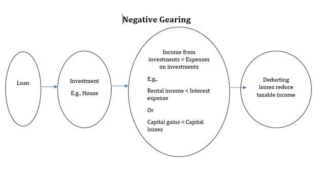

Investment strategy profitability, negative gearing, and algorithmic trading represent distinct yet interconnected components of the financial ecosystem. Understanding their interplay is essential for modern investors seeking to navigate complex markets and optimize returns.

Investment strategy profitability is determined by various factors, including market conditions, asset types, and investor behavior. Traditional approaches evaluate profitability through metrics like Return on Investment (ROI) and Earnings Per Share (EPS). These methodologies, however, are evolving with the integration of advanced technologies, including algorithmic trading systems that enhance decision-making efficiency and accuracy.



Negative gearing is a fiscal strategy traditionally associated with property investment. It involves offsetting income by deducting the costs of an investment, especially when these costs exceed the income it generates. This strategy can impact investment returns by altering tax obligations, under certain conditions it may prove profitable.

Algorithmic trading is the utilization of computer programs to automate trading processes, using complex models and real-time data. It includes various strategies such as trend-following and statistical arbitrage. The advantages of algo trading lie in its speed, efficiency, and the removal of emotional bias from trading decisions. However, it presents challenges including the risk of overfitting and potential transaction costs.

Integrating traditional investment strategies with modern trading algorithms can offer significant benefits. These include increased profitability through optimized asset allocation and transaction timing. However, this approach also involves risks, such as reliance on technology and complex market dynamics.

In this article, we will discuss these themes extensively, exploring how combining negative gearing with algorithmic trading might maximize investment strategy profitability. We will examine traditional and evolving measures of profitability, the role of negative gearing, and the impact of algorithmic trading. Finally, we will consider how these elements can synergize to offer innovative solutions in the financial market.

## Table of Contents

## Understanding Investment Strategy Profitability

Investment strategy profitability is a critical concern for investors, as it directly influences the success and sustainability of their investment endeavors. Several factors contribute to the profitability of an investment strategy, including market conditions, asset types, and investor behavior. 

Market conditions are inherently dynamic, shaped by economic indicators, regulatory changes, and geopolitical events. A profitable investment strategy must be adaptable to these shifting conditions. For instance, during a bull market, strategies focusing on [growth stocks](/wiki/growth-stocks) may thrive, while in a bear market, a more defensive approach, such as investing in value stocks or bonds, could be advantageous.

Asset types play a crucial role in defining profitability. Different assets—stocks, bonds, real estate, commodities—[carry](/wiki/carry-trading) distinct risk and return profiles. Stocks may offer high returns with increased [volatility](/wiki/volatility-trading-strategies), whereas bonds typically provide more stable returns with lower risk. The choice of asset thus aligns with the risk tolerance and return expectations of the investor.

Investor behavior affects profitability through decision-making and psychological biases like overconfidence or fear, which can lead to suboptimal trading actions. Understanding these behaviors and incorporating behavioral finance principles can enhance strategic decision-making and, consequently, profitability.

Traditional measures of profitability offer a quantitative lens to evaluate the success of investment strategies. Return on Investment (ROI) is a common metric, calculated as:

$$
\text{ROI} = \left( \frac{\text{Net Profit}}{\text{Cost of Investment}} \right) \times 100
$$

Earnings per Share (EPS) is another key measure, representing the portion of a company's profit allocated to each outstanding share, calculated as:

$$
\text{EPS} = \frac{\text{Net Income} - \text{Dividends on Preferred Stock}}{\text{Average Outstanding Shares}}
$$

As investment strategies evolve, new technologies and market approaches are reshaping traditional profitability measures. The integration of [artificial intelligence](/wiki/ai-artificial-intelligence) and [machine learning](/wiki/machine-learning) enables the analysis of vast datasets, enhancing predictive accuracy and optimizing trade executions. This has given rise to [algorithmic trading](/wiki/algorithmic-trading), which leverages algorithms to automate complex trading strategies.

Case studies of successful investment strategies underscore the importance of adapting to market evolutions. The adoption of quantitative strategies by hedge funds, blending statistical models with machine learning, has yielded significant returns. Examples include the Medallion Fund, famously known for its exceptional annual returns driven by algorithm-based trading.

In summary, a profitable investment strategy hinges on adeptly navigating market conditions, selecting appropriate asset types, understanding investor psychology, and utilizing both traditional and modern profitability measures. As technology continues to advance, investors are increasingly able to exploit these dynamics, enhancing the potential for success in their investment endeavors.

## The Role of Negative Gearing in Investment Strategies

Negative gearing is a financial strategy predominantly used in property investment that involves borrowing money to acquire an asset where the income generated by that asset, typically rent, is less than the cost of owning and managing the asset, including interest on the loan. The underlying principle is that the investor incurs a loss on the investment in the short term, which can be offset against other income, reducing overall tax liabilities. This strategy is commonly employed in countries where tax systems allow such deductions, most notably in Australia.

The primary impact of negative gearing on investment returns lies in its tax implications. By enabling investors to deduct their net investment losses from their taxable income, it effectively reduces the cost of holding the investment. This tax advantage can lead to increased after-tax income, potentially enhancing long-term investment returns if the value of the property appreciates. However, the strategy relies heavily on capital gains; the expectation is that the property will significantly appreciate in value over time, outweighing the interim losses.

The profitability of negative gearing largely depends on several conditions. Primarily, the scale of tax benefits must offset the cash flow deficits incurred through negative gearing. Investors tend to benefit more in environments with strong property market growth and favorable tax regulations. Additionally, low-interest-rate environments increase the attractiveness of negative gearing by reducing the cost of borrowing.

Despite these potential benefits, negative gearing is subject to various criticisms and risks. One of the primary criticisms is that it can create market distortions. By incentivizing investment in property, negative gearing can lead to increased demand for real estate, which may drive up property prices, exacerbating housing affordability issues. Furthermore, the scheme has been criticized for disproportionately benefiting wealthier investors, who have larger incomes and can take full advantage of the tax deductions.

The financial stability risks associated with negative gearing are another concern. This strategy exposes investors to the risk of rising interest rates, which can increase borrowing costs and widen the gap between income and expenses, leading to greater financial strain. Also, in periods of market downturns, property values may decrease, undermining the expected capital gains and resulting in financial losses.

Overall, while negative gearing can enhance investment returns under certain conditions, it requires careful consideration and management of its inherent risks. Investors must evaluate market conditions, tax environments, and [interest rate](/wiki/interest-rate-trading-strategies) expectations to effectively leverage negative gearing as part of a broader investment strategy.

 to Algorithmic Trading

Algorithmic trading involves the use of computer programs to execute trading decisions based on a predetermined set of rules or algorithms. These algorithms take into account various factors such as price, timing, and [volume](/wiki/volume-trading-strategy), and allow traders to execute orders at speeds and frequencies far beyond the capabilities of a human trader. By automating the decision-making process, algorithmic trading reduces the emotional and psychological influences that can impact trading performance.

Different types of algorithmic trading strategies are employed in the industry, each with its unique approach. Trend following strategies identify and exploit market trends, buying or selling assets based on expected price movements. These strategies rely on technical analysis indicators, such as moving averages, to trigger trades. Statistical [arbitrage](/wiki/arbitrage) focuses on identifying price inefficiencies between related securities, and profits are generated by exploiting the reversion to a mean. High-frequency trading ([HFT](/wiki/high-frequency-trading-strategies)) involves executing a large number of orders at very fast speeds, capitalizing on minuscule price discrepancies within fractions of a second. These strategies often require sophisticated infrastructure and lower latency to stay competitive.

Algorithmic trading offers several advantages. First, it provides speed and efficiency, as algorithms can process and analyze market data rapidly, executing trades at optimal prices. Second, it ensures consistency and discipline in trading, as decisions are based on mathematical models rather than human impulses. Additionally, algorithmic trading removes emotional biases from the trading process, resulting in more objective decision-making.

However, algorithmic trading also presents certain risks and challenges. The potential for overfitting is a significant concern, where algorithms are too finely tuned to historical data, making them ineffective in future market conditions. Transaction costs, including slippage and commissions, can erode profitability, especially in high-frequency trading environments. Furthermore, technical failures or bugs in the algorithm can lead to substantial financial losses.

In summary, while algorithmic trading has revolutionized the financial markets with its speed and efficiency, it requires careful consideration of risks and a sound understanding of the trading algorithms employed. By acknowledging these factors, traders can better harness the potential of algorithmic trading for improved decision-making and profitability.

## Enhancing Profitability with Algo Trading

Algorithmic trading, commonly referred to as algo trading, has become a transformative force in enhancing the profitability of investment strategies. By leveraging computing power and advanced algorithms, investors can execute trades with high precision and speed, often capitalizing on minute market inefficiencies. The integration of machine learning (ML) and artificial intelligence (AI) has further amplified these capabilities, allowing for the development of sophisticated trading models that can analyze vast datasets, adapt to changing market conditions, and optimize decision-making processes.

### Integration of Machine Learning and AI

Modern algo trading systems employ ML algorithms to analyze historical price data, identify patterns, and predict future market movements. Techniques such as supervised learning, where models are trained on labeled data, enable the creation of predictive models that anticipate price trends and volatility. Additionally, [reinforcement learning](/wiki/reinforcement-learning), which focuses on learning optimal actions through trial and error, is increasingly used to refine trading strategies by continuously adapting to new market information.

AI enhancements allow trading models to incorporate natural language processing to digest unstructured data sources such as news articles, social media sentiments, and economic reports, providing a broader understanding of market dynamics. These AI-driven insights can inform trading decisions, making them more robust by accounting for a diverse range of informational inputs.

### Examples of Profitable Algo Trading Models

Trend following and [statistical arbitrage](/wiki/statistical-arbitrage) are two widely used algo trading strategies. Trend following algorithms aim to identify and capitalize on the [momentum](/wiki/momentum) of trending markets by employing moving averages or technical indicators. For instance, the moving average crossover strategy, where short-term moving averages cross above long-term moving averages, signals buy opportunities, and vice versa for sell signals.

Statistical arbitrage, on the other hand, exploits price inefficiencies between correlated assets. By identifying pairs of similar stocks and executing trades based on deviations from historical price ratios, traders can profit from mean-reversion tendencies.

**Example in Python for a Simple Moving Average Crossover Strategy**:

```python
import pandas as pd

def sma_crossover_strategy(data, short_window=40, long_window=100):
    signals = pd.DataFrame(index=data.index)
    signals['price'] = data['close']
    signals['short_mavg'] = data['close'].rolling(window=short_window, min_periods=1).mean()
    signals['long_mavg'] = data['close'].rolling(window=long_window, min_periods=1).mean()
    signals['signal'] = 0.0
    signals['signal'][short_window:] = np.where(signals['short_mavg'][short_window:] 
                                                > signals['long_mavg'][short_window:], 1.0, 0.0)   
    return signals

# Data would be loaded into a DataFrame format
# results = sma_crossover_strategy(data)
```

### Metrics for Measuring Algo Trading Success

The effectiveness of algo trading can be evaluated using several key metrics:

- **Sharpe Ratio**: Calculated as 
$$
  \text{Sharpe Ratio} = \frac{E[R_p - R_f]}{\sigma_p}

$$
  where $E[R_p - R_f]$ is the expected return of the portfolio minus the risk-free rate, and $\sigma_p$ is the standard deviation of the portfolio's excess return. A higher Sharpe Ratio indicates better risk-adjusted returns.

- **Profit Factor**: Defined as the ratio of gross profits to gross losses. A profit factor greater than 1 denotes a profitable strategy, with higher values indicating more lucrative trading systems.

These metrics provide insights into the risk-reward balance of trading strategies, helping investors optimize their portfolio returns while managing potential downsides. The integration of AI and ML within algo trading not only enhances profitability but also provides a framework for developing adaptive strategies that can remain competitive in increasingly dynamic financial markets.

## Synergizing Negative Gearing and Algorithmic Trading

Negative gearing and algorithmic trading are two strategies that, when combined, have the potential to maximize profitability for investors. Negative gearing, traditionally associated with property investment, involves borrowing funds to invest in an asset that generates income, where the interest and other costs exceed the income from the asset. This strategy can create a taxable loss, thereby providing tax benefits under certain jurisdictions. Algorithmic trading, on the other hand, uses computer algorithms to automate trading decisions, enhancing trading efficiency and execution speed.

The synergy of these two strategies can create unique benefits. Negative gearing offers tax advantages that can improve cash flow, while algorithmic trading provides precision and speed, allowing for responsive adjustments to market conditions. By integrating algorithmic trading systems with negatively geared investments, investors can optimize their portfolio management, potentially improving returns through automated adjustments to leverage ratios or asset allocations based on market signals. 

However, this dual approach also presents certain drawbacks. Negative gearing, by its nature, requires taking on debt, which can amplify losses if market conditions turn unfavorable. Algorithmic trading, while efficient, may incur high transaction costs and is susceptible to market anomalies or technical failures. The integration of these strategies thus demands a robust risk management framework that can anticipate and mitigate potential downsides.

The application of this synergy varies across market conditions and asset classes. In a rising market, negatively geared positions can benefit from capital appreciation, while algorithmic trading systems can capitalize on short-term price movements. Conversely, in volatile or declining markets, the strategies must be precisely aligned to hedge risks and adjust positions rapidly to limit losses. Asset classes such as real estate, equities, and derivatives might be particularly suitable for this synergy, given their potential for both leverage and algorithmic trading.

Looking to the future, the landscape of this investment strategy fusion is poised to evolve with advancements in technology. Machine learning and artificial intelligence are expected to play an increasingly important role in optimizing algorithms, enhancing predictive accuracy and adaptive capabilities. Moreover, the proliferation of high-frequency trading platforms will likely expand the potential for integrating negatively geared positions across a wider range of markets. 

Regulatory changes might also influence the feasibility and attractiveness of combining these strategies, particularly as governments reassess tax policies related to negative gearing or impose new regulations on automated trading systems. Investors and financial institutions must stay abreast of these developments, balancing innovation with compliance to maintain a competitive edge in the financial markets.

In conclusion, the fusion of negative gearing and algorithmic trading presents a dynamic investment strategy with potential for enhanced profitability, provided the inherent risks are carefully managed. The continued evolution of technology and regulatory frameworks will shape the future opportunities within this space, underscoring the importance of adaptability and foresight for investors seeking to harness these strategies.

## Conclusion

The integration of negative gearing with algorithmic trading represents a transformative approach to maximizing investment profitability. This synergy leverages the tax advantages of negative gearing while utilizing the technological precision and efficiency of algorithmic trading. Investors who adeptly merge these strategies can potentially achieve enhanced financial outcomes, provided they navigate the inherent complexities and risks.

Negative gearing traditionally allows investors to offset losses on investment properties against taxable income, providing a tax shield that can bolster overall profitability. When combined with algorithmic trading, which automates investment decisions based on pre-defined rules and market data, the potential for optimized returns increases. Algorithmic trading’s speed and ability to process vast datasets can help investors quickly capitalize on market opportunities, potentially offsetting negative cash flows more efficiently than manual trading methods.

However, this approach is not without its risks. The volatile nature of markets, coupled with the high leveraging involved in negative gearing, can lead to significant financial exposure if not managed properly. Algorithmic models, while efficient, are not infallible and can suffer from overfitting or fail to adapt to unexpected market changes. Furthermore, transaction costs and the need for constant system upgrades can erode the advantages offered by the trading algorithms.

Employing this multifaceted strategy necessitates a continuous dedication to learning and innovation. As financial markets evolve and new technologies emerge, investors must remain agile, updating algorithms and assessing tax strategies regularly to maintain profitability. Machine learning and artificial intelligence pave the way for more sophisticated models, yet they also require a robust understanding and management of both technology and risk.

Investors should carefully consider their risk tolerance and investment objectives before deploying such a strategy. It is vital to conduct thorough due diligence and seek professional advice to tailor an approach that aligns with individual financial goals. This personalized strategy, coupled with ongoing education and technological adaptation, will position investors to potentially unlock new avenues of profitability amidst an ever-dynamic financial landscape.

## References & Further Reading

[1]: ["Advances in Financial Machine Learning"](https://www.amazon.com/Advances-Financial-Machine-Learning-Marcos/dp/1119482089) by Marcos Lopez de Prado

[2]: Bergstra, J., Bardenet, R., Bengio, Y., & Kégl, B. (2011). ["Algorithms for Hyper-Parameter Optimization."](https://dl.acm.org/doi/10.5555/2986459.2986743) Advances in Neural Information Processing Systems 24.

[3]: ["Evidence-Based Technical Analysis: Applying the Scientific Method and Statistical Inference to Trading Signals"](https://www.amazon.com/Evidence-Based-Technical-Analysis-Scientific-Statistical/dp/0470008741) by David Aronson

[4]: ["Quantitative Trading: How to Build Your Own Algorithmic Trading Business"](https://www.amazon.com/Quantitative-Trading-Build-Algorithmic-Business/dp/1119800064) by Ernest P. Chan

[5]: ["Machine Learning for Algorithmic Trading"](https://github.com/stefan-jansen/machine-learning-for-trading) by Stefan Jansen