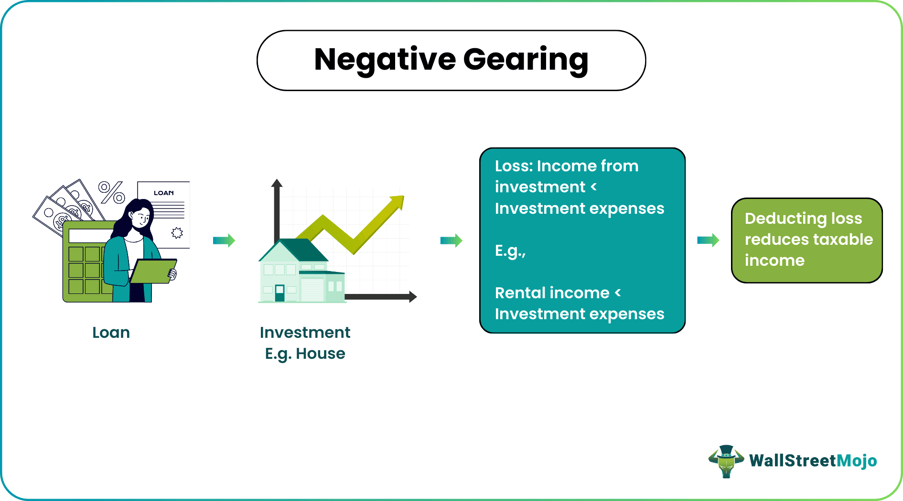

## Table of Contents

## What is negative gearing?

Negative gearing is when you borrow money to buy an investment, like a house or property, and the costs of owning it are more than the income it brings in. For example, if you rent out the house but the rent you get is less than what you pay on the loan, that's negative gearing. People do this because they can claim the loss on their taxes, which means they pay less tax.

This strategy can be risky because you're losing money each month. But some people hope that the value of the investment will go up over time. If the property's value increases, they can sell it later for a profit. This potential for future gains is why some investors are willing to take the risk of negative gearing, even though it means they're spending more money now.

## How does negative gearing work in real estate?

Negative gearing in real estate happens when you buy a house or apartment with a loan, and the money you spend on it is more than the money you get from renting it out. Let's say you buy a house and the monthly loan payment is $1,000, but you can only charge $800 in rent. That means you're losing $200 every month. This loss is what people call negative gearing.

People might choose negative gearing because they can use the loss to lower their taxes. If you're losing $200 a month, that's $2,400 a year you can subtract from your income when you file your taxes. This can save you money on taxes. But it's a bit of a gamble. You're spending more money now, hoping that the house will be worth more in the future. If the house's value goes up, you could sell it for a profit later. But if it doesn't, you might end up losing money overall.

## What are the basic requirements for a property to be negatively geared?

For a property to be negatively geared, you need to borrow money to buy it, and the costs of owning it must be more than the income it brings in. This means that if you rent out the property, the rent you get should be less than what you pay for the loan, plus any other costs like property taxes, insurance, and maintenance.

The idea behind negative gearing is that you can use the loss to reduce your taxable income. So, if you're losing money on the property each year, you can subtract that loss from your total income when you do your taxes. This can lower the amount of tax you have to pay. But it's important to remember that negative gearing is a risk because you're spending more money now, hoping that the property's value will go up in the future so you can sell it for a profit.

## Can you explain the tax implications of negative gearing?

When you use negative gearing, you can lower the amount of tax you pay. This happens because the money you lose on your property each year can be subtracted from your total income. For example, if you make $50,000 a year and lose $5,000 on your property, you only have to pay taxes on $45,000. This can save you money on your tax bill, but you need to keep good records and follow the tax rules.

It's important to know that negative gearing can be risky. While it might help you pay less tax now, you're spending more money each month on your property than you're getting back from rent. You're hoping that the property's value will go up over time so you can sell it for a profit later. If the property doesn't increase in value, you could end up losing money overall, even with the tax savings.

## What are the potential benefits of using negative gearing?

One potential benefit of using negative gearing is that it can reduce the amount of tax you have to pay. When you lose money on your property each year, you can subtract that loss from your total income. This means you pay taxes on a smaller amount of money, which can save you a lot on your tax bill. Keeping good records is important so you can show the tax office how much you've lost.

Another benefit is the chance to make a profit in the future. Even though you're spending more money on the property than you're getting back in rent right now, the value of the property might go up over time. If that happens, you could sell the property for more than you paid for it, making a profit. This is why some people are willing to take the risk of negative gearing, hoping that their investment will pay off in the long run.

## What risks are associated with negative gearing?

Negative gearing can be risky because you're losing money every month. If the rent you get from your property is less than what you pay for the loan and other costs, you're spending more money than you're making. This can be hard on your wallet, especially if you have other bills to pay. It's like betting that the property will be worth more in the future, but there's no guarantee that will happen.

Another risk is that property values might not go up as much as you hope. If the value of your property stays the same or goes down, you could lose money when you sell it. Even if you save some money on taxes now, the overall loss might be bigger than the tax savings. This means you need to be careful and think about whether the potential future profit is worth the money you're spending now.

## How does negative gearing affect cash flow?

Negative gearing can make your cash flow worse because you're spending more money on your property than you're getting back from rent. If you have a loan to buy a house and the monthly payments are higher than the rent you get, you're losing money every month. This can be tough because you need to find extra money to cover those costs, which might mean using your savings or taking money from other parts of your budget.

But there's a chance that negative gearing can help your cash flow in the future. If the value of your property goes up, you could sell it for a profit. That profit could give you a big boost to your cash flow later on. The key is that you need to be able to handle the monthly losses now and hope that the property's value will increase enough to make it worth it.

## What is the difference between negative and positive gearing?

Negative gearing happens when you buy something like a house with a loan, and the money you spend on it each month is more than the money you get back from renting it out. For example, if your loan payment is $1,000 a month but you only get $800 in rent, you're losing $200 every month. People do this because they can use that loss to pay less tax. But it's risky because you're spending more money now, hoping that the house will be worth more later so you can sell it for a profit.

Positive gearing is the opposite. It's when the money you get from renting out your property is more than what you spend on it. So, if your loan payment is $1,000 a month and you get $1,200 in rent, you're making $200 every month. This extra money can help you pay for other things or save it. Positive gearing is less risky because you're making money now, but it might not help you save as much on taxes as negative gearing does.

## How can negative gearing be used as part of a broader investment strategy?

Negative gearing can be a part of a bigger plan for investing your money. If you're willing to lose some money each month on a property, you might be able to save on your taxes. This can help you keep more of your money to use in other ways, like buying more investments or saving for the future. But it's important to think about the risks. If the property's value doesn't go up, you could lose money overall. So, you need to make sure you can handle the monthly losses and have other parts of your investment plan that might help balance out the risk.

Another way to use negative gearing in a broader investment strategy is to think about the long term. Even though you're spending more money on the property now, the value might go up over time. If that happens, you could sell it for a profit later. This can be a good way to grow your money if you're patient and the market goes your way. But you should also have other investments that make money right away to help with your cash flow. By mixing negative gearing with other types of investments, you can create a plan that fits your goals and helps you manage the ups and downs of investing.

## What are some advanced tax strategies that can be used with negative gearing?

One advanced tax strategy that can be used with negative gearing is called depreciation. This means you can claim the cost of things like the building itself, or the appliances and furniture inside it, as a tax deduction. Over time, these things lose value, and you can use that loss to lower your taxable income. By carefully figuring out how much everything depreciates, you can increase the amount of money you save on taxes each year. This can help make the monthly losses from negative gearing a bit easier to handle.

Another strategy is to use negative gearing as part of a bigger plan to manage your taxes. For example, if you have a high income from your job, you might buy a property that you know will be negatively geared. The losses from the property can then be used to lower your overall taxable income, which means you pay less tax. This can be especially helpful if you're in a high tax bracket. But it's important to make sure you can afford the monthly losses and that you have other investments that might balance out the risk of negative gearing.

## How have government policies on negative gearing changed over time, and what impact have these changes had?

Over the years, government policies on negative gearing have changed a few times, and these changes have had different effects on people who invest in property. In Australia, for example, negative gearing has been allowed for a long time, but there have been talks about changing the rules. In 2017, the Australian Labor Party suggested limiting negative gearing to new properties only, instead of letting people use it for any property. This idea was meant to encourage building new homes and make it easier for first-time buyers to get into the market. But the policy didn't become law, so negative gearing stayed the same.

These changes, or even just the talk about them, can make a big difference for investors. When people think the rules might change, they might rush to buy properties before the new rules start. This can push up property prices. On the other hand, if negative gearing becomes less useful because of new rules, fewer people might want to invest in property. This could make the market slower and maybe even bring down prices a bit. So, government policies on negative gearing can have a big impact on how people invest and how the property market works.

## Can you discuss case studies or examples where negative gearing has led to significant profitability or loss?

One example of negative gearing leading to significant profitability is the story of John, who bought a small apartment in a growing city in 2005. At the time, the rent he got was less than his monthly loan payments, so he was losing money each month. But John was patient and kept the property for 15 years. During that time, the city grew a lot, and the value of his apartment went up a lot. When he sold it in 2020, he made a big profit because the property was worth much more than what he paid for it. Even though he had to pay more money each month for years, the tax savings and the final profit made it worth it.

On the other hand, there's the case of Sarah, who bought a house in a small town in 2008, hoping to use negative gearing to her advantage. The rent she got was less than her loan payments, so she was losing money every month. She hoped the value of the house would go up over time, but the town didn't grow as much as she expected. When she had to sell the house in 2015 because of financial problems, she ended up selling it for less than she paid for it. Even though she saved some money on taxes each year, the overall loss was bigger than the tax savings, and she ended up losing money on the investment.

## What is the key to understanding investment strategy profitability?

Investment strategy profitability is a critical concern for investors, as it directly influences the success and sustainability of their investment endeavors. Several factors contribute to the profitability of an investment strategy, including market conditions, asset types, and investor behavior. 

Market conditions are inherently dynamic, shaped by economic indicators, regulatory changes, and geopolitical events. A profitable investment strategy must be adaptable to these shifting conditions. For instance, during a bull market, strategies focusing on [growth stocks](/wiki/growth-stocks) may thrive, while in a bear market, a more defensive approach, such as investing in value stocks or bonds, could be advantageous.

Asset types play a crucial role in defining profitability. Different assets—stocks, bonds, real estate, commodities—[carry](/wiki/carry-trading) distinct risk and return profiles. Stocks may offer high returns with increased [volatility](/wiki/volatility-trading-strategies), whereas bonds typically provide more stable returns with lower risk. The choice of asset thus aligns with the risk tolerance and return expectations of the investor.

Investor behavior affects profitability through decision-making and psychological biases like overconfidence or fear, which can lead to suboptimal trading actions. Understanding these behaviors and incorporating behavioral finance principles can enhance strategic decision-making and, consequently, profitability.

Traditional measures of profitability offer a quantitative lens to evaluate the success of investment strategies. Return on Investment (ROI) is a common metric, calculated as:

$$
\text{ROI} = \left( \frac{\text{Net Profit}}{\text{Cost of Investment}} \right) \times 100
$$

Earnings per Share (EPS) is another key measure, representing the portion of a company's profit allocated to each outstanding share, calculated as:

$$
\text{EPS} = \frac{\text{Net Income} - \text{Dividends on Preferred Stock}}{\text{Average Outstanding Shares}}
$$

As investment strategies evolve, new technologies and market approaches are reshaping traditional profitability measures. The integration of [artificial intelligence](/wiki/ai-artificial-intelligence) and [machine learning](/wiki/machine-learning) enables the analysis of vast datasets, enhancing predictive accuracy and optimizing trade executions. This has given rise to [algorithmic trading](/wiki/algorithmic-trading), which leverages algorithms to automate complex trading strategies.

Case studies of successful investment strategies underscore the importance of adapting to market evolutions. The adoption of quantitative strategies by hedge funds, blending statistical models with machine learning, has yielded significant returns. Examples include the Medallion Fund, famously known for its exceptional annual returns driven by algorithm-based trading.

In summary, a profitable investment strategy hinges on adeptly navigating market conditions, selecting appropriate asset types, understanding investor psychology, and utilizing both traditional and modern profitability measures. As technology continues to advance, investors are increasingly able to exploit these dynamics, enhancing the potential for success in their investment endeavors.

## How can profitability be enhanced with algo trading?

Algorithmic trading, commonly referred to as algo trading, has become a transformative force in enhancing the profitability of investment strategies. By leveraging computing power and advanced algorithms, investors can execute trades with high precision and speed, often capitalizing on minute market inefficiencies. The integration of machine learning (ML) and artificial intelligence (AI) has further amplified these capabilities, allowing for the development of sophisticated trading models that can analyze vast datasets, adapt to changing market conditions, and optimize decision-making processes.

### Integration of Machine Learning and AI

Modern algo trading systems employ ML algorithms to analyze historical price data, identify patterns, and predict future market movements. Techniques such as supervised learning, where models are trained on labeled data, enable the creation of predictive models that anticipate price trends and volatility. Additionally, [reinforcement learning](/wiki/reinforcement-learning), which focuses on learning optimal actions through trial and error, is increasingly used to refine trading strategies by continuously adapting to new market information.

AI enhancements allow trading models to incorporate natural language processing to digest unstructured data sources such as news articles, social media sentiments, and economic reports, providing a broader understanding of market dynamics. These AI-driven insights can inform trading decisions, making them more robust by accounting for a diverse range of informational inputs.

### Examples of Profitable Algo Trading Models

Trend following and [statistical arbitrage](/wiki/statistical-arbitrage) are two widely used algo trading strategies. Trend following algorithms aim to identify and capitalize on the [momentum](/wiki/momentum) of trending markets by employing moving averages or technical indicators. For instance, the moving average crossover strategy, where short-term moving averages cross above long-term moving averages, signals buy opportunities, and vice versa for sell signals.

Statistical arbitrage, on the other hand, exploits price inefficiencies between correlated assets. By identifying pairs of similar stocks and executing trades based on deviations from historical price ratios, traders can profit from mean-reversion tendencies.

**Example in Python for a Simple Moving Average Crossover Strategy**:

```python
import pandas as pd

def sma_crossover_strategy(data, short_window=40, long_window=100):
    signals = pd.DataFrame(index=data.index)
    signals['price'] = data['close']
    signals['short_mavg'] = data['close'].rolling(window=short_window, min_periods=1).mean()
    signals['long_mavg'] = data['close'].rolling(window=long_window, min_periods=1).mean()
    signals['signal'] = 0.0
    signals['signal'][short_window:] = np.where(signals['short_mavg'][short_window:] 
                                                > signals['long_mavg'][short_window:], 1.0, 0.0)   
    return signals

# Data would be loaded into a DataFrame format
# results = sma_crossover_strategy(data)
```

### Metrics for Measuring Algo Trading Success

The effectiveness of algo trading can be evaluated using several key metrics:

- **Sharpe Ratio**: Calculated as 
$$
  \text{Sharpe Ratio} = \frac{E[R_p - R_f]}{\sigma_p}

$$
  where $E[R_p - R_f]$ is the expected return of the portfolio minus the risk-free rate, and $\sigma_p$ is the standard deviation of the portfolio's excess return. A higher Sharpe Ratio indicates better risk-adjusted returns.

- **Profit Factor**: Defined as the ratio of gross profits to gross losses. A profit factor greater than 1 denotes a profitable strategy, with higher values indicating more lucrative trading systems.

These metrics provide insights into the risk-reward balance of trading strategies, helping investors optimize their portfolio returns while managing potential downsides. The integration of AI and ML within algo trading not only enhances profitability but also provides a framework for developing adaptive strategies that can remain competitive in increasingly dynamic financial markets.

## References & Further Reading

[1]: ["Advances in Financial Machine Learning"](https://www.amazon.com/Advances-Financial-Machine-Learning-Marcos/dp/1119482089) by Marcos Lopez de Prado

[2]: Bergstra, J., Bardenet, R., Bengio, Y., & Kégl, B. (2011). ["Algorithms for Hyper-Parameter Optimization."](https://dl.acm.org/doi/10.5555/2986459.2986743) Advances in Neural Information Processing Systems 24.

[3]: ["Evidence-Based Technical Analysis: Applying the Scientific Method and Statistical Inference to Trading Signals"](https://www.amazon.com/Evidence-Based-Technical-Analysis-Scientific-Statistical/dp/0470008741) by David Aronson

[4]: ["Quantitative Trading: How to Build Your Own Algorithmic Trading Business"](https://www.amazon.com/Quantitative-Trading-Build-Algorithmic-Business/dp/1119800064) by Ernest P. Chan

[5]: ["Machine Learning for Algorithmic Trading"](https://github.com/stefan-jansen/machine-learning-for-trading) by Stefan Jansen