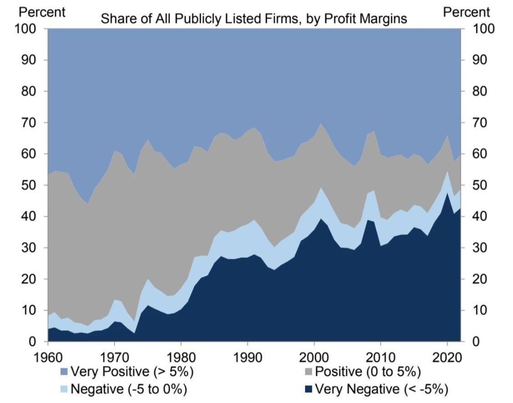

## Table of Contents

## What is gross profit margin?

Gross profit margin is a way to measure how much money a business makes from selling its products or services after paying for the costs to make or buy those products. It is shown as a percentage and is calculated by taking the gross profit (which is the revenue minus the cost of goods sold) and dividing it by the total revenue, then multiplying by 100. This number tells you what part of each dollar of revenue is profit before other business expenses are taken out.

Understanding the gross profit margin is important because it shows how efficiently a company is using its resources to produce goods or services. A higher gross profit margin means the company is keeping more money from each sale, which can be used to cover other costs like rent, salaries, and marketing. If the gross profit margin is low, it might mean the company needs to find ways to reduce the costs of making or buying their products or to increase the prices they charge for their products.

## How is gross profit margin calculated?

Gross profit margin is a way to figure out how much money a business keeps from selling its stuff after paying for what it costs to make or buy that stuff. To find it, you start with the gross profit. Gross profit is what you get when you take away the cost of goods sold from the total revenue. Revenue is all the money the business gets from sales. The cost of goods sold is what it costs to make or buy the products that were sold.

Once you have the gross profit, you divide it by the total revenue. After that, you multiply the result by 100 to turn it into a percentage. This percentage is the gross profit margin. It tells you what part of each dollar of revenue is left as profit before other expenses like rent, salaries, and marketing are paid. A higher percentage means the business is doing a good job at keeping more money from each sale.

## What does a negative gross profit margin indicate?

A negative gross profit margin means a business is losing money on what it sells. This happens when the cost of making or buying the products is more than the money made from selling them. It's like if you bought a toy for $10 and sold it for $8, you would lose $2 on that sale.

When a business has a negative gross profit margin, it's a big warning sign. It shows that the business needs to make some changes fast. They might need to find cheaper ways to make their products or start charging more for them. If they don't fix this, they won't be able to cover other costs like rent and salaries, and the business could fail.

## Can you give examples of companies that have experienced negative gross profit margins?

One example of a company that experienced a negative gross profit margin is Tesla in its early years. When Tesla was starting out, it spent a lot of money making electric cars, but it didn't make enough money from selling them. This meant that the cost to make the cars was more than what they were selling them for, leading to a negative gross profit margin. Over time, Tesla worked on making their cars cheaper to produce and started selling more of them, which helped turn their gross profit margin positive.

Another example is Amazon in its early days. Amazon began as an online bookstore and quickly expanded into selling many other products. In the beginning, the costs of running the website, storing the products, and shipping them were very high. Amazon was selling products at low prices to attract customers, which meant they were often losing money on each sale. This resulted in a negative gross profit margin. However, Amazon's strategy was to grow big and fast, and over time, they managed to lower their costs and increase their sales, eventually turning their gross profit margin positive.

## What are the common causes of a negative gross profit margin?

A negative gross profit margin happens when a business spends more money to make or buy its products than it earns from selling them. One common cause is high production costs. This can happen if the materials or labor needed to make the product are expensive. Another reason might be that the business is selling its products at a low price to attract customers or to compete with other companies. If the selling price is too low, it won't cover the costs of making the product, leading to a loss on each sale.

Another cause can be unexpected increases in costs. For example, if the price of raw materials goes up suddenly, it can make the cost of goods sold higher than expected. This can happen due to things like supply chain issues or changes in the market. Additionally, if a business has a lot of waste or inefficiencies in its production process, it can also increase the cost of making the product, pushing the gross profit margin into the negative.

Lastly, a business might choose to have a negative gross profit margin on purpose as part of a strategy. For instance, a new company might sell products at a loss to gain market share quickly. They hope that by attracting a lot of customers, they can eventually lower their costs or raise their prices to make a profit. This approach is risky because it depends on the business being able to turn things around before running out of money.

## How can a company recover from a negative gross profit margin?

To recover from a negative gross profit margin, a company needs to find ways to make more money from each sale or to spend less money on making the product. One way to do this is by increasing the price of the product. If customers are willing to pay more, the company can make more money on each sale. Another way is to reduce the cost of making the product. This can be done by finding cheaper materials, improving how the product is made to waste less, or negotiating better deals with suppliers. Sometimes, a company might need to change what it sells or how it sells it to make more money.

Another important step is to look at the business's overall strategy. If the company was selling at a loss to attract customers, it might be time to start raising prices slowly. The company can also focus on selling more of its profitable products and less of the ones that lose money. It's also important to keep a close eye on costs. If something like shipping or materials gets more expensive, the company needs to adjust quickly. By making these changes, a company can turn its negative gross profit margin into a positive one and start making money again.

## What are the long-term effects of sustained negative gross profit margins on a company?

If a company keeps having negative gross profit margins for a long time, it can face big problems. It means the company is losing money on every product it sells. This can lead to less money in the bank, making it hard to pay for things like rent, salaries, and other bills. If the company can't find a way to make more money or cut costs, it might have to borrow money or use up its savings. Over time, this can make the company's financial situation worse and worse, and it might even go out of business if it can't turn things around.

In the long run, a company with sustained negative gross profit margins might also lose the trust of its investors and lenders. They might see the company as a risky investment and be less willing to give it money. This can make it even harder for the company to get the funds it needs to keep going or to make changes to improve its situation. If the company can't fix its negative gross profit margins, it might have to close down or be bought by another company that can turn it around.

## How do negative gross profit margins affect a company's financial statements?

When a company has negative gross profit margins, it shows up clearly on its financial statements. The income statement will show that the cost of goods sold is more than the revenue from sales. This means the gross profit number will be negative. When this happens, it can make the company's net income negative too, because there's less money left after paying for the products than before. This can worry investors and make it hard for the company to get loans or attract new investment.

The balance sheet also gets affected by negative gross profit margins. If the company keeps losing money on each sale, it will have less cash and more debt over time. The company might need to borrow money to keep running, which shows up as more liabilities on the balance sheet. If the company can't turn things around, its assets might shrink, and it could struggle to pay off what it owes. This can make the company's financial health look weak and might even lead to bankruptcy if it goes on too long.

## What strategies can be implemented to prevent negative gross profit margins?

To stop a company from having negative gross profit margins, it's important to keep an eye on the costs of making or buying the products and the prices they are sold at. One way to do this is by finding cheaper materials or better ways to make the product. This can mean talking to suppliers to get a better deal or changing how the product is made to use less and waste less. Another way is to look at the prices the company charges. If the prices are too low, the company might need to raise them a little. But they have to be careful not to make the prices so high that customers stop buying.

Another strategy is to make sure the company is selling the right mix of products. Some products might make more money than others, so selling more of those can help. The company can also stop selling products that always lose money. It's also important to keep a close watch on any changes in costs, like if the price of materials goes up. If that happens, the company needs to adjust quickly, maybe by finding new suppliers or raising prices a bit. By doing these things, a company can keep its gross profit margins positive and stay healthy financially.

## How do investors and analysts interpret negative gross profit margins in their assessments?

When investors and analysts see a company with negative gross profit margins, they get worried. It means the company is losing money on what it sells. This is a big red flag because it shows the company might not be able to make money in the long run. Investors might think the company's business model isn't working well or that it's having trouble managing its costs. They might decide not to invest in the company or to sell their shares if they already own them.

Analysts will look closely at why the gross profit margins are negative. They'll check if it's because the company is spending too much to make its products or if it's selling them too cheaply. They might also see if the company is doing this on purpose to grow fast and gain customers, like Amazon did in its early days. If the company has a good plan to fix the problem and turn things around, analysts might still be hopeful. But if the negative margins keep going without a clear way to fix them, analysts will likely be very concerned about the company's future.

## What role does industry type play in the occurrence of negative gross profit margins?

The type of industry a company is in can make a big difference in whether it has negative gross profit margins. Some industries, like technology startups or new online businesses, often start with negative gross profit margins because they spend a lot of money to grow fast and attract customers. They might sell their products at a loss, hoping to make money later when they get bigger. Other industries, like manufacturing or retail, might have negative gross profit margins if the costs of making or buying the products go up a lot or if they have to compete by selling at very low prices.

But not all industries are the same. In some industries, like luxury goods or specialized services, it's less common to see negative gross profit margins because these companies can charge higher prices and have lower costs. Understanding the industry helps investors and analysts know if a negative gross profit margin is a big problem or just part of a plan to grow. If a company in an industry where negative margins are common has a plan to turn things around, it might still be seen as a good investment.

## How can advanced financial modeling help predict and manage negative gross profit margins?

Advanced financial modeling can help a company predict and manage negative gross profit margins by looking at a lot of numbers and figuring out what might happen in the future. These models use past data and current trends to make guesses about future costs and sales. If a company can see that its costs might go up or that it might need to lower its prices, it can use the model to see what would happen to its gross profit margin. This way, the company can make plans to stop the gross profit margin from turning negative. For example, it might decide to find cheaper materials or change its prices before it's too late.

Using advanced financial modeling also helps a company manage negative gross profit margins if they do happen. The model can show different ways to fix the problem, like cutting costs or selling more profitable products. By trying out different ideas in the model, the company can see which ones work best without actually doing them yet. This helps the company make smart choices and turn things around faster. In the end, financial modeling gives the company a clear picture of its financial health and helps it stay on track to make money.

## What is the Understanding of Gross Profit Margin?

Gross profit margin is a critical financial metric that provides insight into a company's profitability by illustrating how efficiently it uses its resources to produce and sell goods. It is essential for assessing how well a company can convert revenue into gross profit and determining its ability to cover operating expenses, interest, taxes, and dividends. The gross profit margin is calculated using the formula:

$$
\text{Gross Profit Margin} = \left( \frac{\text{Revenue} - \text{Cost of Goods Sold (COGS)}}{\text{Revenue}} \right) \times 100
$$

### Components of Gross Profit Margin

1. **Revenue**: This is the total income generated from the sale of goods or services before any expenses are deducted. It represents the top line of the company's income statement.

2. **Cost of Goods Sold (COGS)**: COGS is the direct cost attributable to the production of the goods sold by a company. This includes expenses like raw materials, labor directly associated with production, and manufacturing expenses.

The relationship between revenue and COGS is pivotal. A higher COGS relative to revenue indicates lower efficiency in production, which translates to a lower gross profit margin.

### Scenarios Leading to a Negative Gross Profit Margin

While a gross profit margin ideally should be positive, certain situations may lead to a negative margin, indicating that the company's COGS exceed its revenue. These scenarios include:

- **Higher Than Expected Production Costs**: When production costs increase due to inefficient procurement or production issues, the profit margin may turn negative.
- **Pricing Discrepancies**: Setting prices below cost, either due to market competition or poor pricing strategy, results in a negative gross profit margin.
- **Inventory Write-downs**: Situations where the value of the inventory is reduced can lead to higher COGS and lower, or even negative, margins.

### Implications of a Negative Gross Profit Margin

A negative gross profit margin can have severe implications for a company's overall financial health and investor perception:

- **Financial Instability**: Persistent negative margins may indicate structural inefficiencies, signaling potential liquidity issues. It limits the company's ability to reinvest in growth, pay dividends, or service debt.
- **Investor Confidence**: Investors may perceive negative margins as a red flag, undermining trust in the company's management and its financial reports. This can result in falling stock prices and increased difficulty in raising capital.

Understanding and monitoring the gross profit margin is crucial for identifying underlying cost management issues and ensuring long-term business sustainability. Efficient management of COGS relative to revenue is key to maintaining a healthy gross profit margin and fostering investor confidence.

## References & Further Reading

[1]: Bergstra, J., Bardenet, R., Bengio, Y., & Kégl, B. (2011). ["Algorithms for Hyper-Parameter Optimization."](https://papers.nips.cc/paper/4443-algorithms-for-hyper-parameter-optimization) Advances in Neural Information Processing Systems 24.

[2]: ["Advances in Financial Machine Learning"](https://www.amazon.com/Advances-Financial-Machine-Learning-Marcos/dp/1119482089) by Marcos Lopez de Prado

[3]: ["Evidence-Based Technical Analysis: Applying the Scientific Method and Statistical Inference to Trading Signals"](https://www.amazon.com/Evidence-Based-Technical-Analysis-Scientific-Statistical/dp/0470008741) by David Aronson

[4]: ["Machine Learning for Algorithmic Trading"](https://github.com/stefan-jansen/machine-learning-for-trading) by Stefan Jansen

[5]: ["Quantitative Trading: How to Build Your Own Algorithmic Trading Business"](https://www.amazon.com/Quantitative-Trading-Build-Algorithmic-Business/dp/1119800064) by Ernest P. Chan