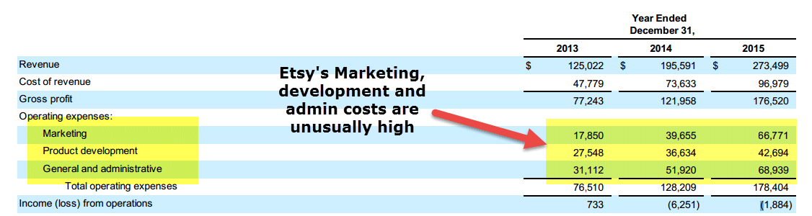

In today's fast-paced financial environment, understanding the intricacies of company financials is crucial. The gross profit margin stands out as a key indicator of a company's financial health, reflecting the core profitability from selling products or services before accounting for other expenses. This metric provides valuable insights into how effectively a company is managing its production costs in relation to its revenue. However, when the gross profit margin turns negative, it signals a pressing concern. A negative margin suggests that a company incurs more costs in providing goods or services than it earns in sales, indicating potential operational inefficiencies or mispricing.

Business losses, particularly when recurring, can be alarming and may point to deeper issues within a company. Prolonged periods of losses might reflect strategic missteps, poor market positioning, or an inability to adapt to changing market conditions. These financial stresses not only affect the company's operational capabilities but also have far-reaching implications for stakeholders, impacting shareholder value and investor confidence.

The advent of algorithmic trading has introduced both opportunities and challenges in financial markets. Algorithmic trading, which refers to using computer programs to execute trades at speeds and frequencies that human traders cannot match, can optimize trading strategies and enhance liquidity. However, if not properly managed, it can exacerbate financial difficulties. Over-reliance on algorithmic models without adequate oversight can lead to significant problems, including large, rapid losses due to unforeseen market events or model misjudgments.

This article aims to explore the challenges associated with negative gross profit margins, business losses, and the role of algo trading in financial outcomes. Understanding these components is essential for companies to navigate the complex financial landscape and ensure long-term stability and growth.

## Table of Contents

## Understanding Gross Profit Margin

Gross profit margin is a critical financial metric that provides insight into a company's profitability by illustrating how efficiently it uses its resources to produce and sell goods. It is essential for assessing how well a company can convert revenue into gross profit and determining its ability to cover operating expenses, interest, taxes, and dividends. The gross profit margin is calculated using the formula:

$$
\text{Gross Profit Margin} = \left( \frac{\text{Revenue} - \text{Cost of Goods Sold (COGS)}}{\text{Revenue}} \right) \times 100
$$

### Components of Gross Profit Margin

1. **Revenue**: This is the total income generated from the sale of goods or services before any expenses are deducted. It represents the top line of the company's income statement.

2. **Cost of Goods Sold (COGS)**: COGS is the direct cost attributable to the production of the goods sold by a company. This includes expenses like raw materials, labor directly associated with production, and manufacturing expenses.

The relationship between revenue and COGS is pivotal. A higher COGS relative to revenue indicates lower efficiency in production, which translates to a lower gross profit margin.

### Scenarios Leading to a Negative Gross Profit Margin

While a gross profit margin ideally should be positive, certain situations may lead to a negative margin, indicating that the company's COGS exceed its revenue. These scenarios include:

- **Higher Than Expected Production Costs**: When production costs increase due to inefficient procurement or production issues, the profit margin may turn negative.
- **Pricing Discrepancies**: Setting prices below cost, either due to market competition or poor pricing strategy, results in a negative gross profit margin.
- **Inventory Write-downs**: Situations where the value of the inventory is reduced can lead to higher COGS and lower, or even negative, margins.

### Implications of a Negative Gross Profit Margin

A negative gross profit margin can have severe implications for a company's overall financial health and investor perception:

- **Financial Instability**: Persistent negative margins may indicate structural inefficiencies, signaling potential liquidity issues. It limits the company's ability to reinvest in growth, pay dividends, or service debt.
- **Investor Confidence**: Investors may perceive negative margins as a red flag, undermining trust in the company's management and its financial reports. This can result in falling stock prices and increased difficulty in raising capital.

Understanding and monitoring the gross profit margin is crucial for identifying underlying cost management issues and ensuring long-term business sustainability. Efficient management of COGS relative to revenue is key to maintaining a healthy gross profit margin and fostering investor confidence.

## Analyzing Business Losses

Business losses are a critical [factor](/wiki/factor-investing) that can severely impact a company's financial stability. Understanding these losses requires examining several underlying causes, including poor sales, high operational costs, and inefficient processes.

**Poor Sales:**

Sales are the primary revenue driver for most companies. A decline in sales can result from various factors such as changes in consumer preferences, increased competition, or economic downturns. When a company's products or services no longer satisfy market demands or if it fails to capture its target audience, sales [volume](/wiki/volume-trading-strategy) may drop, leading to revenue loss. For example, Blackberry once dominated the smartphone market but experienced significant sales declines as competitors like Apple and Android offered more innovative features.

**High Operational Costs:**

Operational costs include all expenses necessary to maintain business operations, such as salaries, rent, utilities, and raw materials. When these costs increase without a corresponding rise in revenues, profitability is squeezed. Factors contributing to high operational costs can include inefficient supply chain management, excessive administrative overhead, or rising labor costs. For instance, retailers with extensive physical store networks, like Sears, struggled with enormous operational costs that were unsustainable in the face of declining retail sales.

**Inefficient Processes:**

Inefficiencies in business processes can lead to wasted resources and higher expenses. This might involve outdated technology, redundant procedures, or poor management systems that fail to optimize productivity and cost-effectiveness. Automating processes, restructuring operations, and adopting lean management practices are approaches companies use to tackle inefficiencies. Toyota's adoption of the lean manufacturing system, for example, was instrumental in reducing waste and improving production efficiency, making it one of the leading automakers globally.

**Impact on Financial Stability:**

Sustained business losses signal declining profitability and can jeopardize a company's financial health. They might lead to [liquidity](/wiki/liquidity-risk-premium) issues, manifested by an inability to meet short-term obligations. Decreased investor confidence often follows, which could reduce access to capital markets, affecting a company's ability to finance future growth or operations. For stakeholders, consistent losses are red flags indicating potential management or structural problems within the company, demanding immediate attention and rectification.

**Examples of Navigating Business Losses:**

Several companies have faced significant business losses but managed to navigate through them effectively. For instance, IBM encountered massive losses in the early 1990s due to shifts in the technology landscape that moved away from mainframe computers. By radically changing its business model, focusing on IT services, and divesting non-core segments, IBM regained financial stability and became a leader in enterprise solutions.

Kodak, another example, faced business losses as digital photography overtook traditional film. Although its traditional business collapsed, Kodak has since focused on leveraging its patented technologies and exploring new markets such as digital imaging and printing solutions to stabilize its operations.

In summary, understanding business losses involves analyzing factors such as sales, operational costs, and process efficiencies. Companies that effectively identify and address these challenges are better positioned to restore profitability and ensure long-term financial stability.

## The Role of Algorithmic Trading in Financials

Algorithmic trading, also known as algo trading, refers to the use of computer algorithms to automate trading decisions and transactions. This technology has increased its presence in the financial markets due to its capacity to process vast amounts of data, execute trades at high speeds, and optimize trading strategies. Algo trading utilizes complex mathematical models to make decisions regarding the timing, price, and quantity of trades, which reduces the need for human intervention and potentially increases efficiency.

The influence of [algorithmic trading](/wiki/algorithmic-trading) on a company's financials can be significant. One key area of impact is the gross profit margin. By optimizing trade execution and reducing transaction costs, algo trading can enhance profitability. The gross profit margin, calculated as (Revenue - Cost of Goods Sold) / Revenue, may reflect improvements if algorithmic strategies effectively lower the costs associated with trading transactions or increase revenue through more strategic asset allocation.

Despite the advantages, algorithmic trading also carries substantial risks. Over-reliance on models can be hazardous, particularly if these models are unable to adapt to sudden market changes or unforeseen external factors. Additionally, a heavy dependence on historical data can lead to erroneous trading decisions during atypical market conditions. The infamous "flash crash" of 2010 is a poignant example where algorithms acted on market anomalies, leading to rapid and substantial losses.

Furthermore, the speed and volume at which algo trading operates can compound losses quickly if strategies do not perform as anticipated. This can be a particular concern for companies that depend on algorithmic systems as part of their core trading tactics. Rapid and large-scale transactions can lead to liquidity issues or inadvertently cause market disruptions, thereby adversely affecting financial stability.

In conclusion, while algorithmic trading offers potential for enhanced financial performance, it requires stringent risk management measures to mitigate associated dangers. Companies must exercise caution, ensuring that their algorithms are robust, adaptive, and complemented by adequate human oversight to avert excessive dependence, particularly in the context of maintaining healthy gross profit margins.

## Strategies to Mitigate Negative Margins and Losses

Companies facing negative gross profit margins must adopt strategic measures to restore financial stability and ensure long-term profitability. Addressing such challenges involves a multifaceted approach that encompasses cost management, revenue enhancement, process optimization, and robust risk management, particularly in relation to algorithmic trading.

Cost management is crucial for improving gross profit margins. By performing a comprehensive analysis of Cost of Goods Sold (COGS), companies can identify areas where expenses can be trimmed without compromising product quality. Techniques such as bulk purchasing, negotiating better terms with suppliers, and adopting more efficient production methods can significantly reduce costs. For example, implementing lean manufacturing principles can streamline operations, reduce waste, and lower production costs.

Revenue enhancement strategies focus on increasing sales and improving pricing strategies. Companies can diversify their product offerings to tap into new markets or introduce premium products to capture higher margins. Enhancing marketing efforts to boost brand visibility and customer engagement can also drive sales growth. In certain scenarios, revisiting pricing models and employing dynamic pricing strategies based on market demand and competition can optimize revenue and improve gross margins.

Process optimization plays a key role in reversing business losses. By leveraging technology and data analytics, companies can improve operational efficiency and productivity. Implementing enterprise resource planning (ERP) systems can streamline workflows and improve inventory management, ensuring that production aligns closely with demand, thereby reducing excess inventory and stockouts.

Risk management is essential, especially when algorithmic trading is part of the financial strategy. Companies should be wary of over-reliance on automated trading systems which might maximize short-term returns but expose the firm to volatile market risks. It is important to develop and enforce strict risk management protocols. One effective approach is the use of stop-loss orders which automatically liquidate positions once they cross a predefined threshold, minimizing potential losses. Additionally, regular audits and assessments of trading algorithms can help in detecting and correcting model errors promptly.

Ensuring compliance with regulatory requirements and maintaining transparency with stakeholders is fundamental in fostering trust and avoiding financial pitfalls. Companies should cultivate a risk-aware corporate culture that prioritizes ethical standards and responsible trading practices.

In summary, companies can mitigate negative gross profit margins and business losses by implementing a comprehensive strategy focused on cost management, revenue growth, process efficiency, and robust risk management. By taking a proactive approach, firms can not only address current financial challenges but also position themselves for sustainable success in the future.

## Conclusion

In today's dynamic financial landscape, maintaining a keen eye on financial indicators such as the gross profit margin is of paramount importance. A negative gross profit margin can signal deeper financial troubles, alerting companies to potential vulnerabilities that need immediate attention. By closely monitoring these indicators, businesses can effectively gauge their financial health and take timely corrective actions.

Proactivity in financial management is crucial for safeguarding a company's future. Businesses must be agile in their approach to financial planning, constantly evaluating and revising strategies as needed. Addressing financial challenges head-on prevents them from escalating into more significant problems that might threaten a company's viability. By implementing a robust framework for assessing and managing financial health, companies can ensure sustained growth and stability.

Moreover, integrating traditional financial strategies with modern approaches like algorithmic trading can provide comprehensive benefits. Traditional methods offer foundational stability, while modern techniques introduce efficiencies and innovation. The synergy of these approaches can enhance a company's ability to navigate complex financial landscapes effectively. Hence, a well-rounded strategy that combines the strengths of both traditional and modern financial methodologies is likely to yield optimal results, ensuring a competitive edge in today’s markets.

## References & Further Reading

[1]: Bergstra, J., Bardenet, R., Bengio, Y., & Kégl, B. (2011). ["Algorithms for Hyper-Parameter Optimization."](https://papers.nips.cc/paper/4443-algorithms-for-hyper-parameter-optimization) Advances in Neural Information Processing Systems 24.

[2]: ["Advances in Financial Machine Learning"](https://www.amazon.com/Advances-Financial-Machine-Learning-Marcos/dp/1119482089) by Marcos Lopez de Prado

[3]: ["Evidence-Based Technical Analysis: Applying the Scientific Method and Statistical Inference to Trading Signals"](https://www.amazon.com/Evidence-Based-Technical-Analysis-Scientific-Statistical/dp/0470008741) by David Aronson

[4]: ["Machine Learning for Algorithmic Trading"](https://github.com/stefan-jansen/machine-learning-for-trading) by Stefan Jansen

[5]: ["Quantitative Trading: How to Build Your Own Algorithmic Trading Business"](https://www.amazon.com/Quantitative-Trading-Build-Algorithmic-Business/dp/1119800064) by Ernest P. Chan